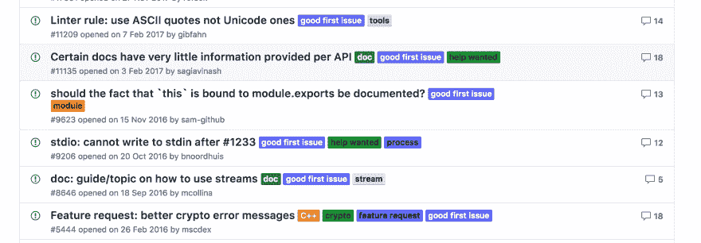

# 结束编码障碍的 5 个技巧

> 原文：<https://dev.to/neilberg/5-tips-for-ending-coder-s-block-1jdn>

程序员的瓶颈，相当于作家的瓶颈，是开发人员不知道下一步该做什么的普遍感觉。

如果你刚刚开始学习编码，经常会有一种“我应该构建什么”的令人畏惧的感觉。所谓“教程-地狱”就是一种不知道如何将新技能应用到教程范围之外的项目中的感觉。或者，你可能只是想在兼职项目中寻找一些乐趣，但不知道从哪里开始。

幸运的是，有许多技巧可以帮助打破这种停滞不前的感觉，让你踏上一段快乐而有灵感的编码之旅。

<figure>

<figcaption>Break through the block and start feeling excited again!</figcaption>

</figure>

以下是我的五大建议。有其他的吗？请务必在下面的评论中删除它们！

### 1。扭曲地模仿

<figure>

<figcaption>Source: Unicode/Cosmopolitan</figcaption>

</figure>

音乐家、艺术家、厨师、作家、时装设计师、电影制作人和其他大多数受创造力驱动的人都在不断地观看、聆听、品尝和消费他们同龄人的作品。将别人的经验和你自己的兴趣融合在一起会产生一些原创的东西。

记下你经常使用的网站、应用程序和其他数码产品，看看哪些能激发你的灵感。

*   你喜欢这个设计吗？
*   你对快速获取数据的方式印象深刻吗？
*   一次点击后的动画是否给你的脸上带来了笑容？

不管这个功能是什么，试着用你自己的天赋重新创造它。从小处着手——试着建立漂亮的头球或者流畅的过渡。在此基础上逐步构建，并继续开发其他功能。

最精彩的部分？一旦你完成了这个功能，你会获得信心，你真的可以制造出你喜欢的产品(并向潜在的雇主炫耀！).

### 2。透过屏幕看

作为开发人员，我们经常生活和工作在电脑/手机屏幕上。然而，在这些屏幕的之外*可以找到如此多的灵感。*

<figure>

<figcaption>Netflix and CSS Grid and chill?</figcaption>

</figure>

杂志、广告牌、专辑封面、麦片盒、食品标签，几乎所有的东西都有一个设计，正在乞求被转化为代码！试着为一些静态设计实现一个响应式网格，并从印刷中常见但在代码中很少使用的时髦颜色和字体中获得乐趣。

### 3。与人交谈

无论是在飞机上，坐在酒吧里，还是只是和朋友出去玩，问一些关于某人喜欢的新网站或应用的问题。当然，大多数时候已经有一个应用程序了，但是谁在乎呢，再建一个吧！

<figure>

<figcaption>"You know how to code?! Can you make this, and that, and this other thing?"</figcaption>

</figure>

不要担心它是否会被使用，只要把它当作一个自由职业者的项目，在那里你研究已经存在的类似产品，如何改进它们，以及你的代码如何帮助解决手头的问题。

最好的情况:你为某人开发了一个有用的(也许是有利可图的)产品。最坏的情况:你有了一个新的投资组合项目，甚至可能有了一个新朋友。

### 4。马后炮是 20/20

回头看看你几个月前写的一个项目或一段代码。毫无疑问，你可以用从那以后获得的知识和技能来提高它。做一些重构，给它增加一些新的特性。根据你刚完成的教程或你刚看过的 youtube 视频/博客帖子，找到新的方向。

<figure>

<figcaption>Looking backwards can move you forward. Source: Lori Ward</figcaption>

</figure>

### 5。为开源代码做贡献

有时候，最好的行动计划不是自己从零开始，而是跳到现有的项目上。

在 Github 上寻找寻求帮助的标签，这是需要解决的首要问题。参加当地的聚会或黑客马拉松，看看有哪些你可以加入的项目正在进行中。逛逛 Dev.to、Twitter、Reddit 和其他社交媒体平台，看看其他人在发布什么，你是否能帮助他们。

<figure>

<figcaption>Other developers need you!</figcaption>

</figure>

### 最后的想法

如果你不知道下一步该做什么，知道你在一个好公司。我认识的人过去都有这种感觉，现在偶尔也会有这种感觉。试试上面的几个建议，看看是否对你有帮助，如果你有其他的想法供我或其他人在未来使用，请告诉我！