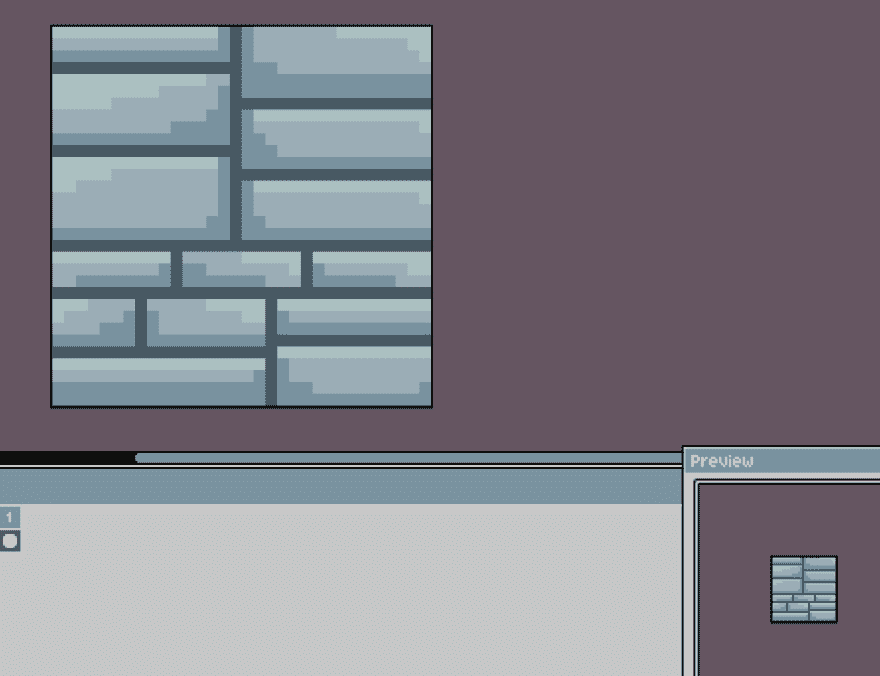
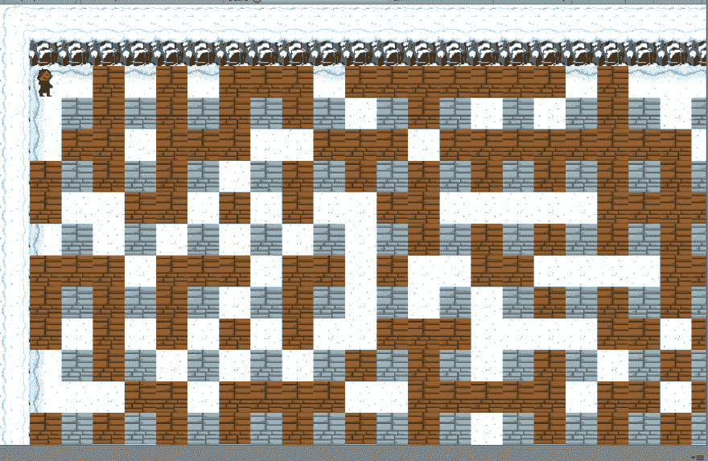
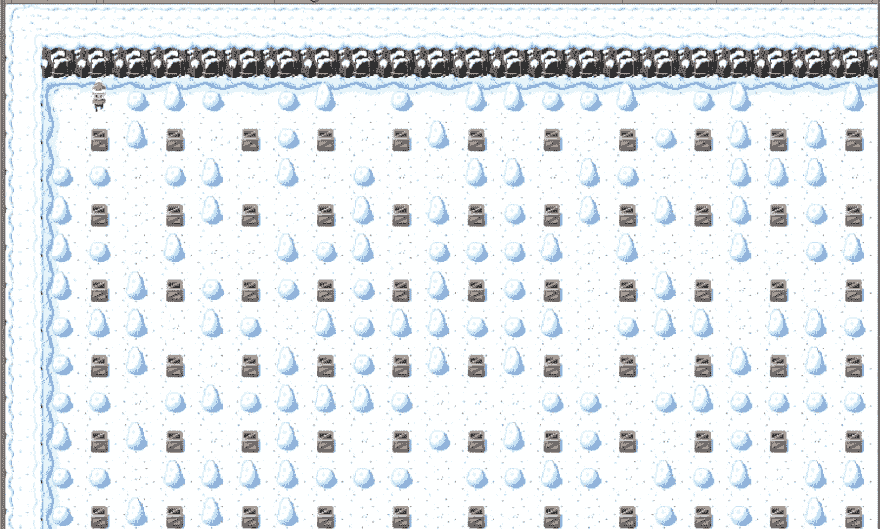
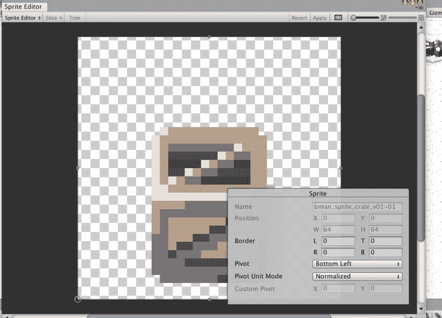
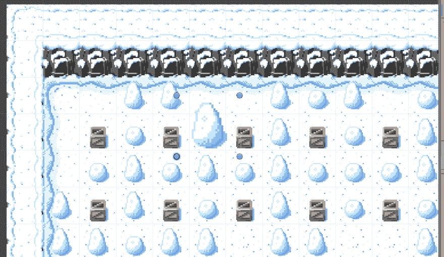
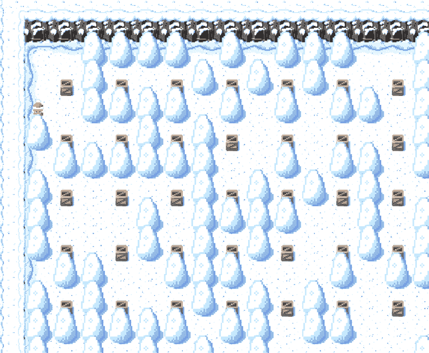
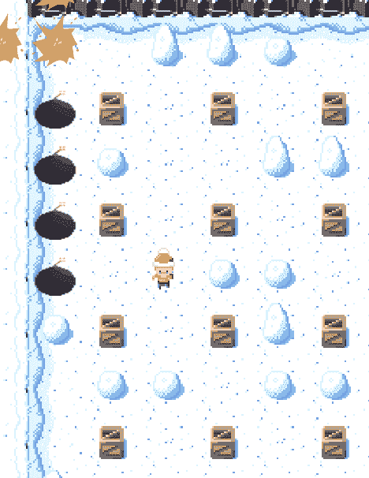
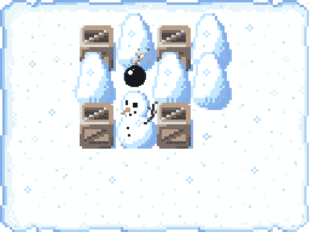

# 疯狂游戏开发博客#1

> 原文：<https://dev.to/nuculabs_dev/mad-game-devlog-1-3en3>

大家好！

在这个博客中，我会尽力让你了解我们游戏的最新状态。因为我们都有全职工作，所以我们只在空闲时间开发这个游戏。

我一直在执行世界生成代码，因为我没有任何可用的墙壁精灵，所以我用无菌脚本制作了自己的精灵。

使用上面的精灵，我在 Unity 中创建了两个预设，我把其中一个预设的颜色改成了棕色，生成的世界看起来像这样:

玩家精灵也是我做的。

几天后，我从 Max 那里收到了墙壁精灵，我把它们导入了 Unity。

精灵看起来这么小的原因是 Max 设计了它们，所以它们可以重叠，但我们不确定我们将如何做到这一点，因为这个游戏是基于矩阵网格添加重叠的精灵可能会使它有点混乱。

这里有一些图片，展示了游戏重叠后的样子。

安德烈承担了让炸弹工作的最繁重的任务。他在 Unity 的光线投射、协同程序和 2D 物理系统中苦苦挣扎。过了一段时间，他设法让它工作起来。炸弹已经放置，爆炸已经产生，它仍然需要一点润色。

感谢您的阅读，祝您愉快！

