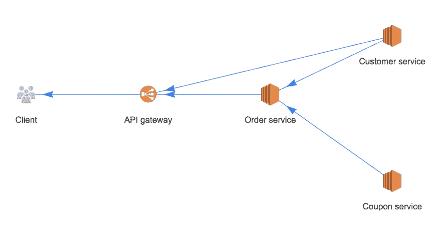
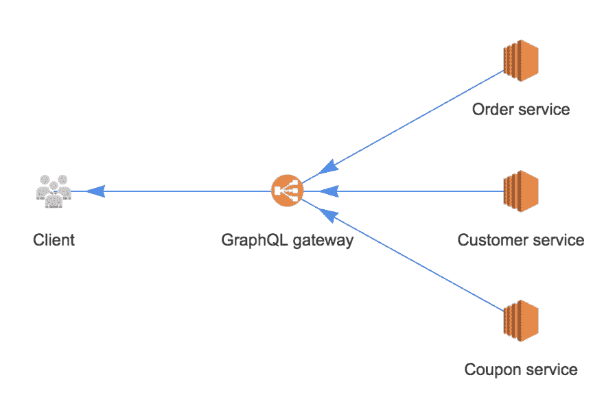

# 让 GraphQL 成为你的(微)服务架构的一部分

> 原文：<https://dev.to/raoulmeyer/make-graphql-part-of-your-micro-services-architecture-1l0e>

微服务架构很复杂。在某种程度上，这是因为您必须处理的[集成点](https://dev.to/raoulmeyer/book-review-release-it-design-and-deploy-production-ready-software-2b27#integration-points)的数量增加了。您可以利用 GraphQL 的强大功能来创建一个更简单的架构，该架构仍然具有微服务架构的许多优点。在这篇文章中，我将描述如何构建一个更容易理解的微服务架构。

## 微服务的问题

想象以下架构:

[](https://res.cloudinary.com/practicaldev/image/fetch/s--0y_-yK_M--/c_limit%2Cf_auto%2Cfl_progressive%2Cq_auto%2Cw_880/https://thepracticaldev.s3.amazonaws.com/i/sivq7lm1hkj7ax2yqcbq.png)

这仍然是一个相对简洁的架构，但在现实世界中，你会看到这些变得更加复杂。尤其是服务之间的关系很难跟踪。一般来说，由微服务组成的系统架构看起来更像是一只喝醉的蜘蛛织成的网。

那么如何在不中断其他服务的情况下改变自己的服务呢？其他服务如何处理您服务的停机时间？你如何确保请求不会永远持续下去？

你可以找到这些问题的答案。但只会给你已经很复杂的系统增加更多的复杂性。通常很难确定谁依赖于您的服务，因为这些依赖很少是显式的。

## graph QL 如何解决那些

以下架构实现了相同的功能，但要简单得多:

[](https://res.cloudinary.com/practicaldev/image/fetch/s--8w6xfz_J--/c_limit%2Cf_auto%2Cfl_progressive%2Cq_auto%2Cw_880/https://thepracticaldev.s3.amazonaws.com/i/dwhm33kioeuzet02k0g5.png)

抛开细节不谈，这个应用程序的 GraphQL 模式可以是这样的:

```
type  Order  {  customer:  Customer!  coupon:  Coupon  ...  } 
```

<svg width="20px" height="20px" viewBox="0 0 24 24" class="highlight-action crayons-icon highlight-action--fullscreen-on"><title>Enter fullscreen mode</title></svg> <svg width="20px" height="20px" viewBox="0 0 24 24" class="highlight-action crayons-icon highlight-action--fullscreen-off"><title>Exit fullscreen mode</title></svg>

该模式明确了哪些依赖项是必需的，哪些是可选的。请求订购时，您可能拿不回优惠券。如果优惠券服务中断，流行的 GraphQL 服务器(如 [apollo-server](https://www.apollographql.com/docs/apollo-server/) )将会捕捉到这种情况，并仍然返回订单。它将能够表明它无法检索优惠券。大多数实现都内置了这种降级服务。

作为一个额外的好处，使用这个模式，您可以立即记录所有可能的响应类型。如果您直接或通过代理访问多个微服务，这将更加困难。这是因为，如果优惠券服务的模式发生变化，这也需要反映在订单服务的模式中。

GraphQL 可以做一些聪明的事情来提高性能。例如，通过容易地添加高速缓存和[记忆](https://dev.to/thekashey/how-i-wrote-the-world-s-fastest-memoization-library-34io#memozation)，但是也通过并行运行解析器。您也可以在每个服务中单独完成这项工作，但这只是更多的工作。

在经典设置中，如果您更改客户服务，您将需要更改直接消费者和订单服务，因为它是一个依赖项。对于更复杂的体系结构，这很快就会失去控制。

通过引入 GraphQL 进行所有服务的整合，**微服务真的只负责一件事。**它不需要知道如何与其他服务交互。它不需要知道在哪里可以找到其他服务。它只需要知道如何做自己的事情，无论是检索订单还是管理客户数据。