# 使用 Knock 对 Rails API 进行用户认证

> 原文：<https://dev.to/amckean12/user-authentication-for-a-rails-api-and-a-react-client-part-1-server-side-3fej>

这篇文章的目标是为 Rails API 使用 JSON web 令牌(JWT)设置用户认证。

通常，当我使用 rails 时，我使用基于会话的认证。这意味着我让我的服务器端做所有繁重的工作。对于基于令牌的身份验证，我不会在服务器上存储任何东西，但我会创建一个唯一的编码令牌，在我访问后端时会用到它。这个令牌将被放在我的请求的头中(作为凭证),并在我需要对用户进行身份验证的任何时候使用。首先，我有两条路可走。我可以在 rails 中构建自己的基于令牌的认证解决方案(重新发明轮子)，或者我可以看看有哪些开源解决方案。我们去看看有什么可用的。

在谷歌上快速搜索“rails api JWT 认证宝石”应该会让我们大吃一惊。

##  [恩萨尔诺](https://github.com/nsarno) / [敲](https://github.com/nsarno/knock)

### Rails API 的无缝 JWT 认证

<article class="markdown-body entry-content container-lg" itemprop="text">

# 敲

[](http://badge.fury.io/rb/knock)[](https://travis-ci.org/nsarno/knock)[](https://codeclimate.com/github/nsarno/knock)

Rails API 的无缝 JWT 认证

## 描述

Knock 是基于 JSON Web 令牌的 Rails API 专用应用程序的认证解决方案。

### 我为什么要用这个？

*   它很轻。
*   它是为只支持 Rails API 的应用程序量身定制的。
*   是[无国籍](https://en.wikipedia.org/wiki/Representational_state_transfer#Statelessness)。
*   它开箱即用，提供像 [Auth0](http://auth0.com/) 这样的服务

### 这种情况还在持续吗？

~~是~~ ~~否~~是！

目前正在@andrerpbts <g-emoji class="g-emoji" alias="heart" fallback-src="https://github.githubassets.cimg/icons/emoji/unicode/2764.png">❤️</g-emoji> 的帮助下进行维护

慢慢地处理积压的问题& PRs，并开始为下一个版本构建路线图。

## 入门指南

### 装置

将这一行添加到应用程序的 Gemfile 中:

```
gem 'knock'
```

然后执行:

```
$ bundle install 
```

### 要求

Knock 对您的用户模型做了一个假设:

它必须有一个`authenticate`方法，类似于由 [has_secure_password](http://api.rubyonrails.org/classes/ActiveModel/SecurePassword/ClassMethods.html#method-i-has_secure_password) 添加的方法。

```
class User < ActiveRecord::Base
  has_secure_password
end
```

推荐使用`has_secure_password`,但是只要你的用户模型实现了一个`authenticate`实例，你就不必这么做…

</article>

[View on GitHub](https://github.com/nsarno/knock)

Knock 的构建仅仅是为了使用 jwt 为 Rails APIs 提供一个认证解决方案，这正是我们想要的。Knock 有一个非常好的自述文件，所以我们就按照它开始吧。

我们要做的第一件事是将必要的宝石添加到我们的宝石文件中。这些宝石是...

1.  gem“knock”#认证解决方案
2.  gem 'bcrypt '，'～> 3 . 1 . 7 ' #来散列我们的密码
3.  gem ' active _ model _ serializers ' #用于序列化我们的数据(注意:在撰写本文时，AMS 正在经历大规模的开发变更，如果正在寻找另一种解决方案，我推荐 fast_jsonapi)
4.  gem 'jwt' #Ruby 实现 RFC 7519 OAuth JWT 标准
5.  gem ' rack-CORS ' #这是与我们的客户沟通的必要条件

接下来，让我们运行软件包安装。现在我们准备开始实现 Knock。我们要做的第一件事是创建一个 knock 初始化器，它将包含所有与 knock 相关的配置选项的信息。

$ rails 生成敲击:安装

初始化文件最简单的形式看起来就是这样...

[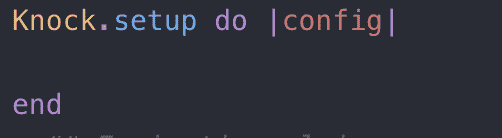](https://res.cloudinary.com/practicaldev/image/fetch/s--8awXvSb4--/c_limit%2Cf_auto%2Cfl_progressive%2Cq_auto%2Cw_880/https://thepracticaldev.s3.amazonaws.com/i/ey872mythxunuy5yq99o.png)

注意:当生成这个初始化式时，我们会得到一堆配置选项。这些选项是实现的好主意，但是为了这篇文章，我们将保持它的简单。

接下来我们需要做的是实现一个令牌控制器。这将为我们的用户提供一种登录方式。

$ rails 生成敲门信号:token_controller 用户

在生成这个控制器之后，我们还需要在 routes 文件中添加一个登录路由。这将是一个谈论命名空间的好时机。保持代码整洁有序的一个非常好的方法是给它命名空间。对于这个项目，我们将使用/api/预先计划我们的所有路线。为此，我们希望在 routes 文件中使用 namespace :api，并将所有控制器嵌套在一个 api 文件夹下。此时的路由文件如下所示。

[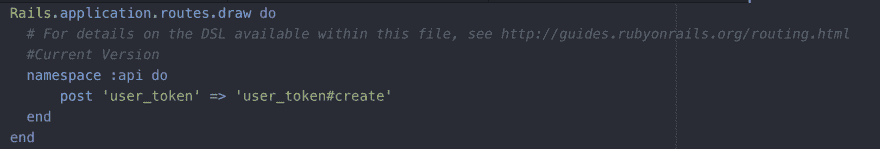](https://res.cloudinary.com/practicaldev/image/fetch/s--EqO4uPId--/c_limit%2Cf_auto%2Cfl_progressive%2Cq_auto%2Cw_880/https://thepracticaldev.s3.amazonaws.com/i/zt6ycmeblp7b2fqurdhy.png)

而我们在 controllers/API/user _ token _ controller . Rb 下的用户令牌控制器会是这样的。

[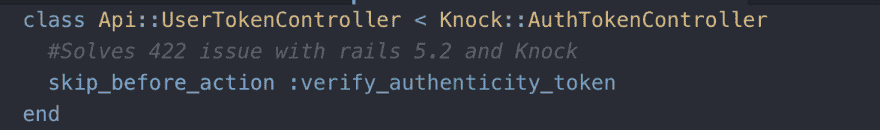](https://res.cloudinary.com/practicaldev/image/fetch/s--0pNLVtwY--/c_limit%2Cf_auto%2Cfl_progressive%2Cq_auto%2Cw_880/https://thepracticaldev.s3.amazonaws.com/i/x9ftdfipcnkfhb43ly41.png)

注意:对于这个项目，我们使用的是 Rails 5.2，我们需要包括 skip _ before _ action:verify _ authenticity _ token。如果我们不将它包含在 UserTokenController 中，当我们尝试登录时，我们将从服务器获得 422 响应。我在 github 上看问题时发现了这个。在实施之前看看这些总是一个好主意。

现在，接下来的步骤是为用户实现模型、控制器、序列化程序和伴随的迁移。为此，我使用了脚手架发电机。

对于此应用程序，我们的用户将拥有以下数据...

[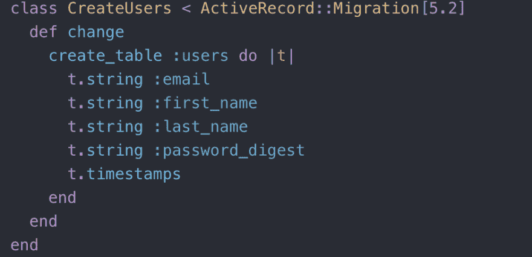](https://res.cloudinary.com/practicaldev/image/fetch/s--o9Pj0dLp--/c_limit%2Cf_auto%2Cfl_progressive%2Cq_auto%2Cw_880/https://thepracticaldev.s3.amazonaws.com/i/t2hcwnmi3sapnxaenxd6.png)

该模型如下所示。

[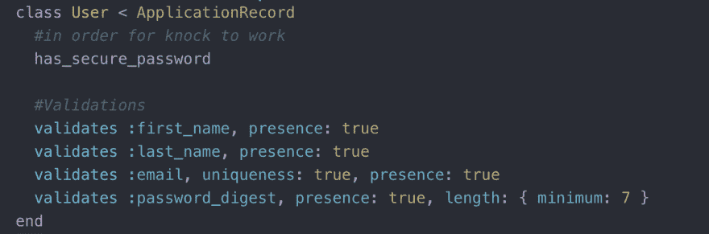](https://res.cloudinary.com/practicaldev/image/fetch/s--j-wGo1Cu--/c_limit%2Cf_auto%2Cfl_progressive%2Cq_auto%2Cw_880/https://thepracticaldev.s3.amazonaws.com/i/uev4igvk71ssnmq1smzh.png)

上面我们已经验证了所有参数的存在，以及唯一的电子邮件和最小长度为 7 的密码。我们还有 has_secure_password 方法。这对于 knock 的工作至关重要。根据文档，Knock 对我们的用户模型做了一个假设。它必须有一个身份验证方法，类似于 has_secure_password。由于我们的 bcrypt gem，我们能够调用这个方法。建议只使用 has_secure_password，但是只要我们的用户模型实现了具有相同行为的 authenticate 方法，我们就不必这样做。

我们的路由文件中还需要用户路由。现在，我们将拥有所有可用的用户路线。我们的 routes 文件现在看起来像这样。

[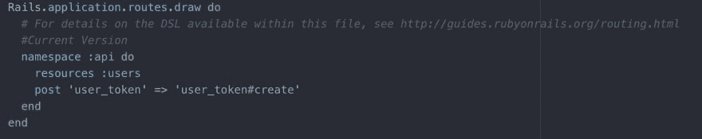](https://res.cloudinary.com/practicaldev/image/fetch/s--MemwB567--/c_limit%2Cf_auto%2Cfl_progressive%2Cq_auto%2Cw_880/https://thepracticaldev.s3.amazonaws.com/i/ugomfiih4z2ylmja4581.png)

接下来，我们需要在控制器上工作。自从我们使用了脚手架生成器，我们创造了很多方法。然而，我们将需要制定两个方法。这些方法是

1.  find #我们将使用的基于电子邮件查找用户的方法
2.  set _ user #设置用户的方法。

这些方法如下所示。

[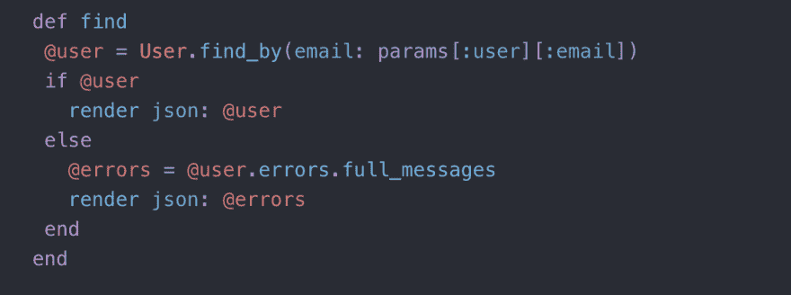](https://res.cloudinary.com/practicaldev/image/fetch/s--jYj_Gl3V--/c_limit%2Cf_auto%2Cfl_progressive%2Cq_auto%2Cw_880/https://thepracticaldev.s3.amazonaws.com/i/0pu3jlxezo45gumz3fre.png)

[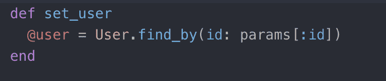](https://res.cloudinary.com/practicaldev/image/fetch/s--FlU_IPvd--/c_limit%2Cf_auto%2Cfl_progressive%2Cq_auto%2Cw_880/https://thepracticaldev.s3.amazonaws.com/i/p7ejb54oztmzjzcamwve.png)

我们还需要将 find_user 路由添加到 routes 文件中。

[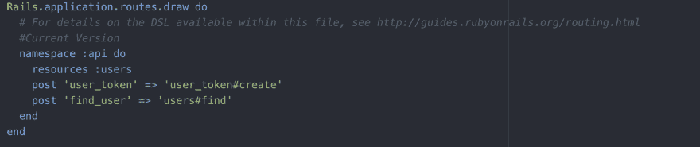](https://res.cloudinary.com/practicaldev/image/fetch/s--jIX-B8Nk--/c_limit%2Cf_auto%2Cfl_progressive%2Cq_auto%2Cw_880/https://thepracticaldev.s3.amazonaws.com/i/5cai8siwvqgwysd4dkuy.png)

至此，我们应该有了登录用户所需的信息。因此，让我们创建一个用户，并使用 Postman 让他们登录。

在我的种子文件中

[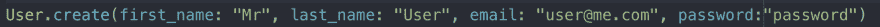](https://res.cloudinary.com/practicaldev/image/fetch/s--qsY2HZaL--/c_limit%2Cf_auto%2Cfl_progressive%2Cq_auto%2Cw_880/https://thepracticaldev.s3.amazonaws.com/i/mpqhjxmss2whwew0wemz.png)

然后在邮递员...

1.  头球

[](https://res.cloudinary.com/practicaldev/image/fetch/s--mR7xwvMb--/c_limit%2Cf_auto%2Cfl_progressive%2Cq_auto%2Cw_880/https://thepracticaldev.s3.amazonaws.com/i/w33gvqvh7nv1hb3yxf19.png)

1.  身体

[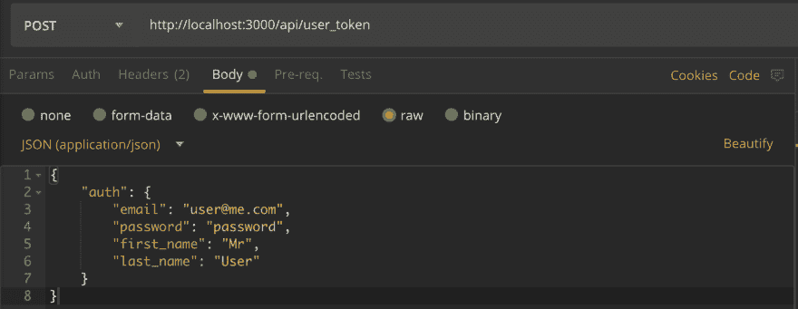](https://res.cloudinary.com/practicaldev/image/fetch/s--vZvJo1fB--/c_limit%2Cf_auto%2Cfl_progressive%2Cq_auto%2Cw_880/https://thepracticaldev.s3.amazonaws.com/i/aj8rqiwl7rpu83yx8fxi.png)

我们要拿回的将是我们的令牌。

[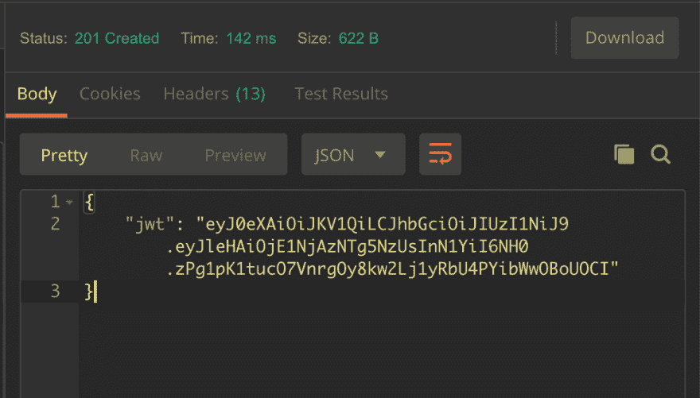](https://res.cloudinary.com/practicaldev/image/fetch/s--V0ksvFpV--/c_limit%2Cf_auto%2Cfl_progressive%2Cq_auto%2Cw_880/https://thepracticaldev.s3.amazonaws.com/i/7xngi3i0j9bn7aks7kc3.png)

我们接下来要做的是将令牌作为凭证放在请求的头部，每次我们想要访问资源时，负责该资源的控制器都会对用户进行身份验证。下面是我的一个项目的控制器中的一个例子。

[](https://res.cloudinary.com/practicaldev/image/fetch/s--Rt6HwnHZ--/c_limit%2Cf_auto%2Cfl_progressive%2Cq_auto%2Cw_880/https://thepracticaldev.s3.amazonaws.com/i/en9sk5pfaa30mq87yl8y.png)

我希望下一步做的是将我们在 postman 中做的输入复制到 React 中。我打算尽快写好那篇文章！感谢您的阅读，如果您有任何问题，请告诉我！