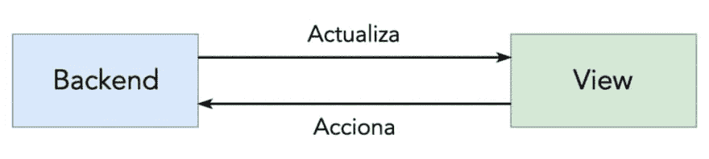
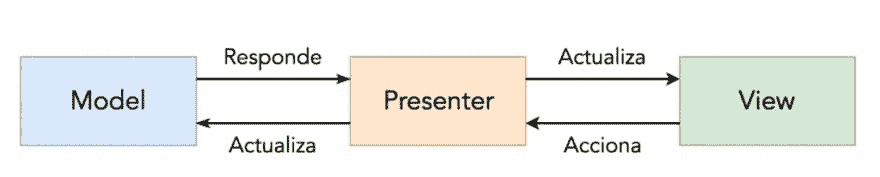
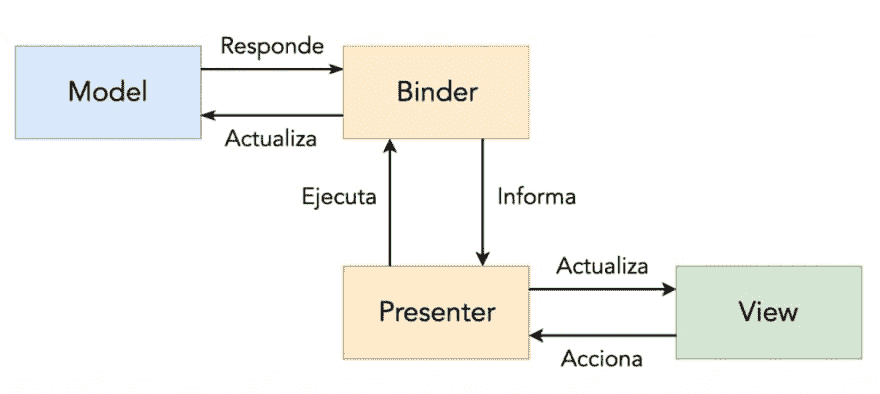
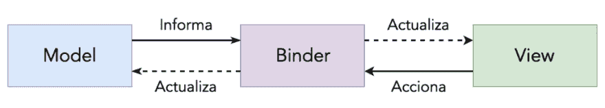

# Android 架构:重新思考 Android 中的 MVP

> 原文：<https://dev.to/apium_hub/android-architecture-rethinking-mvp-in-android-4agn>

今天我们将谈论 Android 架构，并重新思考 Android 中 **MVP 的使用。当我们谈论[软件架构](https://apiumhub.com/software-architecture-services-barcelona/)时，在 Apiumhub 中，我们总是牢记以下目标:**

*   提高可测试性、可表达性和可重用性。
*   降低嘲讽/存根、链接和开发成本。

确立这些目标后，我们按照简单设计的 4 条规则对不同的解决方案进行优先级排序，这 4 条规则按优先级降序排列:

*   编写通过测试的代码
*   代码揭示意图
*   消除欺骗
*   元素数量最少的建筑

记住这两个支柱，我们就可以开始考虑在开发移动应用程序时，什么样的架构会对我们有益。

## 重新思考 Android 中的 MVP

### (M)VB–模型-视图-后端

在开始评估业界最常用的架构并讨论我们的方法之前，我们想强调的是，开发时要考虑的最重要的事情之一是实用主义。

这适用于架构领域，意味着我们必须时刻意识到我们正在开发什么样的产品以及需求是什么，例如，如果我们有一个从服务器查询数据并在屏幕上显示数据的应用程序，而没有数据库、对该数据的复杂转换、级联调用、可重用组件等，最简单的事情就是使用使用最少数量的层和组件的架构，从服务器读取数据并在屏幕上绘制；一个*模型-视图-后端架构*。

[](https://res.cloudinary.com/practicaldev/image/fetch/s--t67LJv6Z--/c_limit%2Cf_auto%2Cfl_progressive%2Cq_auto%2Cw_880/https://apiumhub.com/wp-content/uploads/2019/06/Screenshot-2019-06-11-at-08.19.20-1024x230.png)

### MVP–模型-视图-演示者

当我们谈论移动架构时，起点通常是 MVP 模式。几年前，在 MVVM 到来之前，Android 中的 MVP 是构建应用程序应用层的行业标准。

[](https://res.cloudinary.com/practicaldev/image/fetch/s--nlUgRIJq--/c_limit%2Cf_auto%2Cfl_progressive%2Cq_auto%2Cw_880/https://apiumhub.com/wp-content/uploads/2019/06/Screenshot-2019-06-11-at-08.33.14-1024x206.png)

Android 中的 MVP 是由于需要解决这样一个问题而诞生的，即拥有作为上帝对象的活动，应用程序的所有逻辑、网络调用、BD /共享首选项中的存储等等都驻留在这个问题中……

我们不想深入研究这个架构的细节，因为它非常流行并且众所周知，所以我们将只讨论 Android 中的 MVP 的优点和缺点:

**Android 中的 MVP 优势:**

*   其他组件的分离视图
*   单位表示逻辑
*   可重复使用的视图和演示者

**Android 中的 MVP 劣势:**

*   双向耦合。演示者了解视图，视图也了解演示者。此外，演示者还依赖于服务。
*   当这种耦合存在时，为了测试呈现者，我们必须模拟服务和视图。
*   一个 presenter 依赖于 N 个服务，这使得测试变得复杂，因为我们添加的每个服务都意味着测试中更多的模仿。
*   人们倾向于在 presenter 中存储中间状态(例如，表单的状态)，这导致在测试这个 presenter 时出现困难，因为我们必须配置这些状态以涵盖所有可能的情况。

### MVPBinder

正如我们在经典 MVP 中看到的，经典 MVP 的最大缺点是随着演示者的成长，测试演示者的难度也在增加；这就是为什么我们决定发展它，直到我们可以把它从服务中分离出来。

[](https://res.cloudinary.com/practicaldev/image/fetch/s--xV1hH4lp--/c_limit%2Cf_auto%2Cfl_progressive%2Cq_auto%2Cw_880/https://apiumhub.com/wp-content/uploads/2019/06/Screenshot-2019-06-11-at-08.39.33-1024x458.png)

为此，我们创建了一个“Binder”类，它是 presenter 的子类，允许我们将服务事件与视图中的响应相链接，从而避免依赖于 presenter 中的服务，这样我们就不必模拟相同的服务来测试它。Binder 类的一个例子如下:

```
class Binder(view, service): Presenter(view) {
  init {
    bindSearch { query ->
      service.search(query,
        this::onGetRepositoryListNext,
        this::onGetRepositoryListError
      )
    …
  }
} 
```

*bindSearch* 方法在 presenter 中定义，定义为:

```
fun bindSearch(func: (String) -> Unit) 
```

同样，o_nGetRepositoryListNext_ 和 *onGetRepositoryListError* 方法也在 presenter 中定义，它们是:

```
protected fun onGetRepositoryListNext(list) {
  view.hideLoading() 
  if (list.isEmpty()) {
    view.showEmptyData()
  } else {
    view.showData(list)
  }
}
protected fun onGetRepositoryListError(error) {
  view.hideLoading()
  when (error) {
    is ConnectException -> view.showNetworkError()
    else -> view.showOtherError()
  }
} 
```

采用这种架构，我们会发现以下优点和缺点:

**优势**

*   演示者和服务之间的分离。什么促进了演示者的可重用性。
*   没有必要模仿/停止服务。什么有助于演示者的测试。

**缺点**

*   我们继续维护视图和呈现者之间的依赖关系，所以我们必须模拟视图来测试呈现者(尽管我们只做验证，不为它定义行为)
*   如果我们有不止一个服务，那么我们的绑定器将把这 N 个服务作为一个依赖项，并且可能无限增长。
*   仍然有一个表示器，我们可以在其中存储中间状态，这使它的测试变得复杂。

### MVB-模型-视图-活页夹

[](https://res.cloudinary.com/practicaldev/image/fetch/s--TYniAmVJ--/c_limit%2Cf_auto%2Cfl_progressive%2Cq_auto%2Cw_880/https://apiumhub.com/wp-content/uploads/2019/06/Screenshot-2019-06-11-at-08.43.42-1024x184.png)

在采用了带有绑定器的表示器之后，我们意识到，我们在表示器和服务之间进行的依赖关系投资也可以在表示器和视图之间进行。这样，我们将拥有一个完全解耦的呈现者视图，以及一个从视图和服务中解耦的呈现者。这个呈现者(从现在开始我们称他为 Binder)的唯一职责是将发出视图的事件与对服务的调用联系起来，并将服务发出的事件与视图的方法联系起来。具有这些特征的活页夹应该是这样的:

```
class Binder(view, service) {
  init {
    view.bindSearch(service::search)
    service.bindData(view::showData)
    service.bindEmptyData(view::showEmpty)
    service.bindNetworkError(view::showNetworkError)
  }
} 
```

通过这种方式，我们可以有 N 个绑定器，每个绑定器链接一个视图-服务对，这样我们可以有一个绑定器将我们想要在分析服务中跟踪的视图事件与做同样事情的服务链接起来，并有另一个绑定器从同一个视图中获取数据。通过这种方式，跟踪事件的绑定器(以及视图和服务的接口)将可以在我们想要的所有视图中重用，并且我们将消除代码重复。

视图/服务发出的事件以及它接收的信息将在一个接口中定义，这样:

```
interface RepositoryListView {
 fun bindSearch(func: (String) -> Unit)

 fun showLoading()
 fun hideLoading()
 ...
}

interface RepositoryListService {
 fun search(query: String)

 fun bindData(func: (List) -> Unit)
 fun bindEmptyData(func: () -> Unit)
 ...
} 
```

这种架构使我们更容易测试我们的表示层，因为它完全消除了对视图和服务的依赖(唯一的依赖是对绑定器的依赖，测试它是多余的，因为它只不过是一个配置文件)，并且对于两者都消除了模拟它们的需要。

它不仅消除了嘲笑，而且测试我们的服务和视图的方法是验证，对于条目 X 的事件，通过输出事件 y 发出某个值。这样，我们就有了一个统一的形式来测试我们应用程序的大部分，不管服务或视图有多复杂。

此外，我们消除了在中间层(如 Presenter 或 ViewModel)中使用中间状态的诱惑，因为我们只能将它们存储在视图中(仅与视图相关的信息),或者我们必须将其带到应用程序的外层(例如内存中的缓存)并通过存储库访问它们。

由于这种架构，我们解决了我们在以前的架构中看到的问题，只有一个缺点:相对于以前的架构，服务的复杂性增加了；缺点是我们减少了对服务的密集测试。

**下一步:**

*   我们正在开发一个定义输入和输出事件的 DSL，通过适配器，我们可以使用 RxJava、Corrutinas / canales 等……
*   允许我们定义这些事件及其入口和出口点的委托
*   (也许)一个注释系统允许我们绑定这些事件，而不需要为我们编写相应的代码

附注:用于编写本文的许多代码可以在 [this](https://github.com/apiumhub/mvpp-android/tree/rx) 资源库中找到。

不要忘记订阅[我们的每月简讯](http://eepurl.com/cC96MY)以获得关于移动架构的最新消息，尤其是 Android 中的 MVP！

帖子 [Android 架构:重新思考 Android 中的 MVP](https://apiumhub.com/tech-blog-barcelona/android-architecture-rethinking-mvp-in-android/)最早出现在 [Apiumhub](https://apiumhub.com) 上。