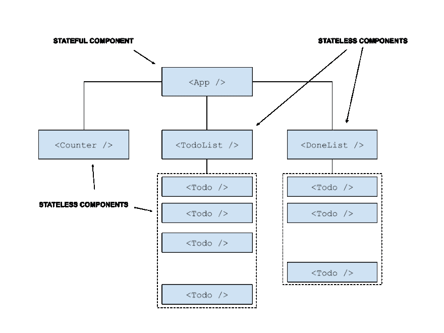

# 如何用 React 和 Firebase 数据库构建 todo 应用程序

> 原文：<https://dev.to/rossanodan/how-to-build-a-todo-app-with-react-and-firebase-database-1kik>

## 第 0 天

📅2019 年 6 月 10 日
🕐1h
🏁规划和初步设计

# 规划

## 我要开发什么

这个挑战的目标是创建一个工作待办应用程序来跟踪我必须做的任务。

## 我要用什么技术

*   做出反应(ES6)
*   Google Firebase 数据库

# 设计

在开始写作之前，我总是试图理解我的应用程序的结构。这张图应该足以看到我将要构建的组件以及我将要管理应用程序状态的方式。
[T3】](https://res.cloudinary.com/practicaldev/image/fetch/s--cRvZTjW_--/c_limit%2Cf_auto%2Cfl_progressive%2Cq_auto%2Cw_880/https://thepracticaldev.s3.amazonaws.com/i/aotkkcx21tvvm07icojw.png)

## 应用状态

状态将在`App`组件中管理。使用`state lifting`技术，它将通过 son 组件。
此刻，我只能想象这个状态会是什么样子:一个 todo 的集合，其中每个 todo 都有一些属性。

```
...
{
  id: 1,
  description: "Lorem Ipsum",
  done: false
},
{
  id: 2,
  description: "Another Lorem Ipsum",
  done: true
},
... 
```

<svg width="20px" height="20px" viewBox="0 0 24 24" class="highlight-action crayons-icon highlight-action--fullscreen-on"><title>Enter fullscreen mode</title></svg> <svg width="20px" height="20px" viewBox="0 0 24 24" class="highlight-action crayons-icon highlight-action--fullscreen-off"><title>Exit fullscreen mode</title></svg>