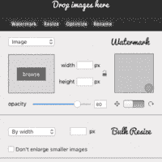
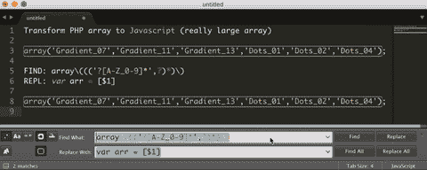
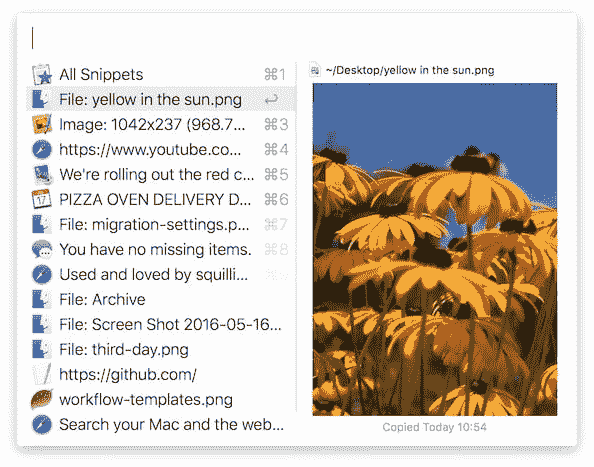
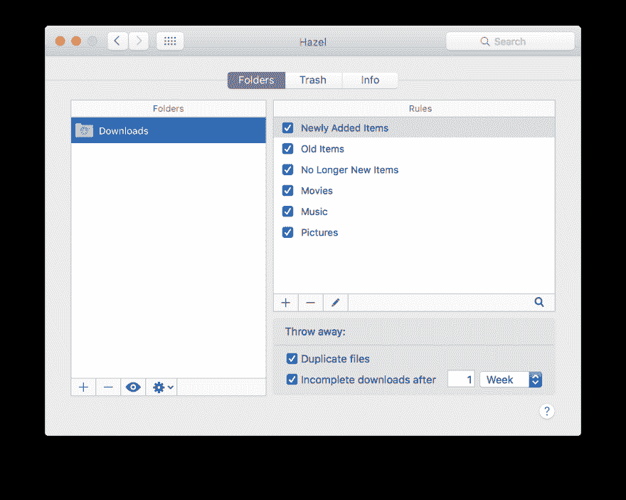

# 通过自动化重复任务，为我节省了 100 多个小时的程序

> 原文：<https://dev.to/danielsada/programs-that-have-saved-me-100-hours-by-automating-repetitive-tasks-11ld>

一年来，我一直在几个 web 平台上工作，在这些平台上，重复的任务通常是常态。从批量优化一千张图片，到从这种晦涩难懂的格式变成 csv 或 json。如果你需要对客户的文件进行关键性的更新，而你又没有足够的想象力去使用某种持续集成工具，那该怎么办呢？我会给你一些提示和技巧来提高效率。

# 1。光子体

一个客户来了，给你转储了一个文件夹，里面有 10 GB 的 4000x4000 的图片，每张图片重量为 30MB，格式为 JPEG。客户需要所有这些图像明天在网页上，水印和特定的名称。当你擦去地板上的泪水时，你会阅读本指南，并发现适用于 [Windows](https://www.eltima.com/products/bulk-photo-editor.html) 和 [Mac](https://mac.eltima.com/bulk-image-editor.html) 的 PhotoBulk。

Photobulk 允许您批量或成批地调整图像大小、添加水印、优化和重命名图像。这是节省我大量时间的主要工具之一，所以我广泛推荐它。我知道有些事情可以通过控制台或 photoshop 操作来完成。但这样更快。

# 2。正则表达式和升华文本或 VS 代码

同一个客户对你花了 4 个小时对图像做了手脚并上传它们感到不高兴，并要求你添加一个 php 数组中给定的 200 种颜色的调色板，以完成他们的调色板到 javascript 的迁移。

 
Regex 是如此强大，可以在海量数据中创建快速变化，以至于我节省了无数小时的转换或朋友的任务，值得学习。直到我在文本编辑器中使用了 regex，我才明白它的强大之处。真的很神奇。

# 3。Coda 或 KomodoIDE

将调色板上传到网站后，客户需要匆忙编辑网站，因为他将自己的 CC 号添加到了用户名字段中。显然这是个麻烦。更好的是，他还设法将它硬编码到 php 代码中。在这个客户的替代世界中，持续集成是不存在的。想象一下，在一个世界里，你必须启动 Filezilla，下载代码文件。编辑它，然后上传。同时启动 MySQL 数据库管理器或控制台，搜索具体条目，并对其进行更改。

他们知道什么是版本控制吗？

这样做了一段时间后，对于没有版本控制的地方的紧急任务，我使用了 Coda，以避免恐慌。(适用于 macOS)或 Komodo IDE(适用于 Windows)。这两个程序都允许建立到数据库的直接 FTP 链接和 mySQL 连接，双击该站点，就可以立即连接到服务器。所以你设法将客户数据的泄露控制在 10 分钟内，因为你速度很快。

# 4。阿尔弗雷德或聚光灯。

最节省我时间的工具之一是 Alfred 和 Spotlight(可能是 Cortana，但它仍然不在)。想快速打开一个文件？Cmd + Space -> file.xls。想做个转换？Cmd + Space -> 100 美元对 CAD 还是 10 lt 对 gal 想做数学？Cmd +空格-->(13239 *(1232+24)* 2)+123% 2

Alfred 更棒，你可以编写脚本来运行或搜索给定的关键词。你马上就能得到一切。

# 5。淡褐色

现在，在同一台电脑上工作了 3 年多，有多个客户，我讨厌把它整理得井井有条。所以我决定买 Hazel(或者 windows 的文件杂耍器)。在这里您可以根据您想要的文件夹组织方式来创建文件夹规则。

例如，我可以创建一个规则，监视我的桌面上超过 4 小时的文件，即截屏，它会将它们带到我的“截屏文件夹”，或者我超过 X 周没有使用的下载。或者创建一个过滤图像的规则。或者创建一个文件夹，把我放进去的所有文件“分类”。

# 但是，哎，这个挺基础的。

我知道这是相当基本的，但是有人手动地做这个动作，因为他们不想用这种自动化来打扰自己。或者他们没有时间自己实现自动化。所以如果这能节省一些时间，我希望它能像对我一样有用。

你的 100 小时省时方法是什么？