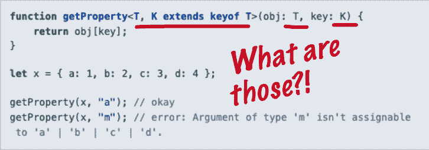
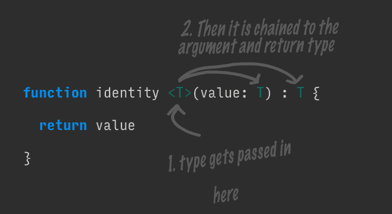
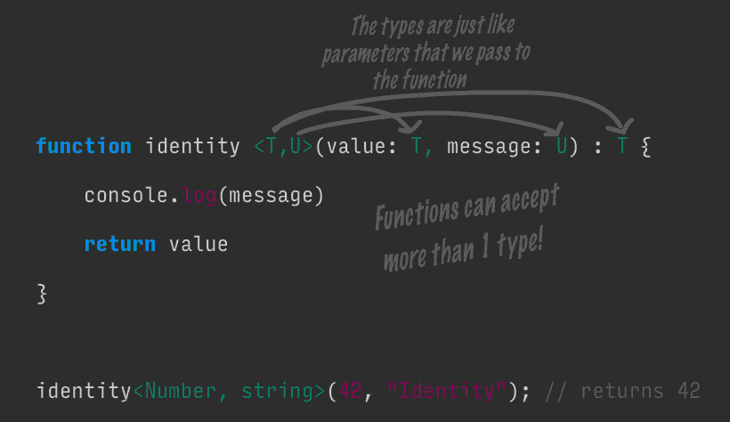
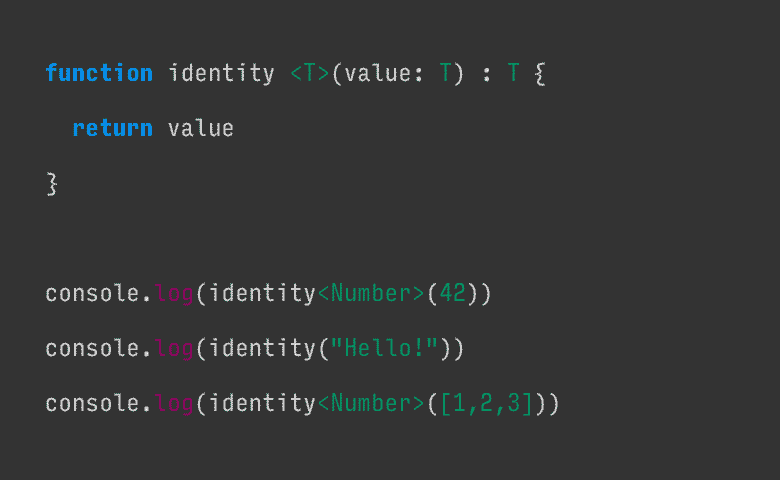

# TypeScript -完全了解常规

> 原文：<https://dev.to/oieduardorabelo/typescript-entendendo-generics-por-completo-38j7>

[*【图像学分】*](https://www.dotnetcurry.com/typescript/1439/typescript-generics)

## 破解了奇怪的语法，如何成为我们的朋友

[](https://res.cloudinary.com/practicaldev/image/fetch/s--APACOpoB--/c_limit%2Cf_auto%2Cfl_progressive%2Cq_auto%2Cw_880/https://cdn-images-1.medium.com/max/1600/1%2AEq3CXJ-UeO6zfT8VFLd1Ug.png) 
*来自[的注释图像](https://www.typescriptlang.org/docs/handbook/generics.html)型脚本的通用文档】*

除非你是一个经验丰富的老手从一种强烈的语言如 [Java](https://en.wikipedia.org/wiki/Generics_in_Java) ，我确信你曾经有过同样的时刻我第一次看到 TypeScript 中的一般类型。该语法与我们在 JavaScript 中看到的任何其它内容都相去甚远，并且可能很难立即消化它所做的工作。

我是来告诉你那些普通人并不像他们看起来那么可怕。如果可以用 JavaScript 编写带有参数的函数，那么可以在短时间内编写并使用通用的**type script**作为专业人员。我们开始吧！

* * *

# type script 中的一般是什么？

TypeScript 文档将通用组件解释为“能够创建一个可以在多种类型(而不是单个类型)上工作的组件”。

太好了！这给了我们一个基本的概念。我们将使用通用部件来创建某种可重复使用的组件，该组件可用于多种类型。但这是怎么发生的呢？我喜欢这样思考:

**一般类型是指类型值是指函数引数--它们是一种方法，可以告诉我们的元件(函数、类别或介面)执行此程式码片段时要使用的类型，就像我们告诉函数执行时要使用哪些值做为引数一样。**

了解此声明的意思的最好方法是编写一个通用身份函数。identidade 函数是一个只返回传递给它的任何参数的函数。在简单 JavaScript 中，这将是:

```
function identity (value) {
    return value;
}

console.log(identity(1)) // 1 
```

现在，让我们对其进行调整，以处理 TypeScript 中的一个数字:

```
function identity (value: Number) : Number {
    return value;
}

console.log(identity(1)) // 1 
```

我们最好有固定的类型，但功能不太灵活。身份函数必须适用于任何过去的值，而不仅仅是数字。这是一般人进来的地方。使用通用函数，我们可以编写一个函数，该函数可以采用任何类型，并根据该类型转换我们的函数。

```
function identity <T>(value: T) : T {
    return value;
}

console.log(identity<Number>(1)) // 1 
```

有这样的语法`<T>`未知！但没什么好怕的。就像传递参数一样，我们传递了要用于此特定函数调用的类型。

[](https://res.cloudinary.com/practicaldev/image/fetch/s--dlmJZMVB--/c_limit%2Cf_auto%2Cfl_progressive%2Cq_auto%2Cw_880/https://cdn-images-1.medium.com/max/1600/1%2A5GZ39qVIwNGWJUsY1ekZaw.png) 
*一般类型的填充方式与我们调用时填写函数参数的方式相同。*

基于以上图片，当我们叫`Number`时，`Number`类型是像`1`这样的说法。它无论出现在何处都填写值`T`。他还可以接收各种类型，就像我们可以有各种论点一样。

[](https://res.cloudinary.com/practicaldev/image/fetch/s--PdeGe8ix--/c_limit%2Cf_auto%2Cfl_progressive%2Cq_auto%2Cw_880/https://cdn-images-1.medium.com/max/1600/1%2Av68QEnkC4qbsdcLOrBj47g.png) 
*一个函数可以有多种通用类型，就像可以有多种参数一样。*

值得注意的是我们是如何调用函数的。语法现在应该对你有意义了。**在`T`或`U`没有什么特别之处，它们只是我们选择的变量名。我们在调用函数时用类型值填充它们，并且它使用这些类型。**

另一种通用的思维方式是，它们根据传递给函数的数据类型转换函数。下面的动画演示了如何使用不同的数据类型更改标识函数。

[](https://res.cloudinary.com/practicaldev/image/fetch/s--Ulk4-1KN--/c_limit%2Cf_auto%2Cfl_progressive%2Cq_66%2Cw_880/https://cdn-images-1.medium.com/max/1600/1%2AZz4Y9ScEbGbRrtIWby4msg.gif) 
*一种通用类型会变成传递给他的任何类型。*

如您所见，该函数假定传递给它的任何类型，使您能够为不同类型创建可重复使用的组件，正如文档所承诺的那样。

**仔细观察动画**中的第二条日志语句。我们没有提供类型。在这种情况下，TypeScript 将尝试根据数据推断类型。小心-类型推断仅适用于简单数据。如果传递对象数组或多类型数组等更复杂的东西，就会推断出像`any`这样的类型，从而破坏了我们的类型安全检查。

* * *

# 类和接口的通用功能与函数完全相同

现在我们知道通用只是将类型传递给组件的一种方法。我们刚刚看到它对函数的工作原理，好消息是:接口和类的工作原理完全相同！对于它们，我们将类型放在接口名称或类名之后。

看看下面的代码块现在是否对你有意义(希望如此！):# t0]

```
interface GenericInterface<U> {
  value: U
  getIdentity: () => U
}

class IdentityClass<T> implements GenericInterface<T> {
  value: T

  constructor(value: T) {
    this.value = value
  }

  getIdentity () : T {
    return this.value
  }

}

const myNumberClass = new IdentityClass<Number>(1)
console.log(myNumberClass.getIdentity()) // 1

const myStringClass = new IdentityClass<string>("Hello!")
console.log(myStringClass.getIdentity()) // Hello! 
```

如果这对您没有立即意义，请尝试跟踪函数调用链中的类型(`T`。它是这样运作的:

1.  我们实例化了一个新实例`IdentityClass`，通过`Number`和`1`
2.  在身份类中，`T`成为`Number`
3.  `IdentityClass`实施`GenericInterface<T>`，我们知道`T`是`Number`，所以就好像在实施`GenericInterface<Number>`
4.  在`Number`中，`U`成为`Number`。我特意在这里使用了不同的变量名来表明类型的值通过字符串传播，变量名并不重要

* * *

# 实际使用案例:超越原始类型

以上提供的所有示例都使用诸如`Number`和`string`等基本类型。这些是很好的例子，但实际上，您可能不会对基本类型使用通用。当我们拥有组成继承树的自定义类型或类时，就会产生泛函的真正力量。

以汽车继承的经典例子为例。我们有一个基础类`Car`用作`Truck`和`Vespa`的基础。接下来，我们编写了一个接收通用实例`Car`的效用函数`washCar`，然后返回。

```
class Car {
  label: string = 'Generic Car'
  numWheels: Number = 4
  horn() {
    return "beep beep!"
  }
}

class Truck extends Car {
  label = 'Truck'
  numWheels = 18
}

class Vespa extends Car {
  label = 'Vespa'
  numWheels = 2
}

function washCar <T extends Car> (car: T) : T {
  console.log(`Received a ${car.label} in the car wash.`)
  console.log(`Cleaning all ${car.numWheels} tires.`)
  console.log('Beeping horn -', car.horn())
  console.log('Returning your car now')
  return car
}

const myVespa = new Vespa()
washCar<Vespa>(myVespa)

const myTruck = new Truck()
washCar<Truck>(myTruck) 
```

通过告诉我们的功能`T`应该扩展`Car`，我们知道可以在功能内调用哪些功能和属性。使用通用类型还可以让我们返回我们传递的特定类型，而不仅仅是一种非特定类型的“`Car`”。

此代码的输出为:

```
Received a Vespa in the car wash.
Cleaning all 2 tires.
Beeping horn - beep beep!
Returning your car now
Received a Truck in the car wash.
Cleaning all 18 tires.
Beeping horn - beep beep!
Returning your car now 
```

* * *

# 完成

我希望这个帖子已经让你更清楚地了解了一般情况！记住，您所做的只是将类型值传递给函数类型，仅此而已。:)

如果您想了解更多有关通用部件的信息，请查看以下链接。

**额外阅读:**

*   [type script](https://www.typescriptlang.org/docs/handbook/generics.html)中的一般文件
*   [type script](https://medium.com/@rossbulat/typescript-generics-explained-15c6493b510f)中关于泛型的解释——对泛型的分析要比我这里提供的要深入得多。

# [t1【学分】](#cr%C3%A9ditos-%EF%B8%8F)

*   [如何最终理解 TypeScript 中的泛型](https://medium.com/better-programming/typescript-generics-90be93d8c292)，escrito origination e por[@ jimrottinger](https://medium.com/@jimrottinger)