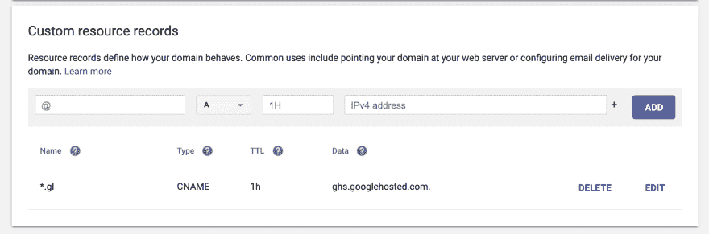

# 云运行服务的通配符

> 原文：<https://dev.to/googlecloud/a-wildcard-for-your-cloud-run-services-4haa>

[Cloud Run](https://cloud.google.com/run/) 是谷歌云上一系列无服务器产品中的最新产品。

当你在 Cloud Run 上创建一个新的服务时，你会在`run.app`下得到一个随机的 URL。例如，我之前设置了一个名为`qr`的，默认情况下可以在[https://QR-bvl HJ 4 hsjq-UC . a . run . app](https://qr-bvlhj4hsjq-uc.a.run.app)中找到。

那个网址有点不可靠，但是不要担心，我们可以修复它！您可以将自定义域映射到您的服务，而不是使用默认 URL。

然而，如果您在同一个项目中有许多不同的服务，这些服务将存在于一个共享域名的子域名中，那么这可能会变得很乏味。但是你知道吗，如果你使用一个**通配符 CNAME** ，你不必每次都配置你的 DNS。你可以在一个子域上设置它？是真的！

## 你领域的主人

为了开始，您需要配置域名的使用。这是一个跨项目的一次性过程，所以虽然可能有点长，但你只需要做一次。

首先，你需要一个域名。

您选择的域名以及向谁注册(域名注册商)由您决定，但有几点需要注意:

*   谷歌确实有自己的域名注册商。如果你使用谷歌，你的域名会被自动验证。
*   有一些域名，像`.app`，将[只允许 HTTPS 内容](https://www.blog.google/technology/developers/introducing-app-more-secure-home-apps-web/)。*这很好*，因为云运行将为您处理证书的创建和配置！

一旦你有了你的域名，你需要在谷歌云中验证它。

要启动此过程，请在您的 Google 云平台控制台中，导航到“云运行”，然后单击“管理自定义域”。

从这里，我们将为我们的`qr`服务“➕添加地图”。

如果你选择通过谷歌域名注册，你的域名将会出现在下拉列表中；否则，您需要遵循您选择的注册商的验证步骤。这些以每个注册商为基础进行记录，通常包括步骤的屏幕截图。

## 常规过程

如果没有通配符，每当我们想要将一个服务映射到一个自定义域时，我们每次都必须创建一个新的 CNAME 记录。

例如，对于这个`qr`服务，我必须添加:

```
qr.gl CNAME 1800 ghs.googlehosted.com. 
```

我不得不每次都这样做，等待 DNS 传播发生，然后才能开始使用我的站点。

## 出现通配符域！

相反，在验证域之后，我们将添加一个 DNS 记录来处理我们所有的服务，甚至是那些还不存在的服务。

以我为例，我注册了`asnt.app`，我想在`gl.asnt.app`下托管我所有的云运行服务(是的，我很可怕。)

为此，我需要创建以下 DNS 记录:

```
*.gl CNAME 1800 ghs.googlehosted.com. 
```

这是它在 Google Domains DNS 页面上的样子:

[](https://res.cloudinary.com/practicaldev/image/fetch/s--8HMLobuI--/c_limit%2Cf_auto%2Cfl_progressive%2Cq_auto%2Cw_880/https://user-images.githubusercontent.com/813732/58294555-3d755700-7dba-11e9-8384-bc7dd13b4d63.png)

这将需要*一个小时*来传播。

但是，我们已经完成了所有的 DNS 配置，我们应该再也不用碰它了！

## 一个命令将它们全部绘制出来

从这里开始，只需一个一次性命令就可以将您的服务映射到您的自定义域。

```
$ gcloud beta run domain-mappings create --service $SERVICE --domain $SERVICE.gl.asnt.app 
```

等待 **15~20 分钟**，你的 SSL 证书*会自动为你创建*，然后 tada🎉 [https://qr.gl.asnt.app](https://qr.gl.asnt.app/?qr=%F0%9F%8E%89) 现已上线！

每次你想部署一个新的服务，只需在你的`gcloud builds submit`和`gcloud beta run deploy`调用之后添加一个`gcloud beta run domain-mappings create`命令。

## 小而有用的效率提升。

使用 CNAME 通配符降低了设置新服务的复杂性，同时通过每次设置唯一的 SSL 证书来确保安全性。

如果 15 分钟仍然太长，你可以考虑使用另一个谷歌云产品的 [Firebase 主机是否适合你。](https://firebase.google.com/docs/hosting/cloud-run)

## 但是等等，通配符不是不好吗？

不一定。

因为我们花时间为特定的子域提供证书，所以我们要保护特定子域上的内容。我们使用通配符 CNAME 所做的只是减少了每次部署新服务时所需的 DNS 配置数量。与替代方案(通配符 SSL 证书)相比，在每个子域上提供唯一证书所需的时间减少了风险。

因为我们必须先验证我们的域，然后才能将其映射到我们的服务，所以没有其他云客户可以将其服务映射到我们的子域。

如果你有不同的服务交互并遇到 CORS 问题，可能会有有趣的结果，特别是如果你从根域*和*子域托管服务；在这种情况下，前面提到的 Firebase 托管可能是一个更好的解决方案。