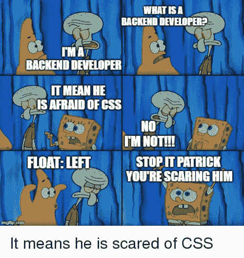

# CSS 战斗 2 号战车

> 原文：<https://dev.to/pheeria/css-battle-2-carrom-220n>

在第一场战斗中，我已经经历过了，但至少，我知道什么是错的。

液体错误:内部

这种不匹配，当你的结果看起来相当，但不完全相同，是令人沮丧的。第一个很简单。我心想，嘿，我听说过*响应式设计*，我是一名*软件工程师*毕竟，我不应该使用硬编码的值！但是`66vh`不等于总数 300 中的`200px`。所以，作为一名工程师，我只是大胆地输入了`200px`,然后就成功了。这一次不同。

## 1。几乎正确的那个

在我之前的公司，我们有很多全栈开发人员，他们喜欢避免前端任务。正如我的一位同事所说，Fullstack 后端开发人员。(在这种特殊的情况下，由于后端是 C#，我们不能他们[后端前端开发人员](https://hackernoon.com/the-backendification-of-frontend-development-62f218a773d4)

[](https://res.cloudinary.com/practicaldev/image/fetch/s--TuZ7oekb--/c_limit%2Cf_auto%2Cfl_progressive%2Cq_auto%2Cw_880/https://pics.me.me/what-is-a-backend-developer-backend-developer-it-mean-he-41886990.png)

正如我发现的那样，在 CSS 之战中，`floats`最初是为了在文本中放置图像。(就像`tables`被用来制作表格一样)更好的方法是`inline-block`元素。或者更好的是使用 Flexbox 或 Grid。所以我决定，去他妈的浮动，我会把内嵌阻塞的划分推到我想去的地方。

```
<div id="a"></div>
<div id="b"></div>
<div id="c"></div>
<div id="d"></div>

<style>
  body {
    margin: 0;
    background: #62374e;
  }
  div {
    width: 50px;
    height: 50px;
    background: #fdc57b;
    display: inline-block;
  }
  #a {
    margin-top: 50px;
    margin-left: 50px;
  }
  #b {
    margin-top: 50px;
    margin-left: 200px;
  }
  #c {
    margin-top: 100px;
    margin-left: 50px;
  }
  #d {
    margin-top: 100px;
    margin-left: 200px;
  }
</style> 
```

Enter fullscreen mode Exit fullscreen mode

这是我考了 98.7 分的时候。最终，在用另一种方法解决问题后，我了解到对于`inline-block`元素，HTML 中的空格很重要。有各种各样的方法来解决这个问题，最值得注意的是，将`body`元素上的`font-size`设置为零，这将导致字符数增加(当然，无论如何我都不会用这种方法得到高分，但仍然如此)，并且只需删除除法之间的空格。将所有四个 div 挤成一条线，它会像一个魔咒一样工作。

## 2。固定位置

在尝试第一种方法失败了几次之后，我想起我是一个受人尊敬的*软件工程师*，于是决定快速而不择手段——给每个部门一个固定的`position`，上面有精确的`top`和`left`坐标。

```
<div id="a"></div>
<div id="b"></div>
<div id="c"></div>
<div id="d"></div>

<style>
  body {
    margin: 0;
    background: #62374e;
  }
  div {
    width: 50px;
    height: 50px;
    background: #fdc57b;
    position: fixed;
  }
  #a {
    top: 50px;
    left: 50px;
  }
  #b {
    top: 50px;
    left: 300px;
  }
  #c {
    top: 200px;
    left: 50px;
  }
  #d {
    top: 200px;
    left: 300px;
  }
</style> 
```

Enter fullscreen mode Exit fullscreen mode

## 3。边界

如果我们不需要`body`的背景色会怎么样？如果我们能在每个方块周围创建一个巨大的边界会怎么样？没问题！我们甚至不需要`ids`，我们可以用`even`来代替(双关语)。`font-size`此处仅用于教育目的。

```
<div></div>
<div></div>
<div></div>
<div></div>

<style>
  body {
    margin: 0;
    font-size: 0;
  }
  div {
    width: 50px;
    height: 50px;
    background: #fdc57b;
    border: 50px solid #62374e;
    display: inline-block;
  }
  div:nth-of-type(even){
    border-left: 150px solid #62374e;
  }
</style> 
```

Enter fullscreen mode Exit fullscreen mode

你可能已经注意到了，因为我们的画布不是一个完美的正方形，所以我为 even `div`添加了一个例外，在左边有一个更大的非正方形边框。

## 4。伪元素

四个分区，我们只根据奇偶来设计它们的样式？对我来说这听起来像是重复。我们能把它切成两半吗？是的，如果我们使用伪元素。假设我们有两个普通的`divs`，它们的形状与`::after`相同。我们首先设计`divs`和他们的`::afters`的样式，然后将它们分开摆放。

```
<div></div>
<div></div>

<style>
  body {
    background: #62374e;
  }
  div, div::after {
    width: 50px;
    height: 50px;
    background: #fdc57b;
  }
  div:nth-of-type(odd) {
    margin: 50px 42px;
  }
  div:nth-of-type(even) {
    margin: 100px 42px;
  }
  div::after {
    content: "";
    display: inline-block;
    margin-left: 250px;
  }
</style> 
```

Enter fullscreen mode Exit fullscreen mode

顺便说一下，所有这些`42px`出现在这里和那里是因为 42 是~~生命、宇宙和一切~~ `50px - 8px`的答案，默认的边距。此外，如果您没有设置`margin`或`padding`，您可以安全地用*替换`body`标签。

## 5。方框阴影

有更优雅的吗？如果我们不需要四个师呢？我们不能试着复制一个三次吗？你记得纸钉吗？`box-shadow`？实际上，我们可以指定多个阴影，用逗号分隔。这是它的样子。

```
<div></div>

<style>
  body {
    background: #62374e;
  }
  div {
    margin: 50px 42px;
    width: 50px;
    height: 50px;
    background: #fdc57b;
    box-shadow: 250px 0 #fdc57b, 250px 150px #fdc57b, 0 150px #fdc57b;
  }
</style> 
```

Enter fullscreen mode Exit fullscreen mode

你看到我看到的了吗？有什么困扰你的吗？`#fdc57b`。该死的四次！不应该有类似`box-shadow-color`的东西吗？很不幸，没有。但是！[框阴影默认为颜色值](https://stackoverflow.com/a/10989662)。所以我们又来了。

```
<div></div>

<style>
  body {
    background: #62374e;
  }
  div {
    margin: 50px 42px;
    width: 50px;
    height: 50px;
    background: #fdc57b;
    color: #fdc57b;
    box-shadow: 250px 0, 250px 150px, 0 150px;
  }
</style> 
```

Enter fullscreen mode Exit fullscreen mode

我错过了什么重要的事情吗？