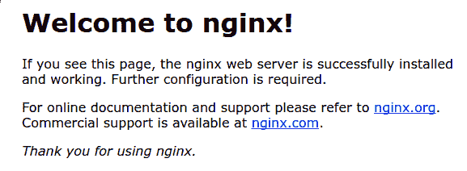

# Deploy Laravel Application with Nginx on Ubuntu 18.04 on DigitalOcean

> 原文：[https://dev.to/shuv1824/deploy-laravel-application-with-nginx-on-ubuntu-18-04-on-digitalocean-1egl](https://dev.to/shuv1824/deploy-laravel-application-with-nginx-on-ubuntu-18-04-on-digitalocean-1egl)

This is a complete guide on deploying a Laravel application on a fresh Ubuntu 18.04 droplet on DigitalOcean. We can follow the same steps to deploy on any similar host (like Linode) with Ubuntu 18.04 OS. For this you will need a fresh droplet with Ubuntu 18.04 server set up and root access of that server. We also need a domain/subdomain pointed to that server’s IP address (You can do that by setting ‘A Value’ in your DNS manager). If we are all set up to this point then lets move ahead and set up our new Ubuntu server.

# Installing Prerequisites

Now we are going to install the following:

*   Nginx
*   MySQL 5.7
*   PHP 7.2

First of all run the following command:

```
$ apt-get update 
```

<svg width="20px" height="20px" viewBox="0 0 24 24" class="highlight-action crayons-icon highlight-action--fullscreen-on"><title>Enter fullscreen mode</title></svg> <svg width="20px" height="20px" viewBox="0 0 24 24" class="highlight-action crayons-icon highlight-action--fullscreen-off"><title>Exit fullscreen mode</title></svg>

## 1\. Nginx

Nginx is one of the most popular web servers in the world and is responsible for hosting some of the largest and highest-traffic sites on the internet. It is more resource-friendly than Apache in most cases and can be used as a web server or reverse proxy.

### 1.1\. Installing Nginx

```
$ apt-get install nginx 
```

<svg width="20px" height="20px" viewBox="0 0 24 24" class="highlight-action crayons-icon highlight-action--fullscreen-on"><title>Enter fullscreen mode</title></svg> <svg width="20px" height="20px" viewBox="0 0 24 24" class="highlight-action crayons-icon highlight-action--fullscreen-off"><title>Exit fullscreen mode</title></svg>

### 1.2\. Adjusting Firewall

Before testing Nginx, the firewall software needs to be adjusted to allow access to the service. Nginx registers itself as a service with `ufw` upon installation, making it straightforward to allow Nginx access.

List the application configurations that `ufw` knows how to work with by typing:

```
$ ufw app list 
```

<svg width="20px" height="20px" viewBox="0 0 24 24" class="highlight-action crayons-icon highlight-action--fullscreen-on"><title>Enter fullscreen mode</title></svg> <svg width="20px" height="20px" viewBox="0 0 24 24" class="highlight-action crayons-icon highlight-action--fullscreen-off"><title>Exit fullscreen mode</title></svg>

We should get a listing of the application profile

```
//Output
Available applications:
  Nginx Full
  Nginx HTTP
  Nginx HTTPS
  OpenSSH 
```

<svg width="20px" height="20px" viewBox="0 0 24 24" class="highlight-action crayons-icon highlight-action--fullscreen-on"><title>Enter fullscreen mode</title></svg> <svg width="20px" height="20px" viewBox="0 0 24 24" class="highlight-action crayons-icon highlight-action--fullscreen-off"><title>Exit fullscreen mode</title></svg>

Now we can enable HTTP by typing

```
$ ufw allow 'Nginx HTTP' 
```

<svg width="20px" height="20px" viewBox="0 0 24 24" class="highlight-action crayons-icon highlight-action--fullscreen-on"><title>Enter fullscreen mode</title></svg> <svg width="20px" height="20px" viewBox="0 0 24 24" class="highlight-action crayons-icon highlight-action--fullscreen-off"><title>Exit fullscreen mode</title></svg>

Lets verify the change by typing

```
$ ufw status 
```

<svg width="20px" height="20px" viewBox="0 0 24 24" class="highlight-action crayons-icon highlight-action--fullscreen-on"><title>Enter fullscreen mode</title></svg> <svg width="20px" height="20px" viewBox="0 0 24 24" class="highlight-action crayons-icon highlight-action--fullscreen-off"><title>Exit fullscreen mode</title></svg>

We should see HTTP traffic allowed in the displayed output:

```
//Output
Status: active

To                         Action      From
--                         ------      ----
OpenSSH                    ALLOW       Anywhere                  
Nginx HTTP                 ALLOW       Anywhere                  
OpenSSH (v6)               ALLOW       Anywhere (v6)             
Nginx HTTP (v6)            ALLOW       Anywhere (v6) 
```

<svg width="20px" height="20px" viewBox="0 0 24 24" class="highlight-action crayons-icon highlight-action--fullscreen-on"><title>Enter fullscreen mode</title></svg> <svg width="20px" height="20px" viewBox="0 0 24 24" class="highlight-action crayons-icon highlight-action--fullscreen-off"><title>Exit fullscreen mode</title></svg>

### 1.3\. Checking the Web Server

At the end of the installation process, Ubuntu 18.04 starts Nginx. The web server should already be up and running. We can check by the following command

```
$ systemctl status nginx 
```

<svg width="20px" height="20px" viewBox="0 0 24 24" class="highlight-action crayons-icon highlight-action--fullscreen-on"><title>Enter fullscreen mode</title></svg> <svg width="20px" height="20px" viewBox="0 0 24 24" class="highlight-action crayons-icon highlight-action--fullscreen-off"><title>Exit fullscreen mode</title></svg>

```
//Output
● nginx.service - A high performance web server and a reverse proxy server
   Loaded: loaded (/lib/systemd/system/nginx.service; enabled; vendor preset: enabled)
   Active: active (running) since Sun 2019-06-09 00:00:00 ; 3h 33min ago
     Docs: man:nginx(8)
  Process: 2062 ExecStart=/usr/sbin/nginx -g daemon on; master_process on; (code=exited, status=0/SUCCESS)
  Process: 1803 ExecStartPre=/usr/sbin/nginx -t -q -g daemon on; master_process on; (code=exited, status=0/SUCCESS)
 Main PID: 2064 (nginx)
    Tasks: 5 (limit: 4915)
   CGroup: /system.slice/nginx.service
           ├─2064 nginx: master process /usr/sbin/nginx -g daemon on; master_process on;
           ├─2066 nginx: worker process
           ├─2068 nginx: worker process
           ├─2071 nginx: worker process
           └─2072 nginx: worker process 
```

<svg width="20px" height="20px" viewBox="0 0 24 24" class="highlight-action crayons-icon highlight-action--fullscreen-on"><title>Enter fullscreen mode</title></svg> <svg width="20px" height="20px" viewBox="0 0 24 24" class="highlight-action crayons-icon highlight-action--fullscreen-off"><title>Exit fullscreen mode</title></svg>

Now if we go to our `server_ip_or_domain` from our browser we will the following page

[](https://res.cloudinary.com/practicaldev/image/fetch/s--qC88aN7n--/c_limit%2Cf_auto%2Cfl_progressive%2Cq_auto%2Cw_880/https://assets.digitalocean.com/articles/nginx_1604/default_page.png)

## 2\. MySQL 5.7

On Ubuntu 18.04, only the latest version of MySQL is included in the APT package repository by default. At the time of writing, that's MySQL 5.7\. To install run the following command:

```
$ apt-get install mysql-server 
```

<svg width="20px" height="20px" viewBox="0 0 24 24" class="highlight-action crayons-icon highlight-action--fullscreen-on"><title>Enter fullscreen mode</title></svg> <svg width="20px" height="20px" viewBox="0 0 24 24" class="highlight-action crayons-icon highlight-action--fullscreen-off"><title>Exit fullscreen mode</title></svg>

This will install MySQL, but will not prompt you to set a password or make any other configuration changes. Because this leaves our installation of MySQL insecure, we will run the next command.

```
$ mysql_secure_installation 
```

<svg width="20px" height="20px" viewBox="0 0 24 24" class="highlight-action crayons-icon highlight-action--fullscreen-on"><title>Enter fullscreen mode</title></svg> <svg width="20px" height="20px" viewBox="0 0 24 24" class="highlight-action crayons-icon highlight-action--fullscreen-off"><title>Exit fullscreen mode</title></svg>

This will take us through a series of prompts where we can make some changes to our MySQL installation’s security options like set a password for the root user etc. We must set a password for the root user. To log in to the root user with the newly set password we can run the following command

```
$ mysql -u root -p 
```

<svg width="20px" height="20px" viewBox="0 0 24 24" class="highlight-action crayons-icon highlight-action--fullscreen-on"><title>Enter fullscreen mode</title></svg> <svg width="20px" height="20px" viewBox="0 0 24 24" class="highlight-action crayons-icon highlight-action--fullscreen-off"><title>Exit fullscreen mode</title></svg>

To test whether `mysql` is running run the following command

```
$ systemctl status mysql 
```

<svg width="20px" height="20px" viewBox="0 0 24 24" class="highlight-action crayons-icon highlight-action--fullscreen-on"><title>Enter fullscreen mode</title></svg> <svg width="20px" height="20px" viewBox="0 0 24 24" class="highlight-action crayons-icon highlight-action--fullscreen-off"><title>Exit fullscreen mode</title></svg>

```
// Output
● mysql.service - MySQL Community Server
   Loaded: loaded (/lib/systemd/system/mysql.service; enabled; vendor preset: enabled)
   Active: active (running) since Sun 2019-06-09 00:00:00; 3h 53min ago
  Process: 1948 ExecStart=/usr/sbin/mysqld --daemonize --pid-file=/run/mysqld/mysqld.pid (code=exited, status=0/SUCCESS)
  Process: 1792 ExecStartPre=/usr/share/mysql/mysql-systemd-start pre (code=exited, status=0/SUCCESS)
 Main PID: 1950 (mysqld)
    Tasks: 28 (limit: 4915)
   CGroup: /system.slice/mysql.service
           └─1950 /usr/sbin/mysqld --daemonize --pid-file=/run/mysqld/mysqld.pid 
```

<svg width="20px" height="20px" viewBox="0 0 24 24" class="highlight-action crayons-icon highlight-action--fullscreen-on"><title>Enter fullscreen mode</title></svg> <svg width="20px" height="20px" viewBox="0 0 24 24" class="highlight-action crayons-icon highlight-action--fullscreen-off"><title>Exit fullscreen mode</title></svg>

## 3\. PHP 7.2

PHP 7.2 is included in the default Ubuntu repository for 18.04\. We can list each of the available PHP 7.2 packages with the following command

```
$ apt-cache pkgnames | grep php7.2 
```

<svg width="20px" height="20px" viewBox="0 0 24 24" class="highlight-action crayons-icon highlight-action--fullscreen-on"><title>Enter fullscreen mode</title></svg> <svg width="20px" height="20px" viewBox="0 0 24 24" class="highlight-action crayons-icon highlight-action--fullscreen-off"><title>Exit fullscreen mode</title></svg>

Next, we can install the packages that our application requires

```
$ apt-get install php curl git unzip
$ apt-get install php-pear php-fpm php-dev php-zip php-curl php-xmlrpc php-gd php-mysql php-mbstring php-xml libapache2-mod-php 
```

<svg width="20px" height="20px" viewBox="0 0 24 24" class="highlight-action crayons-icon highlight-action--fullscreen-on"><title>Enter fullscreen mode</title></svg> <svg width="20px" height="20px" viewBox="0 0 24 24" class="highlight-action crayons-icon highlight-action--fullscreen-off"><title>Exit fullscreen mode</title></svg>

Finally, we can restart Nginx to allow PHP to run

```
$ systemctl restart nginx 
```

<svg width="20px" height="20px" viewBox="0 0 24 24" class="highlight-action crayons-icon highlight-action--fullscreen-on"><title>Enter fullscreen mode</title></svg> <svg width="20px" height="20px" viewBox="0 0 24 24" class="highlight-action crayons-icon highlight-action--fullscreen-off"><title>Exit fullscreen mode</title></svg>

And confirm the PHP version by

```
$ php --version 
```

<svg width="20px" height="20px" viewBox="0 0 24 24" class="highlight-action crayons-icon highlight-action--fullscreen-on"><title>Enter fullscreen mode</title></svg> <svg width="20px" height="20px" viewBox="0 0 24 24" class="highlight-action crayons-icon highlight-action--fullscreen-off"><title>Exit fullscreen mode</title></svg>

```
// Output
PHP 7.2.16-1+ubuntu18.04.1+deb.sury.org+1 (cli) (built: Mar  7 2019 20:23:29) ( NTS )
Copyright (c) 1997-2018 The PHP Group
Zend Engine v3.2.0, Copyright (c) 1998-2018 Zend Technologies
    with Zend OPcache v7.2.16-1+ubuntu18.04.1+deb.sury.org+1, Copyright (c) 1999-2018, by Zend Technologies 
```

<svg width="20px" height="20px" viewBox="0 0 24 24" class="highlight-action crayons-icon highlight-action--fullscreen-on"><title>Enter fullscreen mode</title></svg> <svg width="20px" height="20px" viewBox="0 0 24 24" class="highlight-action crayons-icon highlight-action--fullscreen-off"><title>Exit fullscreen mode</title></svg>

The main config file of PHP 7.2 will be saved as `/etc/php/7.2/fpm/php.ini`. We can use the any text editor to modify relevant settings in that file

```
$ nano /etc/php/7.2/fpm/php.ini 
```

<svg width="20px" height="20px" viewBox="0 0 24 24" class="highlight-action crayons-icon highlight-action--fullscreen-on"><title>Enter fullscreen mode</title></svg> <svg width="20px" height="20px" viewBox="0 0 24 24" class="highlight-action crayons-icon highlight-action--fullscreen-off"><title>Exit fullscreen mode</title></svg>

Now we need another tool before we can get into setting up Laravel. This tool is `composer`. Composer is a popular dependency management tool for PHP, created mainly to facilitate installation and updates for project dependencies. To install `composer` we have to run the following commands

```
$ cd ~
$ curl -sS https://getcomposer.org/installer -o composer-setup.php 
```

<svg width="20px" height="20px" viewBox="0 0 24 24" class="highlight-action crayons-icon highlight-action--fullscreen-on"><title>Enter fullscreen mode</title></svg> <svg width="20px" height="20px" viewBox="0 0 24 24" class="highlight-action crayons-icon highlight-action--fullscreen-off"><title>Exit fullscreen mode</title></svg>

To install composer globally, use the following command which will download and install Composer as a system-wide command named `composer`, under `/usr/local/bin`

```
$ php composer-setup.php --install-dir=/usr/local/bin --filename=composer 
```

<svg width="20px" height="20px" viewBox="0 0 24 24" class="highlight-action crayons-icon highlight-action--fullscreen-on"><title>Enter fullscreen mode</title></svg> <svg width="20px" height="20px" viewBox="0 0 24 24" class="highlight-action crayons-icon highlight-action--fullscreen-off"><title>Exit fullscreen mode</title></svg>

```
//Output
All settings correct for using Composer
Downloading...

Composer (version 1.6.5) successfully installed to: /usr/local/bin/composer
Use it: php /usr/local/bin/composer 
```

<svg width="20px" height="20px" viewBox="0 0 24 24" class="highlight-action crayons-icon highlight-action--fullscreen-on"><title>Enter fullscreen mode</title></svg> <svg width="20px" height="20px" viewBox="0 0 24 24" class="highlight-action crayons-icon highlight-action--fullscreen-off"><title>Exit fullscreen mode</title></svg>

To test our installation, we can run

```
$ composer 
```

<svg width="20px" height="20px" viewBox="0 0 24 24" class="highlight-action crayons-icon highlight-action--fullscreen-on"><title>Enter fullscreen mode</title></svg> <svg width="20px" height="20px" viewBox="0 0 24 24" class="highlight-action crayons-icon highlight-action--fullscreen-off"><title>Exit fullscreen mode</title></svg>

And we will get the following output with all composer's arguments

```
Output
   ______
  / ____/___  ____ ___  ____  ____  ________  _____
 / /   / __ \/ __ `__ \/ __ \/ __ \/ ___/ _ \/ ___/
/ /___/ /_/ / / / / / / /_/ / /_/ (__  )  __/ /
\____/\____/_/ /_/ /_/ .___/\____/____/\___/_/
                    /_/
Composer version 1.6.5 2018-05-04 11:44:59

Usage:
  command [options] [arguments]
... 
```

<svg width="20px" height="20px" viewBox="0 0 24 24" class="highlight-action crayons-icon highlight-action--fullscreen-on"><title>Enter fullscreen mode</title></svg> <svg width="20px" height="20px" viewBox="0 0 24 24" class="highlight-action crayons-icon highlight-action--fullscreen-off"><title>Exit fullscreen mode</title></svg>

# Project Setup

As we are done installing all the dependencies. Now its time for us to set up the main project. Here I am going to use git to pull my Laravel project from a remote repository and maintain version control of the application.

## Database Setup

But first we have to create a new database for the application. To create MySQL database and users, we have to follow these steps.

*   At the command line, we have to log in to MySQL as the root user.

```
$ mysql -u root -p 
```

<svg width="20px" height="20px" viewBox="0 0 24 24" class="highlight-action crayons-icon highlight-action--fullscreen-on"><title>Enter fullscreen mode</title></svg> <svg width="20px" height="20px" viewBox="0 0 24 24" class="highlight-action crayons-icon highlight-action--fullscreen-off"><title>Exit fullscreen mode</title></svg>

Insert root password to enter into mysql shell.

*   To create a database user, we have to type the following command. Replace `username` with the user you want to create, and replace `password` with the user's password.

```
$ mysql> GRANT ALL PRIVILEGES ON *.* TO 'username'@'localhost' IDENTIFIED BY 'password'; 
```

<svg width="20px" height="20px" viewBox="0 0 24 24" class="highlight-action crayons-icon highlight-action--fullscreen-on"><title>Enter fullscreen mode</title></svg> <svg width="20px" height="20px" viewBox="0 0 24 24" class="highlight-action crayons-icon highlight-action--fullscreen-off"><title>Exit fullscreen mode</title></svg>

Then type \q to exit the mysql program.

*   To log in to MySQL as the user we just created, type the following command. Replace `username` with the name of the user you created in previous step.

```
$ mysql -u username -p 
```

<svg width="20px" height="20px" viewBox="0 0 24 24" class="highlight-action crayons-icon highlight-action--fullscreen-on"><title>Enter fullscreen mode</title></svg> <svg width="20px" height="20px" viewBox="0 0 24 24" class="highlight-action crayons-icon highlight-action--fullscreen-off"><title>Exit fullscreen mode</title></svg>

Insert user password to enter into mysql shell.

*   To create a database, we have to type the following command. Replace `dbname` with the name of the database that you want to create.

```
$ mysql> CREATE DATABASE dbname; 
```

<svg width="20px" height="20px" viewBox="0 0 24 24" class="highlight-action crayons-icon highlight-action--fullscreen-on"><title>Enter fullscreen mode</title></svg> <svg width="20px" height="20px" viewBox="0 0 24 24" class="highlight-action crayons-icon highlight-action--fullscreen-off"><title>Exit fullscreen mode</title></svg>

## Application Setup

We are going to host our application in `/var/www/html` directory of our server. You can use any other directory if you want. We will be using `git` to upload the project files and maintain version control. I suppose we know the basics of Git. Lets dive in.

*   Create an empty Git repository in `/var/www/html` directory.

```
$ cd /var/www/html
$ git init 
```

<svg width="20px" height="20px" viewBox="0 0 24 24" class="highlight-action crayons-icon highlight-action--fullscreen-on"><title>Enter fullscreen mode</title></svg> <svg width="20px" height="20px" viewBox="0 0 24 24" class="highlight-action crayons-icon highlight-action--fullscreen-off"><title>Exit fullscreen mode</title></svg>

Say our remote repository is on [Github](https://www.github.com) and we have the link `https://github.com/username/project-name.git` and this repo has a `production` branch. Now lets add this remote repo to our newly created empty repo and pull the project files from the remote.

```
$ git remote add origin https://github.com/username/project-name.git
$ git pull origin production 
```

<svg width="20px" height="20px" viewBox="0 0 24 24" class="highlight-action crayons-icon highlight-action--fullscreen-on"><title>Enter fullscreen mode</title></svg> <svg width="20px" height="20px" viewBox="0 0 24 24" class="highlight-action crayons-icon highlight-action--fullscreen-off"><title>Exit fullscreen mode</title></svg>

We may have to enter our github username and password here. Then We have to wait until the full branch is uploaded to the server. Now we will configure the Laravel application on our server. Make sure we are in our project directory (Here it is `/var/www/html`).

```
$ cp .env.example .env
$ nano .env 
```

<svg width="20px" height="20px" viewBox="0 0 24 24" class="highlight-action crayons-icon highlight-action--fullscreen-on"><title>Enter fullscreen mode</title></svg> <svg width="20px" height="20px" viewBox="0 0 24 24" class="highlight-action crayons-icon highlight-action--fullscreen-off"><title>Exit fullscreen mode</title></svg>

This will open the `.env` file in the `nano` editor so that we can make the necessary changes.

```
// .env file
APP_NAME=application_name
APP_ENV=local APP_KEY=
APP_DEBUG=true APP_URL=application_url

DB_CONNECTION=mysql
DB_HOST=127.0.0.1
DB_PORT=3306
DB_DATABASE=dbname
DB_USERNAME=username
DB_PASSWORD=password

MAIL_DRIVER=smtp
MAIL_HOST=smtp.mailtrap.io
MAIL_PORT=2525
MAIL_USERNAME=null
MAIL_PASSWORD=null
MAIL_ENCRYPTION=null

PUSHER_APP_ID=
PUSHER_APP_KEY=
PUSHER_APP_SECRET=
PUSHER_APP_CLUSTER=mt1 
```

<svg width="20px" height="20px" viewBox="0 0 24 24" class="highlight-action crayons-icon highlight-action--fullscreen-on"><title>Enter fullscreen mode</title></svg> <svg width="20px" height="20px" viewBox="0 0 24 24" class="highlight-action crayons-icon highlight-action--fullscreen-off"><title>Exit fullscreen mode</title></svg>

After editing we will save the file by `Ctrl+o` and exit it by `Ctrl+x`.
Now lets install all dependencies via `composer`.

```
$ composer update 
```

<svg width="20px" height="20px" viewBox="0 0 24 24" class="highlight-action crayons-icon highlight-action--fullscreen-on"><title>Enter fullscreen mode</title></svg> <svg width="20px" height="20px" viewBox="0 0 24 24" class="highlight-action crayons-icon highlight-action--fullscreen-off"><title>Exit fullscreen mode</title></svg>

After all the dependencies are installed successfully run the following commands.

```
$ composer dump-autoload
$ php artisan config:clear
$ php artisan key:generate
$ php artisan migrate
$ php artisan db:seed 
```

<svg width="20px" height="20px" viewBox="0 0 24 24" class="highlight-action crayons-icon highlight-action--fullscreen-on"><title>Enter fullscreen mode</title></svg> <svg width="20px" height="20px" viewBox="0 0 24 24" class="highlight-action crayons-icon highlight-action--fullscreen-off"><title>Exit fullscreen mode</title></svg>

Our laravel application is almost set up now. The only thing remaining to do now is to make an Nginx config file. We can use the `/etc/nginx/sites-available/default.conf` file or we can make a new config file. Either way it will work. Here we are going to use the `default` file.

```
$ nano /etc/nginx/sites-available/default.conf 
```

<svg width="20px" height="20px" viewBox="0 0 24 24" class="highlight-action crayons-icon highlight-action--fullscreen-on"><title>Enter fullscreen mode</title></svg> <svg width="20px" height="20px" viewBox="0 0 24 24" class="highlight-action crayons-icon highlight-action--fullscreen-off"><title>Exit fullscreen mode</title></svg>

Clear everything from the file and add the following snippet.

```
// /etc/nginx/sites-available/default.conf file
server {
    listen 80;
    listen [::]:80;

    root /var/www/html/public;
    index index.php index.html index.htm index.nginx-debian.html;

    server_name <our.application.name>;

    location / {
    try_files $uri $uri/ /index.php$is_args$args;
    }

    location ~ \.php$ {
      try_files $uri /index.php =404;
      fastcgi_pass unix:/var/run/php/php7.2-fpm.sock;
      fastcgi_index index.php;
      fastcgi_param SCRIPT_FILENAME $document_root$fastcgi_script_name;
      include fastcgi_params;
    }

    location ~ /\.ht {
        deny all;
    }
} 
```

<svg width="20px" height="20px" viewBox="0 0 24 24" class="highlight-action crayons-icon highlight-action--fullscreen-on"><title>Enter fullscreen mode</title></svg> <svg width="20px" height="20px" viewBox="0 0 24 24" class="highlight-action crayons-icon highlight-action--fullscreen-off"><title>Exit fullscreen mode</title></svg>

Save and close the file. Now we have to make a symbolic link of this file to the `/etc/nginx/sites-enabled/` directory. To accomplish that run the following command.

```
$ ln -S /etc/nginx/sites-available/default.conf /etc/nginx/sites-enabled/ 
```

<svg width="20px" height="20px" viewBox="0 0 24 24" class="highlight-action crayons-icon highlight-action--fullscreen-on"><title>Enter fullscreen mode</title></svg> <svg width="20px" height="20px" viewBox="0 0 24 24" class="highlight-action crayons-icon highlight-action--fullscreen-off"><title>Exit fullscreen mode</title></svg>

To test whether the nginx config is correct we can run the following command.

```
$ nginx -t 
```

<svg width="20px" height="20px" viewBox="0 0 24 24" class="highlight-action crayons-icon highlight-action--fullscreen-on"><title>Enter fullscreen mode</title></svg> <svg width="20px" height="20px" viewBox="0 0 24 24" class="highlight-action crayons-icon highlight-action--fullscreen-off"><title>Exit fullscreen mode</title></svg>

If the config file is correct then it will output the following.

```
nginx: the configuration file /etc/nginx/nginx.conf syntax is ok
nginx: configuration file /etc/nginx/nginx.conf test is successful 
```

<svg width="20px" height="20px" viewBox="0 0 24 24" class="highlight-action crayons-icon highlight-action--fullscreen-on"><title>Enter fullscreen mode</title></svg> <svg width="20px" height="20px" viewBox="0 0 24 24" class="highlight-action crayons-icon highlight-action--fullscreen-off"><title>Exit fullscreen mode</title></svg>

Now we have to restart Nginx service.

```
$ systemctl restart nginx 
```

<svg width="20px" height="20px" viewBox="0 0 24 24" class="highlight-action crayons-icon highlight-action--fullscreen-on"><title>Enter fullscreen mode</title></svg> <svg width="20px" height="20px" viewBox="0 0 24 24" class="highlight-action crayons-icon highlight-action--fullscreen-off"><title>Exit fullscreen mode</title></svg>

At this point our Laravel application is deployed successfully on our Ubuntu 18.04 server. Now to test we browse the server's IP or domain from the browser and will see our application live.

In this post I tried to give you guys a full guide to how you can deploy your Laravel application with Nginx on Ubuntu 18.04 on DigitalOcean or Linode or any other similar hosting platform. Hope this will help you all in some way. Peace.