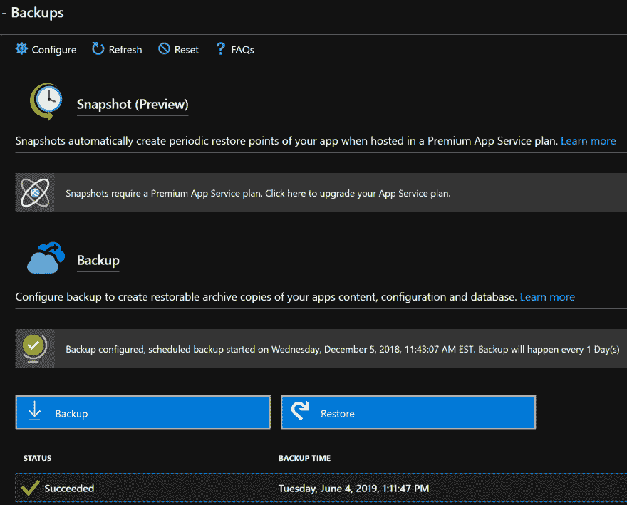
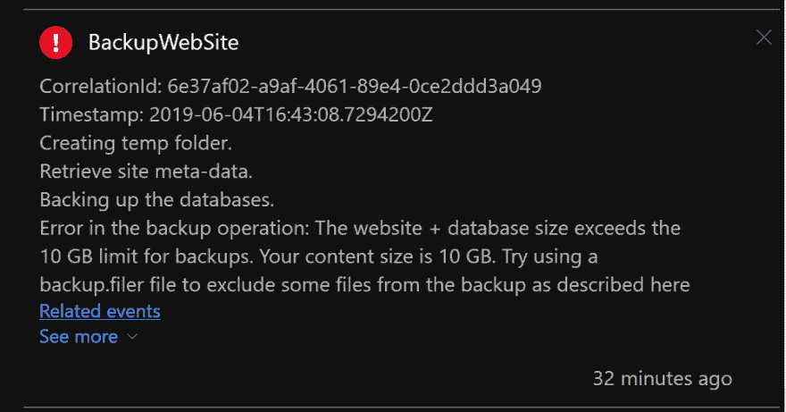

# Kentico CMS 快速提示:确保 Azure 应用服务中的成功备份

> 原文：<https://dev.to/wiredviews/kentico-cms-quick-tip-ensuring-successful-backups-in-azure-app-service-3op0>

## 肯蒂科💕蔚蓝的

早在 2011 年，Kentico 就是第一个被认证在 Azure 中运行的 CMS。Kentico 团队与微软紧密合作，以确保在传统数据中心环境之外运行 Kentico 的兼容性和支持。👍

在 [WiredViews](https://www.wiredviews.com/) 时，我们在 2017 年将我们的主机从一个私有数据中心迁移到 Azure，从那以后我们就喜欢上了在 Azure 中管理我们客户网站的体验。🙌

## 开发者💕应用服务

使用 Azure 的 [App 服务](https://azure.microsoft.com/en-us/services/app-service/)产品有很多好处。

最主要的一点是，你的应用在一个应用服务中运行的大部分基础设施都是由 Azure 管理的(操作系统更新、安全加固)。

开发人员开始专注于开发和部署他们的应用程序“正常工作”。

## 备份

App Service 有一个集成的应用程序备份解决方案，可以按计划配置，对应用程序的文件系统(以及可选的连接数据库)进行备份或快照。

这是用户界面的一个截图。

[](https://res.cloudinary.com/practicaldev/image/fetch/s--jBnlaP5z--/c_limit%2Cf_auto%2Cfl_progressive%2Cq_auto%2Cw_880/https://thepracticaldev.s3.amazonaws.com/i/rp88fk0fnb7xn7wzcj2g.PNG)

如果你习惯于按计划编写脚本到`xcopy`或 zip 文件，这个内置特性是一个很好的替代品。👌

## 问题:备份大小限制- 10GB

有些事情你可能没有意识到...

如果您的应用服务文件系统包含超过 10GB 的数据，则自动计划备份将会失败！😱

您将在 Azure 门户中收到类似这样的通知:

[](https://res.cloudinary.com/practicaldev/image/fetch/s--DJA_Dq9t--/c_limit%2Cf_auto%2Cfl_progressive%2Cq_auto%2Cw_880/https://thepracticaldev.s3.amazonaws.com/i/p9d2de6oftkdc51vnym1.PNG)

## Kentico +备份

运行在 Kentico CMS 上的网站可以包含大量内容。有些内容存储在数据库中(页面内容、站点配置、电子商务历史)，但有些内容可能在文件系统中(媒体库、附件)。

存储在文件系统上的媒体内容会占用大量空间。

希望你正在使用 Azure Blob 存储来[将你的媒体内容存储在 Kentico](https://docs.kentico.com/k12/custom-development/working-with-physical-files-using-the-api/configuring-file-system-providers/configuring-azure-storage) 中。这将使您的应用程序的文件系统保持干净，除了部署的应用程序代码和资产。

> 将媒体内容保存在博客存储中而不是文件系统中的另一个好理由是，文件系统不会在部署插槽之间共享。参见[应用插槽](https://msdn.microsoft.com/en-us/magazine/mt793270.aspx)一节。

即使您将媒体内容存储在 Blob 存储中，您的应用服务文件系统也有可能被数据(日志文件、临时数据、通过 ftp 部署的导入流程文件等)填满...).

## 解

我们解决这个问题并确保备份成功完成的方法是过滤掉备份中不需要存储的文件。🤔

一个特殊的文件`_backup.filter`，你可以在你部署的应用程序文件夹的根目录下创建，给应用程序服务备份进程[关于从备份](https://docs.microsoft.com/en-us/azure/app-service/manage-backup#exclude-files-from-your-backup)中过滤掉什么的指令。🧐

对于 Kentico CMS 站点，它将被放在`\CMS`文件夹中，添加到。NET 项目，并与其余的应用程序代码和二进制文件一起部署到应用程序服务。

下面是一个我们可能在`_backup.filter`文件中包含的内容的例子:

```
\site\wwwroot\App_Data\AzureCache
\site\wwwroot\App_Data\AzureTemp
\site\wwwroot\App_Data\CMSTemp
\site\wwwroot\App_Data\Persistent 
```

<svg width="20px" height="20px" viewBox="0 0 24 24" class="highlight-action crayons-icon highlight-action--fullscreen-on"><title>Enter fullscreen mode</title></svg> <svg width="20px" height="20px" viewBox="0 0 24 24" class="highlight-action crayons-icon highlight-action--fullscreen-off"><title>Exit fullscreen mode</title></svg>

这个示例文件将告诉应用程序服务在创建备份时忽略指定的目录。

这些 Kentico 目录可能会填满许多不需要备份的额外内容，但现在我们不必担心这会停止我们的备份！🎉

## 结论

Azure 中的应用服务的好处之一是自动备份，这是一个很好的功能，应该总是需要配置和启用，尤其是在生产环境中。

如果我们想要依赖这些自动备份，我们需要遵守平台的规则和限制，包括 10GB 备份限制规则。

Kentico CMS 可以生成大量内容，虽然有办法将这些内容从文件系统中删除，但有些网站可能会发送超过 10GB 的文件。

`_backup.filter`文件允许开发人员选择从备份过程中排除哪些文件和文件夹，以确保应用服务不会达到或超过 10GB 的备份限制。

通过保持在备份限制以下，我们可以帮助保证我们的备份总是成功的。💪

* * *

我希望你喜欢这个快速提示。我计划在这个系列中发布更多的技巧。

如果您正在寻找更多的 Kentico 内容，请在 DEV:

## # [肯蒂科](https://dev.to/t/kentico) <button name="button" type="button" data-info="{&quot;className&quot;:&quot;Tag&quot;,&quot;style&quot;:&quot;full&quot;,&quot;id&quot;:5339,&quot;name&quot;:&quot;kentico&quot;}" class="crayons-btn follow-action-button whitespace-nowrap c-btn--secondary fs-base " aria-label="Follow tag: kentico" aria-pressed="false">跟随</button>

或者我的 [Kentico 12:设计模式](https://dev.to/search?q=Kentico%2012%20-%20Design%20Patterns)系列。