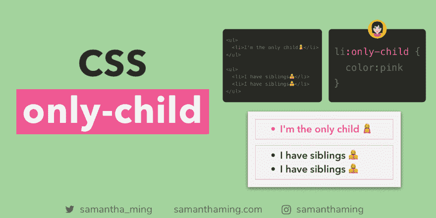
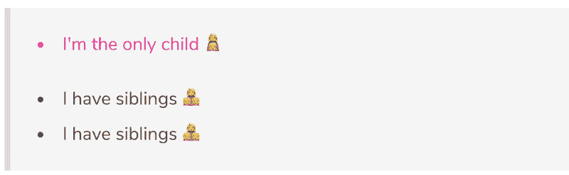

# CSS 独生子女

> 原文：<https://dev.to/samanthaming/css-only-child-1j6d>

[](https://res.cloudinary.com/practicaldev/image/fetch/s--7qDEu9cn--/c_limit%2Cf_auto%2Cfl_progressive%2Cq_auto%2Cw_880/https://thepracticaldev.s3.amazonaws.com/i/pty03v3asw69wy7llz7b.png)

我们有第一个孩子，最后一个孩子和第 n 个孩子。如果你是独生子呢？不是每个人都有兄弟姐妹，你知道的！别担心，CSS 会保护你🤗。如果你想设计一个没有兄弟的元素，使用:only-child 伪类选择器👩‍👧

*HTML*

```
<ul>
  <li>I'm the only child👩‍👧</li>
</ul>

<ul>
  <li>I have siblings👩‍👧‍👧</li>
  <li>I have siblings👩‍👧‍👧</li>
</ul> 
```

*CSS*

```
li:only-child {
  color: DeepPink;
} 
```

*输出*

[](https://res.cloudinary.com/practicaldev/image/fetch/s--aOI-__Qx--/c_limit%2Cf_auto%2Cfl_progressive%2Cq_auto%2Cw_880/https://thepracticaldev.s3.amazonaws.com/i/qbvk1g6nva84syq8ixof.png)

## 备选方案

或者，您也可以使用其他子选择器来实现这个“唯一的孩子”

### 使用:第一个孩子和:最后一个孩子

这也将选择唯一的孩子。

```
li:first-child:last-child {
  color: DeepPink;
} 
```

### 使用:n-child 和:n-last-child

```
li:nth-child(1):nth-last-child(1) {
  color: DeepPink;
} 
```

### 有什么区别？

因此，使用替代解决方案和`:nth-child`的区别在于，我们的后者将具有更低的特异性。

> 如果有两个或更多的 CSS 规则指向同一个元素，浏览器会遵循一些规则来确定哪一个是最具体的，从而胜出。

*[w3schools.com: CSS 特异性](https://www.w3schools.com/css/css_specificity.asp)*

### 专一战⚔️

让我们看看这个例子。由于`only-child`具有较低的特异性，将出现的文本颜色将是**蓝色**。

```
li:first-child:last-child {
  color: blue; /* 👈 This will win */
}

li:only-child {
  color: DeepPink;
} 
```

如果我们打败了他们三个。这个`:first-child:last-child`与`:nth-child(1):nth-last-child(1)`具有相同的特殊性，所以规则是最后出现的将是赢家。在我们的例子中，由于`:nth-child(1):nth-last-child(1)`出现在之后，那么将出现的文本颜色将是**绿色**。

```
li:first-child:last-child {
  color: blue;
}

li:nth-child(1):nth-last-child(1) {
  color: green; /* 👈 This will win */
}

li:only-child {
  color: DeepPink;
} 
```

## 独生子女 vs 独生子女

让我们从单独解释它们开始:

`:only-child`仅选择父元素的唯一子元素。这意味着该父元素中只有一个元素。即使是不同的元素类型，也不会被认为是独生子女。一个元素，没有例外！

仅选择一个元素，如果它是父元素中特定类型的唯一子元素。所以有其他不同类型的兄弟姐妹没问题。

既然我们已经解释清楚了。让我们来看一些例子。

### 举例:独生子女

这里有一个简单的。`<p>`是父元素`<div>`的唯一子元素，所以这符合标准。

```
<div>
  <p></p> <!-- p:only-child -->
</div> 
```

### 举例:非独生子女

但是现在我们有一个问题。父母`<div>`有两个孩子。所以如果我们使用`:only-child`作为我们的选择器，什么都不会被选中。

```
<!-- ⚠️ p:only-child ➡️ no element selected -->
<div>
  <h1></h1>
  <p></p>
</div> 
```

### 示例:仅类型

然而，如果我们使用了`:only-of-type`，我们就没事了。尽管我们的父母`<div>`有两个孩子。`<p>`仍然是那种特殊类型的独生子女。在这种情况下，我们的`<p>`是我们孩子的唯一类型。所以它满足唯一类型的标准，因此被选中。

```
<div>
  <h1></h1>
  <p></p> <!-- p:only-of-type -->
</div> 
```

## 其他类似的 CSS 伪类

以下是一些其他类似的 CSS 伪类

*   `:first-child`和`:first-of-type`
*   `:last-child`和`:last-of-type`
*   `:nth-child`和`:nth-of-type`

我在之前的代码笔记中提到了`:first-child`和`:first-of-type`，请向下滚动到接近末尾处阅读🤓

> [CSS 非选择器](https://www.samanthaming.com/tidbits/46-css-not-selector)

## 浏览器支持

也挺支持的，包括 ie 浏览器！

> [浏览器支持:独生子女](https://developer.mozilla.org/en-US/docs/Web/CSS/:only-child#Browser_compatibility)

## 更新:CSS 选择器 4 中的独生子女

希望也包含此更新。它在 CSS 选择器级别 4 的工作草案中。

> 匹配元素不需要有父元素。

*[MDN 网络文档](https://developer.mozilla.org/en-US/docs/Web/CSS/:only-child#Specifications)*

那么这是否意味着没有父元素也可以有一个唯一的子元素呢🤔我真的不知道这件事的细节😅。但是如果你知道这是关于什么的，请在评论中留下来，这样我可以了解更多。你知道他们说什么，分享是关怀🤗

## 社区输入

*   *[@ EmmiePaivarinta](https://twitter.com/EmmiePaivarinta/status/1137430744555560960):*`:empty`也超级有用😊只有当元素没有子元素时，它才适用。

*   *[@滑板界](https://twitter.com/Skateside/status/1137448069312720901) :* 公平警告与`:empty`

```
<i></i> <!-- empty -->
<i><!-- not empty --></i>
<i><b hidden>not empty</b></i>
<i> </i><!-- not empty (white space) 
```

### 第一胎 vs 独生子女

*[@yoann_buzenet](https://twitter.com/Yoann_Buzenet/status/1137756830703267841) :* 为什么我们要用`only-child`而不是`first-child`？他们不做同样的事情吗？

*[@ cancrexo](https://twitter.com/cancrexo/status/1137759928934780928):*`first-child`嗯，不总是独生子女😉

*[@yoann_buzenet](https://twitter.com/Yoann_Buzenet/status/1137761065448722432) :* 是的但是如果只有一个孩子，`first-child`也行，这就是我不明白的？

*[@cancrexo](https://twitter.com/cancrexo/status/1137763327843721216) :* 是的，但是它将适用于所有的`:first-child`，不管它是否有更多的元素😊

## 资源

*   [MDN Web 文档:独生子女](https://developer.mozilla.org/en-US/docs/Web/CSS/:only-child)
*   [codrops:独生子女](https://tympanus.net/codrops/css_reference/only-child/)
*   [CSS 招数:独生子女](https://css-tricks.com/almanac/selectors/o/only-child/)
*   [CSS 技巧:唯一类型](https://css-tricks.com/almanac/selectors/o/only-of-type/)
*   w3 学校:独生子女
*   [w3schools: only-of-type](https://www.w3schools.com/cssref/sel_only-of-type.asp)

* * *

**感谢阅读❤**
问好！[insta gram](https://www.instagram.com/samanthaming/)|[Twitter](https://twitter.com/samantha_ming)|[脸书](https://www.facebook.com/hisamanthaming) | [媒体](https://medium.com/@samanthaming) | [博客](https://www.samanthaming.com/blog)