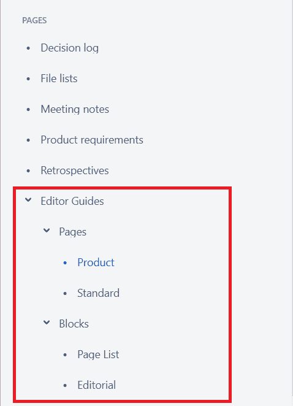
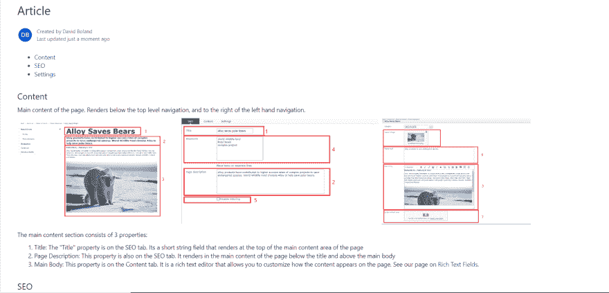

# 创建 CMS 编辑器指南

> 原文：<https://dev.to/debpu06/creating-cms-editor-guides-48c7>

在南森，创建编辑器文档是我们开发过程的一部分。不管 CMS 的用户界面有多友好，编辑与 it 的第一次互动可能会令人望而生畏。在这篇文章中，我想分享我们是如何实现编辑指南的。我要介绍的例子是关于 Episerver 的，但是我们已经在许多其他 CMS 框架中使用了相同的过程。

### 当我们编写我们的编辑指南时

我们的编辑指南流程通常始于开发流程的末尾。作为开发人员，它给了我们一个机会，让我们在创建文档之前摆脱开发的束缚。这有两个好处:首先，它有助于我们编写更多用户友好的指南。我相信你有过这样的经历，你刚开发完一个新功能，你试图向团队成员解释它。他们的目光会变得呆滞，你最终需要想出如何向那些没有埋头于代码的人解释这一点。在这个阶段编写文档有助于避免指南中不必要的复杂性。其次，它可以作为一种测试形式。从另一个角度重新审视实现总是有帮助的。这可能有助于您在问题到达 QA 团队之前发现问题。这甚至不一定是代码中的错误。但它可能只是捕捉到了一些东西，在第二次查看后，从功能的角度来看，可能并不完全是编辑所期望的。

### 我们如何格式化我们的编辑指南

 
我们通常将文档存放在[汇合处](https://www.atlassian.com/software/confluence)。根据客户的需求，这可能因客户而异。如果客户不希望使用 Confluence，而更喜欢硬拷贝，它也为我们提供了导出为 pdf 的灵活性。在 Confluence 中，我们为每种内容类型创建一个页面。正如你在左边的照片中看到的，我们将页面分为两类，块类型和页面类型。Confluence 中的每个内容类型页面都由呈现页面、相应的编辑视图和页面摘要的屏幕截图组成。在这里，我们还将提供与该内容相关的产品需求的链接。屏幕截图被标注为将 CMS 中的属性映射到页面上显示的内容。从那里，我们开始描述每个属性。我们确保不仅包括属性做什么，还包括当它没有被填充时会发生什么(内容是否后退，改变页面的呈现方式，等等。). 

### 测试我们的编辑指南

一旦我们完成了编辑指南，我们就把它们和网站一起交给我们的质量保证(QA)团队进行测试。他们使用指南来帮助他们运行测试用例。这允许他们在测试期间根据他们的使用情况向我们这些开发人员提供反馈。如果他们在内容方面有任何问题，我们知道指南需要修改。我们将这些更新视为需要在 QA 过程中修复的 bug。

### 获取它们的编辑

下一步是找出将文档交付给编辑的最佳方式。通常，这就像在 Confluence 中提供对我们页面的访问或发送所有页面的 PDF 一样简单。我们还为客户提供了更复杂的实现。我之前写过一篇关于将文档作为视图包含在 CMS 中的[帖子](https://davidboland.site/blog/episerver-editor-documentation-view/)。尽管在这一点上客户已经有了文档，并且已经进入了编辑过程，但这并不意味着我们已经完成了。无论是更新原始项目范围的变更单，还是网站发布后很久才要求的新功能，我们都确保我们的指南保持最新。

## 最后的想法

从开发人员到质量保证人员，再到我们的客户，对这个过程的反馈都是积极的。我们总是相信文件多总比少好。虽然文档可能不是开发中最迷人的部分，但我们发现一旦它被集成到您的过程中，它就会变成低投入/高回报的东西。虽然我们发现这个过程是成功的，但我们知道有许多方法可以实现相同的目标。如果您对我们的流程有任何想法，或者认为我们会从您的流程中受益，请随时在下面发表评论。