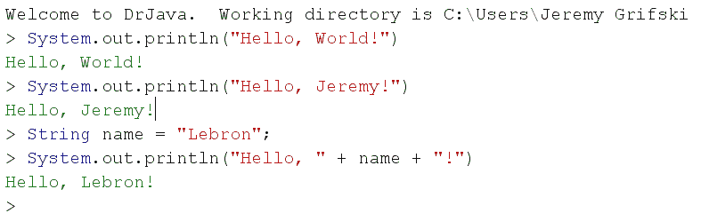

# 为什么我鼓励我的学生使用 DrJava

> 原文：<https://dev.to/renegadecoder94/why-i-urge-my-students-to-use-drjava-3h5b>

如果你在我身边已经有一段时间了，我可能已经在某个时候向你推荐了 DrJava。最后，我决定在一篇文章中阐明我的推理。

## 什么是 DrJava？

有些人可能不知道，DrJava 是 Rice 大学为想学习 Java 的学生开发的 IDE。有趣的故事:[我申请了莱斯大学的研究生院](https://therenegadecoder.com/blog/journey-to-a-phd/)，但是尽管我对他们的软件很感兴趣，却没有被录取。

无论如何，DrJava 有很多你期望从 IDE 中得到的东西:一个带有语法高亮显示的编辑器，以及一大堆功能，比如集成的 JUnit 测试、代码覆盖和 Javadoc API 生成。

此外，DrJava 拥有和不拥有的一些特性使它成为教育工作者的优秀工具。例如，DrJava 没有任何形式的*自动完成*。更好的是，DrJava 有一个控制台——交互面板——可以用来运行代码行，就像 Java 被解释了一样。

也就是说，您可能从未听说过它，因为该行业倾向于 Eclipse、IntelliJ 和 NetBeans。所有这些工具都很棒，但是 DrJava 是我进行 Java 教育的首选 IDE。很自然，问题是“为什么？”

## DrJava 特性

如前所述，作为一名教育工作者，我喜欢 DrJava 的两个主要特性:交互面板和缺少自动完成功能。此外，还有一些针对更高级学生的功能。来说说他们吧。

### 交互窗格

到目前为止，DrJava 最好的特性是交互面板。这是一个我还没有看到在另一个 IDE 中实现的特性(虽然，我最近发现它成为了 [jshell](https://docs.oracle.com/javase/9/jshell/introduction-jshell.htm) 下的 JDK 的标准)，我认为它很棒。基本上，它允许你像对待解释语言一样对待 Java。换句话说，您可以一行一行地运行命令，而不必用 main 方法构建类。很光荣。

为了客观地看待问题，下面是您必须在普通 IDE 中为 HelloWorld 编写的代码:

```
public class HelloWorld { 
  public static void main(String[] args) { 
    System.out.println("Hello, World!"); 
  }
} 
```

Enter fullscreen mode Exit fullscreen mode

这里是交互面板中的代码:

```
System.out.println("Hello, World!"); 
```

Enter fullscreen mode Exit fullscreen mode

要用传统编辑器更改消息，您必须编辑源代码，重新编译，并再次运行解决方案。在交互面板中，只需按下向上箭头，更改消息，然后按下 enter 键即可:

[](https://res.cloudinary.com/practicaldev/image/fetch/s--8o_yg9nI--/c_limit%2Cf_auto%2Cfl_progressive%2Cq_auto%2Cw_880/https://thepracticaldev.s3.amazonaws.com/i/j2d18tkn9u4netosin40.png)

通常，我喜欢使用交互面板来教授 Java，而不实际引入类。换句话说，我喜欢谈论变量、类型、方法和控制流，而不必过多谈论[公共与私有](https://therenegadecoder.com/code/the-difference-between-private-and-public-in-java/)，静态与实例等。能够快速原型化代码的本质是美妙的。

一个额外的好处是，学生可以犯很多错误，而不会有编译/运行循环的挫败感。试试一条线，看它断了，然后再试试另一条线。就是这么方便。此外，它让学生习惯于使用命令行。能够点击向上箭头，并在再次运行之前稍微修改一行代码，这真的很神奇。

总的来说，我认为交互窗格是使用 DrJava 胜过任何其他大型 IDE 的充分理由。当学生们第一次学习编码时，他们不需要所有的花里胡哨。

### 缺少自动完成功能

虽然交互窗格本身是一个很好的特性，但我喜欢 DrJava 没有自动完成功能的事实。换句话说，所有代码都必须从内存中键入。通常，我不会浪费时间将代码提交到内存中，但对于初学者来说，真正编写自己的代码是非常重要的。否则，他们永远也学不会语法。

作为一个额外的奖励，如果你给学生发一些必须手写代码的考试(顺便说一句，我讨厌这些)，你的学生会感谢你强迫他们学习语法。

也就是说，每个人都知道 Java 有多冗长，所以在 DrJava 中手工键入代码可能是一个漫长而痛苦的过程。因此，我不建议任何知道自己在做什么的人使用这个工具。换句话说，如果你只是想学习语法，就只使用 DrJava。

### 无实时编译

当您使用像 Eclipse 这样的编辑器时，您会注意到您的代码会自己编译。毕竟，错误会以弯曲的红色下划线随机出现在整个代码中。将鼠标悬停在该错误上，您将会看到到底哪里出了问题。

使用 DrJava，您不会得到红色下划线的好处。相反，您必须在编译代码时实际读取错误消息。就我个人而言，我自己并不是一个受虐狂，但我确实认为让学生自己解决问题是至关重要的。否则，他们只会在屏幕上追逐红线，直到一切“正常工作”

### 其他特性

除了已经提到的所有东西，DrJava 还有一些更好的特性。例如，该工具内置了 JUnit，因此学生可以编写测试，而不必处理依赖性问题。其实我喜欢以此为契机，一教方法就教测试。

在 JUnit 测试之上，DrJava 具有内置的代码覆盖率。如果您编写 JUnit 测试，您可以通过点击一个按钮来检查您的测试覆盖了多少代码。这三个特性结合在一起，可以让学生快速掌握一些好的软件实践。

同样，构建 DrJava 时也考虑到了 JavaDoc。如果您编写 JavaDoc 注释，DrJava 将允许您通过单击一个按钮轻松地呈现您自己的文档。我个人可以说，对于学生来说，这是一个令人惊叹的时刻。没有什么比看着你的评论以网页的形式出现更好的了。

最后，DrJava 有一个小的可读性特性，当按下 tab 键时，自动在当前行缩进代码。虽然像 Eclipse 这样的编辑器通常有内置的格式化程序，在保存代码时激活，但是这些特性可能很难设置。同时，DrJava 中的自动缩进可以通过选择所有代码并点击 tab 来激活。嘣，适当的缩进。

## 一个教育家的视角

就我个人而言，自从我开始教学以来，我一直在敦促我的学生使用 DrJava。很自然，当我开始编码时，我就接触到了这个工具，我认为很多初学者也可以从中受益。不幸的是，如今大多数课程都让学生陷入了 Eclipse 的困境，但是您能做些什么呢？

作为一名教育工作者，如果我不能让我的学生皈依 DrJava，我至少会在课堂上让他们接触到它。我几乎是出了名的在回答问题时总是说“好吧，让我们试试吧”，然后迅速将一些代码转储到 DrJava 的交互面板中。对于任何教 Java 的人来说，这真的是一个很棒的工具。

对于任何坚持使用 Eclipse 的人来说，实际上有一个用于 Eclipse 的 [DrJava 插件。据我所知，它仍然有效——至少从 2019-03 年的 Eclipse 开始。它将交互窗格直接添加到 Eclipse 中，因此学生至少可以开始测试代码片段。](http://www.drjava.org/eclipse.shtml)

无论如何，我希望我今天让你见识了一个新工具。如果没有，请告诉我您是否喜欢在课堂上使用任何东西。如果你是学生，你是如何学习 Java 的？我总是对寻找新的方法来教授同样的材料感兴趣。

既然我已经把你带到这里了，那就看看其他一些与教学相关的文章吧:

[](/renegadecoder94) [## 回想我第一学期的教学

### 杰里米格里夫斯基 1917 年 5 月 7 日 17 分钟阅读

#java #leadership #teaching #computerscience](/renegadecoder94/reflecting-on-my-first-semester-of-teaching-1e91)[](/renegadecoder94) [## 我如何自动化我的评分职责

### 杰里米·格里夫斯基 1912 年 5 月 12 日 9 分钟阅读

#teaching #java #testing #python](/renegadecoder94/how-i-automated-my-grading-responsibilities-42g3)[](/renegadecoder94) [## 如何讲授计算机科学中的数组

### 杰里米格里夫斯基 5 月 18 日 1913 分钟阅读

#teaching #education #computerscience #programming](/renegadecoder94/how-to-teach-arrays-in-computer-science-2f5n)

一如既往，如果你喜欢这些内容，[考虑成为会员](https://therenegadecoder.com/members/)。或者，至少，[订阅我的每周简讯](http://eepurl.com/dB-ABr)！这样，你就不会错过另一篇文章了。下次见！

我为什么敦促我的学生使用 DrJava 的帖子最先出现在叛徒程序员 T2 的网站上。