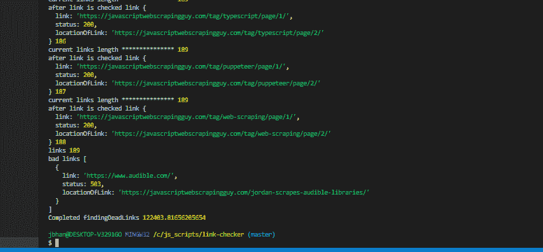
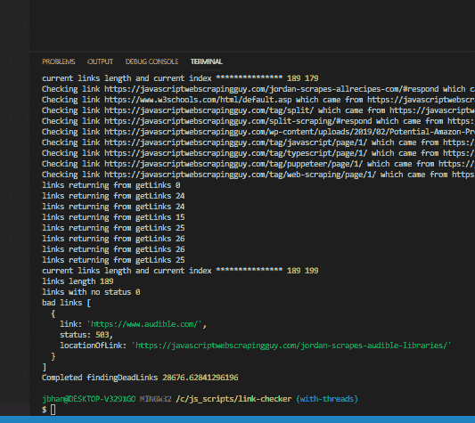
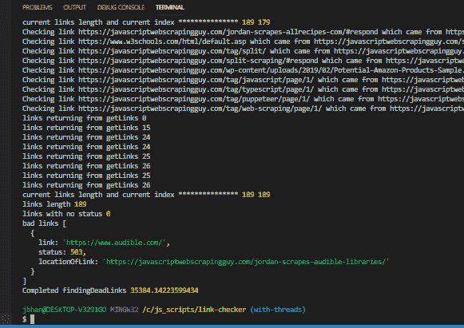
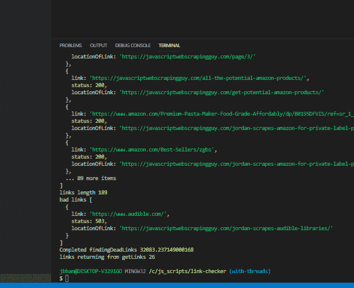
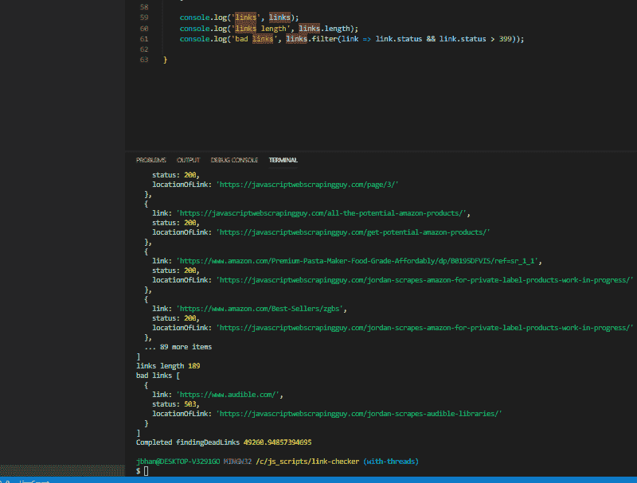
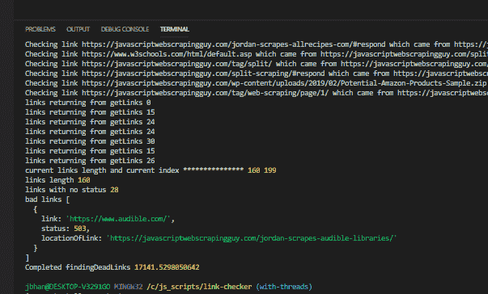

# 乔丹是速度(用多线程加速刮)

> 原文：<https://dev.to/aarmora/jordan-is-speed-speeding-up-scraping-with-multiple-threads-2919>

[此处示例代码](https://github.com/aarmora/jordan-does-dead-link-checking/tree/with-threads)

## 故事至此结束

这是我关于死链接检查的帖子的后续。我仍然喜欢这段代码，但速度是一个大问题。我检查了一个有超过 100，000 个链接的网站(其中很大一部分是对博客帖子的评论)，花了几天时间。“几天”对于运行这样的代码来说太长了。

我仍然不确定我可以用什么样的启发式方法来处理评论。

像`https://laurenslatest.com/fail-proof-pizza-dough-and-cheesy-garlic-bread-sticks-just-like-in-restaurants/#comment-26820`这样的链接并不是真正的新链接。我如何将它与类似于`domain.com/#/posts`的 url 区分开来？我还在思考这个问题，希望能找到更好的处理方法。

下面是一个例子，展示了在这个只有 189 个链接的网站上检查链接的速度。它花了大约 122 秒，对于一个站点来说，这还不算太糟糕。不过，你将看到的速度提升确实令人印象深刻。

[](https://res.cloudinary.com/practicaldev/image/fetch/s--S2BEiWnw--/c_limit%2Cf_auto%2Cfl_progressive%2Cq_auto%2Cw_880/https://javascriptwebscrapingguy.com/wp-content/uploads/2019/06/image.png) 

<figcaption>单线程链接检查
</figcaption>

## 使用网络工作者

[](https://i.giphy.com/media/YP9WadrYt8dz2/giphy.gif) 

<figcaption>Javascript 是单线程的。
</figcaption>

正如我在上一篇文章中提到的，我正在考虑利用 javascript 的异步特性，尝试分块并发地完成工作。为此，我需要利用 web workers 来分离额外的线程。

Javascript 是单线程的，但也是异步的。这里有一个很好的解释来说明这一切是如何进行的。我发现了一个非常棒的库，好人[安迪](https://twitter.com/andywritescode)的 [threads.js](https://github.com/andywer/threads.js/tree/master) 。我在实施的时候有一些问题，他给了我难以置信的帮助。

## 重构

我不得不做相当多的重构。之前，我将整个链接数组传入我的函数，该函数将获得新的链接。我这样做是为了确认我没有添加重复的链接。这种做法的缺点是，我在一个功能一个功能地级联这个巨大的链接数组，直到它被实际使用。

另一个缺点，也是我进行重构的真正原因，是如果链接检查是在一个单独的线程中的函数中进行的，那么当它们是单独的时候，很有可能会复制大量的链接。

```
for (let i = 0; i < links.length; i++) {
        if (!links[i].status) {
            const promises: any[] = [];

            const amountOfThreads = 20;
            for (let linkToCheckIndex = 0; linkToCheckIndex < amountOfThreads; linkToCheckIndex++) {
                if (links[i + linkToCheckIndex]) {
                    promises.push(checkLink(links[i + linkToCheckIndex], domain));
                }
            }

            const checkLinkResponses = await Promise.all(promises);

            for (let index = 0; index < checkLinkResponses.length; index++) {
                // Replace the link that doesn't have a status with the link that does       
                let linkToReplaceIndex = links.findIndex(linkObject => linkObject.link === checkLinkResponses[index].link.link);
                links[linkToReplaceIndex] = checkLinkResponses[index].link;

                // This part needs to check for duplicate links
                // So we can't do it concurrently just in case we miss duplicates
                for (let linkToCheck of checkLinkResponses[index].links) {
                    if (links.filter(linkObject => linkObject.link === linkToCheck.link).length < 1) {
                        console.log('pushed in ', linkToCheck.link);
                        links.push(linkToCheck);
                    }
                }
            }
            i += amountOfThreads - 1;

            // console.log('after link is checked link', links[i], i);
            console.log('current links length and current index ***************', links.length, i);

        }
    } 
```

这段代码现在看起来如上所示。我必须做相当多的循环来匹配它们所属的地方，这是相当昂贵的，但现在至少我可以加快许多请求的东西。应该注意的是，这个**确实增加了被测站点**的负载。不过，这似乎并不重要。我在 https://javascriptwebscrapingguy.com 的[上用 20 个线程试了试，在导航时没有发现任何问题。](https://javascriptwebscrapingguy.com)

我不得不利用`Promise.all`，它实际上工作得非常好。我希望请求部分并发运行，但是我需要阻塞后面的部分(我匹配结果的地方)。所以我最终做了这样的事情:

```
const promises: any[] = [];

            const amountOfThreads = 20;
            for (let linkToCheckIndex = 0; linkToCheckIndex < amountOfThreads; linkToCheckIndex++) {
                if (links[i + linkToCheckIndex]) {
                    promises.push(checkLink(links[i + linkToCheckIndex], domain));
                }
            }

            const checkLinkResponses = await Promise.all(promises); 
```

这样做将旋转尽可能多的线程，将它们推入一个承诺数组，然后我就用我的`const checkLinkResponses = await Promise.all(promises);`阻塞。稍后在代码中，你可以看到我用`i += amountOfThreads - 1;`增加了我的索引。

让所有这些工作并让它很好地工作是相当棘手的。我终于能够让它工作，并在众多不同的线程计数中返回与之前的工作代码相同的结果。你可以在下面看到粘贴的结果。时差很大(20 个线程把时间缩短到了 **28 秒！我真的为此感到骄傲。**

每当我浏览 10 个线程时，我都认为 javascript 有一个内置的可能的内存泄漏警告。是我得到的警告。我想在某个时候深入探讨这个问题。这当然不会破坏我的脚本，并且扩展到 10 个以上仍然给了我更快的结果，所以它似乎不会阻止额外的线程，尽管错误似乎表明了这一点。

一个值得注意的实验是，当我把它增加到 50 个线程时，我得到了一堆状态为 null 的链接，这意味着检查要么没有在这些链接上完成，要么更有可能的是，我们在结束脚本之前没有等待它们正确返回。未来某个时候值得深究的东西。

原来如此！使用 web workers 的并发 javascript(和[一个很棒的包](https://github.com/andywer/threads.js/tree/master)！)来剥离线程。

[](https://res.cloudinary.com/practicaldev/image/fetch/s--k0cnh_jl--/c_limit%2Cf_auto%2Cfl_progressive%2Cq_auto%2Cw_880/https://javascriptwebscrapingguy.com/wp-content/uploads/2019/06/image-6.png) 

<figcaption>二十线程</figcaption>

[](https://res.cloudinary.com/practicaldev/image/fetch/s--tmV8VVlI--/c_limit%2Cf_auto%2Cfl_progressive%2Cq_auto%2Cw_880/https://javascriptwebscrapingguy.com/wp-content/uploads/2019/06/image-7.png) 

<figcaption>十线程</figcaption>

[](https://res.cloudinary.com/practicaldev/image/fetch/s--2YngYn60--/c_limit%2Cf_auto%2Cfl_progressive%2Cq_auto%2Cw_880/https://javascriptwebscrapingguy.com/wp-content/uploads/2019/06/image-3.png) 

<figcaption>12 个线程(得到了 11 个监听器的警告)</figcaption>

[](https://res.cloudinary.com/practicaldev/image/fetch/s--lPPhaEqE--/c_limit%2Cf_auto%2Cfl_progressive%2Cq_auto%2Cw_880/https://javascriptwebscrapingguy.com/wp-content/uploads/2019/06/image-4.png) 

<figcaption>5 线程</figcaption>

[](https://res.cloudinary.com/practicaldev/image/fetch/s--uEc4gQc5--/c_limit%2Cf_auto%2Cfl_progressive%2Cq_auto%2Cw_880/https://javascriptwebscrapingguy.com/wp-content/uploads/2019/06/image-5.png) 

<figcaption>50 个线程(注意，28 个链接仍然处于空状态)</figcaption>

[此处示例代码](https://github.com/aarmora/jordan-does-dead-link-checking/tree/with-threads)

帖子 [Jordan Is Speed(多线程加速抓取)](https://javascriptwebscrapingguy.com/jordan-is-speed-speeding-up-scraping-with-multiple-threads/)最早出现在 [JavaScript 网页抓取家伙](https://javascriptwebscrapingguy.com)上。