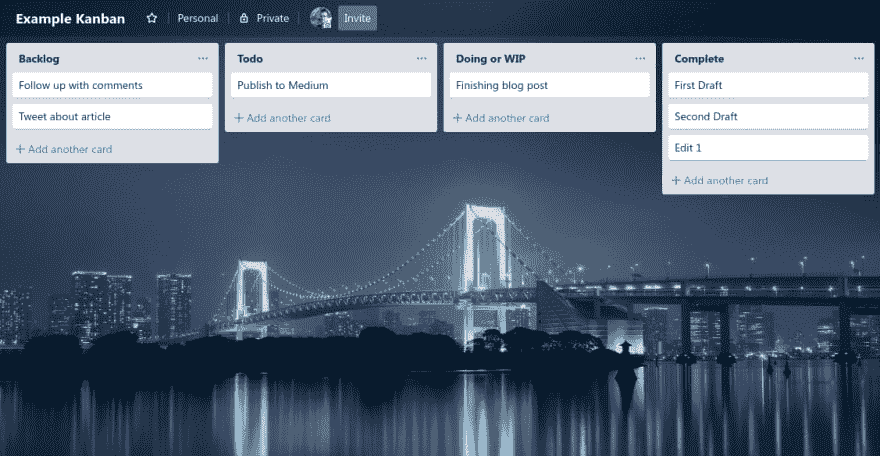

# 我从塔尔萨 2000 年网络开发者大会中学到了什么

> 原文：<https://dev.to/_rich/what-i-learned-from-tulsa-8217-s-web-developer-conference-200ok-1jjm>

*本文收集了我参加 2019 年[塔尔萨 Web Developer Conference 2000 ok](https://200ok.us/)时的一些想法。我想指出的是，大会上的所有讨论都很有趣，而且各有各的用处。这篇文章将只涵盖我发现最相关的部分。*

2000 年 OK 大会上有三个演讲让我印象深刻。这三个讲座是关于拥有增长的心态，编写好的 API，以及通过看板提高效率。我相信这三点是成为一名优秀的 web 开发人员的基础。让我们一个接一个地简单探索这些领域。

## 有成长的心态

[](https://res.cloudinary.com/practicaldev/image/fetch/s--H88gSFPX--/c_limit%2Cf_auto%2Cfl_progressive%2Cq_auto%2Cw_880/https://blog.richardkeller.net/wp/wp-content/uploads/2019/06/meditation.jpg)

我想提到的第一个演讲是来自软件工程师克里斯汀·西曼的演讲。她的演讲题目是**“破解你的大脑——改善你思维过程的方法。”**这个讲座真的很棒，还包括一个冥想环节，让它变得更棒。

对于网站开发者来说，拥有一个成长的心态是很重要的。拥有一个成长的心态意味着你将问题视为学习的机会。在 web 开发中总是有新的东西需要学习，因为技术变化很快。技术的发展速度可能会让人不知所措。这里有一些我从这个关于拥有成长心态的演讲中学到的技巧。

### 1 承认你并不完美

这是一个大的。你需要谦虚，因为你不可能什么都知道。重要的是要承认你并不完美。每个人都想在自己的工作中做到最好，这是可以理解的，但你也需要意识到，你学习的时间有限，所以你不可能在所有方面都成为专家。

### 2 关注学习过程，而不是最终结果

最终的结果看起来很棒，但是学习的过程更值得关注。你需要弄清楚并理解你如何学得最好，来帮助自己学得更好更快。网上有大量的资源，你可以从中找到如何学得更好的方法。这里有一个免费的在线课程，解释了像**间隔重复、回忆、**和**可视化**这样的技巧，以帮助你更好地学习和保留信息:学习如何学习、[https://www.coursera.org/learn/learning-how-to-learn](https://www.coursera.org/learn/learning-how-to-learn)。

## 原料药应记录在案并保持一致

[](https://res.cloudinary.com/practicaldev/image/fetch/s--tJSBMZOO--/c_limit%2Cf_auto%2Cfl_progressive%2Cq_auto%2Cw_880/https://blog.richardkeller.net/wp/wp-content/uploads/2019/06/rest.png)

我想提到的第二个演讲来自首席工程师米歇尔·蒂托洛。她的演讲题目是“APIs:好的坏的丑的”* *关于 REST APIs 的优缺点。我只想提几件关于什么是好的 API 的事情。一个好的 API 有许多特征，但是对我来说最突出的三个特征是一致性、语义和文档化。

### 1 记录在案

Web 开发人员通常不愿意写文档，这很奇怪，因为他们喜欢使用优秀的文档。文档实际上只是成为优秀 web 开发人员的一部分。帮助他人理解如何使用您的代码对于代码库的生存和发展至关重要。一个没有文档化的 API 可能永远不会被使用，因为只看代码是不容易理解的。

良好的 API 文档可以让它更容易访问，从而自动变得更好。下面是我为记录 REST API 创建的一个模板:

[https://gist . github . com/rbk/c 6 D2 e 80 c 9 f 4830857 CAFA 3d 24 e 97 e 227](https://gist.github.com/rbk/c6d2e80c9f4830857cafa3d24e97e227)

### 2 一致

API 的一致性非常重要。错误代码、请求负载和响应类型可以是您想要的任何东西，只要确保它有意义。这对于一般的代码来说很重要。您不希望将 JSON 响应与 XML 响应混合在一起。我使错误代码标准化的一个方法是创建一个标准对象，它遵循微软的 API 指南(讽刺的是他们并不总是使用这个指南):

```
payload = {
    'error': {
        'code': 'InvalidParameter',
        'message': 'You sent the wrong parameter.'
    }
}
return Response(payload, status=406) 
```

## 看板关注的是流动效率

[](https://res.cloudinary.com/practicaldev/image/fetch/s--Dvx8pIkD--/c_limit%2Cf_auto%2Cfl_progressive%2Cq_auto%2Cw_880/https://blog.richardkeller.net/wp/wp-content/uploads/2019/06/kanban-2.png)

我想提到的最后一个演讲来自保罗·高尔。他的演讲题目是**“克服延迟——最好的开发者如何提高生产力”。**

我听说过“看板”这个词，但我以为它指的是从一列到另一列的移动。这个演讲让我看到了看板的世界。看板本质上是关于效率的。

### 1 流量效率

看板不是魔术，它是一个提高效率的过程。这个基本概念可以在[利特尔定律中考察。](https://en.wikipedia.org/wiki/Little%27s_law)“输出流大于或等于输入流的工作。这意味着让生产流在组织中流动是满足生产线另一端的客户以发展业务的必要条件。

### 2 WIP(在制品)

看板通过控制 WIP(在制品)来提高效率。这种控制是为了防止团队被过多的工作压得喘不过气来，如电子邮件、问题和任务等，这些都会降低个人的生产力。

## 结论

塔尔萨的 200OK Web Developer Conference 总是非常值得参加。这个会议总是给我提供相关的信息，我可以用在我作为一个网站开发人员的日常工作中。我希望你能找到一些有用的提示和信息。感谢阅读。

## 加成:会议笔记。

*   做开发者不是为了钱，是为了解决问题。
*   开发人员需要遵守纪律来完成项目。
*   算法和编程是表达同一问题解决方案的两种方式。