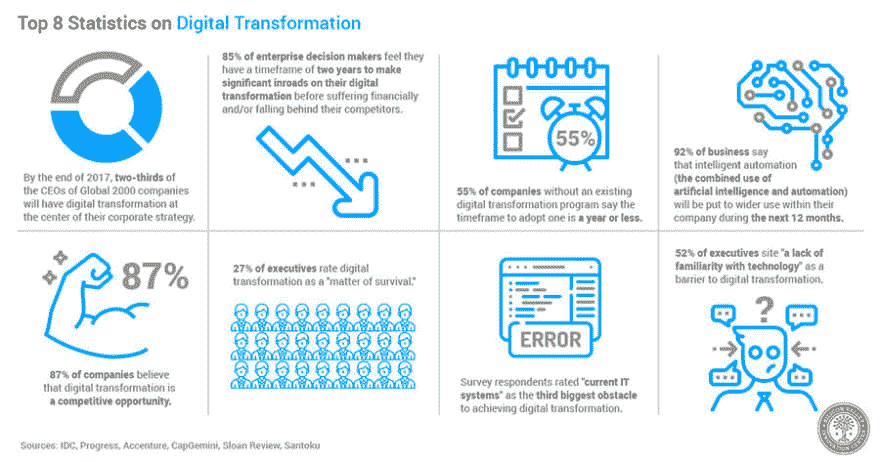

# 什么是数字化转型？

> 原文：<https://dev.to/code4sense/this-3-min-summary-of-digital-transformation-is-all-you-need-to-know-548m>

## 数字转换解释

*   [什么是数字化转型？](#what-is)

* * *

## 什么是数字化转型？

*   数字化转型是将数字技术整合到业务的所有领域，从根本上改变您的运营方式和向客户交付价值的方式。
*   这也是一种文化变革，要求组织不断挑战现状，进行实验，并接受失败。

