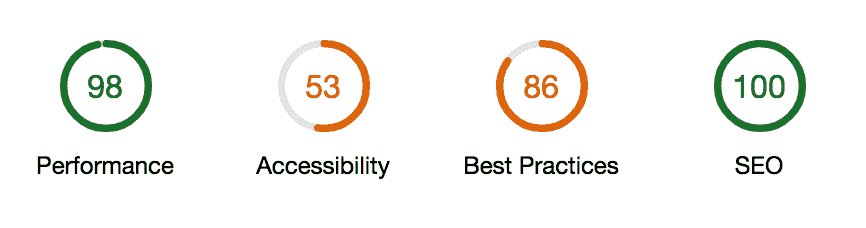
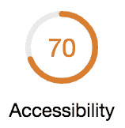
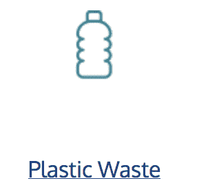
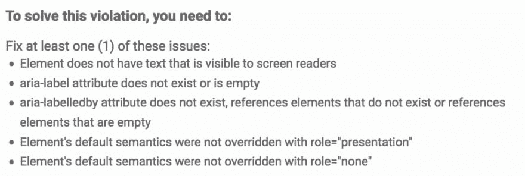
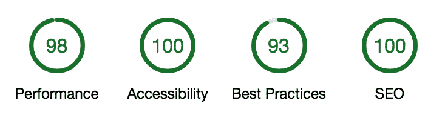

# 初学者尝试基本的可访问性测试

> 原文：<https://dev.to/smh30/a-beginner-tries-basic-accessibility-testing-5gka>

我刚刚完成了我的第一个客户网站的建设——只是一个非常基本的[单页的东西](https://johnwoodtakapuna.nz)但是，嘿，每个人都必须从某个地方开始。

我想确保它是可访问的，所以我用 Firefox 的 Axe 扩展和 Chrome 的 Lighthouse 测试对它进行了测试，前者我曾在过去的作业中使用过，后者我曾在其他文章中引用过。我知道这些工具[并不完美](https://dev.to/adrianengine/accessibility-beyond-scores-369b)，但我认为这是一个坚实的开端。

最初的结果是...不太好。
[T3】](https://res.cloudinary.com/practicaldev/image/fetch/s--AjBAVPBx--/c_limit%2Cf_auto%2Cfl_progressive%2Cq_auto%2Cw_880/https://thepracticaldev.s3.amazonaws.com/i/r5o6w3ix0kgn2eqz9g36.png)

不过我发现的一件事是，像这样的小网站，少量的问题真的会降低分数，相反，即使是最简单的问题也会得到改善。

Lighthouse 报告中强调的四个问题中的两个是由于我在 HTML 中错误地留下了一些东西。

*   页面上的属性不是唯一的

我不小心在页面的两个相似部分使用了相同的 id。很容易通过更换其中一个来解决。

*   列表不仅仅包含`<li>`元素和脚本支持元素(`<script>`和`<template>`)。

由于某种复制/粘贴混淆，列表包含一个空段落。拿掉它，et voila:

我猜这种事情不会发生在有更多经验的人身上，但对我来说，很高兴看到一分钟左右的时间让分数提高了这么多。

接着谈到另一个问题:

*   图像元素没有`[alt]`属性

六个项目在这一点上失败了。我在页面上使用的其他一些图片上添加了`[alt]`文本，但是这些纯粹是装饰性的，所以我没有在意。但是如果它被标记出来，显然我还需要做些别的事情！

快速搜索后，我发现[当图像纯粹是表示性的，它们应该有空的替代文本](https://www.w3.org/WAI/tutoriaimg/decorative/) `[alt=""]`来表明这一事实。另一个简单的解决方法！我觉得自己势如破竹！

*   链接没有可识别的名称

这部电影给我的戏剧性比其他所有电影加起来都多

Lighthouse 中的[链接信息对我帮助不大。这完全是为了确保文本与每个链接相关联，这显然是一件好事！不过，在我的例子中，有问题的链接是图片，图片下方也有一个指向相同位置的文本链接。
T3T5】](https://dequeuniversity.com/rules/axe/3.1/link-name?application=lighthouse)

我试着将`[tabindex="-1"]`应用到图像上，这样它们就不会被键盘聚焦。尽管它们不再是 tab 键可聚焦的，因此以我有限的理解，不应该呈现给寻找链接的屏幕阅读器，但错误仍然存在。

在花了很长时间寻找解决这个问题的方法后，我几乎要放弃了，但我决定检查 Axe，看看它是否还有其他问题。它只有一个相同的，但事实证明，它的解决方案建议对我更有帮助。
[T3】](https://res.cloudinary.com/practicaldev/image/fetch/s--VQ88mT6S--/c_limit%2Cf_auto%2Cfl_progressive%2Cq_auto%2Cw_880/https://thepracticaldev.s3.amazonaws.com/i/91zcc1nbi6rc0pd1n30f.png)

来自 Lighthouse 的所有建议都是关于添加文本的，但是这给了我其他的选择。

首先我试着加上`[role="presentation"]`，因为那听起来最快。不幸的是，我没有那么幸运，因为我有点怀疑这种情况，因为一个链接的作用是表示没有意义。

解决方案原来是在列表的第三个建议中:“`aria-labelledby`属性不存在，引用了不存在的元素或者引用了空的元素”。通过图标后面的文本链接来标注图标似乎已经解决了这个问题，至少对 Lighthouse 和 Axe 来说是这样的。

我从第一次尝试易访问性测试中得到的教训是，没有必要害怕，在工具和谷歌搜索的帮助下，这是完全可以实现的。