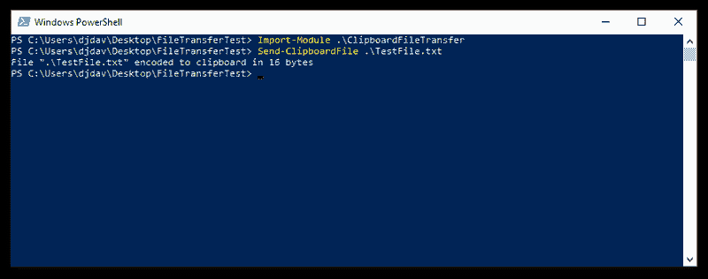
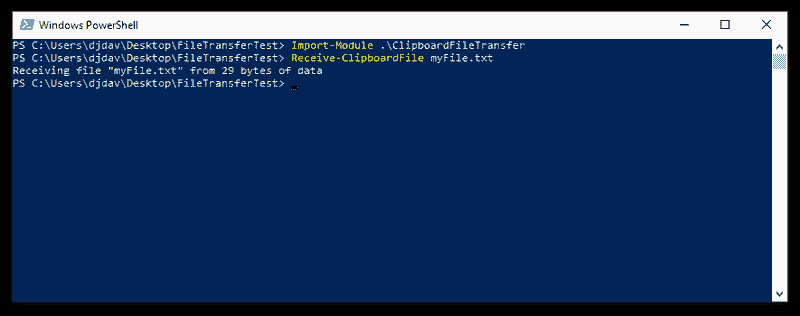

# A little PowerShell hack for sending files to a remote machine

> 原文：[https://dev.to/jermdavis/a-little-powershell-hack-for-sending-files-to-a-remote-machine-21o4](https://dev.to/jermdavis/a-little-powershell-hack-for-sending-files-to-a-remote-machine-21o4)

I was asked to do some configuration on a remote computer recently, and discovered that the security-concious network admins had locked down the ability for me to share my local computer’s files with the server via RDP and the ability to get to services like OneDrive. I had a collection of config files I had been asked to deploy, and manually creating each file on the server and copying over its contents seemed like a lot of hassle. So I tried a trick with PowerShell to make my life easier…

[***Please note:*** I’m not condoning breaking network security policies here – don’t use this in a way that would get you into trouble!]

Ages ago I wrote a post about how you can [embed files directly into PowerShell scripts](https://jermdavis.wordpress.com/2017/12/24/embedding-resources-in-powershell-scripts/) using Base64 encoding. Since that idea can turn an arbitrary file into text that you can save in a script, it can also be used to encode an arbitrary file and place it onto the clipboard. And that gives you a route to move the file over an RDP session’s shared clipboard – which looked like it might be an approach to making my situation easier. So I hacked up a little PowerShell module that can be used to achieve this…

So on one machine we’re going to need to send a specific file to the clipboard. That entails a commandlet that takes the path to a file, checks it exists and sends the file to the clipboard:

```
function  Send-ClipboardFile  {  param(  [string]$file  )  if(!(Test-Path  $file))  {  throw  "Specified file '$file' cannot be found"  }  $fileName  =  Split-Path  $file  -leaf  $data  =  Base64Encode-File  $file  "$fileName`b$data"  |  Set-Clipboard  Write-Host  "File `"$file`" encoded to clipboard in $($data.Length) bytes"  } 
```

<svg width="20px" height="20px" viewBox="0 0 24 24" class="highlight-action crayons-icon highlight-action--fullscreen-on"><title>Enter fullscreen mode</title></svg> <svg width="20px" height="20px" viewBox="0 0 24 24" class="highlight-action crayons-icon highlight-action--fullscreen-off"><title>Exit fullscreen mode</title></svg>

Having checked the file exists, the code uses `Split-Path` to make sure it has just the file name, ignoring any relative path that may have been passed in. It then turns the file into a base64 string. Finally it sends a string to the clipboard that combines the file name and the encoded data and writes some output.

Encoding the file to a base64 string is pretty simple:

```
function  Base64Encode-File  {  param  (  [Parameter(Mandatory  =  $true)]  [string]$file  )  process  {  $c  =  Get-Content  $file  -Encoding  Byte  return  [System.Convert]::ToBase64String($c)  }  } 
```

<svg width="20px" height="20px" viewBox="0 0 24 24" class="highlight-action crayons-icon highlight-action--fullscreen-on"><title>Enter fullscreen mode</title></svg> <svg width="20px" height="20px" viewBox="0 0 24 24" class="highlight-action crayons-icon highlight-action--fullscreen-off"><title>Exit fullscreen mode</title></svg>

All it needs to do is read the contents of the file, and call the .Net function to convert the value into base64.

The other end of the process involves receiving the data from the clipboard:

```
function  Receive-ClipboardFile  {  param(  [string]$alternativeName  =  $null  )  $clip  =  Get-Clipboard  $bits  =  $clip.Split("`b")  if($bits.Length  -ne  2)  {  throw  "Data error. Expected 2 items of data on clipboard, but got $($bits.Length)"  }  $file  =  $bits[0]  if($alternativeName  -ne  $null  -and  $alternativeName.Length  -gt  0)  {  $file  =  $alternativeName  }  $data  =  $bits[1]  Write-Host  "Receiving file `"$file`" from $($clip.Length) bytes of data"  Write-EmbeddedFile  $data  $file  } 
```

<svg width="20px" height="20px" viewBox="0 0 24 24" class="highlight-action crayons-icon highlight-action--fullscreen-on"><title>Enter fullscreen mode</title></svg> <svg width="20px" height="20px" viewBox="0 0 24 24" class="highlight-action crayons-icon highlight-action--fullscreen-off"><title>Exit fullscreen mode</title></svg>

This bit of code grabs the data that’s on the clipboard, and tries to split it using the separator character that was used in the sending routine above. It checks to see that it got exactly two items from that. If not, that implies an error. Otherwise you have a filename and a block of encoded data. If the user passed the optional alternative file name parameter then it uses that, otherwise it uses the original file name sent over the clipboard. Then it can write some output, and then turn the clipboard data back into a disk file.

And again, writing the data out to disk is pretty simple:

```
function  Write-EmbeddedFile  {  param  (  [string]$base64,  [string]$targetFile  )  process  {  $Content  =  [System.Convert]::FromBase64String($base64)  Set-Content  -Path  ".\$targetFile"  -Value  $Content  -Encoding  Byte  }  } 
```

<svg width="20px" height="20px" viewBox="0 0 24 24" class="highlight-action crayons-icon highlight-action--fullscreen-on"><title>Enter fullscreen mode</title></svg> <svg width="20px" height="20px" viewBox="0 0 24 24" class="highlight-action crayons-icon highlight-action--fullscreen-off"><title>Exit fullscreen mode</title></svg>

Finally, the module file can export the two key functions for use:

```
Export-ModuleMember  -Function  "Receive-ClipboardFile"  Export-ModuleMember  -Function  "Send-ClipboardFile" 
```

<svg width="20px" height="20px" viewBox="0 0 24 24" class="highlight-action crayons-icon highlight-action--fullscreen-on"><title>Enter fullscreen mode</title></svg> <svg width="20px" height="20px" viewBox="0 0 24 24" class="highlight-action crayons-icon highlight-action--fullscreen-off"><title>Exit fullscreen mode</title></svg>

And with that, all you have to do is drop this script (I named it “`ClipboardFileTransfer.psm1`“) into a suitably named folder in your modules directory or locally and you can import it and send some files…

For example, if you have the module in a local directory on the local machine you might run:

[](https://jermdavis.files.wordpress.com/2019/05/sendafile.png)

And on the remote one you can run:

[](https://jermdavis.files.wordpress.com/2019/05/receiveafile.png)

And magically the file is transferred… (And of course you can do it in the opposite direction too)

[Note to self: tweak script so that the bytes reported at both ends measure the same thing… [](https://res.cloudinary.com/practicaldev/image/fetch/s--fumfYCPq--/c_limit%2Cf_auto%2Cfl_progressive%2Cq_auto%2Cw_880/https://s0.wp.com/wp-content/mu-plugins/wpcom-smileys/twemoji/2/72x72/1f609.png) ]

You need to get this one script onto both of your machines, but if you can do that, this allows for easy transfers of other files. And it made my day a lot simpler.

If you think this might be useful, [the script is available as a gist](https://gist.github.com/jermdavis/aa3d1cda2875167ef59feaceae6b0961) for you to use.