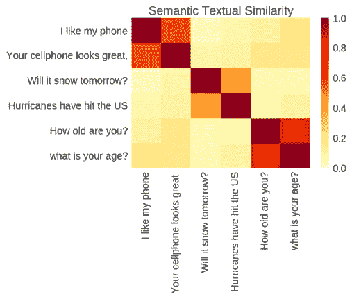
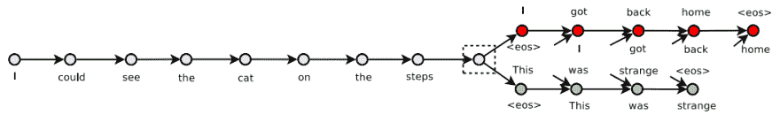
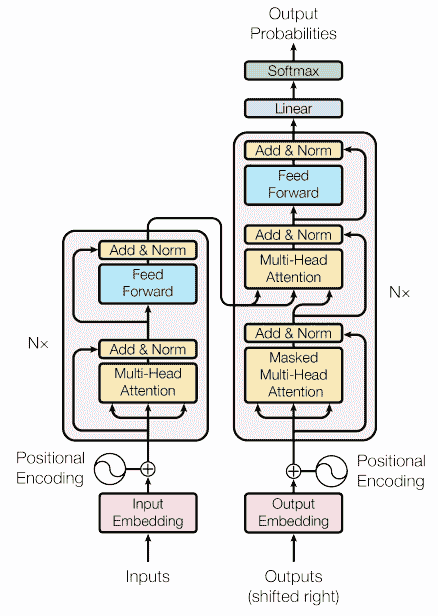
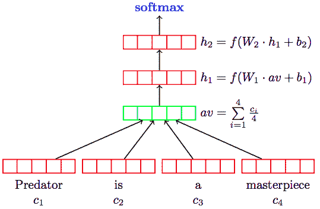

# 句子嵌入的多任务学习

> 原文：<https://dev.to/makcedward/multi-task-learning-for-sentence-embeddings-3f4p>

通用句子编码器

 

<figcaption>【富士山】上[下](https://unsplash.com/photos/xFmcfCR9h20?utm_source=medium&utm_medium=referral)</figcaption>

Cera 等人证明了句子嵌入的迁移学习效果优于[单词嵌入](https://towardsdatascience.com/3-silver-bullets-of-word-embedding-in-nlp-10fa8f50cc5a)。构建句子嵌入的传统方法是平均、求和或联系一组词向量来产生句子嵌入。这种方法损失了大量的信息，但计算简单。Cera 等人评估了两种著名的网络架构，即基于变压器的模型和基于深度平均网络(DAN)的模型。

 

<figcaption>句子相似度评分(Cera et al .，2018)</figcaption>

本故事将讨论[通用语句编码器](https://arxiv.org/pdf/1803.11175.pdf) (Cera et al .，2018)，并将涵盖以下内容:

*   数据
*   体系结构
*   履行

### 数据

由于它被设计为支持多个下游任务，因此采用了多任务学习。因此，Cera 等人使用多个数据源来训练模型，包括电影评论、客户评论、情感分类、问题分类、语义文本相似性和单词嵌入关联测试(WEAT)数据。

### 建筑

文本将通过 Penn Treebank(PTB)方法进行标记化，并传递到 transformer 架构或深度平均网络。由于这两个模型都是通用的，所以采用了多任务学习方法。培训目标包括:

*   与[Skip-through](https://towardsdatascience.com/transforming-text-to-sentence-embeddings-layer-via-some-thoughts-b77bed60822c)相同，通过给出当前句子来预测上一句和下一句。
*   包含已解析会话数据的会话响应建议。
*   监督数据的分类任务

 

<figcaption>预测上一句和下一句(Kiros 等人，2015)</figcaption>

[Transformer](https://arxiv.org/pdf/1706.03762.pdf) 架构是 Google 在 2017 年开发的。它利用多块自我注意来学习上下文感知的单词表示。

 

<figcaption>变压器架构(瓦斯瓦尼等人，2017)</figcaption>

深度平均网络(DAN)使用嵌入(单词和双字母)的平均值，并输入到前馈神经网络。

 

<figcaption>丹建筑(Ivver 等人，2015)</figcaption>

引入两种模型的原因是出于不同的考虑。变压器架构实现了更好的性能，但它需要更多的资源来训练。虽然 DAN 的表现不如 transformer 架构。DAN 优点是建模简单且需要较少的训练资源。

### 实现

探索通用句子编码器，如果你简单地遵循来自 [Tensorflow Hub](https://tfhub.dev/google/universal-sentence-encoder/2) 的指令。

### 带走

*   多任务学习对学习文本表征很重要。可以发现，许多现代 NLP 模型结构使用多任务学习，而不是独立的数据集
*   从多词向量中学习比聚集多词向量来表示句子嵌入获得更好的结果。

### 关于我

我是湾区的数据科学家。专注于数据科学、人工智能，尤其是 NLP 和平台相关领域的最新发展。请随时在 [LinkedIn](https://www.linkedin.com/in/edwardma1026) 上与我联系，或者在 [Medium](http://medium.com/@makcedward/) 或 [Github](https://github.com/makcedward) 上关注我。我提供关于机器学习问题或数据科学平台的简短建议，收取少量费用。

### 延伸阅读

*   [通用语句编码器](https://tfhub.dev/google/universal-sentence-encoder-large/3)实现
*   [单词嵌入](https://towardsdatascience.com/3-silver-bullets-of-word-embedding-in-nlp-10fa8f50cc5a)
*   [跳过(句子嵌入)](https://towardsdatascience.com/transforming-text-to-sentence-embeddings-layer-via-some-thoughts-b77bed60822c)

### 引用

D.塞拉、杨元庆、孔士友、华、林蒂亚科、约翰娜、康斯坦察、瓜哈尔多-塞斯佩德斯、袁世凯、塔尔、宋永赫、施特罗普和雷·库兹韦尔。[通用语句编码器](https://arxiv.org/pdf/1803.11175.pdf)。2018

A.Vaswani，N. Shazeer，N. Parmar，J. Uszkoreit，L. Jones，A. N. Gomez，凯撒和我。你所需要的只是注意力。2017

米（meter 的缩写））Iyyer，V. Manjunatha，J. Boyd-Graber 和 H. Daume III。[深度无序组合与文本分类的句法方法相匹敌](http://www.aclweb.org/anthology/P15-1162)。2015