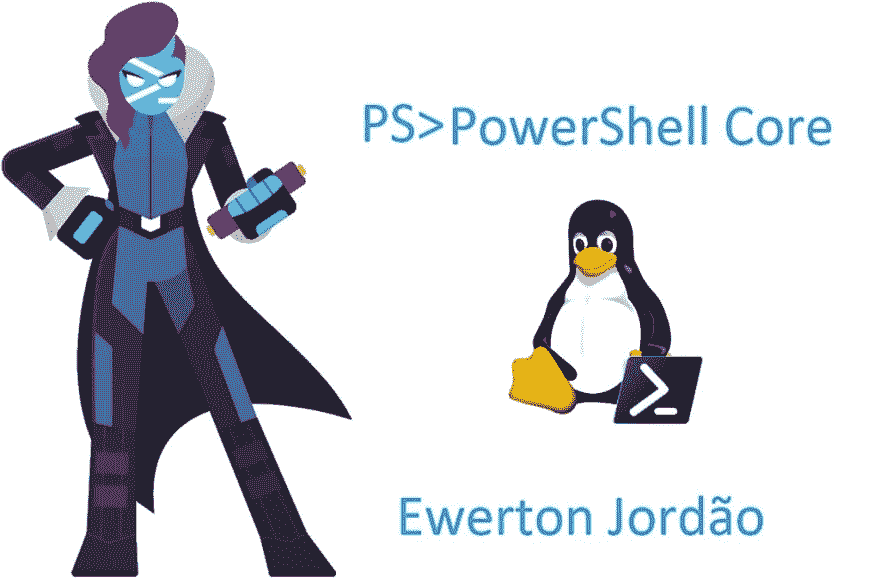
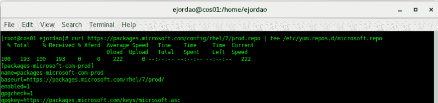
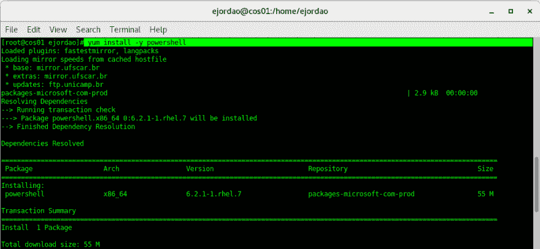
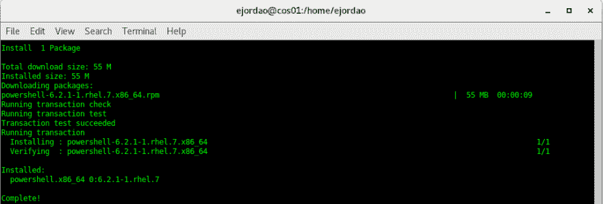
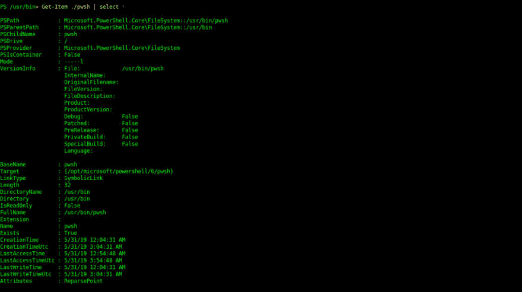

# PowerShell 核心|数百个安装

> [https://dev . to/viewer tonjordao/powershell-core-installao-no-centos-54 pf](https://dev.to/ewertonjordao/powershell-core-instalacao-no-centos-54pf)

手动和通过软件包管理器安装 PowerShell

这是私人恩怨，好吗？我在云 fc 上进行了为期一天的‘t0’[23/05]的演讲，之后，我准备了一个步骤来安装 PowerShell，我在演讲中所做的数百个演示都是基于 Ubuntu 18.02。

对于熟悉 bash 和基于 Unix 的系统的用户来说，以下步骤非常常见，因为如果您使用/管理 Windows 服务器，这将是一个很好的机会，让您可以轻松地了解另一个操作系统。

我们走吧：

<figure> 

<figcaption>运行下载并注册微软存储库</figcaption>

</figure>

<figure>

<figcaption>Executando o yum install-y powershell</figcaption>

</figure>

在 Microsoft 存储库中实际运行 PowerShell 包扫描并验证依赖项。

<figure>

<figcaption>55 MB</figcaption>

</figure>

从 PSCore 设施返回

要运行 PowerShell，我们将在 bash **pwsh** 中键入，它将返回安装的版本，我们现在可以在 Linux 中运行我们的脚本。

<figure>

<figcaption>PowerShell no CentOS</figcaption>

</figure>