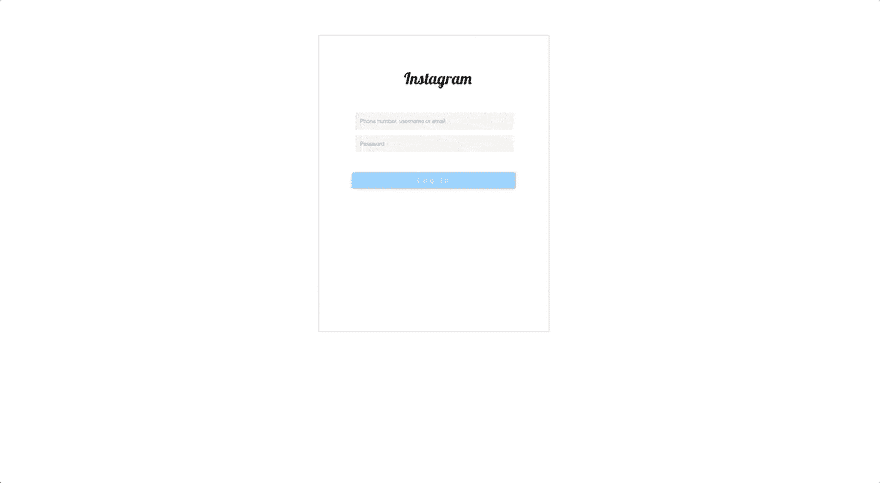
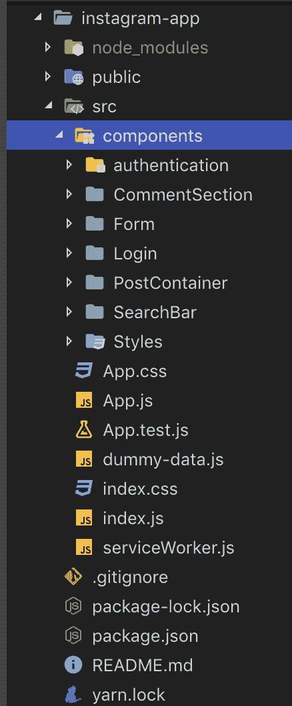
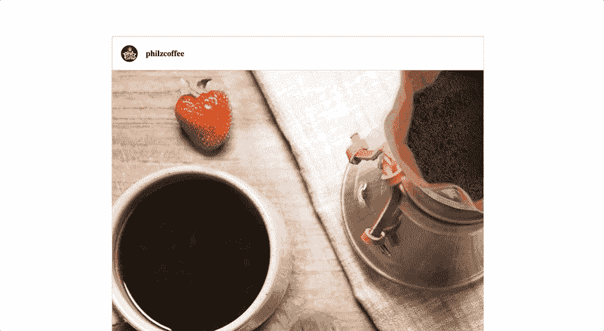

# 利用 React 钩子，一个实际的例子

> 原文：<https://dev.to/pc_codes/harnessing-react-hooks-a-practical-example-14aa>

1.  [简介](#introduction)
2.  [项目设置](#project-setup)
3.  [依赖关系](#dependencies)
4.  [使用状态](#usestate)
5.  [使用效果](#useeffect)
6.  [项目链接](#project-links)
7.  [资源](#resources)

## 简介

#### 先决条件:

T2`This article is for people who are familiar with the basic concepts of react.`

钩子是 react 库中一个强大的特性，它结合了 react 的概念，比如道具、状态、上下文、引用和生命周期。React 16.8.0 及更高版本支持该功能。钩子的开发是为了:

1.  简单
2.  表演

在钩子出现之前，人们只能在 react 类组件中声明状态。此外，每当在 react 中提到`stateful components`时，唯一想到的是`class component`，而`functional components`被认为是`stateless components`，但现在已经不是这样了。感谢 react 钩子`functional components`现在可以声明状态和任何你能想到的 react 概念。因此，反作用钩子最好描述如下:

 `Hooks are functions that let you “hook into” React state and lifecycle features from functional components.` 

这给这些术语带来了新的区别:

*   这些是声明和管理状态的类组件或功能组件。他们通常是`parent-components`
*   这些是不声明或管理状态的类组件或功能组件。他们通常是`child-components`

虽然关于钩子的 [react 文档](https://reactjs.org/docs/hooks-intro.html)非常详细，但是我坚信掌握一个新概念的最好方法是实践，这就是为什么我设计了我们将在本文中研究的迷你项目。

### 项目设置

为了向您展示如何利用 react 钩子，我们将一起制作一个`Instagram clone`。下面是该项目的现场演示

[](https://res.cloudinary.com/practicaldev/image/fetch/s--s9N2K5mp--/c_limit%2Cf_auto%2Cfl_progressive%2Cq_66%2Cw_880/https://thepracticaldev.s3.amazonaws.com/i/473z36leefa0jrla5ycd.gif)
T0】

我们将在这个项目中使用`create-react-app`。因此，对于初学者来说，打开你的命令行，输入如下:

```
npx create-react-app instagram-app 
```

<svg width="20px" height="20px" viewBox="0 0 24 24" class="highlight-action crayons-icon highlight-action--fullscreen-on"><title>Enter fullscreen mode</title></svg> <svg width="20px" height="20px" viewBox="0 0 24 24" class="highlight-action crayons-icon highlight-action--fullscreen-off"><title>Exit fullscreen mode</title></svg>

现在，将 cd 放入我们创建的 instagram-app 文件夹，并安装以下依赖项

```
cd instagram-app
npm install faker moment styled-components uuid 
```

<svg width="20px" height="20px" viewBox="0 0 24 24" class="highlight-action crayons-icon highlight-action--fullscreen-on"><title>Enter fullscreen mode</title></svg> <svg width="20px" height="20px" viewBox="0 0 24 24" class="highlight-action crayons-icon highlight-action--fullscreen-off"><title>Exit fullscreen mode</title></svg>

#### 依赖关系

*   `faker`是一个生成随机数据输入的 npm 包
*   `moment`是一个用于日期格式化的 npm 包
*   是一个 npm 包，我们将使用它来设计我们的组件。它利用带标签的模板文字来设计组件的样式，并消除了在我们的项目中创建 CSS 文件的需要。
*   这是随机 uuid 生成器

#### 现在我们将创建我们的组件文件夹

在命令行中键入以下内容

```
cd src
mkdir -p component/Form component/Login component/PostContainer component/SearchBar component/CommentSection component/Authentication 
```

<svg width="20px" height="20px" viewBox="0 0 24 24" class="highlight-action crayons-icon highlight-action--fullscreen-on"><title>Enter fullscreen mode</title></svg> <svg width="20px" height="20px" viewBox="0 0 24 24" class="highlight-action crayons-icon highlight-action--fullscreen-off"><title>Exit fullscreen mode</title></svg>

这将在我们的项目中创建以下文件夹

[](https://res.cloudinary.com/practicaldev/image/fetch/s--GOAZTHJN--/c_limit%2Cf_auto%2Cfl_progressive%2Cq_auto%2Cw_880/https://ucarecdn.com/6a60bfef-8a86-4548-bcb6-0b52d5d378dc/)

#### 让我们充实我们的组件

在 src 文件夹中，键入以下内容

```
touch component/PostContainer/PostContainer.js component/Form/Form.js component/Login/Login.js component/SearchBar/SearchBar.js component/CommentSection/CommentSection.js 
```

<svg width="20px" height="20px" viewBox="0 0 24 24" class="highlight-action crayons-icon highlight-action--fullscreen-on"><title>Enter fullscreen mode</title></svg> <svg width="20px" height="20px" viewBox="0 0 24 24" class="highlight-action crayons-icon highlight-action--fullscreen-off"><title>Exit fullscreen mode</title></svg>

这将在每个组件目录下分别创建一个 js 文件。

因为这篇文章关注的是 react 钩子及其实现，所以我将检查使用钩子的代码片段。哪些是

*   App.js
*   PostContainer.js
*   Login.js

完整项目回购和托管应用的链接可在下面找到:

[Instagram-clone](https://github.com/PascalUlor/Instagram-clone)

[Instagram-clone-netlify](https://5cfd8594d7a4c562852fee2e--admiring-shaw-fdc467.netlify.com/)

我们将在这个项目中使用的 react 钩子是`useState`和`useEffect`钩子。

## 使用状态

这在一个`functional component`中被调用，以向它添加一些本地状态。这允许我们在应用程序中重用和共享有状态逻辑。

## 使用效果

这给了功能组件执行副作用的能力，就像类组件中的`componentDidMount`、`componentDidUpdate`和`componentWillUnmount`方法一样。

要在我们的反应中使用状态，我们必须像这样导入它们:

```
import React, { useState, useEffect } from "react"; 
```

<svg width="20px" height="20px" viewBox="0 0 24 24" class="highlight-action crayons-icon highlight-action--fullscreen-on"><title>Enter fullscreen mode</title></svg> <svg width="20px" height="20px" viewBox="0 0 24 24" class="highlight-action crayons-icon highlight-action--fullscreen-off"><title>Exit fullscreen mode</title></svg>

在我们的 App.js 文件中进行以下更改

```
import React, { useState, useEffect } from "react";
import styled from "styled-components";
import uuidv4 from "uuid/v4";
import data from "./dummy-data";
import SearchBar from "./component/SearchBar/SearchBar";
import PostContainer from './component/PostContainer/PostContainer';

const preprocessData = data.map(post => {
  return {
    ...post,
    postId: uuidv4(),
    show: "on"
  };
});

function App() {
  const [posts, setPost] = useState([]);
  const [search, setSearch] = useState("");

  useEffect(() => {
    const allData = localStorage.getItem("posts");
    let postData;
    if (allData) {
      postData = JSON.parse(allData);
    } else {
      localStorage.setItem("posts", JSON.stringify(preprocessData));
      postData = JSON.parse(localStorage.getItem("posts"));
    }
    setPost(postData);
  }, []);

const handleSearch = e => {
    e.preventDefault();
    const data = posts;
    setSearch(e.target.value.trim());
      const query = data.map(post => {
        if (!post.username.trim().toLowerCase().includes(e.target.value.trim())) {
          return {
            ...post,
            show: "off"
          };
        }
        return {
          ...post,
          show: "on"
        };
      });
      setPost(query);
  };

  return (
    <AppContainer>
      <SearchBar />
      <PostContainer />
    </AppContainer>
  );
}

export default App; 
```

<svg width="20px" height="20px" viewBox="0 0 24 24" class="highlight-action crayons-icon highlight-action--fullscreen-on"><title>Enter fullscreen mode</title></svg> <svg width="20px" height="20px" viewBox="0 0 24 24" class="highlight-action crayons-icon highlight-action--fullscreen-off"><title>Exit fullscreen mode</title></svg>

#### 解释

1.  在我们的 App.js 文件中，我们导入了原始的`data`,并用下面几行代码对其进行了一些调整

```
const preprocessData = data.map(post => {
  return {
    ...post,
    postId: uuidv4(),
    show: "on"
  };
}); 
```

<svg width="20px" height="20px" viewBox="0 0 24 24" class="highlight-action crayons-icon highlight-action--fullscreen-on"><title>Enter fullscreen mode</title></svg> <svg width="20px" height="20px" viewBox="0 0 24 24" class="highlight-action crayons-icon highlight-action--fullscreen-off"><title>Exit fullscreen mode</title></svg>

这只是给我们的虚拟数据中的每个帖子一个 postId 和一个`show`属性。我们还导入了我们将需要的 react 钩子

```
import React, { useState, useEffect } from "react"; 
```

<svg width="20px" height="20px" viewBox="0 0 24 24" class="highlight-action crayons-icon highlight-action--fullscreen-on"><title>Enter fullscreen mode</title></svg> <svg width="20px" height="20px" viewBox="0 0 24 24" class="highlight-action crayons-icon highlight-action--fullscreen-off"><title>Exit fullscreen mode</title></svg>

1.  在我们的应用程序组件中，我们初始化了我们的状态。`Note`语法。

```
 const [posts, setPost] = useState([]);
  const [search, setSearch] = useState(""); 
```

<svg width="20px" height="20px" viewBox="0 0 24 24" class="highlight-action crayons-icon highlight-action--fullscreen-on"><title>Enter fullscreen mode</title></svg> <svg width="20px" height="20px" viewBox="0 0 24 24" class="highlight-action crayons-icon highlight-action--fullscreen-off"><title>Exit fullscreen mode</title></svg>

*   `useState`返回一对值，表示更新状态的`current-state`(发布)和`update-function`(设置发布和设置搜索)。`setPost`和`setSearch`分别与`class components`的`this.setState`方法类似。

 `"The key difference between the`this . setstate`method of class components and the update-function of the useState react hook is that it does not merge the old state with the new state"` 
useState()方法接受一个参数，该参数是`initial state`(即 useState([])，useState(" ")，仅在第一次渲染时使用。参数可以是 null、字符串、数字或对象。

1.  接下来，我们处理一些副作用。与类组件的`componentDidMount`非常相似，我们将使用`useEffect`函数将我们的数据从`localStorage`装载并呈现到状态

```
useEffect(() => {
    const allData = localStorage.getItem("posts");
    let postData;
    if (allData) {
      postData = JSON.parse(allData);
    } else {
      localStorage.setItem("posts", JSON.stringify(preprocessData));
      postData = JSON.parse(localStorage.getItem("posts"));
    }
    setPost(postData);
  }, []); 
```

<svg width="20px" height="20px" viewBox="0 0 24 24" class="highlight-action crayons-icon highlight-action--fullscreen-on"><title>Enter fullscreen mode</title></svg> <svg width="20px" height="20px" viewBox="0 0 24 24" class="highlight-action crayons-icon highlight-action--fullscreen-off"><title>Exit fullscreen mode</title></svg>

*   `useEffect`需要两个参数。处理副作用的`callback function`,以及效果必须做出反应的状态数组。这很像在一个状态中添加一个事件监听器。在上面的效果中，我们输入了一个空数组作为第二个参数，因为我们希望在应用程序启动时只调用这个效果一次(就像 componentDidMount 一样)。如果未指定数组，组件将在每次状态更改时重新呈现。

现在我们需要将这种状态作为道具传递给我们的子组件。
对我们的 App.js 文件
的 JSX 进行如下更新

```
return (
    <AppContainer>
      <SearchBar search={search} handleSearch={handleSearch} />
      {posts.map((userPost, index) => {
        return <PostContainer 
        key={index} 
        props={userPost} 

        />;
      })}
    </AppContainer>
  ); 
```

<svg width="20px" height="20px" viewBox="0 0 24 24" class="highlight-action crayons-icon highlight-action--fullscreen-on"><title>Enter fullscreen mode</title></svg> <svg width="20px" height="20px" viewBox="0 0 24 24" class="highlight-action crayons-icon highlight-action--fullscreen-off"><title>Exit fullscreen mode</title></svg>

现在 PosContainer.js 和 SearchBar.js 需要把收到的状态渲染成道具。

在我们的 PostContainer.js 文件中，我们将利用 react hooks 的能力来重用有状态逻辑，而不改变组件层次结构。

PostContainer.js

```
 const PostContainer = ({ props }) => {
    const {
      postId,
      comments,
      thumbnailUrl,
      imageUrl,
      timestamp,
      likes,
      username,
      show
    } = props;
    const commentDate = timestamp.replace(/th/, "");
    const [inputValue, setInputValue] = useState("");
    const [inputComment, setInputComment] = useState(comments);
    const [createdAt, setCreatedAt] = useState(
      moment(new Date(commentDate), "MMM D LTS").fromNow()
    );

    const [addLikes, updateLikes] = useState(likes);

    useEffect(()=>{
      const post = JSON.parse(localStorage.getItem("posts"));
      const postUpdate = post.map((userPost) => {
        if(postId === userPost.postId) {
          return {
            ...userPost, comments: inputComment, timestamp: `${moment(new Date(), "MMM D LTS")}`, likes: addLikes
          }
        }
        return userPost;
      });
      localStorage.setItem("posts", JSON.stringify(postUpdate));
    },[inputComment, postId, createdAt, addLikes])

    const handleChange = e => {
      setInputValue(e.target.value);
    };
    const postComment = e => {
      e.preventDefault();
      const newComment = {
        postId: postId,
        id: uuidv4(),
        username: faker.name.findName(),
        text: inputValue
      };
      setInputComment([...inputComment, newComment]);
      setInputValue("");
      setCreatedAt(moment(new Date(), "MMM D LTS").fromNow());
    };
    const handleLikes = () => {
      let newLike = likes;
      updateLikes(newLike + 1);
    };

    return (
      <PostContainerStyle display={show}>
        <UserDeets>
          <UserThumbnail src={thumbnailUrl} alt="user-profile" />
          <p>{username}</p>
        </UserDeets>
        <UserPostArea>
          <PostImage src={imageUrl} alt="user-post" />
        </UserPostArea>
        <Reaction>
          <PostIcons>
            <span onClick={handleLikes}>
              <IoIosHeartEmpty />
            </span> 
            <span>
              <FaRegComment />
            </span>
          </PostIcons>
          {addLikes} likes
        </Reaction>
        {inputComment.map(comment => {
          return <CommentSection key={comment.id} props={comment} />;
        })}
        <TimeStamp>{createdAt}</TimeStamp>
        <Form
          inputValue={inputValue}
          changeHandler={handleChange}
          addComment={postComment}
        />
      </PostContainerStyle>
    );
};

export default PostContainer; 
```

<svg width="20px" height="20px" viewBox="0 0 24 24" class="highlight-action crayons-icon highlight-action--fullscreen-on"><title>Enter fullscreen mode</title></svg> <svg width="20px" height="20px" viewBox="0 0 24 24" class="highlight-action crayons-icon highlight-action--fullscreen-off"><title>Exit fullscreen mode</title></svg>

#### 解释

*   `Note`在我们的 PostContainer 组件中，我们从 App.js 收到的属性使用`useState`钩子呈现为状态。

```
onst commentDate = timestamp.replace(/th/, "");
    const [inputValue, setInputValue] = useState("");
    const [inputComment, setInputComment] = useState(comments);
    const [createdAt, setCreatedAt] = useState(
      moment(new Date(commentDate), "MMM D LTS").fromNow()
    );

    const [addLikes, updateLikes] = useState(likes); 
```

<svg width="20px" height="20px" viewBox="0 0 24 24" class="highlight-action crayons-icon highlight-action--fullscreen-on"><title>Enter fullscreen mode</title></svg> <svg width="20px" height="20px" viewBox="0 0 24 24" class="highlight-action crayons-icon highlight-action--fullscreen-off"><title>Exit fullscreen mode</title></svg>

*   我们还使用了`useEffect`钩子来管理有状态逻辑，并将我们的状态更新保存到`localStorage`。

```
 useEffect(()=>{
      const post = JSON.parse(localStorage.getItem("posts"));
      const postUpdate = post.map((userPost) => {
        if(postId === userPost.postId) {
          return {
            ...userPost, comments: inputComment, timestamp: `${moment(new Date(), "MMM D LTS")}`, likes: addLikes
          }
        }
        return userPost;
      });
      localStorage.setItem("posts", JSON.stringify(postUpdate));
    },[inputComment, postId, createdAt, addLikes]) 
```

<svg width="20px" height="20px" viewBox="0 0 24 24" class="highlight-action crayons-icon highlight-action--fullscreen-on"><title>Enter fullscreen mode</title></svg> <svg width="20px" height="20px" viewBox="0 0 24 24" class="highlight-action crayons-icon highlight-action--fullscreen-off"><title>Exit fullscreen mode</title></svg>

在上面的`useEffect`钩子中，注意第二个参数，它是一个可以触发`useEffect`函数的状态数组。

```
 [inputComment, postId, createdAt, addLikes] 
```

<svg width="20px" height="20px" viewBox="0 0 24 24" class="highlight-action crayons-icon highlight-action--fullscreen-on"><title>Enter fullscreen mode</title></svg> <svg width="20px" height="20px" viewBox="0 0 24 24" class="highlight-action crayons-icon highlight-action--fullscreen-off"><title>Exit fullscreen mode</title></svg>

这意味着这些状态的任何变化都会导致状态在`localStorage`中更新。

此时，我们的帖子应该在浏览器上呈现如下:

[](https://res.cloudinary.com/practicaldev/image/fetch/s--IH8XyHc---/c_limit%2Cf_auto%2Cfl_progressive%2Cq_66%2Cw_880/https://thepracticaldev.s3.amazonaws.com/i/0fudm3er4harl25d9alg.gif)

*   `handleChange`函数调用`setInpuValue`函数来处理表单输入字段的状态，就像类组件的`this.setState`方法一样。而`handleLikes`函数调用`updateLike`函数添加喜欢

*   `postComment`分别通过调用`setComment`和`setCreatedAt`函数为每篇文章添加评论并更新日期。

哇！没那么有趣。现在我们可以`Add comments`和`Add Likes`并将我们的更改保存到`localStorage`

是时候开始我们的登录组件，并为`authentication`创建我们的高阶组件了

Login.js

```
const Login = ({ props }) => {
    const [userInput, setUserInput] = useState({
      username: "",
      password: ""
    });
    const [loggedIn, setloggedIn] = useState(false);

    useEffect(() => {
      setloggedIn(true);
    }, [userInput.username, userInput.password]);
    const loginHandler = () => {
      let logDeets = {
        username: userInput.username,
        password: userInput.password,
        loggedIn: loggedIn
      };
      localStorage.setItem("User", JSON.stringify(logDeets));
    };

    const handleUserNameChange = e => {
      e.persist();
      const target = e.target;
      const value = target.value;
      const name = target.name;
      setUserInput(userInput => ({ ...userInput, [name]: value }));
      console.log(userInput);
    };
    return (
      <Container>
      <Form onSubmit={e => loginHandler(e)}>
      <Header>Instagram</Header>
        <FormInput
          placeholder="Phone number, username or email"
          name="username"
          type="text"
          value={userInput.username}
          onChange={handleUserNameChange}
        />
        <FormInput
          placeholder="Password"
          name="password"
          type="password"
          value={userInput.password}
          onChange={handleUserNameChange}
        />
        <SubmitBtn type="submit" value="Log In" />
      </Form>
      </Container>
    );
  };

export default Login; 
```

<svg width="20px" height="20px" viewBox="0 0 24 24" class="highlight-action crayons-icon highlight-action--fullscreen-on"><title>Enter fullscreen mode</title></svg> <svg width="20px" height="20px" viewBox="0 0 24 24" class="highlight-action crayons-icon highlight-action--fullscreen-off"><title>Exit fullscreen mode</title></svg>

`Notice how we passed in an object as the useState() argument and how we destructured the state in the setUserInput() function`

要添加一些身份验证功能，我们需要创建一个 HOC(高阶组件)。
高阶组件是接收组件作为参数并返回具有附加数据和功能的组件。它们是零副作用的纯函数。在这个项目中使用的是管理我们的组件渲染。

我们首先在我们的`authentication`文件夹中创建一个 js 文件，在我们的`PostContainer`组件
中创建另一个文件

```
touch src/component/PostContainer/PostPage.js src/component/authentication/Authenticate.js 
```

<svg width="20px" height="20px" viewBox="0 0 24 24" class="highlight-action crayons-icon highlight-action--fullscreen-on"><title>Enter fullscreen mode</title></svg> <svg width="20px" height="20px" viewBox="0 0 24 24" class="highlight-action crayons-icon highlight-action--fullscreen-off"><title>Exit fullscreen mode</title></svg>

现在我们将做一些代码重构。在我们的 App.js 文件中，我们将剪切 SearchBar 组件和 PostContainer 组件，并将其粘贴到我们的 PostPage.js 文件中。

PostPage.js

```
import React from 'react';
import SearchBar from "../SearchBar/SearchBar";
import PostContainer from './PostContainer';

const PostPage = ({
    handleSearch,
    search,
    posts
}) => {
    return (
        <div>
            <SearchBar search={search} handleSearch={handleSearch} />
      {posts.map((userPost, index) => {
        return <PostContainer 
        key={index} 
        props={userPost} 

        />;
      })}
        </div>
    );
}

export default PostPage; 
```

<svg width="20px" height="20px" viewBox="0 0 24 24" class="highlight-action crayons-icon highlight-action--fullscreen-on"><title>Enter fullscreen mode</title></svg> <svg width="20px" height="20px" viewBox="0 0 24 24" class="highlight-action crayons-icon highlight-action--fullscreen-off"><title>Exit fullscreen mode</title></svg>

然后我们的 App.js 文件

```
 return (
    <AppContainer>
    <ComponentFromWithAuthenticate
        handleSearch={handleSearch}
        search={search}
        posts={posts}
      />
    </AppContainer>
  );

export default App; 
```

<svg width="20px" height="20px" viewBox="0 0 24 24" class="highlight-action crayons-icon highlight-action--fullscreen-on"><title>Enter fullscreen mode</title></svg> <svg width="20px" height="20px" viewBox="0 0 24 24" class="highlight-action crayons-icon highlight-action--fullscreen-off"><title>Exit fullscreen mode</title></svg>

然后在 Authenticate.js 文件中，我们输入下面的

```
import React from 'react';

const Authenticate = (WrappedComponent, Login)  => class extends React.Component {
    render() {
      let viewComponent;
      if (localStorage.getItem("User")) {
        viewComponent = <WrappedComponent {...this.props}/>
      } else {
        viewComponent = <Login />
      }
      return (
        <div className="container">
          {viewComponent}
        </div>
      )
    }
  }

  export default Authenticate; 
```

<svg width="20px" height="20px" viewBox="0 0 24 24" class="highlight-action crayons-icon highlight-action--fullscreen-on"><title>Enter fullscreen mode</title></svg> <svg width="20px" height="20px" viewBox="0 0 24 24" class="highlight-action crayons-icon highlight-action--fullscreen-off"><title>Exit fullscreen mode</title></svg>

我们的迷你项目到此结束。

虽然我们只使用了`useState`和`useEffect`钩子(这是最基本也是最广泛使用的钩子),但是你可以在 react 文档中读到其他的 react 钩子和它们的用法。

## 项目链接

完整项目回购和托管应用的链接可在下面找到:

[Instagram-clone](https://github.com/PascalUlor/Instagram-clone)

[Instagram-clone-netlify](https://5cfd8594d7a4c562852fee2e--admiring-shaw-fdc467.netlify.com/)

## 资源

[React 文档](https://reactjs.org/docs/hooks-intro.html)
[汤姆鲍登](https://dev.to/exodevhub/react-hooks-making-it-easier-to-compose-reuse-and-share-react-code-5he9)
[詹姆斯·金](https://upmostly.com/tutorials/using-custom-react-hooks-simplify-forms/)

[](https://res.cloudinary.com/practicaldev/image/fetch/s--ja4D3nLC--/c_limit%2Cf_auto%2Cfl_progressive%2Cq_66%2Cw_880/https://thepracticaldev.s3.amazonaws.com/i/4spr6zi6sdrtwztb9p2n.gif)