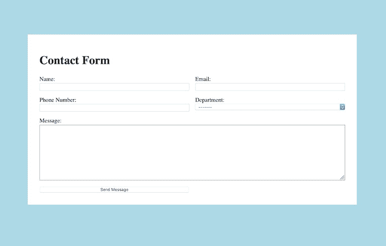
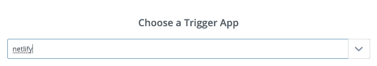
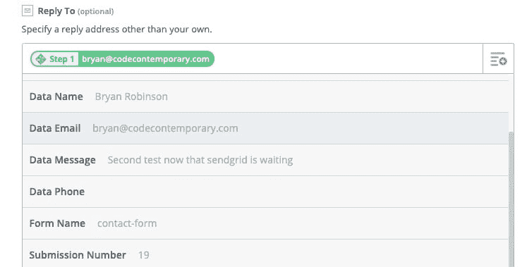
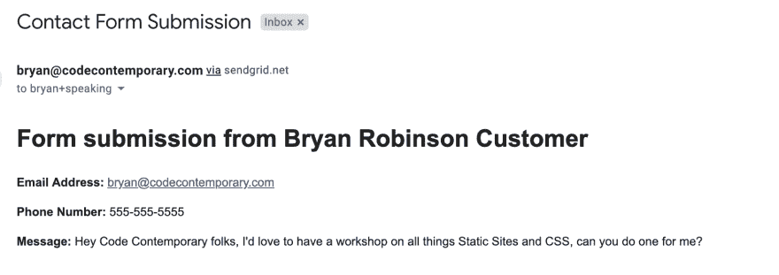

# 使用 Netlify、Zapier 和 SendGrid 将联系人形式的电子邮件路由到不同的地址

> 原文：<https://dev.to/brob/routing-contact-form-emails-to-different-addresses-with-netlify-zapier-and-sendgrid-83n>

我最近写道[由于客户的期望](https://bryanlrobinson.com/blog/2019/04/26/client-work-and-the-jamstack/)，一些开发人员对加入 JAMstack 的潮流持谨慎态度。当您的客户需要动态表单处理，而您的站点是“静态的”时，您会怎么做？

在本文中，我们将探讨两种基于用户对表单域的回答进行动态表单路由的方法。

这段代码的简单用例是，当客户希望根据用户选择的“部门”向内部不同的地方发送电子邮件时。

我们将探索两种不同的方法来实现这一点。一个没有 HTML 以外的代码，另一个有简单的无服务器函数来处理表单。

## 基本设置:表单 HTML

[](https://res.cloudinary.com/practicaldev/image/fetch/s---V1dweQX--/c_limit%2Cf_auto%2Cfl_progressive%2Cq_auto%2Cw_880/https://bryanlrobinson.cimg/netlify-form-form.jpg)

无论我们是自己编写表单处理还是外包给第三方，我们都需要构建表单。

对于这个例子，我们将假设一个简单的联系形式。

```
<form name="contact-form" action="/thank-you" netlify>  
    <label for="name">Name: <input type="text" name="name"></label>  
    <label for="email">Email: <input type="email" name="email"></label>  
    <label for="phone">Phone Number: <input type="text" name="phone"></label>  

    <label for="department">Department:  
    <select name="department" id="department">  
        <option value="bryan@codecontemporary.com">-------</option>  
        <option value="bryan+sales@codecontemporary.com">Sales</option>  
        <option value="bryan+speaking@codecontemporary.com">Speaking</option>  
        <option value="bryan+careers@codecontemporary.com">Careers</option>  
    </select> 
    </label> 

    <label class="full-width" for="message">Message: 
      <textarea name="message" id="message" rows="10"></textarea>
    </label>  
    <button type="submit">Send Message</button>  
</form> 
```

<svg width="20px" height="20px" viewBox="0 0 24 24" class="highlight-action crayons-icon highlight-action--fullscreen-on"><title>Enter fullscreen mode</title></svg> <svg width="20px" height="20px" viewBox="0 0 24 24" class="highlight-action crayons-icon highlight-action--fullscreen-off"><title>Exit fullscreen mode</title></svg>

该表单将从用户那里获取一些信息:姓名、电子邮件、电话号码和消息。该表单还将有一个`select`字段，允许用户从下拉列表中选择一个“部门”。为了便于处理，我们将允许每个`option`的值作为我们想要发送电子邮件的电子邮件地址。

我们只需在 HTML `<form>`元素中添加一个`netlify`属性，就可以将这个表单转换成 Netlify 能够识别的表单。

当 Netlify 建立我们的网站时，它会自动为这个表单设置基本的表单处理。得心应手！

## 为表单路由设置 Zap

如果我们不想编写自己的表单处理程序，我们可以使用像 Zapier 这样的服务。不需要代码。

首先，如果你没有 Zapier 账户，[去创建一个](https://zapier.com/)。使用 Zapier，您可以利用许多具有 API 的不同服务。除了这个例子之外，它还很方便。

登录后，您将进行第一次 Zap(Zapier 是您的迷你应用程序的名称)。

给你的 Zap 命名，然后选择一个“触发器”

### 设置您的 Zap 触发器

[](https://res.cloudinary.com/practicaldev/image/fetch/s--ceUTk2u9--/c_limit%2Cf_auto%2Cfl_progressive%2Cq_auto%2Cw_880/https://bryanlrobinson.cimg/netlify-form-zap-trigger.jpg)

触发器是启动应用程序的东西。在这种情况下，我们可以使用“Netlify”触发器应用程序。每个应用程序中都有各种触发器。在我们的例子中，我们将使用“新表单提交”触发器。

在下一个屏幕上，将要求您登录您的 Netlify 帐户。通过身份验证后，您可以选择要使用的网络生活站点以及该站点的表单。

您将能够选择一个表单提交作为您数据的基础，然后继续构建您的“动作”

### 建立你的 Zap 的行动

[](https://res.cloudinary.com/practicaldev/image/fetch/s--u_wPE6ER--/c_limit%2Cf_auto%2Cfl_progressive%2Cq_auto%2Cw_880/https://bryanlrobinson.cimg/netlify-form-zap-action.jpg)

您可以从成千上万的应用程序中选择来处理下一步(甚至是与 CRMs 集成的应用程序)。出于我们的目的，我们将使用 Zapier 提供的默认“电子邮件”应用程序。

您将选择“发送出站电子邮件”作为操作并继续。

有趣的事情开始了。您可以从我们的表单中指定任何数据来填充此操作中的任何字段。

在“Subject”字段中，您可以放入一条通用消息(或者返回到您的表单中添加一个主题字段并填充它)。

在“Body”字段中，我使用 Netlify 提供的“Summary”字段。我喜欢这个选项，因为它在字段中包含了名称和消息。您可以构建自己的定制 HTML 来填充该字段，并包含您的客户端需要的任何数据。

对于“回复”字段，我将使用从 Netlify 发送的“数据电子邮件”字段。

最后，对于我们的“To”字段，我将使用从 Netlify 发送的“数据部门”提供的数据(我们的“部门”字段的值)。

所有这些都准备就绪并保存后，Zapier 将在提交联系表的任何时候向该部门的电子邮件地址发送一封电子邮件。

### 幕后

值得注意的一件有趣的事情是:当你建立这种联系时，Zapier 和 Netlify 正在幕后设置一个 webhook。webhook 位于表单设置的网络管理面板中。每当你的表单被提交时，Netlify 就会为你触发一个点击 Zapier API 的“输出 Webhook”。

我们将在下一节做一些类似的事情，但是是针对我们自己的 API 端点！

## 创建无服务器表单处理器

如果您喜欢编写代码，并且希望完全控制应用程序中发生的事情，您可以创建自己的表单处理器。

我们将使用 Netlify 函数创建一个 Lambda 函数，它将为我们处理电子邮件。

要发送电子邮件，我们需要某种形式的 Node.js 电子邮件 API。对于这个例子，我们将使用 Twilio 的 SendGrid 产品。这个 API 很容易理解，并且有很多例子。额外收获:对于低水平的使用，它是免费的。

旁白:Chris Coyier 最近写了一篇关于 CSS 技巧的文章，关于从无服务器功能 *发送邮件的* [*。在里面，他使用了看起来也很方便的 SparkPost。*](https://css-tricks.com/netlify-functions-for-sending-emails/)

### 设置我们的无服务器功能

首先，我们必须配置我们的项目来使用 Netlify 函数。最简单的方法是使用 Netlify Dev CLI 设置项目。

运行以下命令，它将为您设置好一切:

```
netlify functions:create --name contact-route 
```

<svg width="20px" height="20px" viewBox="0 0 24 24" class="highlight-action crayons-icon highlight-action--fullscreen-on"><title>Enter fullscreen mode</title></svg> <svg width="20px" height="20px" viewBox="0 0 24 24" class="highlight-action crayons-icon highlight-action--fullscreen-off"><title>Exit fullscreen mode</title></svg>

从这里，您可以选择“Hello World”示例，并用我们的新处理程序替换基本示例。

我们将继续使用 Netlify 的基本表单功能。我发现我从他们的表单中获得的功能是值得的。我就不带代码的垃圾邮件防护，非常感谢！

### 设置我们的电子邮件提供商:SendGrid

首先，在 SendGrid 上设置一个帐户。从这里开始，您的应用程序将需要一个 API 密钥。最好将它存储在您的 Netlify 环境变量中。Netlify 的 Dev CLI 会将您的环境变量从您的帐户同步到您的本地版本。

接下来，我们需要获取节点发送网格包。

```
npm install --save @sendgrid/mail 
```

<svg width="20px" height="20px" viewBox="0 0 24 24" class="highlight-action crayons-icon highlight-action--fullscreen-on"><title>Enter fullscreen mode</title></svg> <svg width="20px" height="20px" viewBox="0 0 24 24" class="highlight-action crayons-icon highlight-action--fullscreen-off"><title>Exit fullscreen mode</title></svg>

在我们的`contact-route.js`函数中，我们需要包含 SendGrid 包，并用我们的 API 键初始化脚本。

```
const sgMail = require('@sendgrid/mail');  
sgMail.setApiKey(process.env.SENDGRID_API_KEY); 
```

<svg width="20px" height="20px" viewBox="0 0 24 24" class="highlight-action crayons-icon highlight-action--fullscreen-on"><title>Enter fullscreen mode</title></svg> <svg width="20px" height="20px" viewBox="0 0 24 24" class="highlight-action crayons-icon highlight-action--fullscreen-off"><title>Exit fullscreen mode</title></svg>

### 解析表单提交

在我们的处理函数中，我们希望以一种 SendGrid 可以使用的方式来解析表单数据。

Netlify 的表单 webhook 会将数据作为事件的主体发送给我们。我们需要将这些数据转换成 JSON。

```
let formData = JSON.parse(event.body).data; 
```

<svg width="20px" height="20px" viewBox="0 0 24 24" class="highlight-action crayons-icon highlight-action--fullscreen-on"><title>Enter fullscreen mode</title></svg> <svg width="20px" height="20px" viewBox="0 0 24 24" class="highlight-action crayons-icon highlight-action--fullscreen-off"><title>Exit fullscreen mode</title></svg>

接下来，我们要格式化一个 HTML 字符串，SendGrid 将使用它作为我们电子邮件的正文。我们可以在这里用一些简单的 HTML 和 JS 模板文字做很多漂亮的格式化。

```
let html = `<h1>Form submission from ${formData.name}</h1>  
               <p><strong>Email Address:</strong> ${formData.email}</p>  
               <p><strong>Phone Number:</strong> ${formData.phone ? formData.phone : 'Not Submitted'}</p>  
               <p><strong>Message:</strong> ${formData.message}</p>`; 
```

<svg width="20px" height="20px" viewBox="0 0 24 24" class="highlight-action crayons-icon highlight-action--fullscreen-on"><title>Enter fullscreen mode</title></svg> <svg width="20px" height="20px" viewBox="0 0 24 24" class="highlight-action crayons-icon highlight-action--fullscreen-off"><title>Exit fullscreen mode</title></svg>

最后，我们为 SendGrid 构建选项，然后用这些选项调用 SendGrid 的`send()`方法。

```
const msg = {  
       to: formData.department,  
       from: formData.email,  
       subject: 'Contact Form Submission',  
       text: formData.message,  
       html: html,  
     };  

     sgMail.send(msg); 
```

<svg width="20px" height="20px" viewBox="0 0 24 24" class="highlight-action crayons-icon highlight-action--fullscreen-on"><title>Enter fullscreen mode</title></svg> <svg width="20px" height="20px" viewBox="0 0 24 24" class="highlight-action crayons-icon highlight-action--fullscreen-off"><title>Exit fullscreen mode</title></svg>

最后一个函数只有 20 行。

```
'use strict';  
const sgMail = require('@sendgrid/mail');  
sgMail.setApiKey(process.env.SENDGRID_API_KEY);  

export function handler(event, context, callback) {  
let formData = JSON.parse(event.body).data;  

let html = `<h1>Form submission from ${formData.name}</h1>  
               <p><strong>Email Address:</strong> ${formData.email}</p>  
               <p><strong>Phone Number:</strong> ${formData.phone ? formData.phone : 'Not Submitted'}</p>  
               <p><strong>Message:</strong> ${formData.message}</p>`;  

const msg = {  
       to: formData.department,  
       from: formData.email,  
       subject: 'Contact Form Submission',  
       text: formData.message,  
       html: html,  
     };  
     sgMail.send(msg);  
} 
```

<svg width="20px" height="20px" viewBox="0 0 24 24" class="highlight-action crayons-icon highlight-action--fullscreen-on"><title>Enter fullscreen mode</title></svg> <svg width="20px" height="20px" viewBox="0 0 24 24" class="highlight-action crayons-icon highlight-action--fullscreen-off"><title>Exit fullscreen mode</title></svg>

### 在 Netlify 中设置外发 Webhook

在我们的 Zapier 示例中，我们的第三方应用程序为我们设置了 webhook。在我们的自定义示例中，我们需要进入我们的 Netlify admin 并向表单添加一个出站 webhook。

此设置存在于设置>表单>通知中。您可以选择“出站 Webhook”要通知的 URL 将是您的无服务器功能的最终 URL，表单将是该特定表单的表单名称。

最后，电子邮件发送到我们的收件箱。下面是 SendGrid 示例的样子。格式化的 HTML 有很大的不同！

[](https://res.cloudinary.com/practicaldev/image/fetch/s--l1qQ_0t_--/c_limit%2Cf_auto%2Cfl_progressive%2Cq_auto%2Cw_880/https://bryanlrobinson.cimg/netlify-form-email.jpg)

## 结论:使用 Netlify、Zapier 和 SendGrid，表单路由轻而易举

事实证明，使用 JAMstack，我们几乎可以完成客户要求的任何事情。

这两个例子的构建时间都不到两个小时，并且可以扩展到做更多令人惊奇的事情。不要被骗以为静态站点就不能强大。

我希望人们在客户端工作中越来越多地使用这些技术。我发现这使得项目更容易回归，因为它们都是用 HTML、CSS 和 JS 编写的。

你能用 Netlify 和 Zapier 或 SendGrid 的组合做什么？