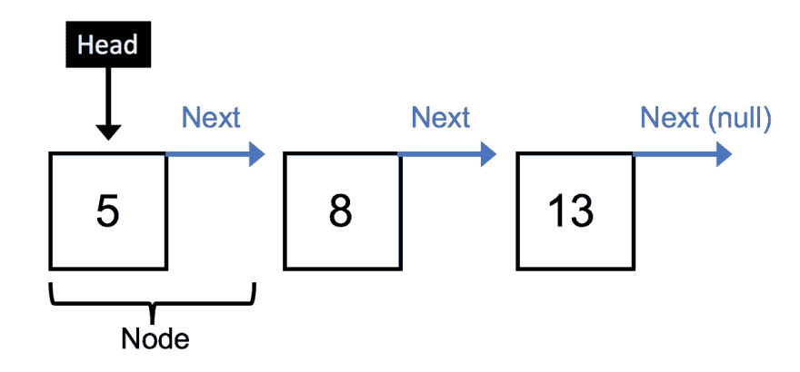
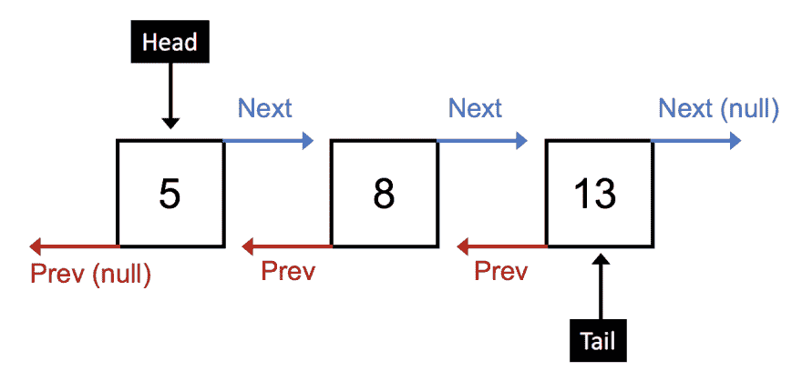

# 跳入链表

> 原文：<https://dev.to/neilberg/leaping-into-linked-lists-3876>

当使用数组时，*查找*插入/删除点在时间上是常数，但是*执行*插入/删除是 O(n)。由于数组中的元素在内存中是连续分配的，导致在执行插入/删除操作时对结构进行重组，因此会发生这种潜在的高成本操作。

另一方面，链表由包含数据值的节点和指向下一个节点(在双向链表的情况下是前一个节点)的指针组成，允许常量时间插入/删除元素。这种相对于数组的性能提升是因为我们只需要在遍历过程中跟踪内存中的当前指针，并在添加或删除目标元素时重新分配该指针。

换句话说，不管链表的大小如何，插入/删除动作需要指针重新分配的单个动作，即 O(1)时间复杂度。但是，查找要添加/删除的元素的遍历复杂度为 O(n)。总之，数组和链表之间插入/删除的时间复杂度是:

**数组**

*   寻找插入/删除点:O(1)
*   执行插入/删除点:O(n)

**链表**

*   寻找插入/删除点:O(n)
*   执行插入/删除点:O(1)

让我们进入单向和双向链表的世界。

### 单链表

单链表由节点定义，节点是包含两个属性的普通对象:

1.  一个值，如整数或字符串
2.  指向列表中下一个节点*的指针，如果在列表末尾，则为空。*

列表本身也有两个属性:

1.  一个*头*，其值指向列表中的第一个节点
2.  最后

例如，一个包含值 5、8 和 13 的三个节点的单链表如下所示:

[](https://res.cloudinary.com/practicaldev/image/fetch/s--eA_dT6GL--/c_limit%2Cf_auto%2Cfl_progressive%2Cq_auto%2Cw_880/https://thepracticaldev.s3.amazonaws.com/i/10oy6n74yyeeosxhcgli.png)

#### 创建 Node 和 SinglyLinkedList 类

使用 ES6 类作为原型继承的语法糖，我们可以从为节点和单链表结构定义类开始。

列表中的每个`Node`都用某个值(例如一个整数)和设置为`null`的初始`next`属性来实例化。

```
class Node {
  constructor(value) {
    this.value = value;
    this.next = null;
  }
} 
```

使用`new`操作符创建了一个新的`Node`实例，并向其传递了所需的值:

```
const node = new Node(5);
console.log(node);
// Node { value: 5, next: null } 
```

该列表通过定义两个属性来实例化:初始设置为空的`head`和初始为零的`length`。

```
class SinglyLinkedList {
  constructor() {
    this.head = null;
    this.length = 0;
  }

  // Methods to be added next
  add(value) {}
  addAt(k, value) {}
  remove(value) {}
  removeAt(k) {}
  indexOf(value) {}
  nodeAt(k) {}
}

const sll = new SinglyLinkedList();
console.log(sll);
// SinglyLinkedList { head: null, length: 0 } 
```

使用`new`操作符创建了 SinglyLinkedList 的一个新实例:

```
const sll = new SinglyLinkedList(); 
```

#### 添加节点

在单向链表的末尾添加一个节点需要以下步骤:

1.  用输入的值创建一个新节点。
2.  检查列表是否为空，即`head`为`null`。
3.  如果为空，将列表头设置为新节点。
4.  如果不为空，则遍历列表，直到找到最后一个节点(其`next`值为`null`)，然后设置最后一个节点的`next`属性指向新节点。
5.  增加列表的长度。

```
add(value) {
  const node = new Node(value);

  if (!this.head) {
    this.head = node;
  } else {
    let current = this.head;
    while (current.next) {
      current = current.next;
    }
    current.next = node;
  }
  this.length++;
}

//
const sll = new SinglyLinkedList();
sll.add(5);
sll.add(8);
sll.add(13);
console.log(JSON.stringify(sll, null, 4))
// {
//     "head": {
//         "value": 5,
//         "next": {
//             "value": 8,
//             "next": {
//                 "value": 13,
//                 "next": null
//             }
//         }
//     },
//     "length": 3
// } 
```

#### 在索引处添加节点 *k*

在索引 *k* 处添加节点通过以下步骤完成:

1.  确保 index *k* 为非负且小于列表长度。
2.  用输入的值创建一个新节点。
3.  如果 *k* = 0，则将新节点的`next`值设置为列表的`head`的初始`next`值，并将`head`重新分配给新节点。
4.  如果*k*T7】0，则从`head`开始循环 *k* 次，并在遍历过程中跟踪`previous`和`current`节点。这些节点用于在下一步中包含新节点。
5.  将`previous`节点的`next`值设置为新节点，并将新节点的`next`值设置为`current`节点。
6.  增加列表的长度。

```
 addAt(k, value) {
    if (k < 0 || k > this.length) {
      return false;
    }

    const node = new Node(value);
    if (k === 0) {
      node.next = this.head.next;
      this.head = node;
    } else {
      let current = this.head;
      let previous = undefined;
      for (let i = 0; i < k; i++) {
        previous = current;
        current = current.next;
      }
      previous.next = node;
      node.next = current;
    }
    this.length++
  }

// Example -- 
const sll = new SinglyLinkedList();
sll.add(5);
sll.add(8);
sll.add(13);
sll.addAt(2, 10);
console.log(JSON.stringify(sll, null, 4));
// {
//     "head": {
//         "value": 5,
//         "next": {
//             "value": 8,
//             "next": {
//                 "value": 10,
//                 "next": {
//                     "value": 13,
//                     "next": null
//                 }
//             }
//         }
//     },
//     "length": 4
// } 
```

#### 删除节点

移除具有特定值的节点通过以下步骤完成:

1.  如果目标值是`head`的值，将`head`指向`head`的`next`值，并减少列表的长度。
2.  否则，遍历列表——跟踪`previous`和`current`节点——直到到达目标节点的值。
3.  将`previous`节点的`next`值设置为`current`节点的`next`值。
4.  减少列表的长度。

```
remove(value) {
  if (value === this.head) {
    this.head = this.head.next;
    this.length--;
  } else {
    let current = this.head;
    let previous = undefined;
    while (current.next) {
      // Traverse until target value found or end of list when current.next === null
      if (current.value === value) {
        previous.next = current.next;
        this.length--;
        break;
      }
    }
  }
}
// Example --
const sll = new SinglyLinkedList();
sll.add(5);
sll.add(8);
sll.add(13);
sll.addAt(2, 10);
sll.remove(8);
console.log(JSON.stringify(sll, null, 4));
// {
//     "head": {
//         "value": 5,
//         "next": {
//             "value": 10,
//             "next": {
//                 "value": 13,
//                 "next": null
//             }
//         }
//     },
//     "length": 3
// } 
```

#### 删除索引处的节点 *k*

移除索引 *k* 处的节点通过以下步骤完成:

1.  确保 *k* 为非负且小于列表长度。
2.  如果 k === 0，重置`head`以指向它的`next`值，并减少列表的长度。
3.  如果 k > 0，遍历列表 *k* 次——跟踪`previous`和`current`节点——然后将`previous`节点的`next`值设置为`current`节点的下一个值。递减列表。

```
removeAt(k) {
  if (k < 0 || k > this.length) {
    return false;
  }

  if (k === 0) {
    this.head = this.head.next;
    this.length--;
  } else {
    let current = this.head;
    let previous = undefined;
    for (let i = 0; i < k; i++) {
      previous = current;
      current = current.next;
    }
    previous.next = current.next;
    this.length--;
  }
}
// Example --
const sll = new SinglyLinkedList();
sll.add(5);
sll.add(8);
sll.add(13);
sll.removeAt(1);
console.log(JSON.stringify(sll, null, 4));singlyLinkedList.js
// {
//     "head": {
//         "value": 5,
//         "next": {
//             "value": 13,
//             "next": null
//         }
//     },
//     "length": 2
// } 
```

#### 一个值的指标

定位与某个值相关联的索引是通过简单地遍历列表直到找到目标值并返回遍历需要多少步来完成的。如果没有找到值，我们可以返回-1 或类似的值。

```
indexOf(value) {
  let i = 0;
  let current = this.head;
  while (i < this.length) {
    if (current.value === value) {
      return i;
    }
    current = current.next;
    i++;
  }
  return -1;
}

// Example --
const sll = new SinglyLinkedList();
sll.add(5);
sll.add(8);
sll.add(13);
console.log(sll.indexOf(5)); // 0
console.log(sll.indexOf(8)); // 1
console.log(sll.indexOf(13)); // 2 
```

#### 索引处的节点 *k*

通过简单地遍历列表 *k* 次并返回结果节点，可以定位特定索引处的节点。和前面一样，我们也首先检查以确保提供了有效的索引。

```
nodeAt(k) {
  if (k < 0 || k > this.length - 1) {
    return false;
  }
  let current = this.head;
  for (let i = 0; i < k; i++) {
    current = current.next;
  }
  return current;
}

// Example --
const sll = new SinglyLinkedList();
sll.add(5);
sll.add(8);
sll.add(13);
console.log(JSON.stringify(sll.nodeAt(1), null, 4));
// {
//     "value": 8,
//     "next": {
//         "value": 13,
//         "next": null
//     }
// } 
```

### 双向链表

我们看到在单链表中只有向前遍历(从头部开始)是可能的。通过向每个节点添加一个`previous`或`prev`属性，并向链表添加一个`tail`属性，可以实现向前*和*向后遍历。结果是一个双向链表，概念上看起来像这样:

[](https://res.cloudinary.com/practicaldev/image/fetch/s--giXTWeQX--/c_limit%2Cf_auto%2Cfl_progressive%2Cq_auto%2Cw_880/https://thepracticaldev.s3.amazonaws.com/i/ss577krhrgc8d054z72w.png)

#### 创建节点和双链接列表类

列表中的每个`Node`用某个值(例如，整数)实例化，并且`next`和`prev`属性被设置为`null`。

```
class Node {
  constructor(value) {
    this.value = value;
    this.next = null;
    this.prev = null;
  }
} 
```

该列表通过定义三个属性来实例化:最初被设置为空的`head`和`tail`以及最初为零的`length`。

```
class SinglyLinkedList {
  constructor() {
    this.head = null;
    this.tail = null;
    this.length = 0;
  }

  // New methods to be added next
  display() {}

  addAtHead(value) {}
  addAtTail(value) {}
  addAtIndex(k, value) {}
  addAtElement(element, value) {}

  removeAtHead() {}
  removeAtTail() {}
  removeAtIndex(k) {}
  removeAtElement(element) {}
}

const dll = new DoublyLinkedList();
console.log(dll);
// DoublyLinked { head: null, tail: null, length: 0 } 
```

#### 显示列表

由于`prev`指针的迂回性质，将双向链表记录到控制台有点棘手。我更喜欢将`head`、`tail`和每个`node`显示在新行上，用箭头表示它们的`prev`和`next`属性:

```
display() {
  let dataString = 'Head => ' + '\n';
  let current = this.head;
  while (current !== null) {
    dataString += '<-' + current.value + '->' + '\n';
    current = current.next;
  }
  dataString += '<= Tail';
  return dataString;
} 
```

#### 在头部添加节点

在列表顶部添加节点是通过以下步骤完成的:

1.  如果列表为空，将头尾指向新节点。
2.  如果列表不为空:
    *   将新节点的`next`属性设置为 head 的当前值(即当前列表中的第一个节点)。
    *   将当前第一个节点的`prev`属性(`this.head.prev`)设置为新节点。
    *   重置头部以指向新节点。
3.  增加列表的长度。

```
addAtHead(value) {
 let node = new Node(value);
 if (!this.head) {
   // First node
   this.head = node;
   this.tail = node;
 } else {
   node.next = this.head;
   this.head.prev = node;
   this.head = node;
 }
 this.length++;
}
// -- Example
const dll = new DoublyLinkedList();
dll.addAtHead(13);
dll.addAtHead(8);
dll.addAtHead(5);
console.log(dll.display());
// Head =>
// <-5->
// <-8->
// <-13->
// <= Tail 
```

#### 在尾部添加节点

在尾部添加节点几乎等同于在头部添加节点:

1.  如果列表为空，将头尾指向新节点。
2.  如果列表不为空:
    *   将新节点的`prev`属性设置为尾部的当前值(即当前列表中的最后一个节点)
    *   将当前最后一个节点的`next`属性(`this.tail.next`)设置为新节点。
    *   重置尾部以指向新节点。
3.  增加列表的长度。

```
addAtTail(value) {
  let node = new Node(value);
  if (!this.tail) {
    // First node
    this.tail = node;
    this.head = node;
  } else {
    node.prev = this.tail;
    this.tail.next = node;
    this.tail = node;
  }
  this.length++;
}
// -- Example
const dll = new DoublyLinkedList();
dll.addAtHead(13);
dll.addAtHead(8);
dll.addAtHead(5);
dll.addAtTail(22);
console.log(dll.display());
// Head => 
// <-5->
// <-8->
// <-13->
// <-22->
// <= Tail 
```

#### 在索引处添加节点 *k*

在指定索引 *k* 处添加新节点是通过以下方式实现的:

1.  检查索引是否非零且小于列表长度
2.  如果 *k* = 0，我们在列表的开头，所以新的节点被插入到开头(参见上面的`addAtHead()`步骤)
3.  如果 *k* =列表的长度，我们在列表的末尾，所以新的节点被插入到末尾(参见上面的`addAtTail()`步骤)
4.  否则，从头部向前(如下所示)或从尾部向后遍历 *k* 步，并在每一步中跟踪当前头部。然后:
    *   在遍历结束时，将新节点的`prev`属性设置为当前头
    *   将新节点的`next`属性设置为当前节点的`next`属性
    *   将当前节点的`next`属性设置为新节点
5.  增加列表的长度。

```
addAtIndex(k, value) {
  const node = new Node(value);
  if (k < 0 || k > this.length) return undefined;
  if (k === 0) {
    // at head
    node.next = this.head;
    this.head.prev = node;
    this.head = node;
  } else if (k === this.length - 1) {
    // at tail
    node.prev = this.tail;
    this.tail.next = node;
    this.tail = node;
  } else {
    //somewhere in the body
    let i = 1;
    let current = this.head;
    while (current.next) {
      if (i === k) {
        node.prev = current;
        node.next = current.next;
        current.next = node;
      }
      current = current.next;
      i++;
    }
  }
  this.length++;
}
// -- Example
const dll = new DoublyLinkedList();
dll.addAtHead(13);
dll.addAtHead(8);
dll.addAtHead(5);
dll.addAtTail(22);
dll.addAtIndex(2, 10);
console.log(dll.display());
// Head => 
// <-5->
// <-8->
// <-10->
// <-13->
// <-22->
// <= Tail 
```

#### 在一个元素上添加节点

在目标元素上添加节点甚至比在目标索引上添加更容易。我们简单地遍历列表，直到找到目标元素，在每一步跟踪当前节点，然后:

1.  将新节点的`prev`属性设置为当前节点。
2.  将新节点的`next`属性设置为当前节点的`next`属性的值。
3.  将当前节点的`next`值设置为当前节点。
4.  增加列表的长度。

```
addAtElement(element, value) {
  const node = new Node(value);
  let current = this.head;
  while (current.value !== element && current.next) {
    current = current.next;
  }
  node.prev = current;
  node.next = current.next;
  current.next = node;
  this.length++;
}
// -- Example
const dll = new DoublyLinkedList();
dll.addAtHead(13);
dll.addAtHead(8);
dll.addAtHead(5);
dll.addAtTail(22);
dll.addAtIndex(2, 10);
dll.addAtElement(5, 7);
console.log(dll.display());
// Head => 
// <-5->
// <-7->
// <-8->
// <-10->
// <-13->
// <-22->
// <= Tail 
```

#### 去除头部节点

为了删除开头的节点，我们基本上跳过了列表中的第一个元素。这通过以下方式实现:

1.  将头部移动到其`next`值。
2.  将头部现在指向的节点的`prev`属性设置为`null`。
3.  减少列表的长度。

```
removeAtHead() {
  if (this.head) {
    this.head = this.head.next;
    this.head.prev = null;
    this.length--;
  }
}
// -- Example
const dll = new DoublyLinkedList();
dll.addAtHead(13);
dll.addAtHead(8);
dll.addAtHead(5);
dll.removeAtHead();
console.log(dll.display());
// Head => 
// <-8->
// <-13->
// <= Tail 
```

#### 删除尾部节点

为了删除尾部的节点，我们基本上跳过了列表中的最后一个元素。这通过以下方式实现:

1.  将尾部移动到尾部的`prev`节点。
2.  将尾部现在指向的节点的`next`属性设置为`null`。
3.  减少列表的长度。

```
removeAtTail() {
  if (this.tail) {
    this.tail = this.tail.prev;
    this.tail.next = null;
    this.length--;
  }
}
// -- Example
const dll = new DoublyLinkedList();
dll.addAtHead(13);
dll.addAtHead(8);
dll.addAtHead(5);
dll.removeAtTail();
console.log(dll.display());
// Head => 
// <-5->
// <-8->
// <= Tail 
```

#### 删除索引处的节点 *k*

当移除目标索引 *k* 处的节点时，我们首先检查以确保 *k* 是非负的并且小于列表的长度。然后:

1.  如果 *k* = 0，我们在最前面，调用`removeAthead()`
2.  如果 *k* =列表的长度，我们在末尾，调用`removeAtTail()`
3.  否则，遍历 *k* 个步骤，在每个步骤中跟踪当前节点，然后通过以下方式跳过要删除的节点:
    *   将当前节点的`prev.next`值设置为当前节点的`next`值。
    *   将当前节点的`next.prev`值设置为当前节点的`prev`值。
4.  减少列表的长度。

```
removeAtIndex(k) {
  if (k < 0 || k > this.length - 1) {
    return undefined;
  }
  if (k === 0) {
    // at the head
    this.removeAtHead();
  } else if (k === this.length - 1) {
    // at the tail
    this.removeAtTail();
  } else {
    let current = this.head;
    for (let i = 0; i < k; i++) {
      previous = current;
      current = current.next;
    }
    current.prev.next = current.next;
    current.next.prev = current.prev;
  }
  this.length--;
}
// -- Example
const dll = new DoublyLinkedList();
dll.addAtHead(13);
dll.addAtHead(8);
dll.addAtHead(5);
dll.removeAtIndex(1);
console.log(dll.display());
// Head => 
// <-5->
// <-13->
// <= Tail 
```

#### 删除目标元素处的节点

最后，我们可以使用以下步骤移除所需的元素:

1.  如果要删除的元素附加到了`head`所指向的节点，调用`removeAtHead()`
2.  如果要删除的值被附加到`tail`所指向的节点，调用`removeAtTail()`
3.  否则，遍历列表，直到找到该元素，在每个步骤中跟踪当前节点，并在移除所需索引时应用与上述相同的逻辑。
4.  减少列表的长度。

```
removeAtElement(element) {
  if (element === this.head.value) {
    this.removeAtHead();
  } else if (element === this.tail.value) {
    this.removeAtTail();
  } else {
    let current = this.head;
    while (current.value !== element && current.next) {
      current = current.next;
    }
    current.prev.next = current.next;
    current.next.prev = current.prev;
    this.length--;
  }
}
// -- Example
const dll = new DoublyLinkedList();
dll.addAtHead(13);
dll.addAtHead(8);
dll.addAtHead(5);
dll.removeAtElement(8);
console.log(dll.display());
// Head => 
// <-5->
// <-13->
// <= Tail 
```