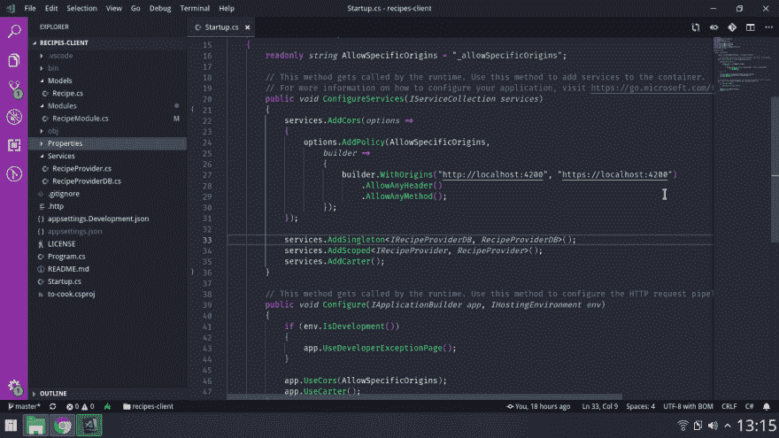

# ASP.NET 核心，卡特和 Angular，一个可扩展的 RESTfull 初学者的例子？(1)

> 原文：<https://dev.to/sebalr/asp-net-core-carter-and-angular-a-scalable-restfull-example-for-beginners-1-pgk>

大家好，这是我在 DEV(或任何社区)的第一篇帖子。它在我的未决清单上，但是我曾经认为我没有什么可写的。我的母语不是英语，所以你可能会发现一些编辑错误，欢迎纠正我。

让我自我介绍一下，我是一名来自阿根廷的软件工程师，两年前我获得了学位并找到了一份前端开发人员的工作，但由于公司的需要，几个月后我成为了我喜欢称之为中端开发人员的人。为什么是中端？因为我真的很喜欢接触复杂的问题和业务逻辑，但我不是数据库的狂热爱好者，尽管我喜欢，但我既不是 UX 也不是 UI 专家。

在我的工作中，我们专注于构建具有角度和 ASP.NET 核心的复杂解决方案。为什么是这种技术？因为两者都有类型和现成的 IoC，我们认为这两点对于构建大型的可维护代码是必不可少的。

等等，凯德是什么？，这是一个可怕的名字(来吧，我是一个电脑人)，因为我认为这是一个伟大的堆栈(也许如果有人看到这一点，可以在评论中提出一个更好的名字):卡特，角，反转控制和 ASP.NET 核心。关于这项技术，我有很多好话要说，但我不想把这篇文章写得太大，所以我会在接下来的几天里写。

在这一系列教程中，我将编写一个非常基本但过度设计的 to-cook 应用程序(是的，就像一个 to-do，但有食物)。我将从基本的后端和前端结构开始，然后进行重构，使它们能够适应大型项目。最初的想法是在同一篇文章中开始前端和后端项目，但它会太大，所以让我们从后端开始。

在一些项目之后，我们发现我们认为后端项目有一个很好的基本结构。

1.  dto 在前端和后端之间移动数据。
2.  富模型(如 DDD)负责简单的业务数据验证，即不能为空的属性，以及不需要注入依赖的复杂操作。
3.  为需要注入依赖关系的操作提供服务，如访问数据库进行验证，或在许多模块中使用，如发送推送通知。
4.  可重用函数的扩展方法，例如，我们已经包含了一个日期时间变量，以确保时间是 23:59:49。

这些主题将在系列教程中讨论。停止谈话，让我们写一些代码。

第一步是安装。NET Core [SDK](https://dotnet.microsoft.com/download) 并创建项目。

```
dotnet new web -n to-cook 
```

然后我们移动到解决方案文件夹并安装 [Carter](https://github.com/CarterCommunity/Carter) 。卡特是一个伟大的工具，引用他的创造者的话，“允许更优雅的路由”。在我看来，最好的一点是你在模块的构造函数中编写方法，并且可以访问其中注入的依赖项。

```
cd to-cook
dotnet add package carter 
```

接下来我们需要在 **startup.cs** 中添加 Carter

```
using System;
using System.Collections.Generic;
using System.Linq;
using System.Threading.Tasks;
using Carter;
using Microsoft.AspNetCore.Builder;
using Microsoft.AspNetCore.Hosting;
using Microsoft.AspNetCore.Http;
using Microsoft.Extensions.DependencyInjection;
using to_cook.Services;

namespace to_cook
{
    public class Startup
    {
        public void ConfigureServices(IServiceCollection services)
        {
            services.AddCarter();
        }

        public void Configure(IApplicationBuilder app)
        {
            if (env.IsDevelopment())
            {
                app.UseDeveloperExceptionPage();
            }
            app.UseCarter();
        }
    }
} 
```

我们将从我们想做的食谱开始。用 *Recipe.cs* 创建一个**模型**文件夹。属性是虚拟的(并且 recipe 有一个 id ),因为稍后(在另一篇文章中)我们将添加实体框架。

```
namespace to_cook.Models
{
    public class Recipe
    {
        public virtual int Id { get; set; }
        public virtual string Title { get; set; }
        public virtual string Description { get; set; }
    }
} 
```

现在我们将为本教程创建一个超级基本的“数据库”。稍后我们会将此更改为*真正的*数据提供者和数据库连接。
用 *RecipeProviderDB.cs* 创建一个**服务**文件夹。

```
using System.Collections.Generic;
using to_cook.Models;

namespace to_cook.Services
{
    public interface IRecipeProviderDB
    {
        ICollection<Recipe> Recipes();
    }

    public class RecipeProviderDB : IRecipeProviderDB
    {
        ICollection<Recipe> _recipes;

        public RecipeProviderDB()
        {
            _recipes = new HashSet<Recipe>()
            {
                new Recipe() { Id = 1, Title = "Hamburger pizza" },
                new Recipe() { Id = 2, Title = "Argentine Asado" },
                new Recipe() { Id = 3, Title = "Mexican Tacos" },
            };
        }

        public ICollection<Recipe> Recipes()
        {
            return this._recipes;
        }
    }
} 
```

为什么我的文件中有一个 *IRecipeProviderDB* ？正如我所说，我们最喜欢 ASP.NET 核心的一点是，它提供了开箱即用的依赖注入模式支持。

你可以谷歌更多关于依赖注入的信息，但这是一种模式，你对你的依赖使用高级抽象，所以你不必担心实现细节，IoC 解耦依赖，使软件更容易扩展和测试。

ASP.NET 核心要求其 DI 模式的 3 个步骤:

1.  定义接口(合同)。
2.  编写一个实现该接口的类。
3.  声明它们之间的联系。我保证，一会儿就清楚了。

现在，您可以看到 *IServiceProviderDB* (步骤 1)有一个方法返回一个**食谱**集合，因此任何拥有 *IRecipeProviderDB* 的人都可以向他请求一个**食谱**集合。
在同一个文件中，我们用 **_recipes** 编写了一个 *ServiceProvicerDB* 类，这是我们的超级简单数据库，它还实现了 *IserviceProviderDB* (步骤 2)，因此我们必须遵守契约( *Recipes()* 方法)。

为什么把两个放在同一个文件里？，只是因为当你使用*时很容易转到定义*，但是你可以把接口放在一个单独的文件中。

**声明:这不是真正的“提供商”**。本教程的主要目的是编写 RESTfull API 的基本结构。耐心点。

下一步是在**服务**中创建一个*接收提供者*。同样，首先我们定义合同(步骤 1)。

```
public interface IRecipeProvider
{
    IEnumerable<Recipe> GetAll();
    Recipe GetById(int id);
    Recipe Add(Recipe recipe);
    Recipe Update(int id, Recipe recipe);
    void Delete(int id);
} 
```

然后我们编写实际的类(步骤 2)，我将一部分一部分地解释这个类。

```
public class RecipeProvider : IRecipeProvider
{
    private IRecipeProviderDB _recipeProviderDB;

    public RecipeProvider(IRecipeProviderDB recipeProviderDB)
    {
            _recipeProviderDB = recipeProviderDB;
    }
} 
```

我们有 **_recipeProvider** 来存储我们通过构造函数作为依赖接收的*数据库*。最后，一些具体的 DI，正如我前面提到的，在这个特殊的点上 *RecipeProvider* 需要一个 *IRecipeProviderDB* 以便它可以向他请求**食谱**的集合，但是它不关心 *IRecipeProviderDB* 将如何、何时或为什么(特别是如何)获得它。

现在我们有了*数据库*，因为我们是优秀的开发人员，我们将编写代码来履行 *IRecipeProvider* 合同。让我们一个一个来:

*GetAll()* 很简单，我们只需返回菜谱。

```
public IEnumerable<Recipe> GetAll()
{
    return this._recipeProviderDB.Recipes();
} 
```

**非常重要**在现实世界中，在任何情况下你都不会返回实际的数据库，而是一个副本。记住，本教程的主要目的是描述项目的基本结构。您还将看到，由于 DI，这种变化对于服务消费者来说是透明的。

*GetById()* 也很基本，我们首先获取所有的菜谱，然后使用 [LINQ](https://es.wikipedia.org/wiki/Language_Integrated_Query) ，另一个超级牛逼的 c#工具 *FirstOrDefault()* 返回第一个匹配 where 标准的元素或者 **null** ，找到具有指定 Id 的菜谱。

```
public Recipe GetById(int id)
{
    return this._recipeProviderDB.Recipes().Where(x => x.Id == id).FirstOrDefault();
} 
```

好了，现在让我们继续合同列表中的下一个*添加(Recipe recipe)* ，添加一个新的**配方**到列表中并返回。代码也很简单。

```
public Recipe Add(Recipe recipe)
{
    this._recipeProviderDB.Recipes().Add(recipe);
    return recipe;
} 
```

最困难的方法来了: *Update(int id，Recipe recipe)* 我们必须将新数据放入带有指定的 *id* 的*配方*中。为此，我们必须检查 *id* 是否是有效的 *id* 。写两次代码是一个不好的实践(大多数时候)，所以我们重用我们已经有的 *GetById()* 方法，记住它可能返回 null。

```
public Recipe Update(int id, Recipe recipe)
{
    var oldRecipe = this.GetById(id);
    if (oldRecipe != null)
    {
        oldRecipe.Title = recipe.Title;
        oldRecipe.Description = recipe.Description;
        return oldRecipe;
    }
    else
    {
        return null;
    }
} 
```

一个接一个地传递属性是乏味的，在接下来的文章中，我们将使用另一个复杂但很棒的工具，叫做 [AutoMapper](https://automapper.org/) 。

我们接近完成合同，最后我们有 *Delete(int id)* ，这类似于 *update()*

```
public void Delete(int id)
{
    var recipe = this.GetById(id);
    if (recipe != null)
    {
       this._recipeProviderDB.Recipes().Remove(recipe);
    }
} 
```

现在，我们已经创建了操作食谱所需的所有内容，我们将添加第一个 Carter 模块。创建一个包含 *RecipeModule.cs* 的**模块**文件夹。卡特模块只是扩展了**卡特模块**的 c#类。

我们需要导入一些 Carter 实用程序，并告诉 **CarterModule** 该端点模块中的所有方法都将在 */recipe* URL 下工作。

正如你所看到的，我们有一个注入的 **IRecipeProvider** ，这意味着一个契约说我们可以访问五个方法，在这一点上，我们不知道它们是如何实现的(我们也不关心)。

请注意，我们不需要将提供者存储在变量中，因为在 Carter 中，我们在构造函数中编写 HTTP 方法，所以我们可以直接访问注入的依赖项。Carter 允许许多 HTTP 方法实现，我们将使用一个接收字符串的实现和一个返回**任务**的委托(委托就像指向函数或匿名方法的类型安全指针)。

```
using System.Threading.Tasks;
using Carter;
using Carter.ModelBinding;
using Carter.Request;
using Carter.Response;
using Microsoft.AspNetCore.Http;
using Microsoft.AspNetCore.Routing;
using to_cook.Models;
using to_cook.Services;

namespace to_cook.Modules
{
    public class RecipeModule : CarterModule
    {
        public RecipeModule(IRecipeProvider recipeProvider) : base("recipe")
        { 
            // Here we will write REST methods
        }
    }
} 
```

RESTful APIs 有五个基本方法(正如我们在提供者中所写的)

*   *GET /* 获取所有元素。
*   *GET /{id}* 获取一个元素。
*   *POST /* 添加一个元素。
*   *PUT /{id}* 更新一个元素。
*   *DELETE /{id}* 删除一个元素。

我们将把它们添加到评论处。让我们从第一个开始，我们使用 provider 获取所有元素，然后让 Carter 在一个响应 Json 中神奇地转换数据。

```
Get("/", ctx =>
{
    var recipes = recipeProvider.GetAll();
    return ctx.Response.AsJson(recipes);
}); 
```

这个有点棘手。
首先，我们使用另一个 Carter 实用程序从 URL 中获取 *id* ，然后我们使用提供者来搜索**食谱**，如果您还记得的话， *GetById* 会给我们一个空值，如果它找不到一个元素，在这种情况下，我们将返回 404。

```
Get("/{id:int}", ctx =>
{
    var id = ctx.GetRouteData().As<int>("id");

    var recipe = recipeProvider.GetById(id);

    if (recipe != null)
    {
        return ctx.Response.AsJson(recipe);
    }
    else
    {
        ctx.Response.StatusCode = 404;
        return ctx.Response.WriteAsync($"No recipe with id {id} was found");
    }
}); 
```

*   注 1: WriteAsync **不会**返回 Json，这不太好，但是我们会在接下来的教程中解决这个问题。
*   注意 2:虽然 WriteAsync 是一个异步方法，但是如果我们**不**等待它(并且声明我们的方法为 Async)，async 我们将把它视为同步的。这不是一个问题，因为我们不做计算复杂的函数，如果我们在那里，使我们的方法异步将被推荐。

现在让我们在列表中添加一个**食谱**。首先我们使用更多的 Carter magic 来转换类中的 POST 主体，然后我们使用 provider 来保存列表中的菜谱。同样，这是第一步，我们假设所有的数据都是正确的，工作起来没有问题(现实生活更困难，**特别是**如果你必须处理用户的输入)，后面我们将添加 dto 进行数据传输和一些输入验证。

```
Post("/", ctx =>
{
    var recipe = ctx.Request.Bind<Recipe>();

    var addedRecipe = recipeProvider.Add(recipe);

    return ctx.Response.AsJson(addedRecipe);
}); 
```

下一个方法是一个 http PUT 来更新现有的**食谱**。我们做了一些基本的验证，因为更新 id(通常)是一个非常非常糟糕的主意。
我们有一个提供者来做所有的工作，所以我们只是打电话给他，并返回一个响应。

```
Put("/{id:int}", ctx =>
{
    var id = ctx.GetRouteData().As<int>("id");
    var newRecipe = ctx.Request.Bind<Recipe>();

    if (id != newRecipe.Id)
    {
        ctx.Response.StatusCode = 400;
        return ctx.Response.WriteAsync("Cant update Id property");
    }

    var editedRecipe = recipeProvider.Update(id, newRecipe);
    return ctx.Response.AsJson(editedRecipe);
}); 
```

最后，我们有删除，这个很简单。我们告诉提供者删除**食谱**，但是我们不想返回任何信息，所以我们使用 204 http 代码(没有内容)并返回一个**完成的任务**，因为，如果你记得的话，Carter 期望一个匿名方法返回一个**任务**。

```
Delete("/{id:int}", ctx =>
{
    var id = ctx.GetRouteData().As<int>("id");
    recipeProvider.Delete(id);
    ctx.Response.StatusCode = 204;
    return Task.CompletedTask;
}); 
```

恭喜，我们快成功了。如果您还在这里，您可能记得我告诉过您，ASP.NET 核心要求 3 个步骤来使 DI 工作，我们从未执行第 3 步(将合同与实施联系起来)，而且，您知道，*没有比现在更好的时机了。*。

有三种可能的方法来建立这种联系

1.  添加 singleton:在应用程序启动时创建一个实例，并共享所有 http 请求中注入的同一个实例。
2.  Add scoped:为每个 http 请求创建一个新的实例(在注入的请求生存期中共享实例)。
3.  添加瞬态:在注入的地方创建一个新的实例。

作用域生存期是 RESTFull APIs 的常见选择，因为根据定义，它们是无状态的。我们不想在请求之间共享信息。我们的数据库是一个特例，因为我们希望它在请求之间存活，所以它必须是单例的。

在 *Startup.cs* 中，转到 *ConfigureServices* 并在 *services 之前添加接下来的两行。AddCarter()* :

```
services.AddSingleton<IRecipeProviderDB, RecipeProviderDB>();
services.AddScoped<IRecipeProvider, RecipeProvider>(); 
```

现在，您终于可以测试解决方案了。只需运行:

```
dotnet build
dotnet run 
```

打开浏览器进入 *localhost:5000/recipe* 或者使用伟大的 vscode 插件 [REST 客户端](https://marketplace.visualstudio.com/items?itemName=humao.rest-client)(在我的 repo 中有一个. http 包含所有方法示例)和 TADA:

```
[{  "id":  1,  "title":  "Hamburger pizza"  },  {  "id":  2,  "title":  "Argentine Asado"  },  {  "id":  3,  "title":  "Mexican Tacos"  }] 
```

我们可以停在这里，但我们必须做更多的小事情，让事情准备好与我们未来的角度前端集成。购买恐怖 CORS 的必需品。我们将定义一个自定义的 CORS 策略...
去 **Startup.cs** 放一个

```
readonly string AllowSpecificOrigins = "_allowSpecificOrigins"; 
```

然后，在 *ConfigureServices()* 中，我们将添加两个原点，我将放置默认角度端口，但您可以编写任何您喜欢的 URL。

```
services.AddCors(options =>
    {
        options.AddPolicy(AllowSpecificOrigins,
            builder =>
            {
                builder.WithOrigins("http://localhost:4200", "https://localhost:4200")
                    .AllowAnyHeader()
                    .AllowAnyMethod();
             });
    }); 
```

最后但同样重要的是，我们必须告诉 ASP.NET 使用该策略，因此在 *configure()* 中我们添加:

```
 app.UseCors(AllowSpecificOrigins); 
```

现在我们完成了。
这是项目结构截图:
[](https://res.cloudinary.com/practicaldev/image/fetch/s--_4wVm6Yt--/c_limit%2Cf_auto%2Cfl_progressive%2Cq_auto%2Cw_880/https://thepracticaldev.s3.amazonaws.com/i/3w7c40wjpqduf2xyw9e2.png) 
和 [Github 回购](https://github.com/sebalr/recipes-client)。

现在，我们可以继续前端

[](/sebalr) [## ASP.NET 核心，卡特和 Angular，一个可扩展的 RESTfull 初学者的例子？(2)

### 塞巴斯蒂安·拉里厄 6 月 9 日 9 分钟阅读

#angular #netcore #api #tutorial](/sebalr/asp-net-core-carter-and-angular-a-scalable-restfull-example-for-beginners-2-4nm3)