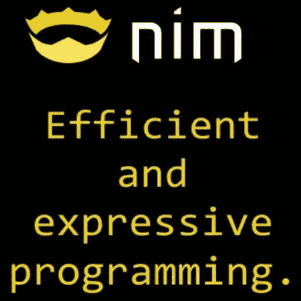
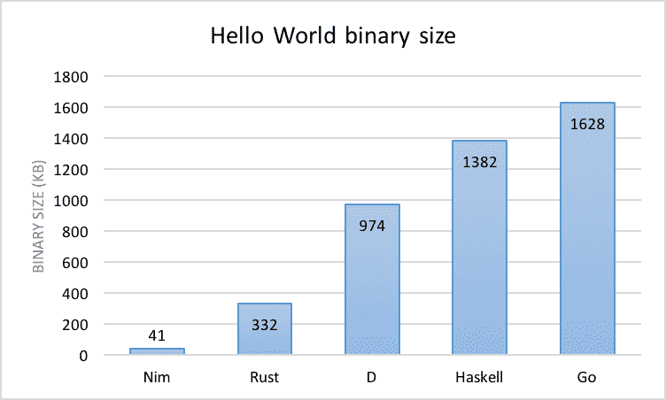
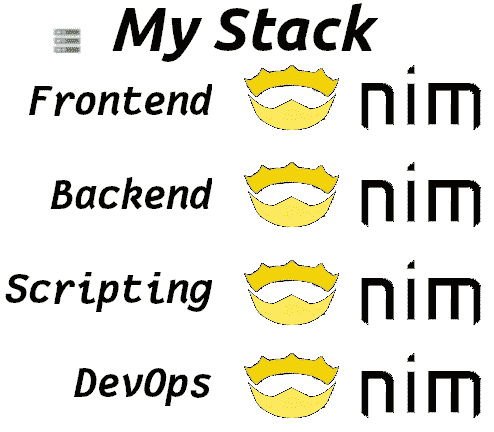

# TLDR；西班牙语

> [https://dev . to/juancarlosaco/tldr-nim-en-Spanish-1 nim](https://dev.to/juancarlospaco/tldr-nim-en-spanish-1nim)

[](https://res.cloudinary.com/practicaldev/image/fetch/s--Aioj8dOH--/c_limit%2Cf_auto%2Cfl_progressive%2Cq_auto%2Cw_880/https://thepracticaldev.s3.amazonaws.com/i/t3oi35bp5v2ls0b3rrnk.png)

Nim 是一种新的可推断的静态类型编译编程语言，
感觉像 Python，运行为 c，
在前端和后端运行，
编译为 c，C++，JavaScript，ObjectiveC，NodeJS。

目标是编译 Python，LLVM，Vulkan，OpenGL，WebAssembly，Dalvik 等。

允许在整个堆栈中使用 1 种语言的项目，
但具有明显的性能，资源较少，
具有非常完整的标准库，具有在线文档，
社区在软件包注册表中创建的库，
附带了一个有用的软件包管理员，

[](https://res.cloudinary.com/practicaldev/image/fetch/s--qiKDtNju--/c_limit%2Cf_auto%2Cfl_progressive%2Cq_auto%2Cw_880/https://thepracticaldev.s3.amazonaws.com/i/i2dw8k76d28eav1eksll.png)

你的代码编译并生成一个本机可执行文件，
，你可以复制粘贴到任何计算机上并工作。
nim 上的节目不需要特殊的“准备环境”。
Nim 中的程序不需要安装 nim 即可运行。

它通常比 Ruby、Rust、PHP 等语言编码少
编码较少，但性能较好。

编译器有一个自动文档生成简单优雅的 HTML，
取代码，阅读重构文本或 Markdown 中的注释，
生成 HTML 或 LaTex，使用 LaTex 可以生成 PDF。

# 大家好

```
echo "Hola Mundo" 
```

Enter fullscreen mode Exit fullscreen mode

[在这里用浏览器玩编码。](https://play.nim-lang.org/index.html?ix=1Llj)

如果 sos devops 或 SysAdmin 能够以解释的方式使用 Nim，
对于替换 BAT 或 PowerShell 或 Bash 脚本，
可能非常有用，因为同一脚本在所有平台上都运行，而不进行编译。
Nimscript 的语法与 nim 的语法相同，
所以没有什么需要从语法学习的，
可以检测硬件体系结构、操作系统以及我与 Linux 运行的距离。

如果你做 Python 但在浏览器中寻找运行 Python 的东西，
Nim 可能是一个选项，因为它编译 JavaScript，
并在没有额外重量或性能问题的情况下运行，
存在单前端库，并与浏览器 JavaScript 无缝集成，
也允许运行

[](https://res.cloudinary.com/practicaldev/image/fetch/s--r-4H8apE--/c_limit%2Cf_auto%2Cfl_progressive%2Cq_auto%2Cw_880/https://thepracticaldev.s3.amazonaws.com/i/jvrroehev64d7bf41ag7.png)

具有先进的特性，但反过来又容易学习，
因为语法类似 Python，如类型化和编译的 Python，
自带编码自聚焦编码器于编译器
(类似于`gofmt`或`autopep8`，也修正风格。

当你使用语言中将要改变的东西时，
在编译
(通常带有新语法或提示)时会显示彩色的抑郁信息。

他们将来销售的语言的新特点隐藏在实验编译参数的背后，
让你可以清楚地看到语言今天走向何方。

通过编译 c 标准，它允许 Nim 软件在几乎无法编译 c、
的任何地方运行，还允许与任何具有 c、
API 的东西实现透明的互操作性，提供了对软件预定淘汰的抵抗能力，
50 年前，您可以编译 c、
100 年前

是 100%自由软件，根据 MIT 许可证，这一切都在 Github，
Nim 这完全是用 Nim 写的，文档都在网上。

```
$ echo 'echo "Hola Mundo"' > hola.nim

$ nim c -r hola.nim          # C
Hola Mundo

$ du -h hola
20K     hola

$ nim cpp -r hola.nim        # C++
Hola Mundo

$ nim objc -r hola.nim       # ObjectiveC
Hola Mundo

$ nim c --os:windows hola.nim
$ wine hola.exe              # Windows
Hola Mundo

$ nim js -d:nodejs hola.nim  # NodeJS
$ nodejs hola.js
Hola Mundo

$ nim e hola.nim             # Interpretado (Sin Compilar)
Hola Mundo

$ nim js hola.nim            # Web (Frontend) 
```

Enter fullscreen mode Exit fullscreen mode

*   [访问 Nim 网站下载并了解更多信息-我...。](https://nim-lang.org/learn.html)
*   [敏捷](http://nimble.directory)
*   NimWC
*   西班牙语电报组
*   [电报英语组](https://t.me/nim_lang)

丹尼斯里奇是对的-我...。