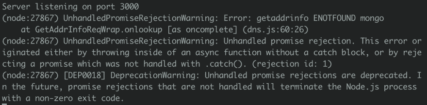
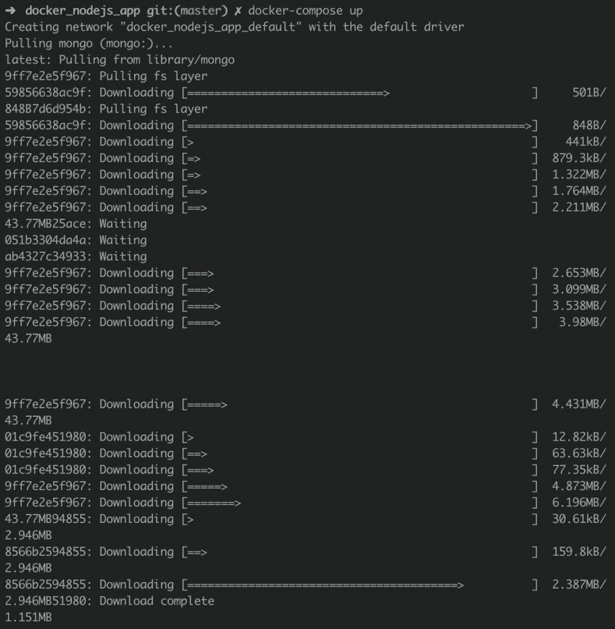
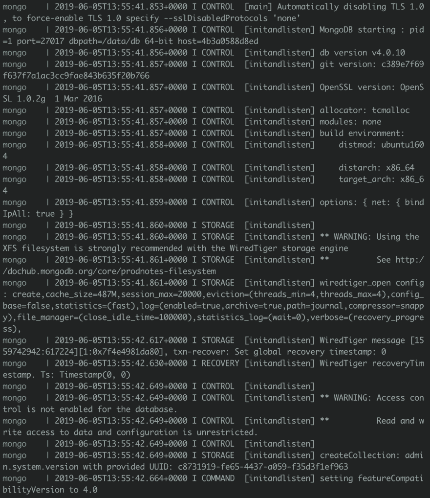
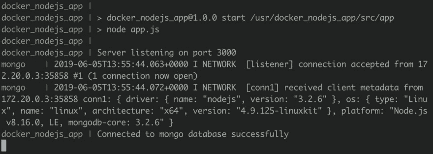

# How to create a Node App within a Docker container with Mongo

> 原文：[https://dev.to/wchr/how-to-create-a-node-app-within-a-docker-container-with-mongo-5886](https://dev.to/wchr/how-to-create-a-node-app-within-a-docker-container-with-mongo-5886)

# Introduction

This is the second part of the series for [Docker meets NodeJS](https://hashnode.com/series/docker-meets-nodejs-cjvzfbat20003j7s1gx8dk98a) where we are going to introduce a database service, *MongoDB*, which we will connect to it with our Node app through a network.

> **Note**: Since we are introducing a new database service, by doing so this also makes our Node app also a service
> 
> **Note**: Ensure you go through the [first part of this series](https://dev.to/tesh254/how-to-create-a-node-app-within-a-docker-container-2kip) since it contains a huge part of how we created our Node app within a Docker container.
> 
> **Note**: Remember to clone the `docker_nodejs_app` repo [here](https://github.com/werickblog/docker_nodejs_app)

# Getting Started

## Recap

On the first part of the series we were able to:

*   Setup the project
*   Create a Node container

## Goals

We should be able to:

*   Add a MongoDB service in which we will be able to access through a network.

## About Services

Services basically are a group of containers, they make it easier to scale your application.

## Lets Code

In order to connect to our Mongo database with Node, we need to install a new dependency called `Mongoose`.

```
$ npm install mongoose --save 
```

<svg width="20px" height="20px" viewBox="0 0 24 24" class="highlight-action crayons-icon highlight-action--fullscreen-on"><title>Enter fullscreen mode</title></svg> <svg width="20px" height="20px" viewBox="0 0 24 24" class="highlight-action crayons-icon highlight-action--fullscreen-off"><title>Exit fullscreen mode</title></svg>

Let's connect our Node App to a database that does not exist by adding a couple of lines in our `app.js` file.

```
 // Connect to database
mongoose.connect("mongodb://mongo:27017/docker_nodejs_app", {
  useNewUrlParser: true,
  useCreateIndex: true
});

mongoose.connection.on("open", err => {
  if (err) console.log(chalk.red("Error connecting to our mongo database"));
  console.log(chalk.green("Connected to mongo database successfully"));
}); 
```

<svg width="20px" height="20px" viewBox="0 0 24 24" class="highlight-action crayons-icon highlight-action--fullscreen-on"><title>Enter fullscreen mode</title></svg> <svg width="20px" height="20px" viewBox="0 0 24 24" class="highlight-action crayons-icon highlight-action--fullscreen-off"><title>Exit fullscreen mode</title></svg>

> **Note**: If you have used mongoose and mongo before, your local or mlab connection URL might look like this `mongodb://localhost:27017/<your_db>` or `mongodb://<dbuser>:<dbpassword>@ds115595.mlab.com:15595/<your_db>` respectively and not `mongodb://mongo:27017`. This is because our mongo database service will be called `mongo` and since it exists in a docker container and not locally on your drive we will expose the port 27017 in its container.

Your `app.js` file should look like this

```
 "use strict"; // Ensures our code is compiled in strict mode

// Lets import our web framework
var express = require("express");
var mongoose = require("mongoose");

// Initialise our app
const app = express();

// Lets set our port
/**
 * The default port number is `3000`
 * Take note on that as we will come to that.
 */
app.set("port", 3000);

// Connect to database
mongoose.connect("mongodb://mongo:27017/docker_nodejs_app", {
  useNewUrlParser: true,
  useCreateIndex: true
});

mongoose.connection.on("open", err => {
  if (err) console.log("Error connecting to our mongo database");
  console.log("Connected to mongo database successfully");
});

/**
 * To ensure works as it should we will create a
 * simple endpoint to return a json response
 */

// Define our json response
const data = {
  blog_name: "docker_nodejs_app",
  blog_author: "wachira (tesh254)",
  blog_author_twitter: "@wachira_dev"
};

// Define out GET request endpoint
app.get("/", (req, res) => {
  res.status(200).json(data);
});

// Initialize our server
app.listen(app.get("port"), () => {
  console.log(`Server listening on port ${app.get("port")}`);
}); 
```

<svg width="20px" height="20px" viewBox="0 0 24 24" class="highlight-action crayons-icon highlight-action--fullscreen-on"><title>Enter fullscreen mode</title></svg> <svg width="20px" height="20px" viewBox="0 0 24 24" class="highlight-action crayons-icon highlight-action--fullscreen-off"><title>Exit fullscreen mode</title></svg>

If we run our Node app we should get an error

[](https://res.cloudinary.com/practicaldev/image/fetch/s--eCe1dQpN--/c_limit%2Cf_auto%2Cfl_progressive%2Cq_auto%2Cw_880/https://cdn.hashnode.com/res/hashnode/image/upload/v1559743693026/2hpHOHzbW.png)

### Create our MongoDB service

In order to build and run a couple of services, we need to introduce a `docker-compose.yml` file that contains certain configurations that will allow that.

```
$ touch docker-compose.yml 
```

<svg width="20px" height="20px" viewBox="0 0 24 24" class="highlight-action crayons-icon highlight-action--fullscreen-on"><title>Enter fullscreen mode</title></svg> <svg width="20px" height="20px" viewBox="0 0 24 24" class="highlight-action crayons-icon highlight-action--fullscreen-off"><title>Exit fullscreen mode</title></svg>

Type this in the `YAML` file

```
 # Defines our composer file version
version: "2.2"
# Define our services 
services: 
  # This is our nodejs app built using the Dockerfile
  app:
    # The name of our node app container
    container_name: docker_nodejs_app
    # Restarts our node app whenever it fails
    restart: always
    # Builds the node app docker container from the local -
    # Docker file we created
    build: .
    # Exposes the necessary ports that our node app uses
    ports:
      - "3000:3000"
    # All the services our node app will link to -
    # which in our case is only mongo
    # You can other services such as a Redis
    links:
      # The name should be similar to the service you will build
      - mongo
  # Our database service called mongo
  mongo:
    # The name of the database container, NOTE: it is similar to the name provided
    container_name: mongo
    # Builds a mongo image from the docker repository
    image: mongo
    # Exposes the ports that Mongo uses
    ports:
      - "27017:27017" 
```

<svg width="20px" height="20px" viewBox="0 0 24 24" class="highlight-action crayons-icon highlight-action--fullscreen-on"><title>Enter fullscreen mode</title></svg> <svg width="20px" height="20px" viewBox="0 0 24 24" class="highlight-action crayons-icon highlight-action--fullscreen-off"><title>Exit fullscreen mode</title></svg>

> To run our configurations we will use a `docker-compose` command...wait where did this come from? 😳

The command `docker-compose` comes with the Docker software, it executes the configurations in the `docker-compose.yml` file.

To build and run our app and mongo services, type this in your terminal

```
$ docker-compose up 
```

<svg width="20px" height="20px" viewBox="0 0 24 24" class="highlight-action crayons-icon highlight-action--fullscreen-on"><title>Enter fullscreen mode</title></svg> <svg width="20px" height="20px" viewBox="0 0 24 24" class="highlight-action crayons-icon highlight-action--fullscreen-off"><title>Exit fullscreen mode</title></svg>

What happens next will take a bit longer...😇...Free time...maybe make yourself a cup of coffee ☕️ or check out [Twitter](https://twitter.com/wachira_dev)

### What happens next, Docker:

*   Pulls the Mongo image from the remote Docker repository
*   Downloads Mongo into Dockers cache
    [](https://res.cloudinary.com/practicaldev/image/fetch/s--v5RX35NY--/c_limit%2Cf_auto%2Cfl_progressive%2Cq_auto%2Cw_880/https://cdn.hashnode.com/res/hashnode/image/upload/v1559744288114/gSDIXuWgH.png)

*   Run instances of mongo

[](https://res.cloudinary.com/practicaldev/image/fetch/s--Ym8-eeyV--/c_limit%2Cf_auto%2Cfl_progressive%2Cq_auto%2Cw_880/https://cdn.hashnode.com/res/hashnode/image/upload/v1559744349795/4H-CFoEpn.png)

[](https://res.cloudinary.com/practicaldev/image/fetch/s--7U2LKaH8--/c_limit%2Cf_auto%2Cfl_progressive%2Cq_auto%2Cw_880/https://cdn.hashnode.com/res/hashnode/image/upload/v1559744361147/wHFCdJeoh.png)

*   Builds our Node app
*   Runs our server and connects to the Mongo database successfully.

[](https://res.cloudinary.com/practicaldev/image/fetch/s--08V3cN98--/c_limit%2Cf_auto%2Cfl_progressive%2Cq_auto%2Cw_880/https://cdn.hashnode.com/res/hashnode/image/upload/v1559744382655/QNVMWv9bX.png)

### What next after a successful build?

You can test out the database by creating a couple of

*   POST requests to save data in the MongoDB database collection
*   GET requests to retrieve data from the database collection
*   PUT requests to update data in the database collection
*   DELETE requests to delete data in the database collection

## Summary

To summarise, in this post we have:

*   Connected to MongoDB database service successful
*   Introduction to the `docker-compose` command

## Next

In the next part:

*   We will host our application on Heroku
*   Push our repo to the Docker repository.
*   Other commands in Docker that will make your experience worthwhile such as:

## Extras

*   Link to repo [https://github.com/werickblog/docker_nodejs_app](https://github.com/werickblog/docker_nodejs_app)

*   Link to download NodeJS [https://nodejs.org/en/download/](https://nodejs.org/en/download/)

*   Link to download Docker [https://www.docker.com/get-started](https://www.docker.com/get-started)

*   Understanding what docker is [https://docs.docker.com/engine/docker-overview/](https://docs.docker.com/engine/docker-overview/)