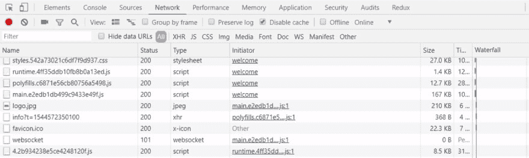

# 角度为 8°的延迟加载

> 原文：<https://dev.to/nishugoel/lazy-loading-in-angular-8-5g54>

我们都知道延迟加载是 Angular Routing 最有用的概念之一，对于我们这些一直在使用 Angular 的人来说，我们知道它如何降低大文件的大小。这是通过延迟加载偶尔需要的文件来实现的。

为了通过在需要时异步加载路由的功能模块来开始延迟加载，我们转到路由配置并使用属性 loadChildren。让我们看看这个属性是做什么的。

```
 {path: ‘user’, loadChildren: ‘./users/user.module#UserModule’} 
```

<svg width="20px" height="20px" viewBox="0 0 24 24" class="highlight-action crayons-icon highlight-action--fullscreen-on"><title>Enter fullscreen mode</title></svg> <svg width="20px" height="20px" viewBox="0 0 24 24" class="highlight-action crayons-icon highlight-action--fullscreen-off"><title>Exit fullscreen mode</title></svg>

此属性 loadChildren 用于延迟加载路由，与子路由等无关。

让我们来分解一下财产的价值意味着什么。loadChildren 属性接受一个字符串值，该值包含到功能模块的路由，后跟一个哈希符号，然后是功能模块的名称。

现在，当路由被激活时，这个 loadChildren 属性将被激活并加载所请求的模块。然后，它将加载所请求的组件，并显示该组件的模板。

一旦我们配置了这个属性，我们就去控制台查看生成了哪些文件。

我们将看到生成了一个额外的包文件。
现在，如果您转到控制台中的“网络”选项卡，查看路由到用户模块时生成的文件，您会看到一个用某个数值创建的额外文件，可能如下所示:

[](https://res.cloudinary.com/practicaldev/image/fetch/s--lPzo5fLW--/c_limit%2Cf_auto%2Cfl_progressive%2Cq_auto%2Cw_880/https://thepracticaldev.s3.amazonaws.com/i/oziumdbc6dq22nlx1jvg.png)

这就是使用特定功能模块的路由配置中的 loadChildren 功能实现延迟加载的方式。并且这仅在导航到该路线并且请求数据时才创建另一个包文件。

这就是我们到目前为止处理惰性加载的方式，对吗？

但是…
如果我们再看一下路由配置，

```
 {path: ‘user’, loadChildren: ‘./users/user.module#UserModule’} 
```

<svg width="20px" height="20px" viewBox="0 0 24 24" class="highlight-action crayons-icon highlight-action--fullscreen-on"><title>Enter fullscreen mode</title></svg> <svg width="20px" height="20px" viewBox="0 0 24 24" class="highlight-action crayons-icon highlight-action--fullscreen-off"><title>Exit fullscreen mode</title></svg>

loadChildren 属性接受一个字符串，这意味着即使在编写代码时出现错误的模块名称或打字错误，Angular 也不会知道有什么问题，而是将所有内容作为字符串接受，直到我们尝试构建它。

因此，假设我们将配置写成:

```
 {path: ‘user’, loadChildren: ‘./users/user.module#UserModulee’}, 
```

<svg width="20px" height="20px" viewBox="0 0 24 24" class="highlight-action crayons-icon highlight-action--fullscreen-on"><title>Enter fullscreen mode</title></svg> <svg width="20px" height="20px" viewBox="0 0 24 24" class="highlight-action crayons-icon highlight-action--fullscreen-off"><title>Exit fullscreen mode</title></svg>

有了额外的' e '，它将不会抛出任何错误，认为它是字符串的一部分。

因此，
Angular 8 在我们的路由器配置中提出了对动态导入的支持。这意味着我们使用 import 语句来延迟加载模块，这将被 IDEs、webpack 等理解。

因此，当您更新到 Angular 8 时，这将自动适应您的应用程序中的变化。

现在，如果您看一看在这个新的路由配置中，延迟加载是如何完成的，您会看到:

```
 {path: ‘user’, loadChildren: () => import(‘./users/user.module’).then(m => m.UserModule)}; 
```

<svg width="20px" height="20px" viewBox="0 0 24 24" class="highlight-action crayons-icon highlight-action--fullscreen-on"><title>Enter fullscreen mode</title></svg> <svg width="20px" height="20px" viewBox="0 0 24 24" class="highlight-action crayons-icon highlight-action--fullscreen-off"><title>Exit fullscreen mode</title></svg>

现在你的编辑器，假设 VSCode 理解这个语法，如果有错误，它会识别出来，我们不必等到编译时才意识到错误。

这个新语法现在意味着 loadChildren 是一个函数，它将在试图访问用户模块时执行。这将异步加载导入语句并实现模块。

斯蒂芬·弗鲁恩在这段视频中解释了这种新的惰性加载方式:[https://www.youtube.com/watch?v=jPXl7sCPCOA](https://www.youtube.com/watch?v=jPXl7sCPCOA)