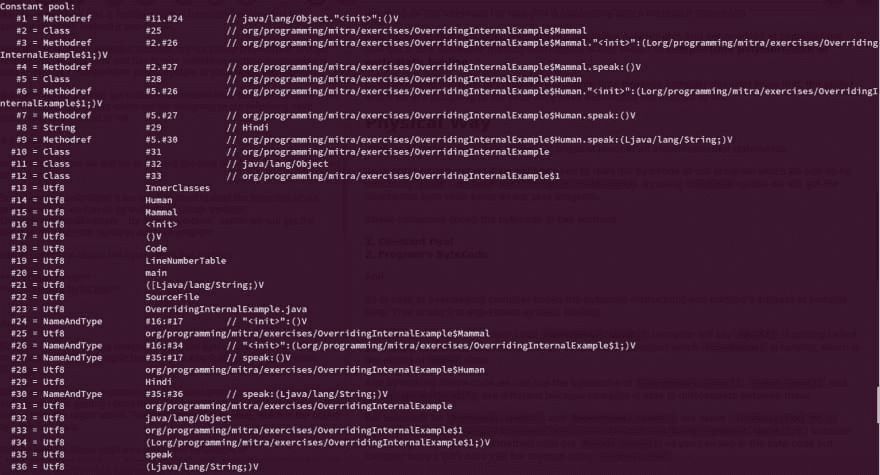
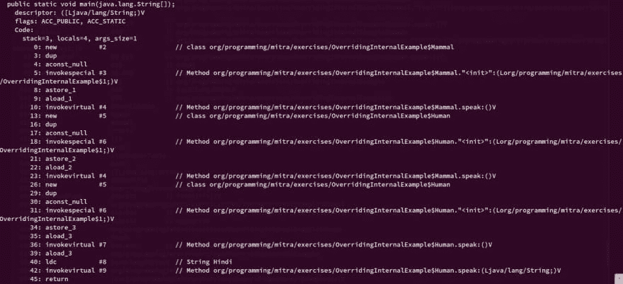
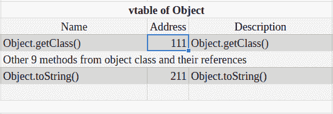
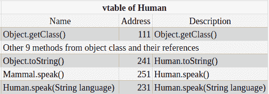

# JVM 如何在内部处理多态性(方法重载和覆盖)

> 原文：<https://dev.to/njnareshjoshi/how-does-jvm-handle-polymorphism-method-overloading-and-overriding-internally-2m26>

在我以前的文章[关于方法重载 Vs 方法覆盖的一切](https://programmingmitra.blogspot.in/2017/05/everything-about-method-overloading-vs-method-overriding.html)中，我已经讨论了方法重载和覆盖，它们的规则和区别。

在本文中，我们将看到 JVM 如何处理方法重载和内部重写，JVM 如何识别应该调用哪个方法。

让我们以之前博客中的父类`Mammal`和子类`Human`为例来更清楚地理解它。

```
public class OverridingInternalExample {

    private static class Mammal {
        public void speak() { System.out.println("ohlllalalalalalaoaoaoa"); }
    }

    private static class Human extends Mammal {

        @Override
        public void speak() { System.out.println("Hello"); }

        // Valid overload of speak
        public void speak(String language) {
            if (language.equals("Hindi")) System.out.println("Namaste");
            else System.out.println("Hello");
        }

        @Override
        public String toString() { return "Human Class"; }

    }

    //  Code below contains the output and bytecode of the method calls
    public static void main(String[] args) {
        Mammal anyMammal = new Mammal();
        anyMammal.speak();  // Output - ohlllalalalalalaoaoaoa
        // 10: invokevirtual #4 // Method org/programming/mitra/exercises/OverridingInternalExample$Mammal.speak:()V

        Mammal humanMammal = new Human();
        humanMammal.speak(); // Output - Hello
        // 23: invokevirtual #4 // Method org/programming/mitra/exercises/OverridingInternalExample$Mammal.speak:()V

        Human human = new Human();
        human.speak(); // Output - Hello
        // 36: invokevirtual #7 // Method org/programming/mitra/exercises/OverridingInternalExample$Human.speak:()V

        human.speak("Hindi"); // Output - Namaste
        // 42: invokevirtual #9 // Method org/programming/mitra/exercises/OverridingInternalExample$Human.speak:(Ljava/lang/String;)V
    }
} 
```

<svg width="20px" height="20px" viewBox="0 0 24 24" class="highlight-action crayons-icon highlight-action--fullscreen-on"><title>Enter fullscreen mode</title></svg> <svg width="20px" height="20px" viewBox="0 0 24 24" class="highlight-action crayons-icon highlight-action--fullscreen-off"><title>Exit fullscreen mode</title></svg>

这个答案我们可以用两种方式来回答，逻辑方式和物理方式，我们来看看逻辑方式。

## 合乎逻辑的方式

逻辑上我们可以说，在编译阶段调用方法被认为是来自引用类型。但是在执行时，将从引用持有的对象中调用方法。

例如，在`humanMammal.speak();`行，编译器会说`Mammal.speak()`正在被调用，因为`humanMammal`的类型是`Mammal`。但是在执行过程中，JVM 知道`humanMammal`持有一个`Human's`对象，所以`Human.speak()`将被调用。

嗯，这很简单，直到我们把它仅仅停留在概念层面。一旦我们怀疑 JVM 内部是如何处理这些的？或者 JVM 如何计算应该调用哪个方法。

此外，我们知道重载方法不被称为多态，而是在编译时被解析，这就是为什么有时方法重载也被称为**编译时多态或早期/静态绑定**。

但是被覆盖的方法会在运行时被解析，因为编译器不知道，我们赋给引用的对象是否覆盖了方法。

## 物理方式

在本节中，我们将尝试找出所有上述语句的物理证据，为了找到它们，我们将读取程序的字节码，这可以通过执行`javap -verbose OverridingInternalExample`来完成。通过使用`-verbose`选项，我们将获得与 Java 程序相同的描述性字节码。

上面的命令显示了字节码的两个部分

**1。常量池:**保存了我们程序执行所需的几乎所有东西，例如方法引用(`#Methodref`)、类对象(`#Class`)、字符串文字(`#String`)，请点击图片放大。

[](////2.bp.blogspot.com/-q3LKSKxk4B4/WT67WYY0gaI/AAAAAAAALSQ/ovoyKut4JwQU4nXBtTQntmSrgyf7HzojQCK4B/s1600/java-constant-pool-method-table.png)

**2。程序的字节码**:可执行的字节码指令，请点击图片放大。

[](////4.bp.blogspot.com/-3J5Gu7HRR3U/WT67qoWNaHI/AAAAAAAALSY/mx_27LmbToA0JE151OjXF0qxHtzGfBNVACK4B/s1600/method-overloading-overriding-internals-byte-code.png)

## 为什么方法重载被称为静态绑定

在前面提到的代码`humanMammal.speak()`中，编译器会说`speak()`正被`Mammal`调用，但在执行时，它将被`humanMammal`持有的对象调用，该对象是`Human`类的对象。

通过查看上面的代码和图片，我们可以看到`humanMammal.speak()`、`human.speak()`和`human.speak("Hindi")`的字节码完全不同，因为编译器能够根据类引用来区分它们。

因此，在方法重载的情况下，编译器能够在编译时识别字节码指令和方法的地址，这就是为什么它也被称为**静态绑定或编译时多态性**。

## 为什么方法覆盖被称为动态绑定

`anyMammal.speak()`和`humanMammal.speak()`的字节码是相同的(`invokevirtual #4 // Method org/programming/mitra/exercises/OverridingInternalExample$Mammal.speak:()V`)，因为根据编译器，这两个方法都在`Mammal`引用上被调用。

那么现在问题来了，如果两个方法调用有相同的字节码，那么 JVM 如何知道调用哪个方法呢？

嗯，答案隐藏在字节码本身中，根据 JVM 规范，它是`invokevirtual`指令

> invokevirtual 调用对象的实例方法，在对象的(虚拟)类型上调度。这是 Java 编程语言中正常的方法分派。

JVM 使用`invokevirtual`指令来调用 C++虚拟方法的 Java 等价物。在 C++中，如果我们想在另一个类中覆盖一个方法，我们需要将它声明为`virtual`，但是在 Java 中，默认情况下所有方法都是虚拟的(除了 final 和 static 方法)，因为我们可以覆盖子类中的每个方法。

操作`invokevirtual`接受指向方法引用调用的指针(`#4`常量池中的索引)

```
invokevirtual #4   // Method org/programming/mitra/exercises/OverridingInternalExample$Mammal.speak:()V 
```

<svg width="20px" height="20px" viewBox="0 0 24 24" class="highlight-action crayons-icon highlight-action--fullscreen-on"><title>Enter fullscreen mode</title></svg> <svg width="20px" height="20px" viewBox="0 0 24 24" class="highlight-action crayons-icon highlight-action--fullscreen-off"><title>Exit fullscreen mode</title></svg>

并且方法引用#4 再次引用方法名和类引用

```
#4 = Methodref   #2.#27   // org/programming/mitra/exercises/OverridingInternalExample$Mammal.speak:()V
#2 = Class   #25   // org/programming/mitra/exercises/OverridingInternalExample$Mammal
#25 = Utf8   org/programming/mitra/exercises/OverridingInternalExample$Mammal
#27 = NameAndType   #35:#17   // speak:()V
#35 = Utf8   speak
#17 = Utf8 
```

<svg width="20px" height="20px" viewBox="0 0 24 24" class="highlight-action crayons-icon highlight-action--fullscreen-on"><title>Enter fullscreen mode</title></svg> <svg width="20px" height="20px" viewBox="0 0 24 24" class="highlight-action crayons-icon highlight-action--fullscreen-off"><title>Exit fullscreen mode</title></svg>

所有这些引用组合起来用于获取对方法和类的引用，在该方法和类中可以找到该方法。JVM 规范中也提到了这一点

> Java 虚拟机不要求对象 4 有任何特定的内部结构。

书签 4 表示

> 在 Java 虚拟机的一些 Oracle 实现中，对类实例的引用是指向句柄的指针，句柄本身是一对指针:一个指向包含对象方法的表，一个指向表示对象类型的类对象，另一个指向从堆中为对象数据分配的内存。

这意味着每个引用变量都有两个隐藏的指针

1.  一个指向同样保存对象方法的表的指针和一个指向类对象的指针。例如[speak()，speak(String)类对象]
2.  一个指针，指向在堆上为对象数据分配的内存，例如实例变量的值。

但是问题又来了，如何在内部做到这一点？嗯，没有人能回答这个问题，因为它取决于 JVM 的实现，并且因 JVM 而异。

从上面的陈述中，我们可以得出结论，一个对象引用间接持有一个表的引用/指针，该表持有该对象的所有方法引用。Java 从 C++中借用了这个概念，这个表有各种各样的名字，比如[虚方法表( **VMT** )、虚函数表(** vftable**)、虚表( **vtable** )、调度表](https://en.wikipedia.org/wiki/Virtual_method_table)。

我们不能确定`vtable`是如何在 Java 中实现的，因为它依赖于 JVM。但是我们可以预期它将遵循与 C++相同的策略，其中`vtable`是一个类似数组的结构，它保存方法名和它们在数组索引上的引用。每当 JVM 试图执行一个虚拟方法时，它总是向`vtable`询问它的地址。

每个类只有一个`vtable`,这意味着它是唯一的，对于与`Class`对象相似的类中的所有对象都是一样的。我已经在我的文章[中讨论了更多关于`Class`对象的内容，为什么外部 Java 类不能是静态的](https://programmingmitra.blogspot.in/2016/10/why-outer-java-class-cant-be-static.html)和[为什么 Java 是纯面向对象语言或者为什么不是](https://programmingmitra.blogspot.in/2016/06/why-java-is-purely-object-oriented-or-why-not.html)。

因此`Object`类只有一个`vtable`,它包含所有 11 个方法(如果我们不计算 registerNatives)和对它们各自方法体的引用。

[](////4.bp.blogspot.com/-OmB72b_upTM/WT7PkecSHMI/AAAAAAAALS0/nH5hmwdBMwMb8g-WycCsPpfn8bkh-pq3wCK4B/s1600/vtable-of-object.png)

当 JVM 将`Mammal`类加载到内存中时，它为它创建一个`Class`对象，并创建一个`vtable`,其中包含来自 object 类的 vtable 的具有相同引用的所有方法(因为`Mammal`没有覆盖来自 Object 的任何方法),并为`speak`方法添加一个新条目。

[](////1.bp.blogspot.com/-asDExe0Qg18/WT7PuZdv0hI/AAAAAAAALS8/rkdwAGMRrAISOe_2mIeXTg8PTUCFxDTRQCK4B/s1600/vtable-of-mammal.png)

现在轮到了`Human`类，现在 JVM 将把所有条目从`Mammal`类的`vtable`复制到`Human`类的`vtable`，并为过载版本的`speak(String)`添加一个新条目。

JVM 知道`Human`类覆盖了两个方法，一个是来自`Object`的`toString()`，另一个是来自`Mammal`的`speck()`。现在不是用更新的引用为这些方法创建新的条目。JVM 将修改对相同索引上已经存在的方法的引用，并保持相同的方法名。

[](////3.bp.blogspot.com/-DuoCzjUxQ8M/WT7Ru7OXi9I/AAAAAAAALTM/OHsjsEL9Bx83siSo3uKWSa5tUiL5zOiRgCK4B/s1600/vtable-of-human.png)

`invokevirtual`使得 JVM 将方法引用`#4`处的值，不是作为地址，而是作为在当前对象的`vtable`中查找的方法名。

我希望现在已经有一点清楚了，JVM 如何混合`constant pool`条目和`vtable`来决定它要调用哪个方法。

你可以在这个 [Github 库](https://github.com/njnareshjoshi/exercises/blob/master/src/org/programming/mitra/exercises/OverridingInternalExample.java)上找到完整的代码，请随时提供你的宝贵反馈。