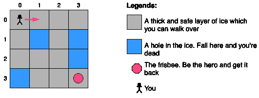
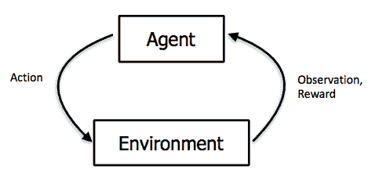

# 强化学习简介:冰封湖的例子

> 原文：<https://dev.to/rodolfomendes/introduction-to-reinforcement-learning-the-frozen-lake-example-13ie>

让我们通过一个简单的例子来理解强化学习是如何工作的。让我们玩一个叫冰封湖的游戏。假设冬天你和朋友在公园玩飞盘。你们中的一个人把飞盘扔得太远，以至于飞盘掉进了一个结冰的湖里。你的任务是走过结冰的湖去拿回飞盘，但是要小心不要掉进冰冷的水里。

<figure>

<figcaption>The Frozen Lake game. Recover the frisbee and be the hero. Just take care to not fall into a hole in the ice.</figcaption>

</figure>

通过编写一个简单的算法，给出到达飞盘的正确方向，我们可以很容易地创建一个总是赢得这个游戏的机器人。但那一点挑战性都没有，也不好玩。相反，我们希望创建一个代理，它可以在多次玩游戏的同时学习飞盘的路径。

在强化学习范式中，学习过程是一个循环，在这个循环中，代理读取环境的状态，然后执行一个动作。然后环境返回它的新状态和一个奖励信号，表明这个动作是否正确。该过程继续，直到环境达到终止状态，或者如果执行了最大数量的迭代。

<figure>

<figcaption>The agent-environment interaction loop.</figcaption>

</figure>

因此，训练我们的代理玩冰湖游戏的第一步是将游戏的每个方面建模为强化学习问题的组件。

## 环境

环境是我们的代理将与之交互的上下文的表示。它可以代表真实世界的一个方面，例如股票市场或街道，也可以是一个完全虚拟的环境，例如游戏。在任一情况下，环境定义了代理可以接收的状态和奖励，以及代理可以针对每个状态执行的可能动作。在我们的例子中，环境是冰湖游戏，它由两种类型的方格组成:

*   灰色方块，代表你可以走过的安全厚冰层。
*   蓝色方块代表冰洞。

英雄可以在格子里朝四个方向移动(上、下、右、左)。如果你够到飞盘，你就赢得了比赛，但是如果你掉进一个洞里，你就输了。

## 状态

状态是代理从环境中接收到的观察结果。这是代理接收关于环境的所有可用信息的方式。在我们的例子中，游戏的状态仅仅是角色在网格中的位置，它将由一对坐标(I，j)来表示。

## 动作

代理执行的操作可能会改变环境的状态。一个行为如何改变环境状态的所有规则都是环境内部的。对于给定的状态，代理可以选择它的下一个动作，但是它不能控制这个动作将如何影响环境。对于冰湖的例子，代理的可用动作是我们的英雄可以移动的四个方向:上、右、下和左。

## 奖励

如果一个行动是正确的或不正确的，奖励信号给代理人。在我们的例子中，当英雄到达飞盘时，环境返回+1，如果英雄掉进洞里，环境返回-1。每隔一种情况都被认为是中性的，所以环境返回 0(零)。

## 玩法

游戏从(0，0)位置的英雄开始。从这个状态开始，有两种可能的动作，向右移动或者向下移动。如果代理人选择向右移动，那么新的状态将是(0，1)，代理人将获得 0(零)的奖励，因为这是一个中性策略。从位置(0，1)开始，有三种可能的移动:向左、向右和向下。假设代理选择下移，那么新的状态将是位置(1，1)。但是，这个位置是冰窟窿，意味着代理人输了比赛。所以代理人收到了-1 的惩罚，游戏结束。该顺序如下表所示:

| **当前状态* * | **行动* * | **下一个状态* * | **奖励* * | * *游戏结束？** |
| (0, 0) | ➡️ | (0, 1) | Zero | 不 |
| (0, 1) | ⬇️ | (1, 1) | -1 | 是 |

状态(0，1)的另一个可能序列是英雄向右移动并到达状态(0，2)。从那里，英雄继续移动，直到它到达位置(3，2)，最后它移动到左边，到达位置(3，3)的飞盘，并获得+1 奖励。

| **当前状态* * | **行动* * | **下一个状态* * | **奖励* * | * *游戏结束？** |
| (0, 0) | ➡️ | (0, 1) | Zero | 不 |
| (0, 1) | ➡️ | (0, 2) | Zero | 不 |
| (0, 2) | ⬇️ | (1, 2) | Zero | 不 |
| (1, 2) | ⬇️ | (2, 2) | Zero | 不 |
| (2, 2) | ⬇️ | (3, 2) | Zero | 不 |
| (3, 2) | ➡️ | (3, 3) | +1 | 是 |

## 结论

通过一个简单的例子，我们学习了强化学习范式的基本概念。每当我们想要应用强化学习方法来解决问题时，我们总是必须划定环境、识别状态、可能的行动并设置适当的奖励。