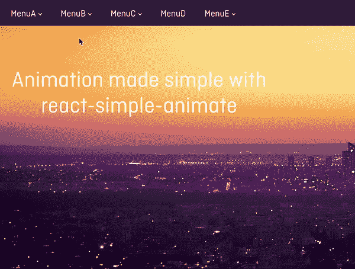
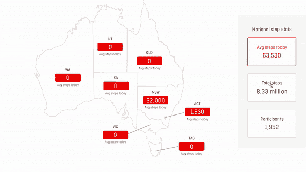

# React UI 动画变得简单

> 原文：<https://dev.to/bluebill1049/react-ui-animation-made-simple-5hbd>

是什么让 UI 优雅、性感、美丽？设计是脑海中首先闪现的东西。现代网络还有很长的路要走！是时候用动画把 web UI 推上一个新台阶了。我已经记不清有多少次我被 iOS 和 Android 的美丽动画所惊叹，而我的大多数 web 应用程序仍然是静态的和“无聊的”。静态设计就像一个美丽的👸在海报上。它不动也不和你互动！动画让静态 UI 活起来，生动起来。

回顾一下我的经历，切换(显示/隐藏)一个元素是 UI 中最常见的任务之一，我已经像下面这样做了很长时间……(可耻地)

```
import React from 'react';

export default function Component ({ isContentReady }) {
    return isContentReady ? <div>Content</div> : null;
} 
```

<svg width="20px" height="20px" viewBox="0 0 24 24" class="highlight-action crayons-icon highlight-action--fullscreen-on"><title>Enter fullscreen mode</title></svg> <svg width="20px" height="20px" viewBox="0 0 24 24" class="highlight-action crayons-icon highlight-action--fullscreen-off"><title>Exit fullscreen mode</title></svg>

我慢慢地从这个进化到 css 来执行切换

```
.wrapper {
  transition: 1s all;
}

.hide {
  opacity: 0;
}

.show {
  opacity: 1;
} 
```

<svg width="20px" height="20px" viewBox="0 0 24 24" class="highlight-action crayons-icon highlight-action--fullscreen-on"><title>Enter fullscreen mode</title></svg> <svg width="20px" height="20px" viewBox="0 0 24 24" class="highlight-action crayons-icon highlight-action--fullscreen-off"><title>Exit fullscreen mode</title></svg>

```
import React from 'react';
import styles from './styles.css'

export default function Component ({ isContentReady }) {
    return <div className={styles.wrapper}>
        <span className={isContentReady ? styles.show : styles.hide}>Content</span>
    </div>;
} 
```

<svg width="20px" height="20px" viewBox="0 0 24 24" class="highlight-action crayons-icon highlight-action--fullscreen-on"><title>Enter fullscreen mode</title></svg> <svg width="20px" height="20px" viewBox="0 0 24 24" class="highlight-action crayons-icon highlight-action--fullscreen-off"><title>Exit fullscreen mode</title></svg>

虽然这很有效，但当快速浏览代码时，我经常会忘记实际的风格是什么样子。我一直觉得这不是实现动画的最好方法。

在 React 中应该有更好更简单的方法来执行动画。所以我写了自己的。我向你介绍[反应-简单-动画](https://react-simple-animate.now.sh)。

```
import React from 'react';
import Animate from 'react-simple-animate';

export default function Component ({ isContentReady }) {
    return <Animate 
      play={isContentReady}
      start={{ opacity: 0 }}
      end={{ opacity: 1 }}
    >
      Content
    </Animate>;
} 
```

<svg width="20px" height="20px" viewBox="0 0 24 24" class="highlight-action crayons-icon highlight-action--fullscreen-on"><title>Enter fullscreen mode</title></svg> <svg width="20px" height="20px" viewBox="0 0 24 24" class="highlight-action crayons-icon highlight-action--fullscreen-off"><title>Exit fullscreen mode</title></svg>

在 react 中执行动画的声明式简单方法。我可以控制动画的开始和动画结束时应用的样式。在我看来这是一个很好的模式。万岁！

## 反应简单有生气

简单动画反应🤘就是要走的路！哦是的，这是我在使用开源软件多年后(也是第一次)值得为社区做贡献的 2c。我们的目标是让用户界面动画尽可能的简单

下面是我使用 react-simple-animate 实现的两个很棒的例子:

[](https://res.cloudinary.com/practicaldev/image/fetch/s--UiIDj8qR--/c_limit%2Cf_auto%2Cfl_progressive%2Cq_66%2Cw_880/https://thepracticaldev.s3.amazonaws.com/i/e48no00e8ur6ep89k903.gif)
[T6】](https://res.cloudinary.com/practicaldev/image/fetch/s--WEyMBdAA--/c_limit%2Cf_auto%2Cfl_progressive%2Cq_66%2Cw_880/https://thepracticaldev.s3.amazonaws.com/i/aky9ma7h6znpft1du6se.gif)

虽然 React 简单动画很棒，但它也有一些优点和缺点:

😍优点:

*   从内嵌样式 A 到样式 B 的简单动画
*   组件动画的声明性
*   轻松切换动画
*   支持动画序列
*   支持关键帧动画
*   它很小(2.2kb)

😑缺点:

*   它是为简单的动画制作的🤘

最好的方法就是自己尝试，你可以通过[演示](https://react-simple-animate.now.sh)来实现。

总的来说，我希望 [react-simple-animate](https://github.com/bluebill1049/react-simple-animate) 能够帮助每个人用漂亮的动画创建更优雅的 UI，当然，感谢您花时间阅读本文并试用这个包。🤘