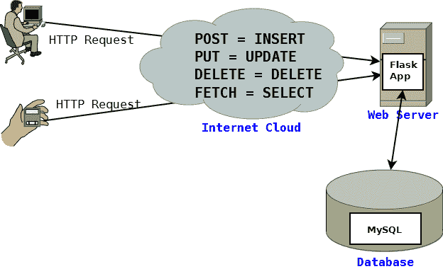

# 使用 sqlalchemy 的烧瓶配方 RESTful CRUD

> 原文：<https://dev.to/prahladyeri/flask-recipe-restful-crud-using-sqlalchemy-3731>

RESTful 应用程序现在很流行。当您的应用程序的用户群变得相当大，并且客户端可能从笔记本电脑到 android 设备再到 iOS 设备都不相同时，保持后端代码独立并只使用服务器来使用与基本 OLTP 事务相关的 HTTP 方法进行 RESTful 调用是有好处的:选择、插入、更新和删除。

像 [Firebase](https://en.wikipedia.org/wiki/Firebase#Realtime_Database) 这样受欢迎的第三方应用程序本质上为你提供了同样的东西——一个基于 REST 的数据库前端，可以使用简单的 HTTP 方法在线访问。但在本教程中，我们将学习如何使用 Python 的`flask`框架和`sqlalchemy`创建这样一个后端，这是一个轻量级但功能强大的 ORM 库，可以使用其灵活的 *sql 表达式语言*访问任何数据库。

[](https://res.cloudinary.com/practicaldev/image/fetch/s--BXR-Pl-E--/c_limit%2Cf_auto%2Cfl_progressive%2Cq_auto%2Cw_880/https://prahladyeri.com/uploads/old/restful-crud.png)

如果您开发自己的后端实现，而不是使用 firebase，这不仅会帮助您学习并成为更好的程序员，还会给您一个灵活的解决方案，您可以根据自己的需要进行扩展和更改。与其他昂贵的替代方案相比，在 Amazon EC2(或 Lambda)上托管自己的解决方案也要便宜得多。

与流行的想法相反，创建一个数据库不可知的后端并不困难，如上图所示。有了像`flask`这样最小且强大的 web 框架，结合`sqlalchemy`的力量，您可以在几分钟内启动并运行。事实上，我已经开发了一个名为[的原型版本，基本上只用了 172 行 Python 代码就做了和上面一样的事情。在我们继续学习本教程时，您可以参考 github 存储库，或者直接开始使用它。但是请确保在运行它之前安装了以下依赖项:](https://github.com/prahladyeri/tiddly)

```
pip install flask
pip install sqlalchemy 
```

<svg width="20px" height="20px" viewBox="0 0 24 24" class="highlight-action crayons-icon highlight-action--fullscreen-on"><title>Enter fullscreen mode</title></svg> <svg width="20px" height="20px" viewBox="0 0 24 24" class="highlight-action crayons-icon highlight-action--fullscreen-off"><title>Exit fullscreen mode</title></svg>

创建应用程序的第一步是创建数据库模型。一旦你进行了头脑风暴并决定了你需要什么样的表格和字段，你就可以创建一个类似这样的`models.py`源文件:

```
import sqlalchemy
from sqlalchemy import create_engine
from sqlalchemy import Column, String, Integer
from sqlalchemy.orm import sessionmaker
from sqlalchemy.ext.declarative import declarative_base

#TODO: Change as needed:
engine = create_engine("sqlite:///tiddly.db", echo=True)
Base = declarative_base()

Session = sessionmaker(bind=engine)
dbsession = Session()

class User(Base):
    __tablename__ = "user"
    id = Column(Integer, primary_key=True)
    email = Column(String)
    password = Column(String)
    name = Column(String)
    def repr(self):
        return "<User(name=%s, email=%s, )>" % (name, email)

class Dual(Base):
    __tablename__ = "dual"
    id = Column(Integer, primary_key=True)
    text = Column(String)
    def repr(self):
        return "<Dual(id=%s, text=%s, )>" % (id, text) 
```

<svg width="20px" height="20px" viewBox="0 0 24 24" class="highlight-action crayons-icon highlight-action--fullscreen-on"><title>Enter fullscreen mode</title></svg> <svg width="20px" height="20px" viewBox="0 0 24 24" class="highlight-action crayons-icon highlight-action--fullscreen-off"><title>Exit fullscreen mode</title></svg>

我在这里使用 sqlite 数据库作为例子，但是你可以使用你选择的任何一个。在几乎每个应用程序中，表格都是非常基本的，因为它用于身份验证。除此之外，我还创建了一个`dual`表来玩。

之后，创建包含我们的应用程序代码的第二个文件`app.py`。随模型一起定义以下导入语句，因为它们会非常方便:

```
import flask
from flask import request, jsonify, session
import sqlalchemy
from sqlalchemy import inspect, desc
import json
import models
from models import engine, dbsession 
```

<svg width="20px" height="20px" viewBox="0 0 24 24" class="highlight-action crayons-icon highlight-action--fullscreen-on"><title>Enter fullscreen mode</title></svg> <svg width="20px" height="20px" viewBox="0 0 24 24" class="highlight-action crayons-icon highlight-action--fullscreen-off"><title>Exit fullscreen mode</title></svg>

现在，唯一要做的事情就是将`HTTP`方法连接到它们各自的数据库操作。您可以为每个视图创建一个单独的视图功能，也可以为所有视图使用一个视图功能。在这个例子中，为了简单起见，我使用了一个函数。

```
@app.route("/<table_name>", methods=["POST", "PUT", "DELETE", "FETCH"])
def fetch(table_name):
    print("verb: %s, tablename: %s" % (request.method, table_name))
    if request.method == "POST" or request.method == "PUT":
        data = request.get_json(force=True)
        print("data:", data)
        try:
            TableClass = models.get_class_by_tablename(table_name)
            if TableClass == None: raise Exception("Table not found: %s" % table_name)
            if request.method == "POST": #insert data
                object = TableClass(**data)
                dbsession.add(object)
                dbsession.commit()
            else: #update data
                object = dbsession.query(TableClass).filter_by(**{"id":id}).first()
                if object == None: raise Exception("No data found.")
                #object.update(**data)
                for key in data.keys():
                    setattr(object, key, data[key])
                #dbsession.add(object)
                dbsession.commit()
            return jsonify({
                "status": "success",
                "id": object.id,
                })
        except Exception as e:
            return jsonify({
                "status": "error",
                "error": str(e),
                })
    elif request.method == "DELETE":
        try:
            TableClass = models.get_class_by_tablename(table_name)
            if TableClass == None: raise Exception("Table not found: %s" % table_name)
            object = dbsession.query(TableClass).filter_by(**{"id":id}).first()
            if object == None: raise Exception("No data found.")
            dbsession.delete(object)
            dbsession.commit()
            return jsonify({
                "status": "success",
                "id": object.id,
                })
        except Exception as e:
            return jsonify({
                "status": "error",
                "error": str(e),
                })
    elif request.method == "FETCH":
        try:
            data = request.get_json(force=True)
            data = json.loads(data)
            print("data: ", data)
            print("data-type: ", type(data))
            TableClass = models.get_class_by_tablename(table_name)
            if TableClass == None: raise Exception("Table not found: %s" % table_name)

            query = dbsession.query(TableClass).filter_by(**data['where'])
            if 'orderby' in data:
                for cname in data['orderby'].split(','):
                    reverse = False
                    if cname.endswith(' desc'):
                        reverse = True
                        cname = cname[:-5]
                    elif cname.endswith(' asc'):
                        cname = cname[:-4]
                    print("cname: ", cname)
                    column = getattr(TableClass, cname)
                    if reverse: column = desc(column)
                    query = query.order_by(column)
            if 'limit' in data:
                query = query.limit(data['limit'])
                query = query.offset(data['offset'])
            object = query.all()
            data = [object_as_dict(t) for t in object]
            return jsonify({
                "status": "success", 
                "data": data
                })
        except Exception as e:
            return jsonify({
                "status": "error",
                "error": str(e),
                })
    else:
        return jsonify({
            "status": "error", "error": "Unrecognized verb.",
            }) 
```

<svg width="20px" height="20px" viewBox="0 0 24 24" class="highlight-action crayons-icon highlight-action--fullscreen-on"><title>Enter fullscreen mode</title></svg> <svg width="20px" height="20px" viewBox="0 0 24 24" class="highlight-action crayons-icon highlight-action--fullscreen-off"><title>Exit fullscreen mode</title></svg>

对于`SELECT`动作，我使用了一个非标准的 HTTP 方法`FETCH`。这是因为如果使用`GET`方法，根据 HTTP 规范，不允许实际发布数据(在实际发布中，不要与`POST`方法混淆)。其他方法，即`POST`、`PUT`和`DELETE`是自明的，它们分别代表`INSERT`、`UPDATE`和`DELETE`动作。

可以看到，该应用很好地利用了 sqlalchemy 的 sql 表达式语言来动态查询任何类型的数据，不仅使用了常见的`where`子句，还使用了排序和分页(limit/offset)参数:

```
if 'orderby' in data:
    for cname in data['orderby'].split(','):
        reverse = False
        if cname.endswith(' desc'):
            reverse = True
            cname = cname[:-5]
        elif cname.endswith(' asc'):
            cname = cname[:-4]
        print("cname: ", cname)
        column = getattr(TableClass, cname)
        if reverse: column = desc(column)
        query = query.order_by(column)
if 'limit' in data:
    query = query.limit(data['limit'])
    query = query.offset(data['offset']) 
```

<svg width="20px" height="20px" viewBox="0 0 24 24" class="highlight-action crayons-icon highlight-action--fullscreen-on"><title>Enter fullscreen mode</title></svg> <svg width="20px" height="20px" viewBox="0 0 24 24" class="highlight-action crayons-icon highlight-action--fullscreen-off"><title>Exit fullscreen mode</title></svg>

前端使用 JSON 格式向后端发送它需要的任何内容，结果也是 JSON 格式的。例如，下面的 JSON 在使用`FETCH`方法提交到`/user`端点时，从用户表中返回记录，其中`name`字段匹配`admin`，并通过电子邮件以降序对结果进行排序。

```
{"where": {"name":"admin"}, "orderby": "email desc"} 
```

<svg width="20px" height="20px" viewBox="0 0 24 24" class="highlight-action crayons-icon highlight-action--fullscreen-on"><title>Enter fullscreen mode</title></svg> <svg width="20px" height="20px" viewBox="0 0 24 24" class="highlight-action crayons-icon highlight-action--fullscreen-off"><title>Exit fullscreen mode</title></svg>

将`limit`和`offset`子句添加到同一个中可以帮助前端进行分页。

```
{"where": {"name":"admin"}, "orderby": "email desc", "limit":2, "offset": 2} 
```

<svg width="20px" height="20px" viewBox="0 0 24 24" class="highlight-action crayons-icon highlight-action--fullscreen-on"><title>Enter fullscreen mode</title></svg> <svg width="20px" height="20px" viewBox="0 0 24 24" class="highlight-action crayons-icon highlight-action--fullscreen-off"><title>Exit fullscreen mode</title></svg>

用这种设计实现用户认证也很简单。为了简单起见，我没有在这个例子中这样做，但是你可以在 [github 代码](https://github.com/prahladyeri/tiddly)中找到它。

本教程和 github 上的所有代码都是许可和免费使用的。所以，享受编码吧，构建你自己的 RESTful CRUD 应用，并通过下面的评论让我知道它的进展！

*(原载于我的博客[prahladyeri.com](https://prahladyeri.com/blog/2017/06/flask-recipe-restful-crud-using-sqlalchemy.html))*