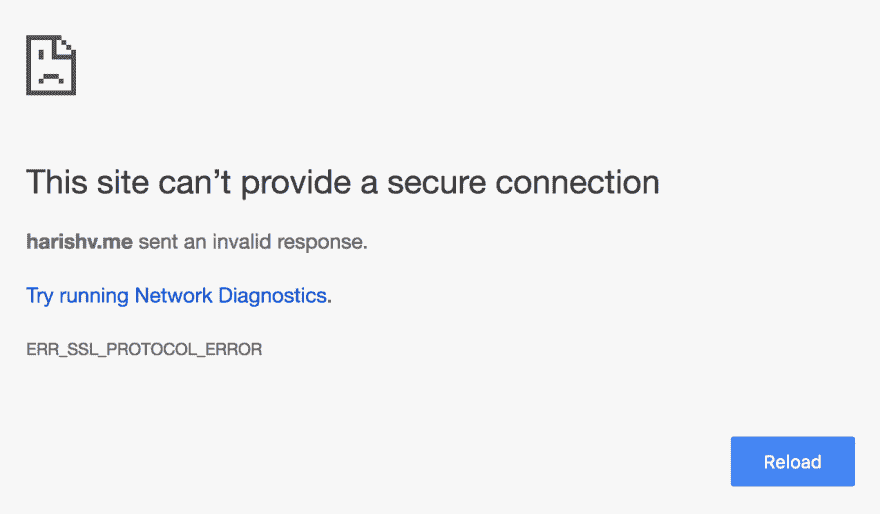

# 将 SSL 添加到您的站点(免费！)

> 原文：<https://dev.to/rightfrombasics/adding-ssl-to-your-site-free-1fa7>

以前见过错误图像吗？

这种情况发生在你访问我的个人网站， [harishv.me](https://harishv.me) ，前面有一个`www`。这会重定向到 [https://harishv.me](https://harishv.me) ，你将会看到这个`ERR_SSL_PROTOCOL_ERROR`，因为该网站无法提供安全连接。

如果你正在使用一个普通的 GitHub Pages 站点，这意味着它有一个带有`.github.io`的域，你可以简单地进入你正在使用的 GitHub 库，点击设置，一直向下直到你看到`Enforce HTTPS`。点击这将意味着您的网站将始终在 HTTPS 提供服务。

在研究免费 SSL 选项以添加到我的网站时，我发现您实际上可以使用免费计划下的 [Cloudflare 的](https://www.cloudflare.com/)名称服务器来为您的网站获取 SSL 证书。

简单来说，

1.  创建一个 [Cloudflare](https://www.cloudflare.com/) 帐户
2.  允许 Cloudflare 扫描您的网站记录
3.  检查并验证 Cloudflare 自动生成的记录是否与您的注册商页面上的记录相匹配(在我的情况下，这是[Namecheap.com](http://namecheap.com/))
4.  Cloudflare 现在将为您提供 2 个名称服务器，以便添加到您的帐户中
5.  登录 Namecheap
6.  点击域名列表
7.  选择您要添加 SSL 的域，然后单击右侧的`Manage`
8.  在名称服务器下，复制并粘贴 Cloudflare 提供给您的 2 个名称服务器
9.  完成后，在 Cloudflare 的概述选项卡上，单击`Recheck Nameservers`

Cloudflare 还在免费计划中提供了多达三个页面规则。有了这个，我们就可以在我们的网站上强制执行“https”。为了做到这一点，

1.  单击 Cloudflare 顶部的页面规则选项卡
2.  输入这个:`http://*<your-domain-name>.com/*`
3.  将设置添加到`Always Use HTTPS`
4.  点击`Save and Deploy`

星号就像通配符模式，这意味着任何以这种格式输入的网址将被强制使用 HTTPS 连接。例如， [www.harishv.me](//www.harishv.me) 或【http://harishv.me/blog】T2 现在都将与 HTTPS 一起强制执行。

这是所有的乡亲。立即使用 Cloudflare 获取您的免费 SSL 证书！

附言:如果你想知道为什么 HTTPS 如此重要，请等几天再看我的下一篇关于 HTTPS 的文章——有什么大不了的？。

* * *

### 找托管？

*   如果你想要最好的 Wordpress 托管，我强烈推荐 [Bluehost](https://www.bluehost.com/track/harishv/) 。当你[通过此链接](https://www.bluehost.com/track/harishv/)申请时，可以获得很大的折扣。
*   此外，当你[通过此链接](https://www.hostg.xyz/aff_c?offer_id=6&aff_id=2883)申请时，还可以获得 [Hostinger](https://www.hostg.xyz/aff_c?offer_id=6&aff_id=2883) 的大幅折扣。

这两项服务都提供了良好的正常运行时间和客户服务。哦，我有没有提到-你得到一个免费的域名与 Bluehost 和 Hostinger！