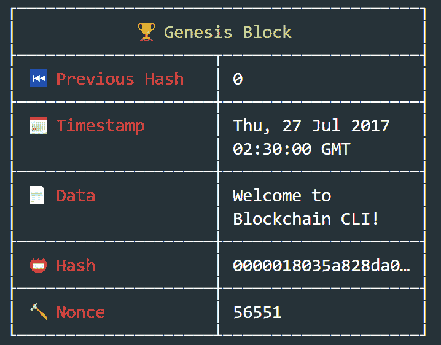
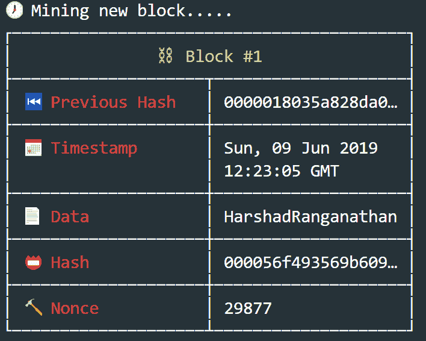
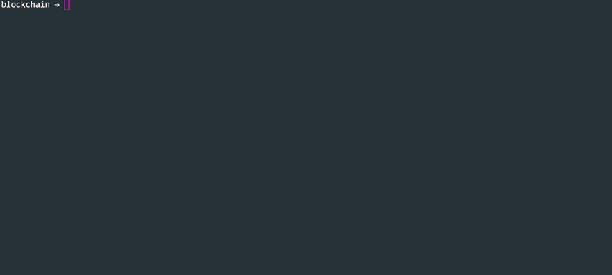
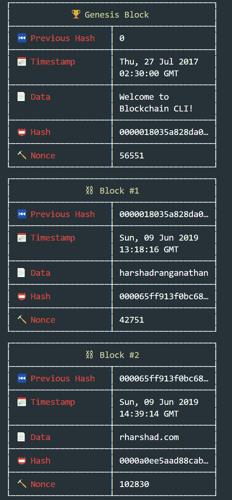

# 区块链

> 原文：<https://dev.to/harshadranganathan/blockchain-4jef>

## 区块链简介

区块链是一个去中心化、分布式和公共的数字分类账，用于维护一个不断增长的记录列表，称为块，使用加密技术链接。任何涉及的记录都不能追溯性地修改，除非修改所有后续块。

## 区块链的好处

1.  分散的-不为单一实体所有。网络中的每个参与者都可以访问交易历史或确认新的交易。

2.  透明度-交易的公开可验证性。

3.  安全性——由于没有可利用的中心点，该系统可以抵御黑客攻击和欺诈。

4.  不变性-添加到区块链的块不能被篡改。

5.  没有中介——不需要第三方就能完成点对点和企业对企业的交易。

## 区块链如何工作

区块链从一个叫做 genesis block 的单个区块开始。

[](https://rharshad.com/assets/img/2019/06/genesis-block.png)

每个块存储以下信息:

| 田 | 描述 |
| --- | --- |
| 索引 | 创世纪区块的索引将为 0。 |
| 时间戳 | 块创建时间的记录。时间戳有助于保持区块链有序。 |
| 混杂 | 数据的数字指纹。散列是固定长度的，易于计算，并且不可转换回数据。 |
| 以前的哈希 | 前一个块的哈希。 |
| 数据 | 每个块都可以存储数据。 |
| 目前 | 用于查找有效哈希的数字。 |

我们将用一个新区块的开采来解释这些。

[](https://rharshad.com/assets/img/2019/06/mined-block.png)

### 索引

|每个新块都有一个递增的索引值，在本例中为 1。|

### 时间戳

以纪元时间表示的块创建时间戳，1560082985.203。

### 哈希

SHA256(索引、以前的哈希、时间戳、数据、随机数)的哈希

```
CryptoJS.SHA256(1 + '0000018035a828da0878ae92ab6fbb16be1ca87a02a3feaa9e3c2b6871931046' 
+ 1560082985.203 + 'HarshadRanganathan' + 29877).toString()

000056f493569b609d6484da94b9031238e80076a8b6a373ae76d3db2746c211 
```

### 上一次哈希

前一个块的哈希为“0000018035 a 828 da 0878 AE 92 ab 6 fbb 16 be 1 ca 87 a 02 a3 FEA 9 E3 C2 b 6871931046”。

### 数据

块数据。

### Nonce

我们从随机数“1”开始，并不断递增，直到找到一个有效的散列。

如果前导零的数量与难度匹配，则认为哈希有效。

例如，这里我们将难度设置为“4”。我们将继续重新生成哈希，直到它有 4 个前导零。

[](https://res.cloudinary.com/practicaldev/image/fetch/s--5v6s3DSv--/c_limit%2Cf_auto%2Cfl_progressive%2Cq_66%2Cw_880/https://i.imgur.com/Zzo4Ofa.gif)

随着难度的增加，可能的有效哈希的数量会减少，因此需要更多的处理能力才能找到有效的哈希。

只有满足以下要求时，新块才会添加到区块链:

1.  新块具有有效索引，即块索引应大于最新块索引。

2.  新块的先前哈希有效，即先前哈希等于最新块哈希。

3.  新块具有有效的散列，即它已被正确计算。

4.  新块的哈希满足难度要求。

随着使用加密技术添加和链接数据块，数据块的区块链会不断增长。

[](https://rharshad.com/assets/img/2019/06/blockchain.png)

### 永恒性

区块链提供了记录的不变性。如果对手篡改了整个链中的任何数据，它将使所有后续数据块无效。

[](https://res.cloudinary.com/practicaldev/image/fetch/s--fRGIeiVm--/c_limit%2Cf_auto%2Cfl_progressive%2Cq_66%2Cw_880/https://i.imgur.com/41UnNFa.gif)

假设我们有 3 个块，我们想篡改块#1 中的数据。

1.  如果您更改块#1 中的数据，则该块的 SHA256 哈希值会发生变化，因为它是基于该数据计算的。

2.  块#2 的散列因其基于块#1 的散列而改变。

3.  块#3 的散列因基于块#2 的散列而改变。

4.  现在，所有 3 块都是无效的，因为它们不符合有 4 个前导零的难度要求。

5.  然后，您将不得不通过寻找新的 nonce 值来再次挖掘所有无效的块，以使它们有效。

这将是一个计算密集型且不可行的操作，因为链会随着新块不断增长。

## 参考文献

[https://www.npmjs.com/package/blockchain-cli](https://www.npmjs.com/package/blockchain-cli)

[https://block chain demo . io](https://blockchaindemo.io)

[https://anders.com/blockchain/blockchain.html](https://anders.com/blockchain/blockchain.html)