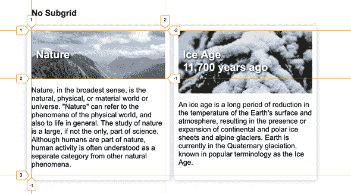
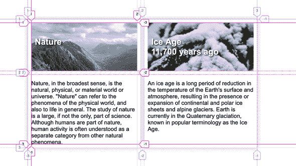

# 让我们来谈谈 CSS 子网格

> 原文：<https://dev.to/apvarun/let-s-talk-about-css-subgrids-29d2>

CSS 子网格是 CSS 工作组制定的 [CSS 网格 2 级规范](https://www.w3.org/TR/css-grid-2/)的一部分。它解决了一个常见的用例，这个用例在网格推出时并不明显。我们来深挖一下到底是什么！

CSS 网格主要用于构建复杂的网页布局。当您开始构建这样的布局时，可能会有这样的用例，您会希望为子组件使用网格。这太棒了！但是当你这样做的时候，有一件不明显的事情发生了。

每次你写`display: grid`，一个新的网格上下文被创建，它完全不知道父网格。

现在，由于这个模糊的规范，你最终会得到与你的网页主网格(父网格)不一致的布局。也正是因为这个问题，子网格出现了。

> 子网格允许网格项目和它自己的网格在父网格的一个或两个维度上对齐

下面是一个包含两个子元素的两列网格容器的例子。

[](///static/d15b3e50b78113797b2978bd749baaf3/d3ebb/grid%20with%20child.png)

在这种情况下，两张卡是网格的一部分，并且正确对齐。但是在你看到的格子内容中，虽然卡片本身是一个格子，但是它们的排列方式是不同的。

```
/* Styles for grid without subgrid */
.container {
  display: grid;
  grid-template-columns: repeat(2, minmax(50px, 1fr));
  grid-gap: 10px;
  .card {
    display: grid;
  }
} 
```

### 带子网格

当您将子卡指定为子网格时，我们可以指定子卡使用父卡的网格(在这种情况下使用自动行)。

[](///static/a8dfdd3ee7c64032230dc9cb989ea6e9/8b54b/grid%20with%20subgrid.png)

这里，对于两张卡，网格线 2 是相同的，从而使对齐相同。

```
/* Styles for grid with subgrid */
.container {
  display: grid;
  grid-template-columns: repeat(2, minmax(50px, 1fr));
  grid-gap: 10px;
  .card {
    display: grid;
    grid-row: span 2;
    grid-template-rows: subgrid;
  }
} 
```

PS:像`grid-gap`和`names grid lines`这样的属性也会被子网格从父网格中继承。

*在 [Codepen](https://codepen.io/apvarun/pen/RmXOzX) 中为你自己检查上面的例子。*

目前**子网格**规范只在 Mozilla Firefox 夜间版本中可用，但对其他浏览器的支持也正在进行中。caniuse.com

* * *

**奖励:**这是一个 Scrimba 截屏，用代码解释了子网格。

[https://scrimba . com/c/cgq 2 kn 6](https://scrimba.com/c/cgq2knS6)