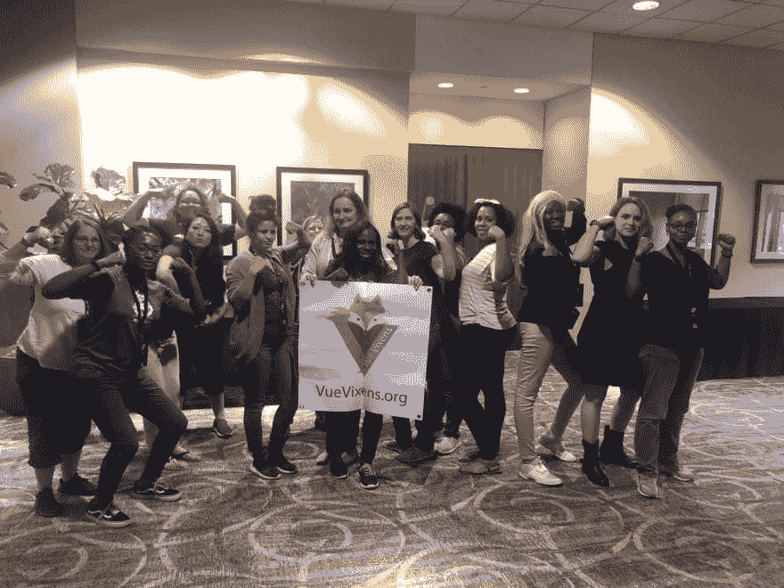

# 我在 REFACTR 的经历。技术

> 原文：<https://dev.to/dayrentolliver/my-experience-at-refactr-tech-1887>

你好。我在这里总结一下我在 REFACTR 的经历。技术。

REFACTR 于上周 6 月 5 日至 7 日在佐治亚州亚特兰大举行。会议由贝丝·莱恩、T2、天使银行和 T4 组织。重点是“技术，同时创造一个安全的空间或围绕技术的多样性、包容性和交叉性进行深思熟虑和细致入微的对话。”

简而言之，这次会议旨在给每个人一个技术席位。

## 第 1 天-工作坊

### 视图

> vixen 视图🦊@ vuvixen亚特兰大万岁！【2019 年 6 月 22:17 PM - 05 日】【49】

REFACTR 的第一天只关注研讨会。由于我想成为一名前端开发人员，我选择了 [Vue Vixens](https://vuevixens.org/) 工作室。这是我第一次使用框架，所以我有点紧张，因为我没有足够的 JavaScript 知识来理解正在发生的事情。支持我的 Vue Vixens 团队很快消除了我的恐惧。是的，我有很多问题，但总有人在那里帮忙澄清。在我深入研究 Vue 之前，我希望有更多的 JavaScript 经验，但是课程结构使它很容易跟上，不管技能组合如何。

如果你是 Vue 新手或者只是想得到更多的练习，你可以‘Vue’😂此处为**车间[，免费](https://vue-vixens-workshop.netlify.com/workshop/)**！

### 谷歌放大器

我也有几个朋友参加了谷歌的 [AMP 路演](https://amp.dev/)。根据 AMP 的网站，“AMP 是一个开源的 HTML 框架，它提供了一种简单的方法来创建快速、流畅的网页，并优先考虑用户体验。”你可以了解更多关于 AMP 的好处，并参加其**免费**课程[在这里](https://amp.dev/documentation/guides-and-tutorials/)。

### 整个车间列表

您可以在此查看工作坊[的完整列表。(我不确定其他研讨会是否提供了任何资源，但如果你找到了感兴趣的主题，这可能值得一看。)](http://refactr.tech/schedule/)

## 第 2/3 天-分组会议

我不想向你介绍我参加的每一个演讲，(顺便说一句，它们都很棒)，我只想重点介绍两个。

免责声明:我选择这两个演讲是因为演讲者拥有我感兴趣的技术背景，而不是因为他们在哪里工作。

### 将我们的心态从“自学”重新配置为“社区学习”

这是来自[销售店](https://www.salesloft.com/)的 UI 工程师 [Ray Gesualdo](https://twitter.com/RayGesualdo) 的演讲。我总是对听那些没有计算机科学学位的人的故事感兴趣，比如我自己。我从雷的演讲中得到的启示是，没有人是真正自学成才的，我们都是在社区学习的。你可能没有受过正规教育，但你肯定没有在某一天醒来时拥有你目前的知识。你获得这些技能是因为其他人愿意分享他们的知识和资源。无论是博客、YouTube 视频等等。，有人特意分享了有关该主题的信息。我们有责任确保我们继续为我们的后代保持和创造。毕竟之前的人都是这么做的。

### 《React 开发人员技术面试指南》

Adrianna Valdivia 也是[saleloft](https://www.salesloft.com/)的 UI 工程师。Adrianna 演讲的目的是帮助正在寻找 React 角色的开发人员避免她在面试时遇到的陷阱。虽然我不是 100%确定我已经准备好开始面试了，但这给了我一个机会来找出我 JavaScript 知识的差距，这样我就可以更好地确定我的时间和注意力应该集中在什么地方。我遇到了几个新的训练营毕业生，他们也发现她的观点非常有用！

## 随机的，但有价值的资源

以下是我从其他与会者那里找到的资源列表:

*   [Year Up](https://www.yearup.org/) -我遇到一个人，因为这个组织，他在一年之内从咖啡店工作变成了前端开发人员

*   这个 Dot Labs 学徒项目帮助女性通过一年的学徒期进入科技行业

*   这是一个位于亚特兰大的软件工程学徒项目

*   [熨斗预备课程](https://flatironschool.com/free-courses/coding-bootcamp-prep) -这是**同样的**预备工作课程，提供给熨斗的学生，完全**免费**，即使你没有上熨斗的计划

## 最后的想法

如果你还不知道，我在 REFACTR.TECH 学到了很多东西。作为一个内向的人，我特意去和别人交谈，我很高兴我做到了！

一路上，有几个人提供了他们的时间和资源来帮助我。我期待着培养这些关系，我已经等不及明年的会议了。

感谢[贝丝·莱恩](https://twitter.com/laingbeth)、[天使银行](https://twitter.com/angelmbanks)和[艾丽卡·史坦利](https://twitter.com/ericastanley)举办了如此精彩的会议！🎉