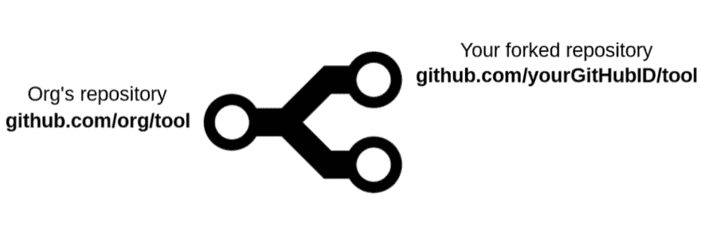

# 为 GitHub 上的开源 Go 项目做贡献——克隆分叉 Go repos 的秘诀。

> 原文：<https://dev.to/penthaapatel/contributing-to-open-source-go-projects-on-github-a-recipe-to-clone-forked-go-repos-a87>

唷！我花了一段时间才弄清楚整个过程，所以我决定写这篇文章，我希望它能进一步帮助其他人开始。我设法收集了所有的材料并策划了食谱，开始着手一个开源 Golang 项目…所以继续吧。

假设你想试验用 Go 编写的 **org** 的新**工具**。所以，你**去拿**(双关语)你在 GitHub 账户上**分叉**的回购。

[](https://res.cloudinary.com/practicaldev/image/fetch/s--A2Ssw_OC--/c_limit%2Cf_auto%2Cfl_progressive%2Cq_auto%2Cw_880/https://thepracticaldev.s3.amazonaws.com/i/lgdmrvm0d79bwzxmw7zq.png)

*问题*:为什么你常规的`go get`分叉回购不起作用？
*简单回答*:你所有的进口都会被搞乱。你必须修改所有的导入语句，比如说从`github.com/org/tool`到`github.com/yourGitHubID/tool`这样的语句，这样你的代码就会发生冲突。

`go get`原**机构**的回购。`go get`将回购克隆到您的`GOPATH`中。`-u` flag 更新已命名的包及其依赖项。

```
$ go get -u github.com/org/tool 
```

<svg width="20px" height="20px" viewBox="0 0 24 24" class="highlight-action crayons-icon highlight-action--fullscreen-on"><title>Enter fullscreen mode</title></svg> <svg width="20px" height="20px" viewBox="0 0 24 24" class="highlight-action crayons-icon highlight-action--fullscreen-off"><title>Exit fullscreen mode</title></svg>

转到您刚刚克隆了 **org** 的**工具** repo 的目录

```
$ cd $GOPATH/src/github.com/org/tool 
```

<svg width="20px" height="20px" viewBox="0 0 24 24" class="highlight-action crayons-icon highlight-action--fullscreen-on"><title>Enter fullscreen mode</title></svg> <svg width="20px" height="20px" viewBox="0 0 24 24" class="highlight-action crayons-icon highlight-action--fullscreen-off"><title>Exit fullscreen mode</title></svg>

让我们看看此时我们有哪些远程回购。列出远程存储库。`-v`获取详细输出。

```
$ git remote -v
origin https://github.com/org/tool (fetch)
origin https://github.com/org/tool (push) 
```

<svg width="20px" height="20px" viewBox="0 0 24 24" class="highlight-action crayons-icon highlight-action--fullscreen-on"><title>Enter fullscreen mode</title></svg> <svg width="20px" height="20px" viewBox="0 0 24 24" class="highlight-action crayons-icon highlight-action--fullscreen-off"><title>Exit fullscreen mode</title></svg>

添加一个新的远程 Git 存储库，明确指向您的 fork。这里我用的新遥控器的简称是`fork`，你可以随意命名。

```
$ git remote add fork https://github.com/yourGitHubID/tool.git 
```

<svg width="20px" height="20px" viewBox="0 0 24 24" class="highlight-action crayons-icon highlight-action--fullscreen-on"><title>Enter fullscreen mode</title></svg> <svg width="20px" height="20px" viewBox="0 0 24 24" class="highlight-action crayons-icon highlight-action--fullscreen-off"><title>Exit fullscreen mode</title></svg>

再次列出远程存储库进行检查，您会看到添加了一个新的远程存储库。

```
$ git remote -v
fork   https://github.com/yourGitHubID/tool.git (fetch)
fork   https://github.com/yourGitHubID/tool.git (push)
origin https://github.com/org/tool (fetch)
origin https://github.com/org/tool (push) 
```

<svg width="20px" height="20px" viewBox="0 0 24 24" class="highlight-action crayons-icon highlight-action--fullscreen-on"><title>Enter fullscreen mode</title></svg> <svg width="20px" height="20px" viewBox="0 0 24 24" class="highlight-action crayons-icon highlight-action--fullscreen-off"><title>Exit fullscreen mode</title></svg>

现在您有了一个指向 GitHub 帐户上分叉回购的遥控器，您可以开始工作了。要开始处理新的分支:

```
$ git checkout -b experimentbranch 
```

<svg width="20px" height="20px" viewBox="0 0 24 24" class="highlight-action crayons-icon highlight-action--fullscreen-on"><title>Enter fullscreen mode</title></svg> <svg width="20px" height="20px" viewBox="0 0 24 24" class="highlight-action crayons-icon highlight-action--fullscreen-off"><title>Exit fullscreen mode</title></svg>

确保你的分支与**组织**的分支更新。然后你可以开始修改实验分支上的文件`git add`你修改的文件和`git commit`在测试你添加的新特性后你的工作。

把变化推到你的叉子上。

```
$ git push -u fork experimentbranch:experimentbranch 
```

<svg width="20px" height="20px" viewBox="0 0 24 24" class="highlight-action crayons-icon highlight-action--fullscreen-on"><title>Enter fullscreen mode</title></svg> <svg width="20px" height="20px" viewBox="0 0 24 24" class="highlight-action crayons-icon highlight-action--fullscreen-off"><title>Exit fullscreen mode</title></svg>

然后，您可以比较您所做的更改，并提交一个 Pull 请求，以提出要与 **org** 的存储库合并的更改。

如果你注意到帖子中有任何需要修改的地方，欢迎在下面评论！:)