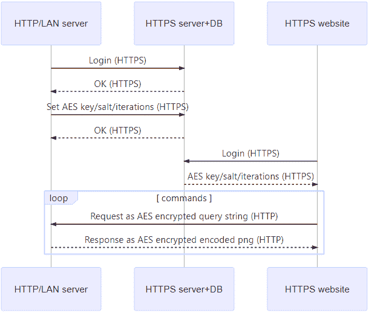

# 通过混合内容过滤器发送数据

> 原文：<https://dev.to/skhmt/sending-data-through-mixed-content-filters-3i0g>

## TL；灾难恢复/底线在前面

使用公开隐写术(显形术？)，您可以从 HTTPS 托管的站点检索协作 HTTP 服务器上的数据，同时仅在浏览器上触发混合被动/显示内容警告。

## 但是为什么 tho？

最基本的用例是将来自本地网络服务器的数据包含在通过 HTTPS 托管在互联网上的页面中。本地服务器很难获得 CA 颁发的 HTTPS 证书，因为 HTTPS 证书需要域名，而本地服务器通常没有域名。但仍有可能存在这样的用例:将来自本地服务器的数据包含在互联网上托管的站点上，可能是物联网设备的配置页面。

如果在 HTTPS 页面上加载不安全的数据，可能会发生以下两种情况之一。如果你的内容在一个``、`<audio>`、`<video>`或某些`<object>`标签中，它将被加载为[混合被动/显示内容](https://developer.mozilla.org/en-US/docs/Web/Security/Mixed_content#Mixed_passivedisplay_content)。这意味着网站将失去锁图标，控制台将抛出关于混合内容的警告，但除此之外，网站将正常工作。但是，如果您的内容以任何其他方式加载(`<script>`、`<iframe>`、`XMLHttpRequest`等)，您的不安全内容将无法加载，因为它将被视为[混合活动内容](https://developer.mozilla.org/en-US/docs/Web/Security/Mixed_content#Mixed_active_content)。

大多数物联网设备或其他网络设备只是放弃了 HTTPS。Plex 有另一种解决方案，但每年的成本为 5000-10000 美元。本文涵盖了这些方法的替代方法。

## 通过便携式网络传输二进制数据图形

在图像、音频和视频中，图像是最容易以编程方式创建的，并且开销最低。在或多或少受到普遍支持的图像格式中， [PNG](https://www.w3.org/TR/PNG/) s 是理想的，因为它们具有一个字节为一个像素的灰度模式，它们包括 gzip 压缩，它们的开销非常低，并且没有损失。

对于高达 2gb 的数据，开销是恒定的 66 字节，这意味着即使没有压缩(您可以对两者都应用压缩)，对于传输大于约 200 字节的二进制数据，它也比 base64 更有效，但代价是一些 cpu 周期。

## 服务器(Kotlin/JVM)

让我们从服务器开始。服务器必须以 HTTP `GET`请求的形式接收所有请求，因此所有选项都必须在查询字符串或参数字符串中。如何做到这一点超出了本文的范围，但是这非常简单。

收到请求后，它必须将一些数据转换成 PNG，然后返回给请求者。

这从一个字符串手动创建了一个 PNG 文件——它可能是一个字节数组，但是在这个例子中我把它写成了一个字符串。输出 PNG 是单行，宽度等于输入数据的大小，每个像素代表一个灰度字节。这篇文章的封面图片是“Hello World ”,但是放大了一堆，这样就可以看到了。

注意:`*arrayName`是*不是*指针，是 Kotlin 扩展运算符。

```
fun makePNG(data: String): ByteArray {
    val dataAsByteArray = data.toByteArray(Charsets.UTF_8) // string (utf8) as a byte array

    return (pngSignature() +
            pngIHDR(dataAsByteArray.size,1) +
            pngIDAT(dataAsByteArray) +
            pngIEND())
}

// PNG Signature - https://www.w3.org/TR/PNG/#5PNG-file-signature
fun pngSignature(): ByteArray {
    return byteArrayOf(-119,80,78,71,13,10,26,10)
}

// PNG IHDR chunk - https://www.w3.org/TR/PNG/#11IHDR
fun pngIHDR(width: Int, height: Int): ByteArray {
    val ihdrLength = byteArrayOf(0,0,0,13)
    val ihdrType = byteArrayOf(73,72,68,82)
    val ihdrData = byteArrayOf(
        *intToBA(width), // width
        *intToBA(height), // height
        8, // bitdepth - 8 so each pixel is a byte
        0, // color type - 0 is greyscale
        0,0,0 // compression, filter, and interlace methods - must be 0
    )
    val ihdrCRC = getCRC(ihdrType, ihdrData)

    return (ihdrLength +
            ihdrType +
            ihdrData +
            ihdrCRC)
}

// PNG IDAT chunk - https://www.w3.org/TR/PNG/#11IDAT
fun pngIDAT(data: ByteArray): ByteArray {
    val idatType = byteArrayOf(73,68,65,84)

    val idatData = deflate(byteArrayOf(0, *data)) // filter type 0 (no filter)

    val idatCRC = getCRC(idatType, idatData)

    val idatLength = intToBA(idatData.size) // compressed data length

    return (idatLength +
            idatType +
            idatData +
            idatCRC)
}

// PNG IEND chunk - https://www.w3.org/TR/PNG/#11IEND
fun pngIEND(): ByteArray {
    return byteArrayOf(0,0,0,0,73,69,78,68,-82,66,96,-126)
} 
```

Enter fullscreen mode Exit fullscreen mode

我知道这很多，但是在上面所有的代码中，可能 95%都是创建一个基本 PNG 的样板文件。IHDR 很有趣，但仅仅是因为它使用位深度`8`和颜色类型`0`来允许每像素 1 字节。其余的块没什么特别的，除非您对 PNG 文件格式感兴趣，并在 JVM 中实现它。

便利函数`getCRC()`、`intToBA()`和`deflate()`分别使用 Java 的 CRC 库创建 CRC，将整数转换为字节数组，以及使用 Java 的紧缩器库紧缩数据。它们包含在[完整的服务器代码](https://gist.github.com/Skhmt/b5d1b4145b5d316ca74dee652b669e94)中。

## 站点(javascript)

托管在 HTTPS 上的网站需要解决两个问题，第一个是将数据和请求一起发送到 HTTP 服务器，然后获取数据。

它通过一个查询字符串发送数据，因为数据通信必须通过一个``标签。根据大多数浏览器限制，这将请求数据限制为 1KB。

第二个问题是获取数据。服务器通过发送一个 png 来解决这个问题，png 本质上是包装和压缩数据，但是现在浏览器必须理解它。它通过将`img`绘制到`<canvas>`元素上，然后读取每个像素的红色值(在灰度图像中，红色、绿色和蓝色都是一样的)并将其推入一个数组:

```
function pngGet(url, fn) {
    const canvas = document.createElement('canvas')
    const ctx = canvas.getContext('2d')
    const img = new Image()
    img.crossOrigin = 'anonymous'
    img.onload = function() {
        canvas.width = img.width
        canvas.height = img.height
        ctx.drawImage(img, 0, 0)

        const utf8 = []
        for (let x = 0; x < img.width; x++) {
            const byte = ctx.getImageData(x, 0, 1, 1).data[0]
            utf8.push(byte)
        }
        fn(stringFromUTF8Array(utf8), img)
    }
    img.src = url
} 
```

Enter fullscreen mode Exit fullscreen mode

这可以通过清理在 DOM 中创建的`<canvas>`和``元素来改进，但是在这个例子中，实际上是[输出](//skhmt.github.io/https.html)给用户看。这里和服务器代码中也有一些可以做的优化(比如预分配`utf8`数组的长度)。

上面使用的`stringFromUTF8Array()`函数是由[埃德·怀恩](https://weblog.rogueamoeba.com/2017/02/27/javascript-correctly-converting-a-byte-array-to-a-utf-8-string/)编写的。对于这个例子，我根本没有修改它。当然，如果你想传输二进制数据，你不需要把字节数组转换成字符串。

### 这个实现有一个巨大的警告

所提供的代码只允许创建一个 2，147，483，647 像素宽、单行的 PNG 文件，这有一个问题...虽然 PNG 规范在技术上允许，但 Photoshop 等程序只允许 300，000 x 300，000 像素的图像，而 Chrome 和 Firefox 的最大宽度为 32，767 像素。因此，即使实现了多行，也只有允许每个 PNG 大约 1g 字节。这不应该是一个困难的修复，但这只是一个概念证明，所以它没有在代码中实现。

## 恢复机密性和数据完整性

这样做的主要问题是它缺乏保密性和数据完整性。换句话说，通过不安全的 Wi-Fi 或中间人嗅探你的网络流量的人理论上可以读取和/或更改包含你的数据的图像。这是所有混合被动/显示内容的问题。

解决这个问题的一个方法是通过像 [asmCrypto.js](https://github.com/asmcrypto/asmcrypto.js) 或 [Stanford JS Crypto Library](https://github.com/bitwiseshiftleft/sjcl) 这样的东西来滚动你自己的加密/解密。然后，您可以通过普通的 Java 加密库加密响应数据，并在从`<canvas>`中读取字节后解密响应。您必须在一个辅助通道中传递密钥，HTTPS 站点/服务器和 HTTP 服务器都与 HTTPS 服务器通信，将密钥发送到数据库中。HTTPS 服务器+数据库也可以托管 HTTPS 网站。

[](https://res.cloudinary.com/practicaldev/image/fetch/s--OE3nNSA---/c_limit%2Cf_auto%2Cfl_progressive%2Cq_auto%2Cw_880/https://thepracticaldev.s3.amazonaws.com/i/mmxbwmx41cnj1o614qqz.png)

## 结束语

在未来，浏览器可能会对混合的被动/显示内容发出更明显的警告，或者他们可能会开始将这种内容视为混合的主动内容，并直接阻止它。本质上，这是一个可能不会永远存在的变通办法。出于这个原因，我们在 GameGlass 已经决定不在生产中实现它。

这可能在发送大量数据方面有应用，因为它比 base64 好一点，但为什么不直接发送二进制文件，而不是将其封装在. png 中呢？

这也可以应用于从受损的机器中泄漏数据，但是我想不出在任何情况下这是比任何更成熟的方法更好的解决方案，包括只发送二进制数据。

我猜这可能是用来混淆有效载荷的，但是它会持续到有人阅读这篇文章的时候。

但即使它不是超级有用，也不是突破性的，我认为它还是很整洁的。感谢 Ron Karroll 和 GameGlass 的其他人让我从他们的头脑中获得灵感！