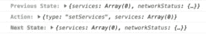

# 一种带有反应钩子的离子反应状态管理模式

> 原文：<https://dev.to/ionic/a-state-management-pattern-for-ionic-react-with-react-hooks-100b>

如何管理应用程序中的状态通常是您做出的最大和最有影响力的架构决策。

不幸的是，国家管理没有标准的做法。开发人员必须在各种各样的技术和库(其中许多是第三方的)之间进行选择，包括 Redux、MobX、状态“隧道”、单例状态服务，或者只是将它们拼凑在一起。其中一些解决方案针对大型应用进行了优化，一些针对小型应用进行了优化。

然而，有了 React Hooks，我们终于有了一种状态管理技术，它既是框架的原生技术，又非常适合大量的应用程序(也许除了非常大的应用程序)。

如果你不熟悉 React 中的钩子，去读一下我们对在 Ionic React 中使用 React 钩子[的介绍，它提供了关于新 API 以及如何用它们构建基本应用的初级读本。我们将在这篇文章中对此加以掩饰。](https://ionicframework.com/blog/using-react-hooks-in-an-ionic-react-app/)

让我们跳进来。

## 状态管理与 React 挂钩

React now 附带了许多钩子，包括两个我们可以用来在我们的应用中构建一个强大的状态管理系统的钩子: [useContext](https://reactjs.org/docs/hooks-reference.html#usecontext) 和 [useReducer](https://reactjs.org/docs/hooks-reference.html#usereducer) 。

冒着过于简化的风险，一个简单的状态管理系统有几个可取的属性:1)它是全局的，所以状态在一个地方管理，而不是在你的应用程序中管理；2)单个组件本身不修改或*改变*状态，而是向状态管理系统发出“动作”,然后状态管理系统可以改变状态，导致组件树在必要时更新。

如果你在上面认出了 redux，恭喜你！这就是我们要用 React 钩子有效构建的东西。

## 图样

好吧，我们来看看模式。我们将在一个名为`State.jsx`(如果使用 TypeScript，则为`tsx`)的文件中构建我们的状态管理系统:

```
import React, { createContext, useReducer } from "react";

let AppContext = createContext();

const initialState = {
  count: 0
}

let reducer = (state, action) => {
  switch(action.type) {
    case "setCount": {
      return { ...state, count: action.user }
    }
  }
  return state;
};

function AppContextProvider(props) {
  const fullInitialState = {
    ...initialState,
  }

  let [state, dispatch] = useReducer(reducer, fullInitialState);
  let value = { state, dispatch };

  return (
    <AppContext.Provider value={value}>{props.children}</AppContext.Provider>
  );
}

let AppContextConsumer = AppContext.Consumer;

export { AppContext, AppContextProvider, AppContextConsumer }; 
```

在这个文件中，我们设置了我们的[上下文](https://reactjs.org/docs/context.html)，我们的子组件将使用`useContext`钩子访问它。当他们这样做时，他们将可以访问我们在`AppContext.Provider`上设置为`value`的两个东西:`state`和`dispatch`函数。这些是调用`useReducer`钩子返回的。`state`是当前的全局状态，可用于渲染/etc。，而`dispatch`允许组件发出动作，我们的`reducer`函数将处理这些动作以变成新的状态对象。

`reducer`函数有两个参数:当前状态和执行的动作。然后，它返回一个新的状态对象，该对象包含处理动作后的任何差异。

让我们来看一个示例组件，看看我们如何使用它:

```
import React, { useContext } from 'react';
import { IonButton } from '@ionic/react';
import { AppContext } from '../State';

export const MyComponent = () => {
  const { state, dispatch } = useContext(AppContext);

  return (
    <div>
      <IonButton onClick={() => dispatch({
        type: 'setCount',
        count: state.count + 1
      })}>
        Add to Order
      </IonButton>
      <h2>You have {state.count} in your cart</h2>
    </div>
  )
} 
```

这就是基本的状态管理模式！我们的组件从上下文中访问状态，并将动作分派给 reducer，后者反过来更新全局状态，这导致组件重新呈现。相当简单！

不过，我们还可以在状态管理系统中添加一些其他的东西，让它变得更加强大。

## 测井

状态管理的一个常见需求是出于调试目的记录操作。

通过用一个简单的日志记录函数包装 reducer 函数，并使用该函数作为`useReducer`的参数，而不是原来的`reducer`函数，可以非常简单地完成日志记录:

```
const logger = (reducer) => {
  const reducerWithLogger = (state, action) => {
    console.log("%cPrevious State:", "color: #9E9E9E; font-weight: 700;", state);
    console.log("%cAction:", "color: #00A7F7; font-weight: 700;", action);
    console.log("%cNext State:", "color: #47B04B; font-weight: 700;", reducer(state,action));
    return reducer(state,action);
  };
  return reducerWithLogger;
}

const loggerReducer = logger(reducer);

function AppContextProvider(props) {
  // ...
  let [state, dispatch] = useReducer(loggerReducer, fullInitialState)
  // ...
} 
```

产生如下有用的日志信息:

[](https://blog.ionicframework.com/wp-content/uploads/2019/06/Screen-Shot-2019-06-08-at-9.45.12-AM.png)

## 坚持不懈

状态管理系统的另一个常见需求是持久性，或者是整个状态，或者是它的一个子集。

我们可以通过使用`localStorage`并向我们的状态系统添加几行代码来简单地实现这一点:

```
const initialState = {...}

const persistedState = JSON.parse(window.localStorage['persistedState']);

function AppContextProvider(props) {
  const fullInitialState = {
    ...initialState,
    ...persistedState
  }
  // ...
} 
```

这首先设置初始状态来包含我们保存在`persistedState`中的任何数据。

然后，为了在状态改变时保持持久化的数据是最新的，我们可以使用`useEffect`，它将在每次状态更新时运行。在这个例子中，我们持久化了一个新的`state.user`字段，它可能包含一个用户的会话令牌:

```
function AppContextProvider(props) {
  const fullInitialState = {
    ...initialState,
    ...persistedState
  }

  let [state, dispatch] = useReducer(loggerReducer, fullInitialState);

  useEffect(() => {
    // Persist any state we want to
    window.localStorage['persistedState'] = JSON.stringify({
      user: state.user
    });
  }, [state]);
  // ...
} 
```

这将让我们在状态中保持特定的字段，如果它们发生变化，并在应用程序再次启动时加载它们。从这个意义上说，持久性是反应性的，我们不必去想它。注意:使用`localStorage`对任何需要长时间存在的东西都不好，因为浏览器/操作系统可能会清理它。然而，对于临时数据来说，这完全没问题。

## 结论

现在你有了它，一个在 Ionic React 中用 React 钩子进行状态管理的简单模式。当然，有更简单的状态管理模式，但我觉得这在对基本应用程序足够简单和对大型应用程序足够复杂之间取得了很好的平衡。如果我要构建一个非常严肃的应用程序，我可能仍然会使用 Redux 来受益于那里可用的各种库和技术。

我非常喜欢这个模式，现在我已经在三个不同的 Ionic React 应用程序上使用了它。就像发面师一样，我为我构建的每个新应用程序复制这个状态管理系统。

你怎么想呢?你喜欢这个图案吗？有什么可以改进或调整的吗？请在评论中告诉我们！