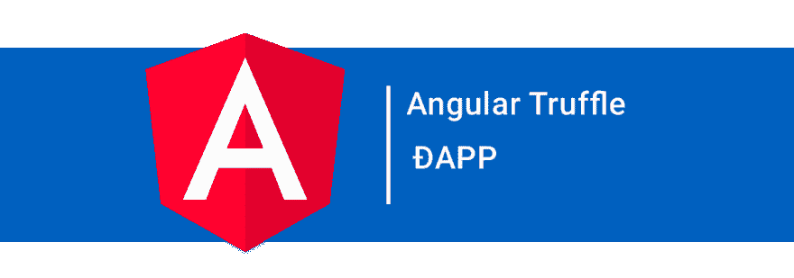

# 介绍带角度的 truffle box 分散式应用程序

> [https://dev . to/macauobog/介绍-truffle-box-con-angular-applications-districted-191 l](https://dev.to/macaoblog/introduciendo-truffle-box-con-angular-aplicaciones-descentralizadas-191l)

[](https://res.cloudinary.com/practicaldev/image/fetch/s--ehCqh_1R--/c_limit%2Cf_auto%2Cfl_progressive%2Cq_auto%2Cw_880/https://i.ibb.co/TkzPNnk/1-CIJ0-LEa6-ZR17-GFZSjy2ce-Q.png)

# 有角+松露=💓-应用程序

是否可以创建带角度的 DAPP(分散应用程序)？答案是肯定的，而且比你想象的容易。但在此之前，我们需要明确一些关键概念:
是 DAPP 吗？
是一个不依赖于中央系统而是依赖于用户社区的应用程序，DAPP 可以是一个移动应用程序，也可以是一个与智能合同交互的 web 应用程序，它执行所有功能。
我需要依赖吗？

*   饭桶
*   节点和 NPM
*   加纳切
*   Metamask
*   角度气候

### 1 .我们安装角& truffle CLI 下载“truffle box”，其中将包含我们的 DAPP 所需的一切。

```
npm install -g truffle
npm install -g @angular/cli
npm install -g ganache-cli 
```

Enter fullscreen mode Exit fullscreen mode

### 2。我们下载了 truffle box

完成后，终端将显示一条成功消息，并向我们显示我们的应用程序所需的命令。

```
truffle unbox ng-es/angulartruffledapp 
```

Enter fullscreen mode Exit fullscreen mode

### 3。我们推出 Ethereum 客户端，可以使用终端或从以下位置下载:[https://truffleframwork . com/ganache](https://truffleframework.com/ganache)

```
ganache-cli 
```

Enter fullscreen mode Exit fullscreen mode

如果安装了旧版本，则建议升级，因为旧版本有一个错误，该错误将气体标记为 0，并且无法执行事务

### 4。智力竞赛和移民

为了迁移 truffle box 的智能合同，我们必须在终端上的目录 **blockchain/contracts 中运行以下命令？** :

```
npm install dotenv && npm install truffle-hdwallet-provider
truffle compile && truffle migrate 
```

Enter fullscreen mode Exit fullscreen mode

在 cli 中，我们将看到我们的合同的汇编和迁移信息，在 ganache 中，我们将看到 build/contracts 中的两个文件。JSON 一个是迁移文件，另一个是我们的合同，由于每笔交易的佣金，我们现在拥有的 ether 较少。

### 5。更改挂钩端口

在 windows 上更改 truffle-config.js 8545 中的端口是 7545，但在 linux 上，端口是 8545，如果使用 cli 或图形版本，则可能会有所不同。

### 6。Instalar Metamask

进入[网页 https://metamask.io/](https://metamask.io/) 并下载您喜欢的浏览器插件。

Metamask 是一个插件，它充当多个 DAAPS 和您的浏览器之间的桥梁，它是一个虚拟货币，您可以在其中使用多个帐户登录，而无需使用完整的 Ethereum 节点，从而保证我们的帐户的安全性。

创建帐户后，我们将使用名为“`HTTP://127.0.0.1:7545 o 8545`”的自定义 RPC 连接到该帐户，然后在密钥图标上获取用于导入新帐户的私钥。

### 7。现在，我们必须安装依赖项并部署本地角服务器，然后使用命令导航到 frontend 文件夹

```
npm install && ng serve 
```

Enter fullscreen mode Exit fullscreen mode

如果您执行了所有步骤，并且在 unbox 期间 truffle 控制台中的消息是:**unbox success。史威特！**恭喜，一切顺利。

启动应用程序时，您会在 metamask 的当前帐户部分看到一条欢迎消息，并且您已经准备好了一个分散的角度应用程序，您可以根据需要修改、改进和修改它。您只需更改位于**block chain \ contracts \ payment . sol**文件夹中的合同，以及位于**front \ src \ app \ services \ contract \ contract . service . ts**文件夹中的合同，在该文件夹中您可以更改您自己合同的名称，并更改与合同交互的功能和指令，位于

你可以在:[https://www . truffle site . com/boxes/angular truffle PP](https://www.trufflesuite.com/boxes/angulartruffledapp)上看到更多的项目

一个非常酷的项目，它创建在远离代码的基础上:[事件页【https://hackathonon . web . app/](https://hackathonmunon.web.app/)T3】应用程序[https://hackathonon . web . app/](https://hackathonmunon.web.app/)如果您要测试它是否连接到 metamask 中的 rinkeby 测试网络