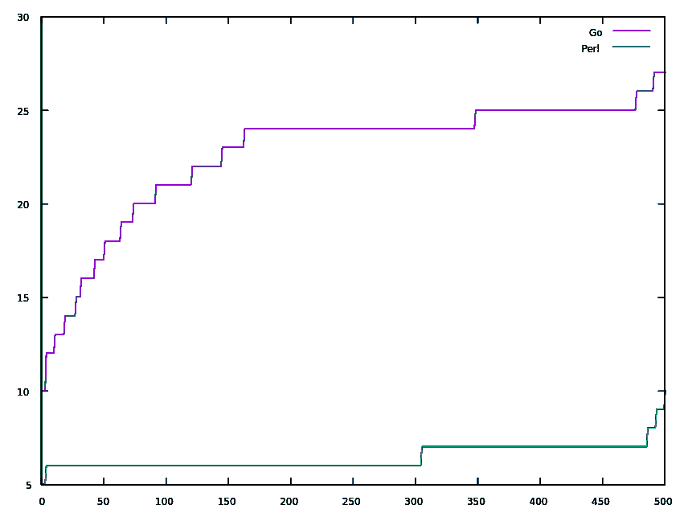
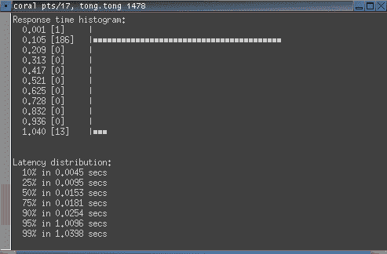
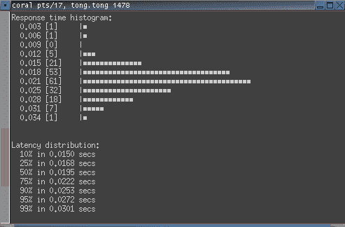

# Perl 中的简单 web 服务器

> 原文：<https://dev.to/suntong/simple-web-server-in-perl-and-go-revisit-5d82>

在我之前的用 Perl 和 Go
实现的简单 web 服务器的博客上，有人指出这是不公平的比较。这一次，感谢[阿克塞尔·瓦格纳](https://dev.to/themerovius)，他取代了 net/http。服务器层直接翻译 Perl 代码，代码现在直接读写套接字，就像 Perl 代码正在做的那样。

这里是我的机器的测试结果(我[在这里](https://gist.github.com/suntong/757d287f4fe44a543b15fa73d6f30abb)发表的):

100 个并发请求(一次执行多个请求的数量):

[](https://res.cloudinary.com/practicaldev/image/fetch/s--QlqZjEMn--/c_limit%2Cf_auto%2Cfl_progressive%2Cq_auto%2Cw_880/https://img.vim-cn.com/93/4bdabb7ad9b7e8bb68176c759d640c1e747b6f.svg)

500 个并发请求:

[](https://res.cloudinary.com/practicaldev/image/fetch/s--sDZ-VGZH--/c_limit%2Cf_auto%2Cfl_progressive%2Cq_auto%2Cw_880/https://img.vim-cn.com/c6/635682fa3a90f909fa2dd4c8ec6cfb57e13388.svg)

再一次，

*   公平地说，这是用 Perl 实现的[，添加了缓存控制头](https://github.com/suntong/dbab/blob/master/src/bin/dbab-svr)
*   这是[Go](https://github.com/suntong/dbab-go-log/blob/232d5fe68e7c16c92da5a1eb8eb4d4c79b7daaf7/dbab-svr/main.go)中的实现
*   正如前面所讨论的，Apache Bench 的统计摘要有点混乱，所以这次我将它们省略掉。还得出结论，测量和报告的响应时间确实可信。

从图表中，我们可以看到 Go 500 并发请求的响应时间几乎与[之前的结果](https://dev.to/suntong/simple-web-server-implemented-in-perl-and-go-b43/)相同，而 100 并发实际上比之前更有价值。

总之，通过这种直接翻译，我仍然看到 Perl 比 Go 表现得更好。为什么？以我自己的身份而不是 root 身份启动 Go 服务器是罪魁祸首，还是其他原因？

**更新:**

我期待看到的是什么？引用前一篇博客的评论:

> ...老实说，perl 仍然以显著更高的平均响应时间而告终，这证实了它不是一种非常快的语言。
> 
> 顺便说一句，我还使用了不同的工具进行基准测试(github.com/rakyll/hey)。AIUI，它更高效地使用多个内核。有了这个工具，perl 实现完全被摧毁了，平均响应时间比我机器上的 Go 实现快了 40 倍。

由于`ab`未能产生预期的结果，我安装了建议的[嘿](https://github.com/rakyll/hey)，测试结果确实表明 Go 比 Perl 更好。

**进一步更新:**

我用 [hey](https://github.com/rakyll/hey) 的默认设置进行了测试。

对于 Perl:

`hey -disable-keepalive http://192.168.0.10/`

[](https://res.cloudinary.com/practicaldev/image/fetch/s--NjMt9njT--/c_limit%2Cf_auto%2Cfl_progressive%2Cq_auto%2Cw_880/https://img.vim-cn.com/ce/f1df6bc22c5b5d5b9f6b377d5f3e68a8c4df58.png)

对于 Go:

`hey -disable-keepalive http://192.168.0.11:8888/`

[](https://res.cloudinary.com/practicaldev/image/fetch/s--9CmrR4Jj--/c_limit%2Cf_auto%2Cfl_progressive%2Cq_auto%2Cw_880/https://img.vim-cn.com/cf/5c0aca6cbbdeb90a9cb08849e2df63efd89c0f.png)

(注意`192.168.0.10`和`192.168.0.11`都是我的本地机器，因为我已经[为它配置了两个 IP 地址](https://github.com/suntong/blog/blob/master/DbabAll.md)。)

而*“测试结果确实表明 Go 比 Perl 更好”*的结论是在`Response time histogram`的基础上得出的。然而，当我想得更多的时候，它对我来说不再有意义了。

[嘿](https://github.com/rakyll/hey)的默认设置是:

```
Usage: hey [options...] <url>

Options:
  -n  Number of requests to run. Default is 200.
  -c  Number of requests to run concurrently. Total number of requests cannot
      be smaller than the concurrency level. Default is 50. 
```

<svg width="20px" height="20px" viewBox="0 0 24 24" class="highlight-action crayons-icon highlight-action--fullscreen-on"><title>Enter fullscreen mode</title></svg> <svg width="20px" height="20px" viewBox="0 0 24 24" class="highlight-action crayons-icon highlight-action--fullscreen-off"><title>Exit fullscreen mode</title></svg>

正如我们在[之前的结果](https://dev.to/suntong/simple-web-server-implemented-in-perl-and-go-b43/)中看到的，Perl 服务器很好地经受住了 500 个并发请求，95%的读数只有 7 毫秒。然而，他们讲述了一个不同的故事，在只有 200 个并发请求的情况下，Perl 服务器的响应时间通常是 0.105*秒*。然而，

那是*比`ab`的读数多 15 倍*。

Hey 无法在`ms`级别获得准确读数让我怀疑它自身的准确性，不得不怀疑 hey 的 15 次响应时间读数是由于*自身的*懈怠。

此外，如果你仔细看看 hey 的延迟分布读数，我们可以看到，Perl 在 75%时仍然是 0.0181 秒，而 Go 在 75%时已经是 0.0222 秒了，更不用说在 10%时，Perl 是 0.0045 秒，而 Go 是 0.0150 秒(> 3 倍)。从 hey 的延迟分布读数中，我们可以看到 hey 的读数是自相矛盾的，而 Perl 的表现显然比 Go 好得多。

此外，来自 Perl 服务器的 13 秒长的 1.043 秒响应时间只在 hey 中观察到，所有其他性能测试软件，包括没有记录的-这里是 [httperf](https://github.com/httperf/httperf) ，它们都没有表现出这样的行为。因此可以得出这样的结论:1.043 秒的长响应时间是由 hey *本身*造成的，而不是由 Perl 服务器造成的。

因此，到目前为止，由于以上三个原因，我不得不得出结论，由于其自身的限制，hey 不适合这个测试，因此无法与最流行的 Apache Bench 相抗衡。

现在，越来越有意思了——*相信谁，相信什么*。是的，*值得拥有另一个博客*，我将把它变成*的商业*网络性能测试软件，我正好可以访问它。它不像一个命令那么简单，只是设置它就需要很多步骤。但是，我会这样做，看看它从已经被数百万公司使用和依赖的商业工具(由微软)看起来如何。

敬请期待...