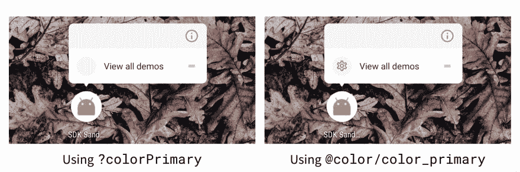
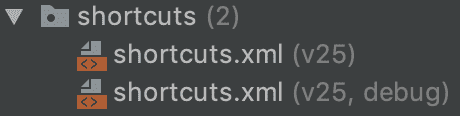

# 快捷方式的快捷方式

> 原文：<https://dev.to/zmdominguez/shortcuts-to-shortcuts-572d>

距离我上次查看实现[应用程序快捷方式](https://developer.android.com/guide/topics/ui/shortcuts)已经过去几年了，最近我又在查看它们。我记得第一次为 Android N 发布时就实现了它们，但是和生活一样，事情发生了一些变化。

在这篇文章中，我想分享一些我在实现静态应用快捷方式时学到的有趣的东西。(注:本帖假设读者熟悉[实现 app 快捷方式](https://developer.android.com/guide/topics/ui/shortcuts/creating-shortcuts)的基本要求)。一如既往，[这篇文章的所有代码](https://github.com/zmdominguez/sdk_sandbox/tree/feature/app-shortcuts)都在我的沙盒应用中。

### Android Studio 支持…有限。

☝️:在这个练习中，我使用的是 Android Studio 3.5 Beta 4。

我说的有限是指资源引用根本不会自动完成。这变得很棘手，因为一些必需的属性*可以*使用资源引用。下表显示了这些是什么:

| 允许 | 不允许 |
| --- | --- |
| `shortcutShortLabel` | `shortcutId` |
| `shortcutLongLabel` | `Intent`属性(`targetPackage`，`targetClass`) |
| `icon` |  |

⚠️:我的非科学测试表明，在 pixel launchers 上，`shortcutShortLabel`被使用，除非`shortcutLongLabel`是 17 个字符或更少。

### APIs 25 和 26 之间的设计指南有所变化

Android O 引入了[自适应图标](https://developer.android.com/guide/practices/ui_guidelines/icon_design_adaptive.html)，如果我们考虑到用户可以将快捷方式钉在他们的主屏幕上，如果我们想提供最好的用户体验，我们需要支持这种格式。

Nick Butcher 在他关于实现自适应图标的[帖子中详细谈到了这一点。](https://medium.com/androiddevelopers/implementing-adaptive-icons-1e4d1795470e)

⚠️使用了一个`VectorDrawable`作为图标前景，正如尼克所展示的，它似乎不喜欢使用主题参考作为填充颜色。使用资源引用是可以的。 [](https://res.cloudinary.com/practicaldev/image/fetch/s--BghyG093--/c_limit%2Cf_auto%2Cfl_progressive%2Cq_auto%2Cw_880/https://i.imgur.com/GvfiOMX.png)

阅读[这篇文章](https://medium.com/google-design/designing-adaptive-icons-515af294c783)了解更多关于设计适应性图标的信息，阅读[这篇文章](https://commondatastorage.googleapis.com/androiddevelopers/shareables/design/app-shortcuts-design-guidelines.pdf)设计应用程序快捷图标。

### Mo '包名，Mo '文件

对于我们想要支持的每一个 app 快捷方式，都需要有一个`Intent`与之关联；每个`Intent`需要一个`targetPackage`和一个`targetClass`。也就是:

```
<intent
    android:action="android.intent.action.VIEW"
    android:targetPackage="com.zdominguez.sdksandbox"
    android:targetClass="com.zdominguez.sdksandbox.MainActivity" /> 
```

如果您的应用程序对每种构建类型有不同的包名，这可能会出现问题。有人[写了一个函数](https://stackoverflow.com/a/44840413/395576)来支持变量，但不幸的是它不能在更现代版本的 Gradle 插件上工作。

这意味着我们需要多个`shortcuts.xml`文件来支持我们想要支持的所有构建变体:

[](https://res.cloudinary.com/practicaldev/image/fetch/s--cDbXQ2lW--/c_limit%2Cf_auto%2Cfl_progressive%2Cq_auto%2Cw_880/https://i.imgur.com/g3M5YgK.png)

### 传递额外意图是可能的，但有时蹦床活动会派上用场

如果我们需要传递一些额外的东西给我们的目标`Activity`，我们可以通过 XML 文件:
来完成

```
<intent ...>
    <extra android:name="target_tab" android:value="settings" />
</intent> 
```

在应用程序快捷方式的文档中，有一条很重要的声明被埋没了:

> 当应用程序已经在运行时，当静态快捷方式启动时，应用程序中的所有现有活动都会被销毁。

这时 trampoline `Activity`就变得有用了，这样我们就可以准备我们的后台堆栈，甚至可以处理接收活动需要的一些需求(例如，从数据库中读取一个值)。你可以在这里阅读更多关于蹦床活动的信息。➰

### 处理向上导航

类似于我们应该如何[处理导航](https://developer.android.com/training/notify-user/navigation#define_your_apps_activity_hierarchy)当从一个通知开始一个`Activity`时，我们需要考虑当用户导航远离我们的目标`Activity`时应用程序将如何表现。

因此，我们需要为快捷方式提供多个`Intent`,列表中的最后一个将是用户最初看到的。

```
<shortcut ...>
    <intent
        android:action="android.intent.action.VIEW"
        android:targetPackage="com.zdominguez.sdksandbox"
        android:targetClass="com.zdominguez.sdksandbox.MainActivity">
        <extra android:name="target_tab" android:value="settings" />
    </intent>
    <intent
        android:action="android.intent.action.VIEW"
        android:targetPackage="com.zdominguez.sdksandbox"
        android:targetClass="com.zdominguez.sdksandbox.DemoActivity">
    </intent>
</shortcut> 
```

我花了比我想象中更长的时间来理解这一切😩，所以我写下来给以后的我做个参考。

👯请务必阅读其余的[最佳实践](https://developer.android.com/guide/topics/ui/shortcuts/best-practices)文档，以了解更多信息。