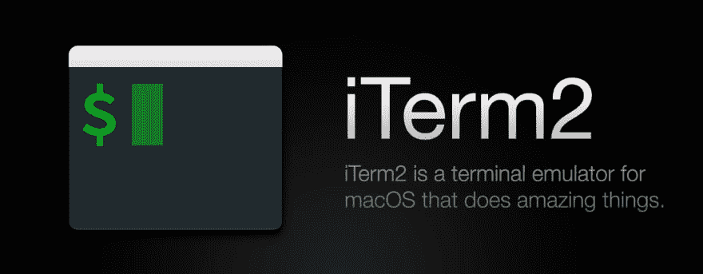
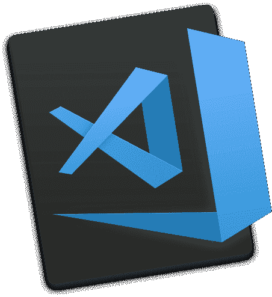
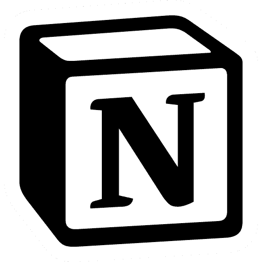

# 我的 macOS 开发环境工具

> 原文：<https://dev.to/kyleboe/my-macos-dev-env-tools-20pk>

下面列出了我每天用来写代码和提高效率的工具，排名不分先后。如果你对为什么 X 应该取代 Y 有强烈的意见，把它们留在评论里，因为我总是希望让我的工作流程更快更有效率。

# 终端工具

### [iTerm2 (v3)](https://www.iterm2.com/version3.html)

与终端相比，高度可定制。我从自然文本导航配置中获益匪浅(按住 option/alt 在单词间切换)

### [自制](https://brew.sh)

我选择的软件包管理器。我经常使用 [`brew bundle`](https://github.com/Homebrew/homebrew-bundle) 来确保我的 Dev Env 依赖项可以很容易地迁移到一台新机器上，如果我当前的机器发生了任何事情的话。

### [Tmux](https://github.com/tmux/tmux)

从他们的网站:

> tmux 是一个终端多路复用器:它允许在一个屏幕上创建、访问和控制多个终端。tmux 可以从屏幕上分离，并继续在后台运行，然后再重新连接。

如果你能通过配置文件的大小( *psst。放心用[矿](https://github.com/kyleboe/dotfiles/blob/master/.tmux.conf)T3)，这个工具是必须的。如果你曾经不小心关闭了一个你需要的终端窗口，学习如何使用 Tmux 会让你受益匪浅。*

# 非终端工具

我不得不按照功能对事情进行分组，因为需要进行一些确认。我会标记我用的那个，但要知道我至少试过其他的。

## 文本编辑器

在看到 VS 代码是多么容易扩展之后，我是一个崇高的文本转换者。

简易模式:

*   **[VS 代号](https://code.visualstudio.com/) ⬅**
*   [崇高的文字](https://www.sublimetext.com/)
*   [Atom](https://atom.io/)

硬模式:

*   [Vim](https://github.com/vim/vim)

## 窗口管理器

虽然我只使用奇观，但由于 ChunkWM 背后的开发者 [koekeishiya](https://github.com/koekeishiya) ，还有一个*巨大的*荣誉奖。在编写窗口管理器方面，他是一个传奇。

简易模式:

*   **[奇观](https://www.spectacleapp.com/) ⬅**
*   [磁铁](https://magnet.crowdcafe.com/)

硬模式:

*   [ChunkWM](https://github.com/koekeishiya/chunkwm)

## 记笔记

我不能推荐足够的概念。它们的功能集几乎可以把所有东西都击出水面。只要看看他们的产品页面，自己看看。

*   **[观念](https://www.notion.so/) ⬅**
*   [熊](http://www.bear-writer.com/)
*   [Evernote](https://evernote.com/)
*   麦克唐

## 杂项生产率

### [阿尔弗雷德](https://www.alfredapp.com/)

这个聚光灯的替代品(以及更多)是我工作效率的核心。Alfred 是高度可扩展的，仅文本片段功能就物有所值。

### [保](https://www.macbartender.com/)

每样东西都有一个菜单栏图标，酒保帮助清理噪音，只让你注意你的条件。

## [破折号](https://kapeli.com/dash)

从网站:

> Dash 是一个 API 文档浏览器和代码片段管理器。Dash 存储代码片段，并立即在离线文档集中搜索 200 多个 API、100 多个备忘单等等。您甚至可以生成自己的文档集或请求包含文档集。

离线文档的可靠工具(与 Alfred 集成)。

# **工具≠练习**

TL；像这样的任何帖子的 DR 都是工具不等于开发实践。这个工具集是出于需要而构建的；花时间改进我的工作流程，让它更有效率。如果你使用一套不同的工具，很好。您使用的环境工具不会让您成为更好或更差的开发人员。