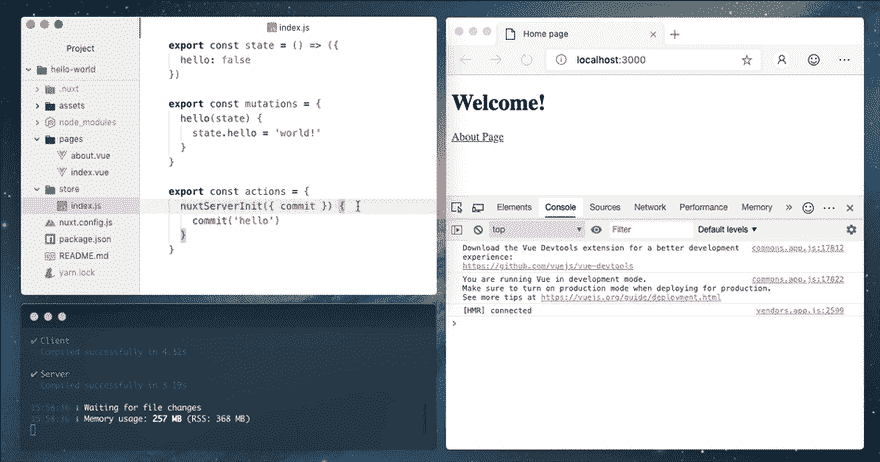
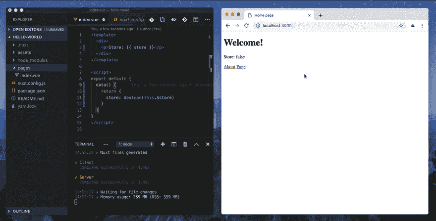
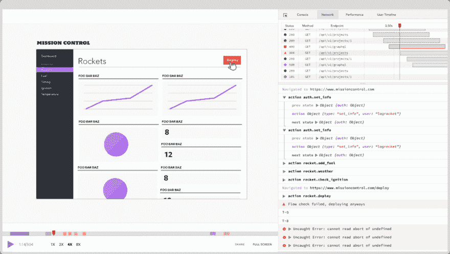

# Nuxt 2.7 的新特性

> 原文：<https://dev.to/bnevilleoneill/what-s-new-in-nuxt-2-7-3gf4>

[](https://res.cloudinary.com/practicaldev/image/fetch/s--W_D1H3nc--/c_limit%2Cf_auto%2Cfl_progressive%2Cq_auto%2Cw_880/https://thepracticaldev.s3.amazonaws.com/i/vec75fctpckfgc7es9j6.png)

NuxtJS 是基于[Vu](https://vuejs.org)[e . js](https://vuejs.org)[Node](https://nodejs.org)[的免费开源 web 应用框架。js](https://nodejs.org) 、 [Express.js](https://expressjs.com) 、 [Webpack](https://webpack.js.org) 和 [Babel.js](https://babeljs.io) 。它是创建 VueJS 应用程序最流行的框架之一。使用 NuxtJS，您可以在通用、静态生成或单页面应用程序之间进行选择。

GitHub 上有超过 20，000 个 [](https://res.cloudinary.com/practicaldev/image/fetch/s--N_KR-JfB--/c_limit%2Cf_auto%2Cfl_progressive%2Cq_auto%2Cw_880/https://s.w.oimg/core/emoji/12.0.0-1/72x72/2b50.png) 的应用程序，并且有大量专门的社区成员不断提供支持，构建具有 SSRA 和 SPA 特性的高性能、稳定和高效的 VueJS 应用程序从未如此简单。

自其最初发布以来，其维护者随后也发布了几个解决问题和添加特性的版本。最近，2.7 版本发布了几个更新，解决了各种痛点，并对现有功能进行了改进。在本教程中，我们将回顾一些最近的变化，以及它们如何帮助我们使用 NuxtJS 开发更好的应用程序。

注意:本教程假设您对 VueJS 和 NuxtJS 有基本的了解。要了解更多信息，请访问链接[这里](https://vuejs.org)和[这里](https://nuxtjs.org/)。

[](https://logrocket.com/signup/)

## 浏览器中的 SSR(通用渲染)日志

通常，在调试通用应用程序(**s _ server+_ _ c _ lient**)时，查看一段代码的结果的常用方法是使用`console.log`来完成的。这是高效的(它完成了工作)，但是一个大的难点是它将日志的结果分割到**终端**(当记录特定于服务器的代码时)或者**浏览器**(当记录特定于客户端的代码时)，这可能是非常烦人的，因为你必须从浏览器切换到客户端才能看到结果。

从 NuxtJS v2.7 开始，情况不再如此。所有 SSR 日志现在都报告到您的浏览器控制台。你不再需要切换屏幕，现在你可以在浏览器中看到所有日志的结果。

[](https://res.cloudinary.com/practicaldev/image/fetch/s--E8xGtxKV--/c_limit%2Cf_auto%2Cfl_progressive%2Cq_66%2Cw_880/https://i0.wp.com/user-images.githubusercontent.com/904724/57533442-12acec80-733e-11e9-92e9-950718b198ac.gif%3Fssl%3D1)

## 自动检测商店目录的创建

存储帮助管理大型应用程序中的状态。NuxtJS 默认实现 Vuex。以前，要激活商店，您需要创建一个商店目录，NuxtJS 将:

*   Import Vuex(导入 Vuex)
*   向根 Vue 实例添加`store`选项。

但是，要实现这一点，您必须重新启动它。在 v2.7 中，你不再需要这样做，因为 NuxtJS 现在可以检测到你何时创建了一个`store/`目录，并且会自动重新加载，所以你不再需要重新启动它。

`serverMiddleware`手表已经被改进，可以重启 NuxtJS 并清理它们的缓存。

[](https://res.cloudinary.com/practicaldev/image/fetch/s--uxZlFTJ3--/c_limit%2Cf_auto%2Cfl_progressive%2Cq_66%2Cw_880/https://i0.wp.com/user-images.githubusercontent.com/904724/57455462-70243900-726b-11e9-8b1b-675e31f17c44.gif%3Fssl%3D1)

## 扩展 babel.presets 和 babel envName API

预设可以作为一个巴别塔插件阵列或可共享的[选项](https://babeljs.io/docs/en/options)配置。当你不想组装自己的一套插件时，`babel-preset-app`是 Nuxt 使用的默认预置，它主要是围绕`@babel/preset-env`预置的一个包装器。

通常定制通天塔配置是通过`.babelrc`或配置文件完成的。在 NuxtJS v2.7 中，默认情况下忽略`babel.rc`文件，而使用`build.extend` API。现在，向 babel 传递选项是使用这个新的 API 完成的，如下所示:

```
// nuxt.config.js
export default {
  build: {
    babel: {
      presets({ isServer }, [preset, options]) {
        // change options directly
        options.targets = ...
        options.corejs = ...

        // or return whole preset list
      }
    }
  }
} 
```

<svg width="20px" height="20px" viewBox="0 0 24 24" class="highlight-action crayons-icon highlight-action--fullscreen-on"><title>Enter fullscreen mode</title></svg> <svg width="20px" height="20px" viewBox="0 0 24 24" class="highlight-action crayons-icon highlight-action--fullscreen-off"><title>Exit fullscreen mode</title></svg>

还添加了一个用于`configFile` :
的`envName` API

```
// nuxt.config.js
export default {
  build: {
    babel: {
      configFile: path.resolve(rootDir, 'babel.config.js')
    }
  }
}

// babel.config.js
module.exports = function (api) {
  const env = api.env()
  api.cache.using(() => env)

  const presets = []
  const plugins = []

  if (env === 'server') {
    // set server presets/plugins
  } else if (env === 'client') {
    // set client presets/plugins
  } else if (env === 'modern') {
    // set modern presets/plugins
  }

  return { presets, plugins }
} 
```

<svg width="20px" height="20px" viewBox="0 0 24 24" class="highlight-action crayons-icon highlight-action--fullscreen-on"><title>Enter fullscreen mode</title></svg> <svg width="20px" height="20px" viewBox="0 0 24 24" class="highlight-action crayons-icon highlight-action--fullscreen-off"><title>Exit fullscreen mode</title></svg>

## 可配置别名

使用 webpack 时，在 webpack 配置中创建别名并不罕见。在 v2.7 之前，从配置文件配置别名是不可配置的。您必须在别名前面使用`@`符号。这意味着如果您的配置中已经有了类似的配置，就会出现冲突。

```
// packages/webpack/src/config/base.js
alias() {
    const { srcDir, rootDir, dir: { assets: assetsDir, static: staticDir } } = this.buildContext.options

    return {
      '~': path.join(srcDir),
      '~~': path.join(rootDir),
      '@': path.join(srcDir),
      '@@': path.join(rootDir),
      [assetsDir]: path.join(srcDir, assetsDir),
      [staticDir]: path.join(srcDir, staticDir)
   }
} 
```

<svg width="20px" height="20px" viewBox="0 0 24 24" class="highlight-action crayons-icon highlight-action--fullscreen-on"><title>Enter fullscreen mode</title></svg> <svg width="20px" height="20px" viewBox="0 0 24 24" class="highlight-action crayons-icon highlight-action--fullscreen-off"><title>Exit fullscreen mode</title></svg>

这个问题在 2.7 版中不再存在，因为它现在是可配置的。别名现在将在`options.js`文件的选项对象中定义，并在`base.js`文件中引用，从而消除潜在的冲突。

## 忽略“未找到”警告

使用 TypeScript 时`export ... was not found ...`是一个常见的错误。尽管它不会阻止你的应用程序运行，但看到它弹出来还是很烦人的。

以前，这种错误可以通过给`nuxt.config.ts`添加一个自定义插件来抑制。然而，从 NuxtJS v2.7 开始，该特性已经被添加到 NuxtJS 核心中。

注意:关于所有变更的具体列表，请查看发布[页面](https://github.com/nuxt/nuxt.js/releases)。

## 弃用

以下 API 在 NuxtJS v2.7 中已被弃用:

*   NuxtJS v2.7 **[不再支持节点< 8.6 关联](https://github.com/TypeStrong/ts-loader/releases/tag/v6.0.0)** `\[**ts-loader v6** \](https://github.com/TypeStrong/ts-loader/releases/tag/v6.0.0)`(仅适用于 TypeScript 用户)
*   为了在页面和布局之间转换时更加清晰，在`nuxt.config.js`中**转换**属性(现已折旧)已被重命名为`**pageTransition**`

## 未来使用警告

*   过渡属性在 NuxtJS v3 中将不再可用。

**迁移提示:**对于任何效果，您都不需要更改项目中的任何一行代码。一旦升级到 NuxtJS v2.7，一切都会自动迁移。

## 结论

在本教程中，我们探索了 NuxtJS v2.7 中的一些新特性和改进。我们还研究了一些不推荐使用的特性和未来警告。要查看所有变更的具体列表并了解更多关于新版本的信息，请务必查看版本[页面](https://github.com/nuxt/nuxt.js/releases)。请关注我们关于 NuxtJS v2.8 的下一篇文章。祝编码愉快！

* * *

### Plug: [LogRocket](https://logrocket.com/signup/) ，一款适用于网络应用的 DVR

<figure>[](https://logrocket.com/signup/)

<figcaption></figcaption>

</figure>

LogRocket 是一个前端日志工具，可以让你回放问题，就像它们发生在你自己的浏览器中一样。LogRocket 不需要猜测错误发生的原因，也不需要向用户询问截图和日志转储，而是让您重放会话以快速了解哪里出错了。它可以与任何应用程序完美配合，不管是什么框架，并且有插件可以记录来自 Redux、Vuex 和@ngrx/store 的额外上下文。

除了记录 Redux 操作和状态，LogRocket 还记录控制台日志、JavaScript 错误、堆栈跟踪、带有头+正文的网络请求/响应、浏览器元数据和自定义日志。它还使用 DOM 来记录页面上的 HTML 和 CSS，甚至为最复杂的单页面应用程序重新创建像素级完美视频。

[免费试用](https://logrocket.com/signup/)。

* * *

帖子[Nuxt 2.7 中的新功能](https://blog.logrocket.com/whats-new-in-nuxt-2-7/)首先出现在[的博客](https://blog.logrocket.com)上。