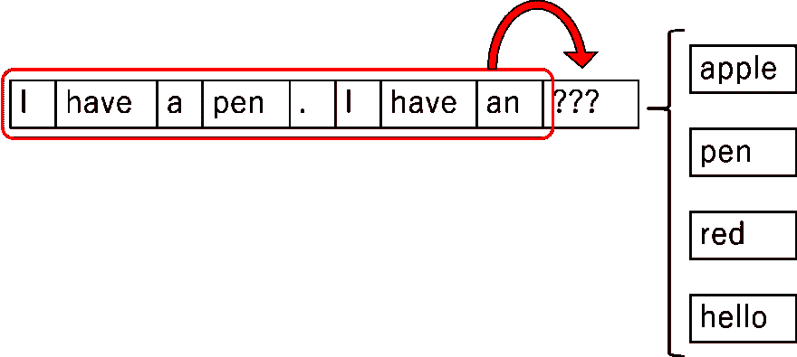

# 如何让机器为你写作

> 原文：<https://dev.to/scarescrow/how-to-make-machines-write-for-you-1g5g>

注意:这篇文章的开头包含了一些背景知识，帮助感兴趣的初学者了解基于 transformer 的网络。如果您只想看到激动人心的结果，请直接跳到结果部分

最近，机器学习已经被有效地用于解决人类面临的几个挑战。特别是在分类、聚类等问题上取得了显著的成功。随着神经网络的出现，我们已经看到了一些令人兴奋的应用，如年龄检测，识别图像中的对象等。

然而，神经网络在处理文本时从来都不太成功。这是可以理解的。任何在语言领域工作的人都知道它有多复杂和微妙。教会机器像讽刺、挖苦等微妙的意图尤其困难。在文本中。

在过去十年中，取得最大进步的挑战之一是自然语言生成任务。你可以一直看到这一点，从处理你的机票预订的聊天机器人，到根据你的问题做出回应的 Alexa。然而，对用户来说很明显，他是在用机器人说话。因此，问题是，我们能让机器写出与人类书写的文本没有区别的文本吗？

### 背景

长期以来，一种叫做[长短期记忆(LSTM)](https://en.wikipedia.org/wiki/Long_short-term_memory) 的特殊类型的神经网络被用于文本生成。为了直观地理解它们为什么有效，请看下面的对话:

[](https://res.cloudinary.com/practicaldev/image/fetch/s--kbtiVbQn--/c_limit%2Cf_auto%2Cfl_progressive%2Cq_auto%2Cw_880/https://thepracticaldev.s3.amazonaws.com/i/oluhuu1avd2b1nvhvvti.png)

基本上，在语言中，我们可能经常提到我们以前说过的东西。作为人类，我们会自然而然地理解正在谈论的内容(或“了解上下文”)。如果我问我的朋友一个简单的问题，比如“你昨晚看比赛了吗？”我在飞行中做了几个假设，比如我的朋友知道正在谈论什么游戏，他对这个游戏感兴趣，等等。这对机器来说更难理解。为了实现这一点，我们试图在网络中存储一点上下文，按照*序列*(单词或字符)。在文本生成过程中，我们试图根据前面的 *n* 个序列来预测下一个序列。这是一个简单的 LSTM 的例子:

[](https://res.cloudinary.com/practicaldev/image/fetch/s--JuUWVriu--/c_limit%2Cf_auto%2Cfl_progressive%2Cq_auto%2Cw_880/https://thepracticaldev.s3.amazonaws.com/i/i8da2u613hvbpyzgm3fa.png)

然而，虽然我们能够使用 LSTMs 得到结构良好、语法正确的句子，但明显缺乏保留上下文，这导致了不令人满意的结果。

### 一种新颖的方法

2017 年，谷歌推出了一种新的神经网络，称为 [Transformer](https://ai.googleblog.com/2017/08/transformer-novel-neural-network.html) ，它在处理文本方面表现出色。根据经验，变形金刚与 LSTMs 的区别在于保存上下文的方式。不是一个序列接一个序列地保存，而是把先前交互的主体的主要理解都保存在网络中。对于熟悉神经网络的高级读者，我强烈推荐阅读原文，[“注意力是你所需要的一切”](https://arxiv.org/abs/1706.03762)

### GPT-2

利用这种变形金刚，OpenAI 今年发布了一款开创性的型号，名为 [GPT-2](https://openai.com/blog/better-language-models/) 。这是一个巨大的模型，有 15 亿个参数，训练了超过 40GB 的互联网文本。它已经取得了出色的性能，以至于 OpenAI 还没有发布完整的模型，因为担心它被以负面的方式使用。然而，他们发布了两个更小的模型，有 1.17 亿个参数，和 3.45 亿个参数(后者是上个月才发布的！).好消息是，这些较小的模型，加上对你的数据的一点训练，你可以得到惊人的结果。

### 结果

117M 模型被用于该实验的目的，并且它在三种不同类型的文本数据上被训练了大约 1000 个时期:

*   《冰与火之歌》(俗称《权力的游戏》)的书
*   保罗·格拉厄姆的散文
*   来自 [ROCStories 数据集](http://cs.rochester.edu/nlp/rocstories/)的短篇故事

现在让我们来看看模型在每个数据集上的表现。

##### 短篇小说

ROCStories 数据集包含由罗切斯特大学学生撰写的简单的 5 句故事。下面是数据集中的一个例子:

```
Jennifer has a big exam tomorrow. She got so stressed, she pulled an all-nighter.   She went into class the next day, weary as can be. Her teacher stated that the test is postponed for next week. Jennifer felt bittersweet about it. 
```

Enter fullscreen mode Exit fullscreen mode

现在让我们玩一个小游戏来回答我们最初的问题。你能认出哪一个是人类写的吗？

[](https://res.cloudinary.com/practicaldev/image/fetch/s--eu4F9Mwo--/c_limit%2Cf_auto%2Cfl_progressive%2Cq_auto%2Cw_880/https://thepracticaldev.s3.amazonaws.com/i/j4f5oga5gmnnrj80bo0o.jpg)

如果你猜这三个都是机器生成的，那么你就是一个非常用心的读者！我们在一个博览会上尝试了这个实验，在我们询问的 18-20 人中，只有 2 人得到了正确的答案。第一句是提示，其余的是在每个例子中生成的。

现在让我们看看更令人兴奋的结果。金色的文字是提示。

##### 权力的游戏

[](https://res.cloudinary.com/practicaldev/image/fetch/s--4G-OdVZQ--/c_limit%2Cf_auto%2Cfl_progressive%2Cq_auto%2Cw_880/https://thepracticaldev.s3.amazonaws.com/i/q3bc9otl78vmpxa3x56r.jpg)

##### 保罗·格拉厄姆杂文

[](https://res.cloudinary.com/practicaldev/image/fetch/s--_9LTFvf6--/c_limit%2Cf_auto%2Cfl_progressive%2Cq_auto%2Cw_880/https://thepracticaldev.s3.amazonaws.com/i/7q84h2lzpuy1n6ncng9g.jpg)

### 关键要点

*   由模型生成的文本的格式根据训练数据而显著改变。
*   生成的文本词汇与训练数据一致。请注意在《权力的游戏》的例子中，它是如何使用只有书中才有的术语和短语的。在散文示例中，生成的文本要严肃得多，谈论的是世俗问题。

### 代码在哪里？

我用来获得这些结果的所有代码都在 [github](https://github.com/scarescrow/StoryGeneratorViaGPT2) 中。我已经写了一个全面的自述文件来解释我的源文件，但是如果有人需要使用这个模型的教程，请写在评论中，我会做一个。

要了解更多有关我们具体方法和评估标准的信息，您可以点击这里阅读我们的完整报告[。](https://github.com/scarescrow/StoryGeneratorViaGPT2/blob/finetuning/report/report.pdf)

### 结论

正如 VentureBeat 和许多其他文章所报道的那样，GPT 2 号已经有了一些出色的表现。这篇文章的目的是展示如何通过稍微调整模型来获得强大的结果。当然，即使是现在，机器生成的文本和人类书写的文本之间的差异对一些读者来说可能是显而易见的。但相比之下，这种差异要小得多，而且这只是一个较小的模型。所有试验过 GPT-2 完整模型的人都对它印象深刻。

希望你喜欢这篇长篇阅读！关注我，了解更多关于软件开发和机器学习的初学者友好内容