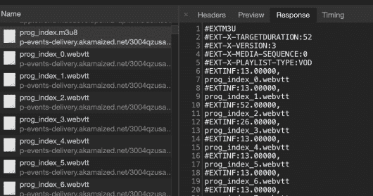
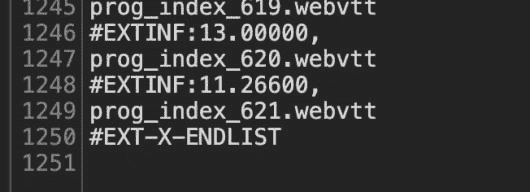
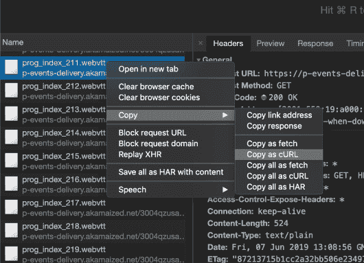
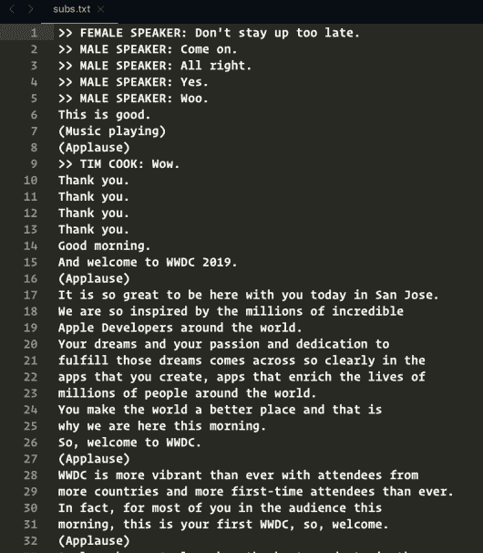

# 读者挑战:享受苹果 WWDC 2019 主题字幕带来的乐趣，展示你的作品

> 原文：<https://dev.to/hrbrmstr/reader-challenge-have-some-fun-with-apple-s-wwdc-2019-keynote-subtitles-show-your-work-4nkg>

本周早些时候，我在一条 Twitter 帖子中对苹果公司相当残忍，我试图让这条帖子与 WWDC 直播同步(如果你继续阅读，这可能是你想记住的事情)。我真的不关心“memojis ”,我对一个非常明显的事实感到非常沮丧，即苹果公司打算通过将大多数人从 MAC 转移到 iPads 来降低计算能力。他们的新“Pro”是为设计人员设计的，我不指望他们用更好的笔记本电脑或更小的[奶酪刨丝器](https://www.cnet.com/news/new-apple-mac-pro-design-inspires-cheese-grater-jokes-and-theyre-gouda/)重新拥抱开发人员/数据科学社区。

“meh”硬件/软件发布并不是这些事件中最糟糕的部分。TED 风格的脚本(包括许多失败的模仿“真实”幽默的尝试)也变得相当乏味。我开玩笑说要分析“每分钟副词”，但过了几天，他们的 [WWDC 2019 主题视频](https://developer.apple.com/videos/play/wwdc2019/101/) **和**字幕轨道才出现。因此，目前的时间限制阻止了字幕本身的深入，**但是**这并不意味着*你*不能从中得到一些乐趣。

继续读下去，看看我是如何刮出字幕的，或者跳到最后，阅读更多关于这个“读者挑战”的内容。

### 没那么细微的字幕刮

如果你去前面链接的 WWDC 视频网址，你会在右下角看到添加字幕轨道的控件。如果您在浏览器开发工具打开的情况下这样做，您将会看到:

[](https://i0.wp.com/rud.is/b/wp-content/uploads/2019/06/01-subtitle-index.png?ssl=1)

这些是 [WebVTT](https://www.w3.org/TR/webvtt1/) 格式的字幕，其格式/语法使其能够以正确的回放时间码显示。我们可以通过查看文件的结尾来了解它们的数量:

[](https://i1.wp.com/rud.is/b/wp-content/uploads/2019/06/02-subtitle-count.png?ssl=1)

因此，它们有 621 个，每个都是单独请求的(而且是超快、并行的)。这些单独的请求看起来像什么？只需选择其中一个来看看。它们只是普通的文本响应(这不是一种超级复杂的格式)。

让我们将其中一个抓取到剪贴板，并使用 [{curlconverter}包](https://cinc.rud.is/web/packages/curlconverter/)通过`straighten()`和`make_req()`函数将其转换成`httr::GET()`请求:

[](https://i0.wp.com/rud.is/b/wp-content/uploads/2019/06/03-subtitle-curl.png?ssl=1)

我继续将它包装成一个名副其实的函数，但是`GET`请求实际上与前面提到的过程没有什么不同。我只是将`{idx}`模板添加到请求 URL 中，这样我们就可以将正确的索引`glue()`到其中。很可能一些头已经被删除了，但是这次我只是使用了`{curlconverter}`处理并返回的内容。

```
library(stringi)
library(subtools) # https://github.com/hrbrmstr/subtools ; (ORIG: https://github.com/fkeck/subtools)
library(tidytext)
library(purrrogress) # tidy progress bars for free!
library(tidyverse)

#' Fetches a subtitle by index from the 2019 Apple WWDC Keynote subtitle stream
get_subtitle <- function(idx = 1) {

  st_url <- "https://p-events-delivery.akamaized.net/3004qzusahnbjppuwydgjzsdyzsippar/vod3/cc2/eng4/prog_index_{idx}.webvtt"
  st_url <- glue::glue(st_url)

  httr::GET(
    url = st_url,
    httr::add_headers(
      `sec-ch-ua` = "Google Chrome 75",
      `Sec-Fetch-Mode` = "cors",
      Origin = "https://developer.apple.com",
      `User-Agent` = "Mozilla/5.0 (Macintosh; Intel Mac OS X 10_14_6) AppleWebKit/537.36 (KHTML, like Gecko) Chrome/75.0.3770.80 Safari/537.36",
      Referer = "https://developer.apple.com/videos/play/wwdc2019/101/",
      `Sec-Fetch-Dest` = "empty",
      `Sec-Fetch-Site` = "cross-site"
    )
  ) -> res

  out <- httr::content(res, as = "text", encoding = "UTF-8")
  out <- stringi::stri_split_lines(out)

  purrr::flatten_chr(out)

} 
```

<svg width="20px" height="20px" viewBox="0 0 24 24" class="highlight-action crayons-icon highlight-action--fullscreen-on"><title>Enter fullscreen mode</title></svg> <svg width="20px" height="20px" viewBox="0 0 24 24" class="highlight-action crayons-icon highlight-action--fullscreen-off"><title>Exit fullscreen mode</title></svg>

来看看一个长什么样:

```
(tmp <- get_subtitle(1))
## [1] "WEBVTT"                                          
## [2] "X-TIMESTAMP-MAP=MPEGTS:181083,LOCAL:00:00:00.000"
## [3] ""                                                
## [4] "3"                                               
## [5] "00:00:21.199 --> 00:00:22.333"                   
## [6] ">> FEMALE SPEAKER:"                              
## [7] "Don't stay up too late."                         
## [8] ""                                                
## [9] "" 
```

<svg width="20px" height="20px" viewBox="0 0 24 24" class="highlight-action crayons-icon highlight-action--fullscreen-on"><title>Enter fullscreen mode</title></svg> <svg width="20px" height="20px" viewBox="0 0 24 24" class="highlight-action crayons-icon highlight-action--fullscreen-off"><title>Exit fullscreen mode</title></svg>

看起来不错！但是，它只是简单的字符，我不想写一个字幕解析器。而且，我不需要！弗朗索瓦·凯克有我们可以使用的[{子工具}包](https://github.com/fkeck/subtools)。但是，它(过去)只对*文件*有效。它[现在](https://github.com/hrbrmstr/subtools)也适用于字符向量(但是你需要从我的 fork 安装它，直到 PR 被合并)。让我们把这组噪音变成我们可以使用的东西:

```
as_subtitle(tmp, format = "webvtt") %>% 
  flatten_df()

## # A tibble: 1 x 4
## ID Timecode.in Timecode.out Text                                
## <chr> <chr> <chr> <chr>                               
## 1 3 00:00:21.199 00:00:22.333 >> FEMALE SPEAKER: Don't stay up to… 
```

<svg width="20px" height="20px" viewBox="0 0 24 24" class="highlight-action crayons-icon highlight-action--fullscreen-on"><title>Enter fullscreen mode</title></svg> <svg width="20px" height="20px" viewBox="0 0 24 24" class="highlight-action crayons-icon highlight-action--fullscreen-off"><title>Exit fullscreen mode</title></svg>

*好整齐！*

我们现在需要得到所有的字幕。我们会做得更快，因为视频播放器检索它们甚至比这个迭代更快:

```
# no crawl delay b/c the video player grabs these even faster than this code does
map(1:621, with_progress(get_subtitle)) %>% # with_progress gets you a progress bar for free
  map(as_subtitle, format = "webvtt") %>% 
  flatten_df() %>% 
  as_tibble() -> apple_subs

apple_subs
## # A tibble: 3,220 x 4
## ID Timecode.in Timecode.out Text                               
## <chr> <chr> <chr> <chr>                              
## 1 3 00:00:21.199 00:00:22.333 >> FEMALE SPEAKER: Don't stay up t…
## 2 4 00:01:10.933 00:01:11.933 >> MALE SPEAKER: Come on.          
## 3 5 00:01:36.500 00:01:37.166 >> MALE SPEAKER: All right.        
## 4 6 00:01:40.966 00:01:41.733 >> MALE SPEAKER: Yes.              
## 5 7 00:01:45.733 00:01:46.666 >> MALE SPEAKER: Woo.              
## 6 8 00:01:46.733 00:01:47.833 This is good.                      
## 7 9 00:01:49.566 00:01:52.666 (Music playing)                    
## 8 10 00:02:05.200 00:02:12.533 (Applause)                         
## 9 10 00:02:05.200 00:02:12.533 (Applause)                         
## 10 11 00:02:14.400 00:02:15.566 >> TIM COOK: Wow.                  
## # … with 3,210 more rows 
```

<svg width="20px" height="20px" viewBox="0 0 24 24" class="highlight-action crayons-icon highlight-action--fullscreen-on"><title>Enter fullscreen mode</title></svg> <svg width="20px" height="20px" viewBox="0 0 24 24" class="highlight-action crayons-icon highlight-action--fullscreen-off"><title>Exit fullscreen mode</title></svg>

流式字幕不是没有错误的，而且经常被复制，让我们看看是不是这样:

```
# Any dups?
distinct(apple_subs) 
## # A tibble: 2,734 x 4
## ID Timecode.in Timecode.out Text                               
## <chr> <chr> <chr> <chr>                              
## 1 3 00:00:21.199 00:00:22.333 >> FEMALE SPEAKER: Don't stay up t…
## 2 4 00:01:10.933 00:01:11.933 >> MALE SPEAKER: Come on.          
## 3 5 00:01:36.500 00:01:37.166 >> MALE SPEAKER: All right.        
## 4 6 00:01:40.966 00:01:41.733 >> MALE SPEAKER: Yes.              
## 5 7 00:01:45.733 00:01:46.666 >> MALE SPEAKER: Woo.              
## 6 8 00:01:46.733 00:01:47.833 This is good.                      
## 7 9 00:01:49.566 00:01:52.666 (Music playing)                    
## 8 10 00:02:05.200 00:02:12.533 (Applause)                         
## 9 11 00:02:14.400 00:02:15.566 >> TIM COOK: Wow.                  
## 10 12 00:02:15.633 00:02:18.166 Thank you.                         
## # … with 2,724 more rows

apple_subs <- distinct(apple_subs) 
```

<svg width="20px" height="20px" viewBox="0 0 24 24" class="highlight-action crayons-icon highlight-action--fullscreen-on"><title>Enter fullscreen mode</title></svg> <svg width="20px" height="20px" viewBox="0 0 24 24" class="highlight-action crayons-icon highlight-action--fullscreen-off"><title>Exit fullscreen mode</title></svg>

有 dup，但现在没有了！

你可以通过[http://rud.is/dl/2019-wwdc-keynote-subtitles.csv.gz](http://rud.is/dl/2019-wwdc-keynote-subtitles.csv.gz)得到那个数据帧。

我想看看这些看起来是否正常，所以我只将文本转储到一个文件中，并在 Sublime Text 中打开它们进行抽查:

```
apple_subs %>%
  pull(Text) %>% 
  write_lines("/tmp/subs.txt") 

system("subl /tmp/subs.txt") # dblchk 
```

<svg width="20px" height="20px" viewBox="0 0 24 24" class="highlight-action crayons-icon highlight-action--fullscreen-on"><title>Enter fullscreen mode</title></svg> <svg width="20px" height="20px" viewBox="0 0 24 24" class="highlight-action crayons-icon highlight-action--fullscreen-off"><title>Exit fullscreen mode</title></svg>

[](https://i1.wp.com/rud.is/b/wp-content/uploads/2019/06/04-subtitle-check.png?ssl=1)

因为我们很好地捕捉到了所说的内容，所以我们可以开始分析过程:

```
distinct(apple_subs) %>% 
  filter(!grepl("^\\(|^>>", Text)) %>%
  unnest_tokens(word, Text) %>% 
  anti_join(get_stopwords()) %>% 
  count(word, sort=TRUE)
## Joining, by = "word"
## # A tibble: 2,408 x 2
## word n
## <chr> <int>
## 1 now 246
## 2 can 205
## 3 new 142
## 4 like 119
## 5 just 106
## 6 app 77
## 7 great 74
## 8 apple 69
## 9 right 64
## 10 apps 59
## # … with 2,398 more rows 
```

<svg width="20px" height="20px" viewBox="0 0 24 24" class="highlight-action crayons-icon highlight-action--fullscreen-on"><title>Enter fullscreen mode</title></svg> <svg width="20px" height="20px" viewBox="0 0 24 24" class="highlight-action crayons-icon highlight-action--fullscreen-off"><title>Exit fullscreen mode</title></svg>

那时我已经没有时间了。

### 读者挑战

你已经清理了 WWDC 2019 主题字幕轨道，并可以访问我的 WWDC 2019 Twitter 帖子。有了它能有什么乐趣？我仍然想知道副词-per-'n '(以及它们是哪一类)。但是，你还能发现什么呢？是否存在通过不同时间的用词选择来操纵情绪的模式？他们在整个活动中是否改变了语气/风格？你还能提出哪些问题，用数据梳理出来？

在评论中留下你的作品的链接(和单独的代码链接),我会在 Twitter 上重新播放它们，并把它们收集到一个新的帖子中，看看你们都想出了什么。

### 鳍

没有截止日期，因为我可以继续策展新的提交进来。虽然这肯定是一个关注 R 的博客，但是对你使用的工具没有限制。

希望这对人们来说是一个有趣/有创造性的练习。如果您对抓取过程或 WebVTT 格式有任何疑问，请随时在这里或 Twitter ( [@hrbrmstr](http://twitter.com/hrbrmstr) )联系我。