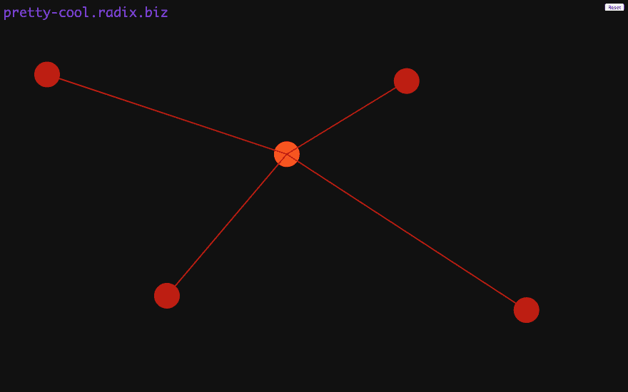

# 基数宇宙可视化器

> 原文：<https://dev.to/radixdlt/radix-universe-visualizer-3kee>

# 基数宇宙可视化仪

在 Radix，我们喜欢从大处着眼，这是在尝试创建一个快速、可扩展的分类帐以支持数十亿人时的一种有用的思维模式。考虑到这一点，Edgars 和我(Stephen Thornton)决定尝试建造一个能让我们看到整个宇宙的东西。然而，由于我们只限于一天，我们改为建立一个宇宙可视化工具，让我们实时查看 Radix 宇宙中的所有网络活动和原子。这是埃德加很久以来就想在 Radix 上构建的东西，也是我们都认为会有用的东西。最重要的是，我们还认为这会非常酷。

# 什么事？

这一天开始得很不顺利，我们住的酒店供应的咖啡是我们两人不幸尝试过的最差的一杯。然而，去镇上买点像样的真正的咖啡让我们有时间进一步集思广益。我们一致认为，我们希望建造一些东西来显示原子是如何通过网络实时存储的，但不确定呈现它的最佳方式。由于缺乏必要的物理设备，我们最初的一些想法很快被放弃，包括使用“Palantir”风格的模型，在该模型中，我们可以将多维网络视图投影到球形触摸屏显示单元以及虚拟现实设备上。

在经历了许多雄心勃勃的想法后，我们最终决定使用 JavaScript 构建一个在普通浏览器上运行的可视化工具。我们选择这条路线有一定的优势，因为 Edgar 是编写 Radix JavaScript 库的人。我们将项目分为三个部分:

我们使用 JavaScript 库将原子放入账本并观察它们移动
获取这些信息后，我们需要形成一些关于它们发生了什么的图形表示
除了图形，我们还想使用声音效果来增强体验
Edgar 负责第一部分，而我负责第二部分。我们的灵感来自一个巨大的弹球桌，原子在节点周围疯狂地嘎嘎作响，敲响铃铛，留下像糟糕的迷幻之旅一样的霓虹轨迹。不幸的是，我们的艺术家和图形设计师另有所图，所以我们不得不用我自己的才能来凑合。我很快发现 two.js 图形库是万能的，也是易于使用的 JavaScript 库。利用这个，我拼凑了一些描绘观察到的事件的基本图形。

然后我们把注意力转向声音，这是我们两个都最兴奋的；当发现冲突时，超新星爆发；当冲突解决时，天使合唱团歌唱。如果我们有更多的时间(并且不受许可限制)，我们会包括一个 R2-D2 画外音来提供连续的评论。

我们很高兴因为我们的努力获得了第三名。唯一的缺点是，由于当天我们不得不使用的测试网络有限，我们无法展示我们精心制作的完整的视觉和听觉体验。然而，自从黑客马拉松以来，我们已经能够使用一个更大的网络来试用可视化工具:

# 它是如何工作的？

以上描述了我们构建的内容，但对于那些渴望了解其工作原理的人来说，基本想法是:

-浏览器应用程序为自己生成一个新的 Radix 帐户
-然后它使用 radixdlt.js 库
连接到网络中的每个节点-当你单击一个节点时，它向该节点提交一个原子
-然后每个节点让浏览器应用程序知道它何时收到了原子， 根据已报告的 atom 目击事件中的时间证明显示它所采取的路径
-路径每次都不同，因为时间证明中的下一跳是随机确定的，从发起者开始的八个节点，从那时开始的二进制分支
-如果您单击其他节点，它会提交冲突的 atom
-当节点解决冲突时，它还会告诉应用程序某个 atom 由于冲突而被拒绝
-当触发适当的事件时，会播放前述音频

对于有技术头脑的人来说，我们将公布代码，并在 betanet 公开时简要介绍一下代码是如何工作的。

有问题吗？给我或 Radix discord 组(discord)的 Edgars 发消息，或者你也可以在我们的电报频道([https://t.me/radix_dlt](https://t.me/radix_dlt))问他们。

订阅我们的邮件列表，在我们达到重要里程碑时获得通知—[https://radixdlt.typeform.com/to/nyKvMV?source=networkvisualizer](https://radixdlt.typeform.com/to/nyKvMV?source=networkvisualizer)