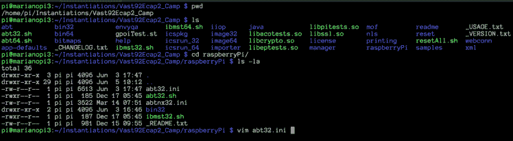
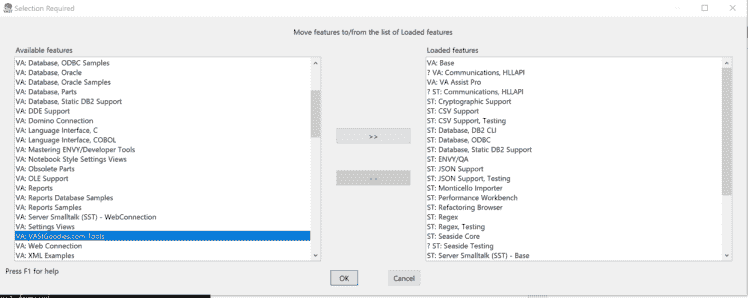
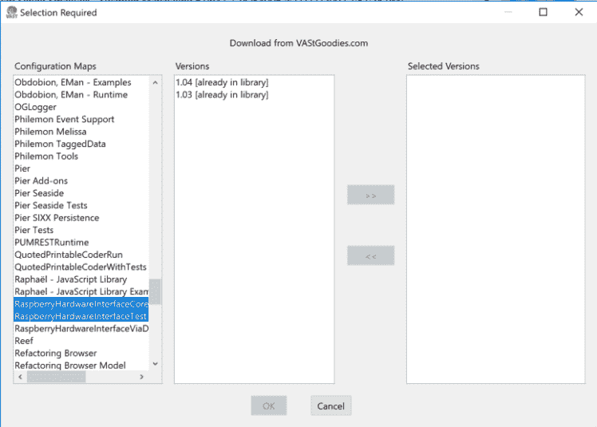
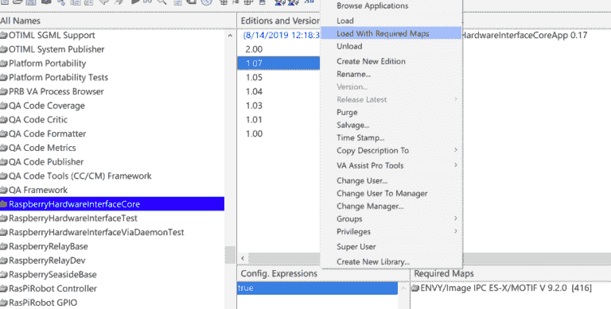
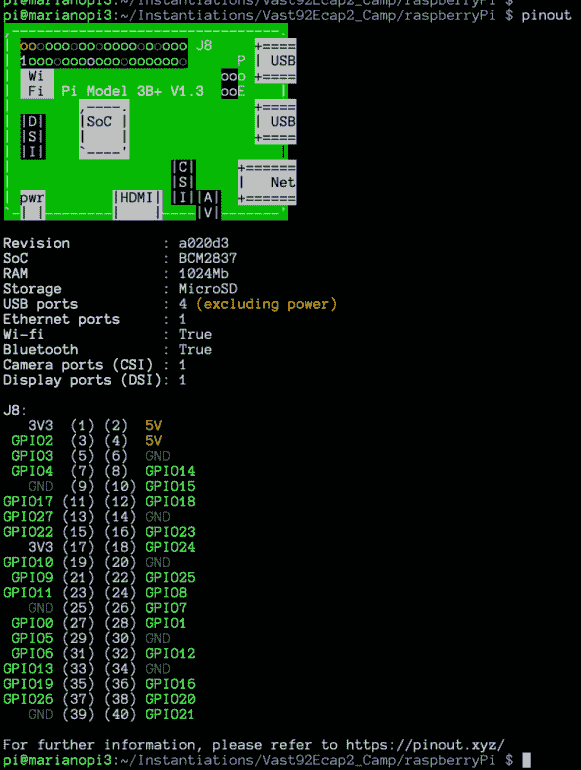
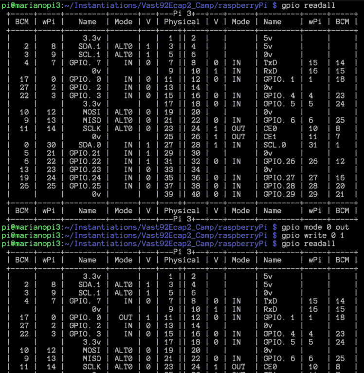

# 使用 Smalltalk 访问 Raspberry Pi GPIOs

> 原文：<https://dev.to/martinezpeck/accessing-raspberry-pi-gpios-with-smalltalk-4blh>

正如我在[早前的一篇帖子](https://dev.to/martinezpeck/getting-started-with-raspberry-pi-and-smalltalk-47oa)中评论的那样， [VASmalltalk](https://www.instantiations.com/products/vasmalltalk/index.html) 在物联网环境中的一个伟大特性是 C 库 [pigpio](http://abyz.me.uk/rpi/pigpio/) 的包装器，它允许我们管理 gpio 及其相关协议，如 1-Wire、I2C 等。

在本帖中，我们将看到让这个工作的基本设置。

液体错误:内部

### 设置 pigpio 库

第一步是安装 [pigpio](http://abyz.me.uk/rpi/pigpio/) C 库。最简单的方法是用打包管理器安装它，如果这个库可用的话:

```
sudo apt-get update
sudo apt-get install pigpio 
```

Enter fullscreen mode Exit fullscreen mode

如果您想要一个不同于 packager manager 安装的版本或者软件包不可用，那么您可以自己编译:

```
rm master.zip
sudo rm -rf pigpio-master
wget https://github.com/joan2937/pigpio/archive/master.zip
unzip master.zip
cd pigpio-master
make
sudo make install 
```

Enter fullscreen mode Exit fullscreen mode

要验证库是否正确安装，您可以执行`pigpiod -v`，这应该会打印出安装的版本。

### 设置 VASmalltalk

在这篇文章中，我展示了如何在手臂的支持下获得 VASmalltalk ECAP 版本。这些说明非常简单，只需将下载的 zip 文件解压缩到所需的文件夹中。

下一步是编辑`/raspberryPi/abt32.ini`:

[](https://res.cloudinary.com/practicaldev/image/fetch/s--R7aBrmT7--/c_limit%2Cf_auto%2Cfl_progressive%2Cq_auto%2Cw_880/https://marianopeck.files.wordpress.com/2019/06/screen-shot-2019-06-05-at-11.14.12-am.png%3Fw%3D748)

包括以下字段:

```
RaspberryGpio=libpigpio.so
RaspberryGpioDaemon=libpigpiod_if2.so
RaspberryGpioUltrasonicDaemon=libpigpioultrasonic.so 
```

Enter fullscreen mode Exit fullscreen mode

在第`[PlatformLibrary Name Mappings]`节下。

然后，通过执行以下操作启动 VASmalltalk 图像:

```
cd raspberryPi/
./abt32.sh 
```

Enter fullscreen mode Exit fullscreen mode

一旦进入 VASmalltalk，进入`Tools` - > `Load/Unload Features…`并加载特性`VA: VAStGoodies.com Tools`。

[](https://res.cloudinary.com/practicaldev/image/fetch/s--C5L7pCGQ--/c_limit%2Cf_auto%2Cfl_progressive%2Cq_auto%2Cw_880/https://marianopeck.files.wordpress.com/2019/06/screen-shot-2019-06-05-at-11.21.26-am.png%3Fw%3D748)

然后`Tools` - > `Browse Configurations Maps`，右键点击左侧窗格(地图列表)，选择`Import from VAStGoodies.com`。这将把选定的版本导入到连接的 ENVY 管理器中。

[](https://res.cloudinary.com/practicaldev/image/fetch/s--haIHUnPG--/c_limit%2Cf_auto%2Cfl_progressive%2Cq_auto%2Cw_880/https://marianopeck.files.wordpress.com/2019/06/screen-shot-2019-06-05-at-11.33.39-am.png%3Fw%3D748)

之后，在同一个配置地图浏览器上，你必须进入`RaspberryHardwareInterfaceCore`和`RaspberryHardwareInterfaceTest`，选择你导入的版本，点击右键，然后`Load With Required Maps`。

[](https://res.cloudinary.com/practicaldev/image/fetch/s--ygrlN4Vs--/c_limit%2Cf_auto%2Cfl_progressive%2Cq_auto%2Cw_880/https://i0.wp.com/marianopeck.blog/wp-content/uploads/2019/09/Screen-Shot-2019-09-04-at-10.57.27-AM.png%3Fresize%3D768%252C389%26ssl%3D1)

你完了！您已经安装了 pigpio 库和 VASmalltalk 包装器。让我们使用它！

### 一些 GPIO 实用程序帮助你启动

在开始 VASmalltalk 之前，让我向您展示一些在使用 GPIO 时非常有用的 Linux 实用程序。

其中一个命令是 Raspbian 自带的`pinout`。它显示了你需要知道的关于你的 Pi 的一切！！硬件信息以及引脚布局:

[](https://res.cloudinary.com/practicaldev/image/fetch/s--k-iwjfYY--/c_limit%2Cf_auto%2Cfl_progressive%2Cq_auto%2Cw_880/https://marianopeck.files.wordpress.com/2019/06/screen-shot-2019-06-05-at-11.47.46-am.png%3Fw%3D581%26h%3D770)

是的，请相信命令行输出并访问 [https://pinout.xyz](https://pinout.xyz/) 。它非常有用。a 必须有。

另一个工具是`gpio`。这使您可以看到每个引脚的状态，甚至从那里拉起/拉下它们。下面的例子显示了如何读取所有引脚，然后拉起 BCM 引脚 17(物理引脚 11)。

[](https://res.cloudinary.com/practicaldev/image/fetch/s--E4PxHLXu--/c_limit%2Cf_auto%2Cfl_progressive%2Cq_auto%2Cw_880/https://marianopeck.files.wordpress.com/2019/06/screen-shot-2019-06-05-at-12.03.10-pm.png%3Fw%3D748)

我不想在这篇文章中进入细节，但正如你所看到的，每个引脚可能有 3 个不同的号码:物理(板上的号码)，BCM 和 wPi(接线 Pi)。它们也有名字。所以…无论你什么时候连接东西，你都必须确定它们指的是哪种“模式”。光有数字是不够的。

### 从 Smalltalk 管理 GPIOs！

在这篇文章中，我们将会看到 GPIO 最基本的场景，也就是说将它拉高或拉低。上升时，它输出 3.3v(在树莓 Pi 的情况下)，下降时，输出 0。这足够你玩 led，风扇，任何不需要“数据”只需要电压的东西了。

这样做的简短代码是:

```
"This is an example of the VA tooling for accessing and dealing with the GPIOs.
Instructions to run: 
1) Make sure you have pigpio installed and that deamon is running. You can start it 
`sudo pigpiod` from a terminal.
2) On a terminal, run `pinout` and identify GPIO17 (phisical pin 11) and the GROUND 
at phisical pin 14.
3) Take a volt meter and put it in DCV 10 or 20\. 
4) Put the negative (usually black) cable into the ground (phisical pin 14) and the positive 
cable (usually red) into the GPIO17  (phisical pin 11). It should display 0V.
5) Run below snipped of code which in fact turns on pin GPIO17 for output. 
6) Repeat number 4) but now you should get a 3.3V output"

| gpioInterface |
[gpioInterface := RaspberryGpioDaemonInterface raspberryGpioStart.
gpioInterface 
    pinSetAsOutput: 17;
    pin: 17 write: 1.
] ensure: [
    gpioInterface shutDown
] 
```

Enter fullscreen mode Exit fullscreen mode

在上面片段的注释中，你可以看到如何验证它实际上是工作的…你可以使用电压表或使用`gpio readall`来确认更改。对于电压表，将其设置在 10 / 20 伏(DCV)范围内。然后用负极电缆(通常为黑色)接触任何接地引脚(例如，物理引脚 6)，用正极电缆(通常为红色)接触 GPIO 引脚 17(物理引脚 11)。当 GPIO 打开时，您应该看到仪表读数约为 3.3 伏，关闭时为 0。**欢迎使用硬件调试器！**

### 结论

在这篇文章中，你看到了如何安装 pigpio C 库，如何在 VASmalltalk 中安装包装器，并看到了一个基本的例子。在以后的文章中，我们将会看到更高级的 GPIO 用法和协议。

液体错误:内部

### 鸣谢

pigpio 包装器(RaspberryHardwareInterface)是一个社区推动的项目。我认为 Tim Rowledge 是从 Squeak Smalltalk 开始的，然后 Louis LaBrunda 启动了一个到 VASmalltalk 的端口，最后[实例化](https://twitter.com/instantiations)帮助完成并运行了那个端口。