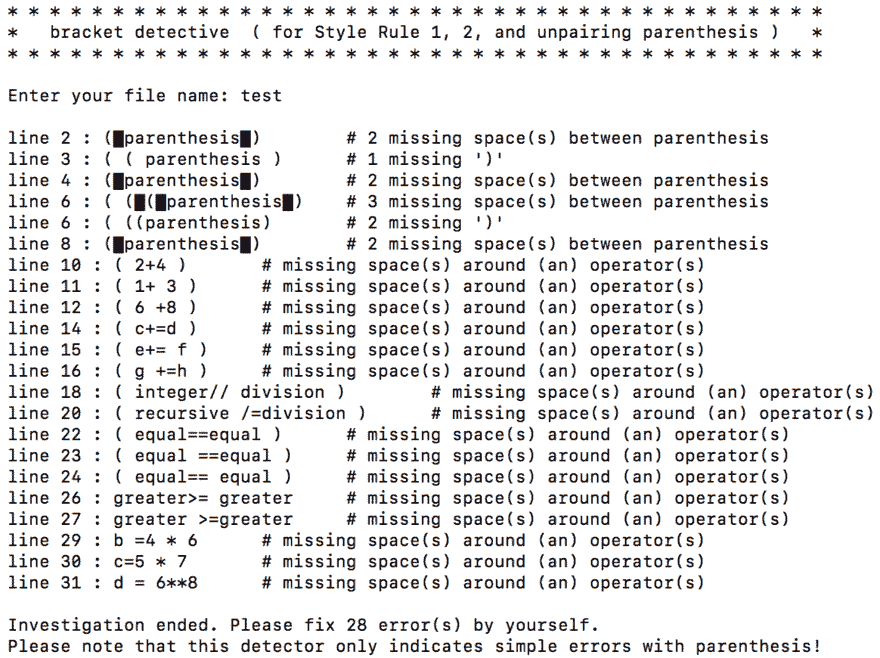

# Truths your college don't tell you why they teach you in such an awful way.

> 原文：[https://dev.to/voidjuneau/truths-your-college-don-t-tell-you-why-they-teach-you-in-such-an-awful-way-4aem](https://dev.to/voidjuneau/truths-your-college-don-t-tell-you-why-they-teach-you-in-such-an-awful-way-4aem)

While studying by out of school during summer vacation, there were some points that I have realized. All of below doubts are ones that either I have actually heard from other student or myself was wondering during the first two semesters.

* * *

1.  Weird custom style rule

    In the first programming course, my college uses its own style rule that is violating PEP 8\. It was quite annoying to be fair. I actually even wrote a program to detect the style errors that is not detected by a code editor. Now, I believe that the reason the school did it is that they don’t want those to be detected by third-party software which is not a student's own brain. Students should learn how to follow style role without a tool nagging them word by word. Actually, after realizing it, I regret a bit I had written that program.

    

2.  Pen&Paper exam

    Yes, it is painful and it takes really a lot of time. However, the fact is that you have to do it like that in job interviews. When I took online courses with embedded edited I usually do it in my IDE and copy+pasted into. After a realize it, I wonder if a stop doing it so.

3.  The narrow scope of the programs

    When I was talking with my friend about this topic, I said that 0\. it’s maybe because school is afraid of a high failure rate. He added,

    > It’s like finding the greatest common divisor.

    I think it is an elegant way to address the situation. However, I also think it’s not all. I also think 1\. School believe a student who want knowledge will find a way to get it by themselves, and 2\. They want students to learn how to do it. Learning is a life long journey. And it is impossible to teach everything in school, especially such a fast-changing industry like ours.

4.  Unnecessary courses

    At front of technical writing class and system and analysis class doors, I heard so many times students saying “This is a waste of time.” And many of them actually often skip classes intentionally.

    You know why? Because it IS necessary. I’ve heard many times from co-op students. That they also thought so when they were learning them for the first time, but when they joined an actual workforce, they found that is actually used. My only complaint about those courses is that it doesn’t feel to be enough. I think I just should practice my own.

5.  Why should we use such an old version of language and editor?

    *   Editor: Why school use Notepad++ and NetBeans instead of one of cool JetBrains’ software? Auto-completion is so cool.

        Because school don’t want you to use that auto-completion. When you first learn a language, you have to LEARN the syntax. And there no better way than actually, and fully use them. With a variable name as well, you have to learn how to carefully use them without making mistakes.

    *   Language: Java now announced 12, but we are learning 8\. What’s wrong with our school.

        I bet it is for your own good. When you even not fully learnt what OOP is, you wouldn't want to learn Java 12 features is it will be too overwhelming. In fact, It's even hard to learn Java 8 features.

* * *

I am not sure if It is the school's actual intent or I am beautifying it. Either way, I am pretty satisfied with it and happy to be a student at my school. I know that there are so many amazing developers who self-thought without having a classic form of education and doing just great. However, for me, I like the facts that there is a curriculum that has been developed through decades with trial and error, and the existence of teachers and classmates who exist physical, not in the screen. Even though I understand school is just a beginning of learning and not provides me with everything, I believe it's providing me with a pretty good starting point.